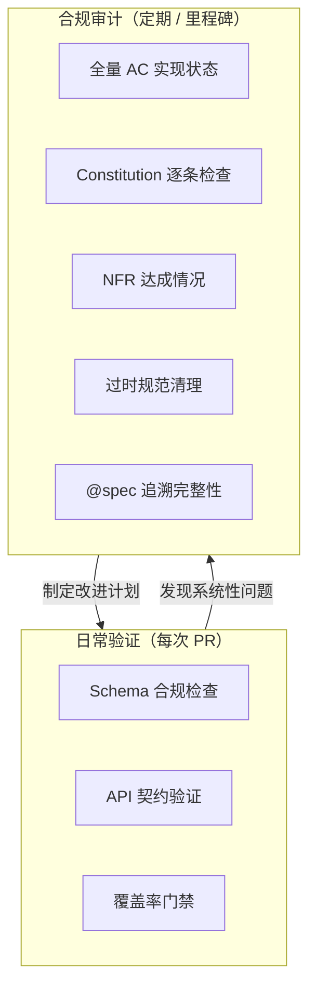
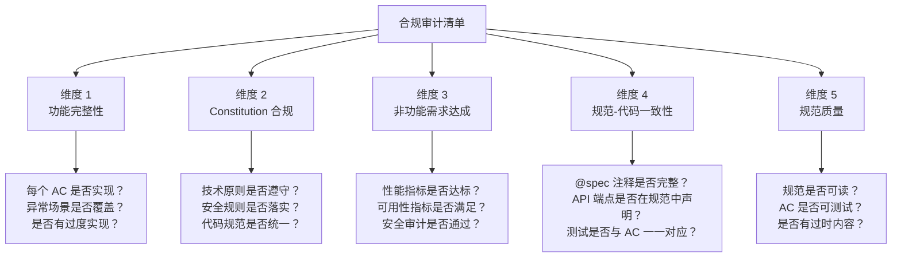
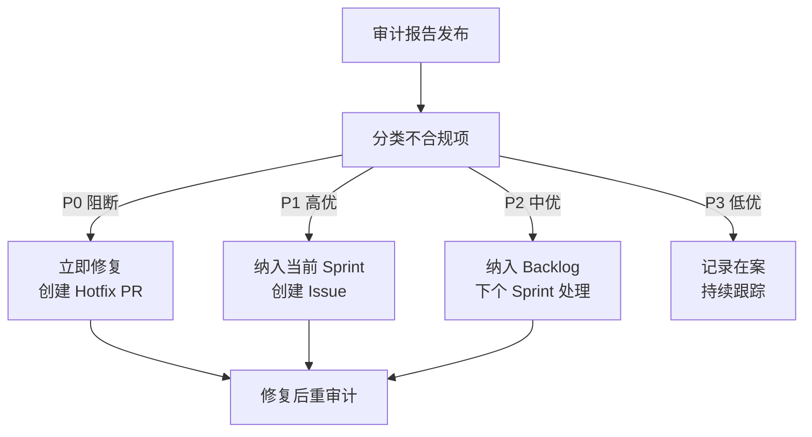
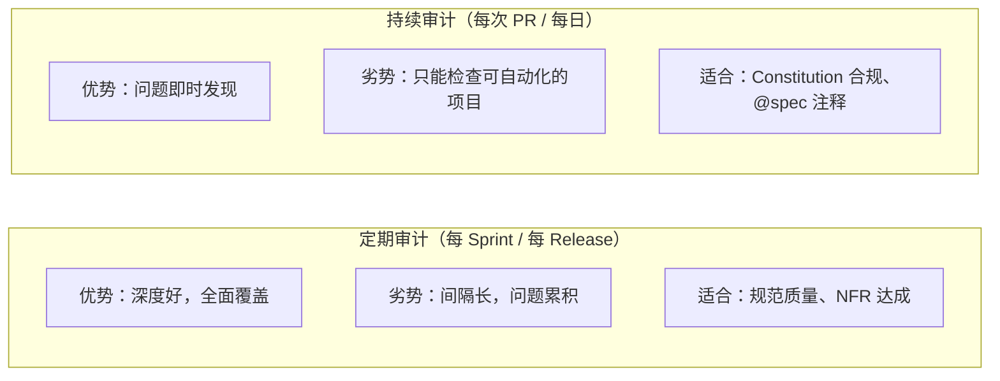
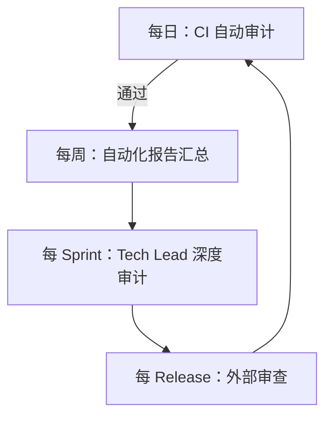

# 合规性审计

合规性审计是 SDD 中验证阶段的收尾环节——确保规范中的每一条要求都被实现，每一个技术原则都被遵守。本章讲解审计清单构建、自动化工具、报告模板以及审计策略选择。

---

## 1. 什么是规范合规性审计

### 1.1 审计的定义和定位

在 SDD 中，合规性审计是对"代码实现是否符合规范"的系统性检查。它与单元测试不同——测试验证代码的**逻辑正确性**，审计验证代码的**规范一致性**。



**核心区别**：日常验证是门禁——"能不能合并"。合规审计是体检——"整体健康吗"。

### 1.2 审计 vs 测试 vs 验证

| 维度 | 测试 | 验证 | 审计 |
|------|------|------|------|
| 频率 | 每次 PR | 每次 PR | 每 Sprint / Release |
| 范围 | 单功能 | 单功能 | 全项目 |
| 深度 | 代码执行 | 行为一致 | 规范完整覆盖 |
| 产出 | 通过/失败 | 符合/偏离 | 审计报告 + 改进计划 |
| 执行者 | CI 自动 | CI + 人工 | Tech Lead / 外部审计员 |

---

## 2. 审计清单构建

### 2.1 清单结构

一份完整的 SDD 合规审计清单包含五个维度：



### 2.2 逐项审计表

**维度 1：功能完整性**

| 审计项 | 检查方法 | 通过标准 | 分值 |
|--------|----------|----------|------|
| AC 实现率 | 运行 `spec_coverage_report.py` | 100% AC 有对应实现 | 30 |
| 异常场景覆盖 | 对照 Spec 异常章节 → 检查代码 error handling | 所有异常场景有处理代码 | 20 |
| 无过度实现 | 审查代码中是否有 Spec 未声明的端点/功能 | 0 个未声明功能 | 10 |
| 边界条件处理 | 检查字段约束是否在代码中校验 | 所有约束有对应校验 | 10 |

**维度 2：Constitution 合规**

| 审计项 | 检查方法 | 通过标准 | 分值 |
|--------|----------|----------|------|
| 技术原则遵守 | 运行 Constitution 扫描脚本 | 0 个违规 | 25 |
| 安全规则落实 | 运行 Bandit/Semgrep 安全扫描 | 0 个高危漏洞 | 25 |
| 代码规范统一 | 运行 Ruff/ESLint | 0 个 error | 15 |
| 架构约定遵守 | 检查目录结构、命名规范 | 符合项目结构约定 | 10 |

**维度 3：非功能需求达成**

| 审计项 | 检查方法 | 通过标准 | 分值 |
|--------|----------|----------|------|
| 响应时间 | 运行 k6/Locust 基准测试 | P95 < Spec 定义值 | 20 |
| 并发能力 | 负载测试 | 达到 Spec 定义并发数 | 15 |
| 可用率 | 检查监控数据 | ≥ 99.9%（或 Spec 定义值） | 10 |
| 安全等级 | OWASP ZAP 扫描 | 0 个高危警报 | 20 |

### 2.3 审计清单生成模板

```yaml
# audit/checklist-2026Q3.yml
audit:
  id: AUDIT-2026-Q3
  date: 2026-09-30
  scope: 全项目规范合规审计
  auditor: Tech Lead + 外部审查员

dimensions:
  - name: 功能完整性
    weight: 30
    items:
      - id: FUNC-01
        description: AC 实现率
        check: python3 scripts/spec_coverage_report.py
        pass_threshold: 100%
        auto: true

      - id: FUNC-02
        description: 异常场景覆盖
        check: 人工对照 Spec 和代码审查
        pass_threshold: 所有异常场景有对应处理
        auto: false

  - name: Constitution 合规
    weight: 25
    items:
      - id: CONST-01
        description: 技术原则遵守
        check: python3 scripts/constitution_check.py
        pass_threshold: 0 violations
        auto: true

      - id: CONST-02
        description: 安全规则
        check: bandit -r src/ && semgrep --config=auto src/
        pass_threshold: 0 high-severity issues
        auto: true

  - name: 非功能需求
    weight: 20
    items:
      - id: NFR-01
        description: API 响应时间
        check: k6 run tests/performance/api-benchmark.js
        pass_threshold: P95 < 200ms
        auto: true

  - name: 规范-代码一致性
    weight: 15
    items:
      - id: TRACE-01
        description: @spec 注释覆盖
        check: python3 scripts/check_spec_drift.py
        pass_threshold: 0 high-severity drifts
        auto: true

  - name: 规范质量
    weight: 10
    items:
      - id: QUAL-01
        description: AC 可测试性
        check: 人工审查每个 AC 是否有 Given-When-Then
        pass_threshold: 100% AC 使用 GWT 格式
        auto: false
```

---

## 3. 自动化审计工具概览

### 3.1 工具矩阵

| 工具 | 审计维度 | 类型 | 集成方式 |
|------|----------|------|----------|
| **spec_coverage_report.py** | AC 实现率 | 自研脚本 | CI / 手动 |
| **check_spec_drift.py** | 规范-代码一致性 | 自研脚本 | CI / 手动 |
| **Bandit** | Python 安全漏洞 | 开源 | CI Pipeline |
| **Semgrep** | 多语言安全 + 代码模式 | 开源 | CI Pipeline |
| **Ruff** | Python 代码规范 | 开源 | Pre-commit |
| **k6 / Locust** | 性能基准 | 开源 | CI (Release) |
| **OWASP ZAP** | Web 安全扫描 | 开源 | CI (定期) |
| **constitution_check.py** | Constitution 合规 | 自研脚本 | CI |
| **pytest-spec** | 测试-规范关联 | 自研插件 | CI |

### 3.2 自研工具：Constitution 合规扫描

```python
# scripts/constitution_check.py
"""Constitution 合规性扫描——检查代码是否遵守项目核心原则。"""
import ast
import sys
from pathlib import Path
from dataclasses import dataclass, field

@dataclass
class Violation:
    rule: str
    severity: str  # error, warning
    file: str
    line: int
    message: str

@dataclass
class ConstitutionRule:
    id: str
    description: str
    check: callable  # (ast_node, file_path) -> list[Violation]

# ====== Constitution 规则定义 ======
RULES = []

def rule(id, description, severity="error"):
    """装饰器：注册一条 Constitution 规则。"""
    def decorator(func):
        RULES.append(ConstitutionRule(id, description, func))
        return func
    return decorator

@rule("C001", "禁止使用 print() 进行调试输出")
def check_no_print(node: ast.AST, file_path: str) -> list[Violation]:
    violations = []
    for n in ast.walk(node):
        if isinstance(n, ast.Call) and isinstance(n.func, ast.Name) and n.func.id == "print":
            violations.append(Violation(
                "C001", "error", file_path, n.lineno,
                "禁止使用 print()，请使用 logging 模块"
            ))
    return violations

@rule("C002", "所有 API 响应必须使用统一格式")
def check_unified_response(node: ast.AST, file_path: str) -> list[Violation]:
    violations = []
    # 简化实现：检查返回语句是否使用了统一响应类
    for n in ast.walk(node):
        if isinstance(n, ast.Return) and isinstance(n.value, ast.Dict):
            # 返回裸 dict 可能是违规
            if not any(kw.arg == "code" for kw in getattr(n.value, 'keywords', [])):
                violations.append(Violation(
                    "C002", "warning", file_path, n.lineno,
                    "API 响应应使用统一格式 {code, data, message}"
                ))
    return violations

@rule("C003", "禁止 hardcode 敏感配置")
def check_no_hardcoded_secrets(node: ast.AST, file_path: str) -> list[Violation]:
    violations = []
    sensitive_patterns = ["password", "secret", "api_key", "token", "dsn"]
    for n in ast.walk(node):
        if isinstance(n, ast.Assign):
            for target in n.targets:
                if isinstance(target, ast.Name):
                    for pattern in sensitive_patterns:
                        if pattern in target.id.lower():
                            if isinstance(n.value, ast.Constant):
                                violations.append(Violation(
                                    "C003", "error", file_path, n.lineno,
                                    f"敏感配置 '{target.id}' 不应 hardcode，请使用环境变量"
                                ))
    return violations

# ====== 扫描执行 ======
def scan_directory(src_dir: str = "src") -> list[Violation]:
    all_violations = []
    for py_file in Path(src_dir).glob("**/*.py"):
        try:
            tree = ast.parse(py_file.read_text())
            for rule in RULES:
                all_violations.extend(rule.check(tree, str(py_file)))
        except SyntaxError as e:
            all_violations.append(Violation(
                "SYNTAX", "error", str(py_file), e.lineno or 0,
                f"语法错误: {e.msg}"
            ))
    return all_violations

if __name__ == "__main__":
    violations = scan_directory()
    if not violations:
        print("✅ Constitution 合规检查通过")
        sys.exit(0)

    errors = [v for v in violations if v.severity == "error"]
    warnings = [v for v in violations if v.severity == "warning"]

    print(f"❌ {len(errors)} 个错误, ⚠️  {len(warnings)} 个警告\n")
    for v in sorted(violations, key=lambda x: x.severity, reverse=True):
        print(f"  [{v.severity.upper()}] {v.rule} — {v.file}:{v.line}")
        print(f"    {v.message}\n")

    sys.exit(1 if errors else 0)
```

---

## 4. 审计结果报告模板

### 4.1 报告结构

```markdown
# 规范合规审计报告

**审计编号**：AUDIT-2026-Q3
**审计日期**：2026-09-30
**审计范围**：全项目（3 个规范，12 个 API 端点，3800 行代码）
**审计员**：张三（Tech Lead）

---

## 1. 总体评分

| 维度 | 权重 | 得分 | 加权得分 | 状态 |
|------|------|------|----------|------|
| 功能完整性 | 30% | 85/100 | 25.5 | 🟡 |
| Constitution 合规 | 25% | 95/100 | 23.75 | 🟢 |
| 非功能需求达成 | 20% | 80/100 | 16.0 | 🟡 |
| 规范-代码一致性 | 15% | 90/100 | 13.5 | 🟢 |
| 规范质量 | 10% | 75/100 | 7.5 | 🟡 |
| **总分** | **100%** | — | **86.25** | 🟢 |

评级标准：🟢 ≥ 85，🟡 70-84，🔴 < 70

---

## 2. 不合规项详细清单

### 2.1 功能完整性

| 编号 | 问题 | 严重度 | 关联规范 | 责任人 | 修复期限 |
|------|------|--------|----------|--------|----------|
| NC-001 | AC-07（密码重置 Token 有效期校验）未实现 | 🔴 高 | SPEC-USER-001 §3.7 | 李四 | 3 天 |
| NC-002 | AC-11（邮箱验证码防重放）仅部分实现 | 🟡 中 | SPEC-USER-001 §3.11 | 李四 | 本 Sprint |
| NC-003 | src/api/admin.py 中的 `/admin/users/export` 未在规范中声明 | 🟡 中 | — | 王五 | 补充规范或删除 |

### 2.2 Constitution 合规

| 编号 | 问题 | 严重度 | 文件 | 修复方案 |
|------|------|--------|------|----------|
| NC-004 | src/services/email.py:42 使用 print() 调试 | 🟢 低 | email.py:42 | 改为 logging.debug() |

### 2.3 非功能需求

| 编号 | 问题 | 严重度 | 当前值 | 目标值 | 修复方案 |
|------|------|--------|--------|--------|----------|
| NC-005 | POST /register P95 响应时间 320ms | 🟡 中 | 320ms | <200ms | 优化数据库查询，添加索引 |

### 2.4 规范-代码一致性

| 编号 | 问题 | 严重度 | 修复方案 |
|------|------|--------|----------|
| NC-006 | 3 处 @spec 注释引用的规范版本已过期 | 🟢 低 | 更新版本号 |

### 2.5 规范质量

| 编号 | 问题 | 严重度 | 修复方案 |
|------|------|--------|----------|
| NC-007 | specs/003-search/spec.md 中 AC-03 缺少 Then 条件 | 🟡 中 | 补充 Then 断言 |

---

## 3. 趋势对比

| 审计周期 | 总分 | 功能完整性 | Constitution | NFR | 一致性 | 质量 |
|----------|------|-----------|-------------|-----|--------|------|
| 2026-Q1 | 78.5 | 75 | 90 | 70 | 85 | 72 |
| 2026-Q2 | 82.0 | 80 | 92 | 75 | 88 | 75 |
| 2026-Q3 | 86.25 | 85 | 95 | 80 | 90 | 75 |

📈 趋势：持续改善，NFR 和规范质量仍是短板。

---

## 4. 改进计划

| 优先级 | 行动项 | 负责人 | 目标日期 |
|--------|--------|--------|----------|
| P0 | 补充 AC-07 实现 | 李四 | 2026-10-03 |
| P1 | 优化 /register 数据库查询 | 王五 | 2026-10-07 |
| P1 | 决策 NC-003：补充规范或删除代码 | 王五 + 张三 | 2026-10-05 |
| P2 | 规范质量提升：AC 全部 GWT 格式 | 全员 | 2026-10-15 |
| P2 | 补充异常场景自动化检查工具 | 张三 | 2026-10-20 |
```

---

## 5. 不合规项的修复与追踪

### 5.1 修复流程



### 5.2 追踪工具

```yaml
# .github/ISSUE_TEMPLATE/audit-finding.md
name: 审计不合规项
description: 规范合规审计中发现的问题
labels: ["audit", "spec-compliance"]
body:
  - type: input
    id: audit_id
    attributes:
      label: 审计编号
      placeholder: AUDIT-2026-Q3
  - type: input
    id: finding_id
    attributes:
      label: 不合规项编号
      placeholder: NC-001
  - type: dropdown
    id: severity
    attributes:
      label: 严重度
      options:
        - "🔴 高 - 阻断"
        - "🟡 中 - 需在 Sprint 内修复"
        - "🟢 低 - 技术债跟踪"
  - type: textarea
    id: description
    attributes:
      label: 问题描述
  - type: textarea
    id: fix_plan
    attributes:
      label: 修复方案
```

### 5.3 修复后验证

每个不合规项修复后，需要：

1. 代码变更 + 规范变更（如有）在同一个 PR
2. 运行对应的自动化审计脚本确认通过
3. 在审计追踪表中标记状态为"已修复"
4. 下次审计时重点复查已修复项

---

## 6. 定期审计 vs 持续审计

### 6.1 两种策略对比



| 维度 | 定期审计 | 持续审计 |
|------|----------|----------|
| 执行频率 | 每 Sprint / Release | 每次 PR / 每日 |
| 覆盖范围 | 全面（含人工审查项） | 可自动化项 |
| 深度 | 深 | 浅（模式匹配） |
| 成本 | 高（人工时间） | 低（CI 自动） |
| 反馈速度 | 慢（最多 2 周） | 快（PR 提交时） |
| 适合检查 | 规范完整性、架构决策 | 规则违规、漂移检测 |

### 6.2 推荐组合策略



**分层审计节奏**：

| 层级 | 频率 | 内容 | 工具 |
|------|------|------|------|
| L1 持续 | 每次 Push | Constitution 合规、@spec 注释 | CI Pipeline |
| L2 每日 | 每天 | 全量自动化审计报告 | Cron + 自动化脚本 |
| L3 每 Sprint | 每 2 周 | Tech Lead 深度审查（含人工） | 审计清单 |
| L4 每 Release | 每 1-3 月 | 外部审查 / 交叉审查 | 完整审计报告 |

> **原则**：能自动化的交给 CI 持续跑，需要人工判断的集中到 Sprint 末尾做。不要让审计成为"季度大扫除"——小步快跑比一次清仓好。

---

## 7. 小结

- 合规审计是 SDD 的"体检"——系统性检查规范一致性，区别于日常的门禁式验证
- 审计清单五个维度：功能完整性、Constitution 合规、NFR 达成、规范-代码一致性、规范质量
- 自动化工具（Constitution 扫描、漂移检测、安全扫描）处理可量化检查项，人工审查处理需要判断的领域
- 审计报告应包含：总体评分、不合规项详情、趋势对比、改进计划——每项有责任人和期限
- 定期审计 + 持续审计组合使用：持续审计堵漏，定期审计做深度体检
- 不合规项的修复必须有追踪和重验证，审计不是"发现问题就结束"，而是"修复并验证再结束"

---

## 相关资源

- [03-自动化测试生成](03-自动化测试生成.md) — 从规范自动生成测试
- [02-基于规范的验证策略](02-基于规范的验证策略.md) — SDD 中的验证框架
- [03-代码与规范的同步维护](../05-Implement实现/03-代码与规范的同步维护.md) — 规范和代码的双向同步
