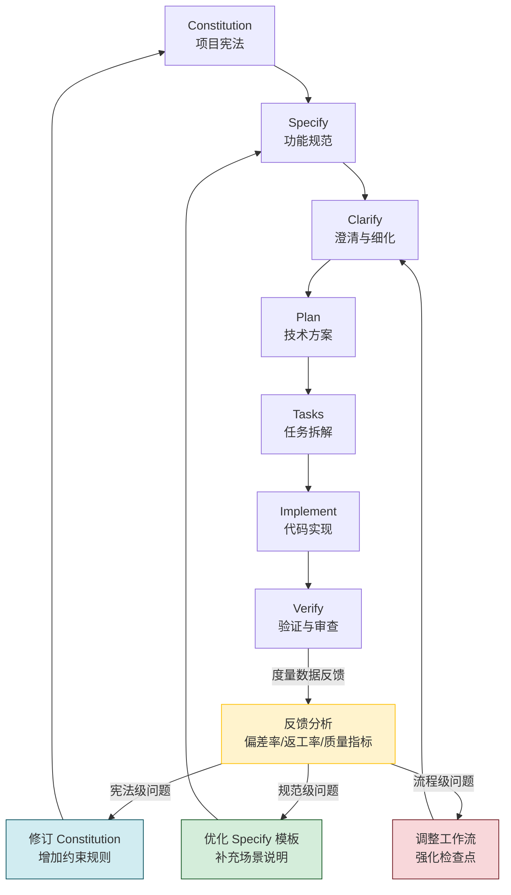

# 反馈循环与持续改进

SDD 不是一次性流程——完成 Verify 不是终点，而是下一轮优化的起点。本章讲解如何在 SDD 七步工作流中建立**反馈闭环**，让规范和流程随着项目演进持续改进。

---

## 1. SDD 全周期反馈闭环

SDD 的反馈闭环意味着：Verify 阶段发现的偏差和问题，不应止于"修复这次代码"，而应**回溯到规范源头**，优化 Constitution 和 Specify 环节，从根本上降低未来同类问题的发生概率。



> **核心理念**：每一次"验证失败"都是一次学习机会。不把偏差当作意外，而是当作流程中漏掉的信息——把它补回到规范里。

---

## 2. 度量指标体系

反馈需要数据支撑。以下是从 SDD 流程中可以提取的关键度量指标：

### 2.1 规范质量指标（Spec Quality Indicators）

| 指标 | 计算方式 | 健康阈值 | 说明 |
|------|----------|----------|------|
| 澄清率（Clarification Rate） | Clarify 阶段新增的澄清条目数 / Spec 原始条目数 | < 15% | 过高说明 Specify 产出质量不足 |
| 规范返工率（Spec Rework Rate） | Implement 阶段触发 Spec 修改的次数 / 总功能数 | < 10% | Spec 在实现后被回溯修改的比例 |
| 场景覆盖率（Scenario Coverage） | Spec 中已定义场景数 / 实际实现的全部场景数 | > 90% | 遗漏场景越少，规范越完备 |
| API Schema 变更率 | 实现阶段 API 签名变更次数 / 初始设计签名数 | < 5% | 衡量 Plan 阶段接口设计的准确性 |

### 2.2 实现偏差指标（Implementation Deviation）

| 指标 | 计算方式 | 健康阈值 | 说明 |
|------|----------|----------|------|
| 偏差率（Deviation Rate） | Verify 阶段发现的不符合 Spec 的项 / 总实现项 | < 8% | 核心指标：实现与规范的偏离程度 |
| 宪法违规率（Constitution Violation Rate） | 违反 Constitution 规则的实现项 / 总检查项 | 0% | 宪法违规应零容忍 |
| 隐患密度（Issue Density） | AI Review 标记的隐患 / 千行代码 | < 5 个/千行 | 代码质量在 SDD 框架下的量化表达 |

### 2.3 业务效率指标

| 指标 | 计算方式 | 健康阈值 | 说明 |
|------|----------|----------|------|
| 返工率（Rework Rate） | 因规范不清导致的返工工时 / 总开发工时 | < 10% | 返工率是 SDD 价值的最直接证明 |
| 缺陷逃逸率（Defect Escape Rate） | 生产环境发现缺陷数 / (测试发现 + 生产发现) | < 5% | 越低说明 SDD + 验证流程越有效 |
| 人均产出偏差 | 同一 Spec 下不同开发者的实现差异度 | 低 | SDD 降低个体差异带来的质量波动 |

---

## 3. 团队回顾中的规范质量审查

### 3.1 回顾流程嵌入

将规范质量审查纳入常规 Sprint 回顾，作为固定议程：

```text
Sprint Retrospective 议程（SDD 版）

1. [10 min] 数据回顾：展示本期度量数据（偏差率、返工率）
2. [15 min] 规范归因：选取 Top 3 偏差事件，追溯是 Spec 缺陷还是执行问题
3. [10 min] Constitution 审视：是否有需要新增/修改的宪法条目？
4. [10 min] 模板优化：Spec/Plan/Tasks 模板是否需要调整？
5. [5 min] 行动项：输出 1-3 条具体的规范改进措施
```

### 3.2 归因分析模板

每次回顾时，对偏差事件做结构化归因：

```markdown
## 偏差归因记录 — SPEC-ORDER-012

### 事件描述
实现阶段发现"订单取消超时"场景未在 Spec 中定义，导致开发自行理解实现，
与产品预期不一致，产生 3 人天返工。

### 归因分类
- [ ] Spec 遗漏：需求场景未覆盖
- [x] Spec 模糊：描述了场景但边界条件不清
- [ ] Constitution 缺失：缺少约束规则
- [ ] 执行偏差：规范清晰但开发未遵循
- [ ] 工具缺陷：验证工具未自动检出

### 根因
Spec 中写"用户可取消未支付订单"，但未定义"超时自动取消"的触发条件和时间窗口。

### 改进措施
在 Specify 模板中增加「异常路径与边界条件」必填 section，要求每个功能点至少列出：
- 1 个超时场景
- 1 个并发冲突场景
- 1 个权限边界场景
```

---

## 4. 管理规范的"技术债"

和代码一样，规范文档也会产生技术债——过期的 Spec、不再准确的 Plan、丢失一致性的 Constitution。需要主动管理。

### 4.1 规范债分类

| 债类型 | 表现 | 危害 | 处理策略 |
|--------|------|------|----------|
| 过期债（Stale Debt） | Spec 描述与当前代码行为不一致 | 新成员误读、AI 生成错误代码 | 实现完成后立即更新 Spec，标记版本号 |
| 漂移债（Drift Debt） | 多次小修小补后，Spec 与 Constitution 产生矛盾 | 审查依据互相冲突 | 每个 Sprint 做一次 Spec 同步 |
| 遗弃债（Orphan Debt） | 已废弃功能模块的 Spec 仍在仓库中 | 污染搜索、误导引用 | 废弃模块的 Spec 移到 `specs/archived/` 目录 |
| 粒度债（Granularity Debt） | Spec 过细（冗余）或过粗（无指导价值） | 开发跳过阅读，规范形同虚设 | 定期评估 Spec 的"被引用率"和"AI Agent 采纳率" |

### 4.2 规范维护节奏

```text
日常维护（每次 PR）
  ├── 代码变更涉及 Spec 修改时，同一 PR 包含 Spec 更新
  └── AI PR Review 自动检查 Spec 一致性

Sprint 级维护（每 2 周）
  ├── Spec Review：抽查 20% 的 Spec，确认描述与代码一致
  ├── 更新 Spec 版本号（MINOR 递增）
  └── 清理 archived/ 目录中超过 3 个月的旧 Spec

里程碑级维护（每季度）
  ├── Constitution Review：审议是否需要版本升级（MAJOR 递增）
  ├── 全量 Spec 审计：用自动化脚本对比 Spec 与代码
  └── 输出规范健康报告
```

---

## 5. SDD 工作流自我演进

### 5.1 演进驱动因素

SDD 七步流程本身也需要迭代——根据团队实际数据调整各步骤的投入比例和检查力度：

| 信号 | 可能原因 | 演进方向 |
|------|----------|----------|
| Clarify 阶段耗时占比 > 30% | Specify 输出质量不足 | 强化 Specify 模板，增加 AI 预澄清 |
| Implement 偏差率持续 > 10% | Tasks 拆解粒度不够 | 增加 Tasks 环节的 AI Review 检查点 |
| Verify 阶段反复出现同类违规 | Constitution 规则太笼统 | 将高频违规模式固化为新的宪法条目 |
| Plan 产出从未被回看 | Plan 文档沦为形式 | 简化 Plan 模板，或将其合并入 Tasks |

### 5.2 流程版本管理

```markdown
# SDD 工作流版本记录

## v1.3.0 (2026-08-01)
- 新增：Clarify 阶段增加「并发冲突场景」必填项
- 调整：Plan 模板缩减为 3 个核心部分（原 7 个）
- 移除：Tasks 中的预估工时字段（准确率低，无参考价值）

## v1.2.0 (2026-07-15)
- 新增：Verify 阶段增加 AI Spec Compliance 自动检查
- 新增：Constitution 规则从 8 条扩展到 12 条
```

### 5.3 自我演进的原则

| 原则 | 说明 |
|------|------|
| **数据驱动** | 每次流程调整必须有 2 个以上的数据点支撑，不做拍脑袋的改动 |
| **小步迭代** | 一次只改一个环节，观察 2-3 个 Sprint 的效果再决定是否固化 |
| **向下兼容** | 新流程必须能处理旧流程产出的 Spec 和 Plan，不做 breaking change 式的流程升级 |
| **全员参与** | 流程调整提案必须经过团队 review，不允许个人擅自修改共同工作流 |

---

## 总结

SDD 的反馈闭环是它区别于"一次性的需求文档"的关键特征：

1. **度量先行**：没有数据就没有改进方向——先建立偏差率、返工率的基础度量
2. **归因到位**：每次偏差不只看"谁写错了代码"，更要看"规范哪里没说清楚"
3. **规范是活文档**：和代码一样需要持续维护、定期审查、主动清债
4. **流程自进化**：SDD 工作流本身也是可迭代的——基于团队数据做针对性优化

> 最好的规范不是一开始就完美的，而是每次验证后都比上一次更准确一点。
