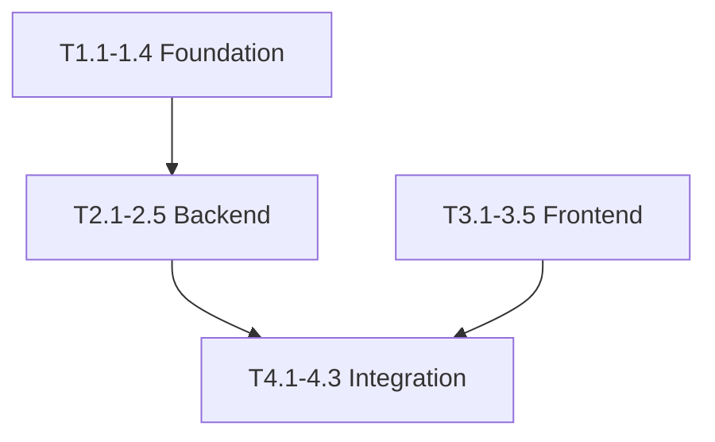
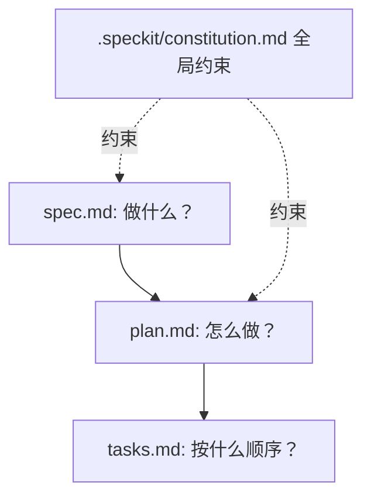

# GitHub Spec Kit 实战

GitHub Spec Kit 是 GitHub 于 **2025 年 9 月**开源的 SDD 工具包，提供 CLI + AI 助手 slash 命令的完整规范驱动开发工作流。核心理念：**"先写规范，再写代码，规范是单一事实来源"**。本章用 Todo App 案例带你从零走完六步实战流程。

---

## 1. 概述

Spec Kit 提供两种使用方式——CLI 负责脚手架，Slash 命令负责每一步的 AI 辅助生成：

| 使用方式 | 场景 | 示例 |
|----------|------|------|
| CLI | 项目初始化、批量操作 | `specify init my-project` |
| AI Slash 命令 | 日常开发交互 | `/speckit.constitution` ~ `/speckit.implement` |

核心价值：代码不是从需求直接生成的，而是经过"规范 -> 计划 -> 任务"三层拆解后才进入实现。


与同类工具对比：

| 维度 | GitHub Spec Kit | sdd-flow | LiorCohen/sdd |
|------|-----------------|----------|---------------|
| 成熟度 | 最高，GitHub 官方 | 社区活跃 | 早期 |
| 生态集成 | Issues/PR/Copilot | Claude Code 深度 | npm 独立 |
| 适合 | 任何规模团队 | Claude Code 用户 | npm 生态 |

---

## 2. 安装与初始化

```bash
# 1. 安装 uv（Spec Kit 运行时依赖）
curl -LsSf https://astral.sh/uv/install.sh | sh
uv --version    # 确认：uv 0.7.x
git --version   # 确认：git 2.43+

# 2. 初始化项目（交互式向导）
uvx --from git+https://github.com/github/spec-kit.git specify init todo-app

# 向导依次回答：
# → 项目名称：todo-app
# → 描述：A full-stack task management application
# → 技术栈：Python + FastAPI + React
# → GitHub Issues 集成：按需
# → PR 模板：建议 Yes
```

初始化后的项目结构：

```text
todo-app/
├── .speckit/                    # 配置 + 宪法 + prompt 模板
│   ├── config.yaml
│   ├── constitution.md          # Step 1 产物
│   └── templates/               # specify/clarify/plan/tasks/implement
├── specs/                       # 所有规范文档（核心工作区）
├── .github/                     # Issues 模板 + PR 模板
│   ├── ISSUE_TEMPLATE/feature-spec.md
│   └── PULL_REQUEST_TEMPLATE.md
├── .gitignore
└── README.md
```

`.speckit/` 控制 AI 行为边界，`specs/` 是规范唯一存放处，`.github/` 打通规范到代码的自动化链路。

---

## 3. 六步实战流程

以 Todo App（创建任务、标记完成、优先级排序、到期日提醒）为贯穿案例。

### Step 1 — `/speckit.constitution`：定义项目宪法

宪法是项目的**元规则**——定义"什么对、什么错"，不描述具体功能。

```text
/speckit.constitution
```

AI 追问核心问题及回答：

```text
Q1: Non-negotiable principles?
→ 所有 API 统一返回 {code, data, message}
→ 数据库操作必须通过 Repository 层
→ TypeScript strict mode，禁止 any

Q2: Technical constraints?
→ 后端 Python 3.12+ / FastAPI / SQLAlchemy 2.0 async
→ 前端 React 18+ / TypeScript 5.x / Tailwind CSS
→ DB: PostgreSQL 15+（生产）/ SQLite（开发）
→ 测试覆盖率：后端 >= 80%，前端核心 >= 60%

Q3: PR merge quality gates?
→ CI 全绿（lint + type-check + test）
→ 至少 1 人 Code Review
→ spec.md 与代码一致性检查
```

生成的 `.speckit/constitution.md` 核心原则：

```markdown
- P1: Unified API Response — all endpoints return {code, data, message}
- P2: Repository Pattern — no raw SQL in route handlers
- P3: TypeScript Strict — no `any` types
- P4: Spec Before Code — every feature must have spec.md first
```

**心得**：不超过 5 条核心原则，先写"绝对不能做"，再写"应该做"。

---

### Step 2 — `/speckit.specify`：编写功能规范

```text
/speckit.specify

Implement core task management for Todo App:
1. Create task (title, description, priority, optional due date)
2. View paginated task list, filter by priority and status
3. Mark task as completed
4. Delete task
Follow project constitution.
```

生成 `specs/001-core-task-management/spec.md`，关键内容（只描述外部行为，不涉及实现）：

```markdown
FR-1: Create Task — title(required 1-200), description(opt max2000),
      priority(required: high|medium|low), due_date(opt ISO8601). Errors: 400/500
FR-2: List Tasks — page(default1), page_size(default20 max100),
      priority/completed filters(opt). Paginated, sorted created_at DESC
FR-3: Mark Completed(PATCH /tasks/{id}) — Errors: 404/409
FR-4: Delete Task(DELETE /tasks/{id}) — 204 No Content. Errors: 404

Data Model: id(UUID) | title(NN) | description(?) | priority(enum NN) |
due_date(?) | completed(default false) | created_at | updated_at
```

---

### Step 3 — `/speckit.clarify`：AI 驱动的规范澄清

```text
/speckit.clarify
Review specs/001-core-task-management/spec.md for ambiguities.
```

AI 澄清对话：

```text
AI: 4 ambiguities found:
1. [FR-2] Deleted tasks in filtered results? → Excluded (soft delete).
2. [FR-1] Default priority? → Required, throw 400 if missing.
3. [FR-3] Past-due task completion? → Allowed, API returns warning field.
4. [Edge] Duplicate titles? → Allowed. Tasks identified by UUID.
```

澄清结果追加到 spec.md 的 Clarifications 章节。**技巧**：把 Clarify 当规范 lint——随时运行发现遗漏。

---

### Step 4 — `/speckit.plan`：生成技术实施计划

```text
/speckit.plan
Generate implementation plan for 001-core-task-management following constitution.
```

生成 `specs/001-core-task-management/plan.md`：

```markdown
Architecture: React → FastAPI Router → TaskService → TaskRepository → PostgreSQL

Backend (5 files): app/models/task.py (ORM), app/schemas/task.py (Pydantic),
  app/repositories/task_repository.py (CRUD+soft_delete),
  app/services/task_service.py (business logic), app/api/v1/tasks.py (4 endpoints)

Frontend (5 files): src/types/task.ts, src/api/tasks.ts (React Query),
  TaskForm.tsx, TaskList.tsx, TaskItem.tsx

Testing: Backend unit→integration; Frontend component(MSW)→E2E(Playwright)
```

---

### Step 5 — `/speckit.tasks`：分解为可执行任务

```text
/speckit.tasks
Decompose plan.md into executable tasks with dependencies.
```

生成 `specs/001-core-task-management/tasks.md`，按依赖分四个 Phase：

```markdown
Phase 1 Foundation(先完成): T1.1 Model → T1.2 Schema → T1.3 Migration → T1.4 Tests
Phase 2 Backend(依赖P1): T2.1 Repo → T2.2 Service → T2.3 Tests → T2.4 Router → T2.5 API tests
Phase 3 Frontend(可并行P2): T3.1 Types → T3.2 API Client → T3.3 Form → T3.4 List → T3.5 Tests
Phase 4 Integration(依赖P2+P3): T4.1 Wiring → T4.2 E2E → T4.3 CI verification
```

依赖关系：



---

### Step 6 — `/speckit.implement`：逐任务实现

```text
/speckit.implement
Start implementing from tasks.md, Phase 1 first.
```

执行过程：

```text
📋 Phase 1: Foundation
[T1.1] Task model ✅ (ruff ✅ mypy ✅)
[T1.2] Schemas ✅ (6 schemas, tests pass)
[T1.3] Migration ✅ (applied to dev DB)
[T1.4] Tests ✅ (8/8 pass)

📋 Phase 2: Backend Core
[T2.1] Repository ✅ (5 methods, 12/12 tests pass)
[T2.2] Service ✅ (validation + past-due warning)
[T2.4] Router ✅ (4 endpoints, unified format)
[T2.5] API tests ✅ (16/16 pass)
...
```

**保障机制**：每文件自动 lint+type-check，每 Phase 自动跑测试，失败在当前任务修复后才继续，代码自动对照 spec.md 做一致性检查。

---

## 4. Spec Kit 的文件结构约定

```text
specs/
├── 001-core-task-management/
│   ├── spec.md      # 做什么：需求 + 澄清（Step 2+3）
│   ├── plan.md      # 怎么做：架构 + 文件清单（Step 4）
│   └── tasks.md     # 按什么顺序：依赖 + 验收（Step 5）
├── 002-user-authentication/
│   └── spec.md / plan.md / tasks.md
└── 003-task-categories/
    └── spec.md / plan.md / tasks.md
```

三个文件关系：



**铁律**：spec.md 是最高优先级。spec vs plan 矛盾则改 plan，spec vs code 矛盾则改 code。

---

## 5. 与 GitHub 生态的集成

### Issues 自动创建

在 `.speckit/config.yaml` 中启用后，每个 Task 自动生成 GitHub Issue：

```yaml
github:
  auto_create_issues: true
  repo: "your-org/todo-app"
```

效果：`#42 [spec-driven] T1.1 Create Task model (Phase 1)`，带依赖标注 `blocks: #42 #43`。

### PR 模板

自动生成的 `.github/PULL_REQUEST_TEMPLATE.md` 包含 Spec 对照清单：

```markdown
## Spec Compliance Checklist
- [ ] All FRs in spec.md implemented
- [ ] All edge cases from clarifications handled
- [ ] API follows unified response format (P1)
- [ ] Tests cover spec scenarios

## Quality Gates
- [ ] CI passes / coverage meets threshold / no new type errors
```

### Copilot 协同

spec.md 和 plan.md 作为 Copilot 的**上下文锚点**——在 VS Code 中打开为参考文件后，代码建议更贴合规范。

---

## 6. 常见问题与技巧

### Q1：Constitution 写太长了怎么办

```text
/speckit.constitution
Trim from 18 rules to top 5 non-negotiable ones.
Move naming conventions to CONTRIBUTING.md.
```

原则：只放"违反必须拒绝 PR"的规则。

### Q2：规范生成不对如何修正

```text
# 不要手工改 spec.md
1. /speckit.clarify
   → "Spec says X, but I meant Y. Update accordingly."

2. /speckit.specify
   → "Revise FR-3: completed tasks archivable not deletable.
    Propagate to spec → plan → tasks."

# Spec Kit 自动传播变更
```

### Q3：多 feature 并行时的分支管理

```bash
git checkout -b feat/001-core-task-management
# ... 完成六步 → push → PR → merge to main

git checkout main && git pull
git checkout -b feat/002-user-authentication
# ... 重复
```

并发保护：plan.md 声明 "Files to Create/Modify"，spec review 阶段就能发现文件冲突，不需要等到合并。

---

## 7. 小结

Spec Kit 将 SDD 固化为六个可执行步骤：**Constitution → Specify → Clarify → Plan → Tasks → Implement**。

| 场景 | 适合度 |
|------|--------|
| 新项目从零搭建 | 非常适合 |
| 已有项目新增功能 | 适合，specs/ 下新增即可 |
| 紧急 Bug 修复 | 不适合，跳过完整流程 |
| 技术探索/POC | 轻量，只用 specify + plan |
| 多人协作中大型项目 | **最佳场景** |

Spec Kit 适合从 **L2 级别**（结构化规范）开始 SDD 的团队。如果团队处于 L1，建议先用 1-2 个小功能跑通流程，建立"规范先行"的肌肉记忆，再逐步推广到整个项目。

> 从 `specify init todo-app` 开始，六步走一遍约 3-4 小时。动手之后你会发现 SDD 从概念变成了每天可用的工作习惯。
