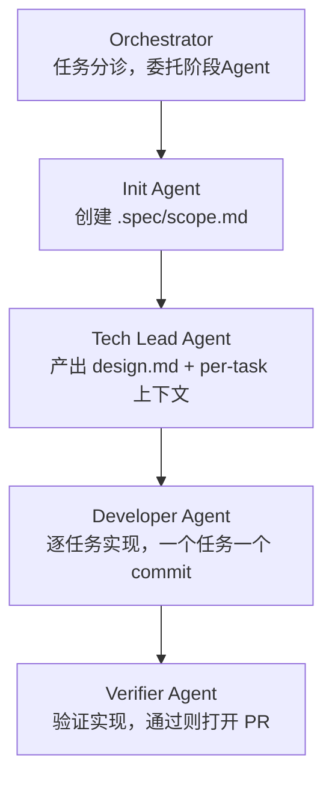

# sdd-flow 插件使用指南

[sdd-flow](https://github.com/nushey/sdd-flow) 是 Claude Code 的 SDD 插件，提供多 Agent 阶段门控流水线——从规范到 PR 的全自动化流程。

---

## 1. 什么是 sdd-flow

sdd-flow 将 SDD 七步工作流映射为一组专用的 Claude Code 子 Agent，每个 Agent 只负责一个阶段，通过严格的输入/输出门控串联：



### 核心设计原则

| 原则 | 说明 |
|------|------|
| **阶段隔离** | 每个 Agent 运行在独立会话中，只接收上一阶段的产出物 |
| **Convention-First** | `AGENTS.md` 是法律，所有 Agent 读取但永不修改 |
| **Sequential Tasks** | Developer 一次只做一个任务，一任务一 commit |
| **PR Only** | Verifier 通过后打开 PR，从不自动合并 |
| **Harness-Neutral** | 不依赖 MCP Server，直接读取磁盘上的 skills/subagents |

---

## 2. 安装

### 前置条件

```bash
# 1. 项目必须有 AGENTS.md（sdd-flow 要求，否则会报错）
touch AGENTS.md

# 2. Git + GitHub CLI 必须认证
gh auth login
gh auth status
```

### 安装插件

```bash
# 在 Claude Code 中执行
/plugin marketplace add nushey/sdd-flow
/plugin install sdd-flow@sdd-flow
```

重启 Claude Code 后，以下命令自动可用：

```
/sdd <description>     # 触发完整 SDD 流水线
/sdd-init              # 仅运行 Init 阶段
/sdd-tech-lead         # 仅运行 Tech Lead 阶段
/sdd-developer         # 仅运行 Developer 阶段
/sdd-verifier          # 仅运行 Verifier 阶段
```

---

## 3. 完整工作流

### 3.1 触发流水线

```bash
/sdd Add OAuth login with Google
```

这条命令触发完整的五步流水线：

```
Triage (Orchestrator)
  → Init: 创建 .spec/<slug>/scope.md
    → Tech Lead: 产出 design.md + per-task 上下文
      → Developer: 逐任务执行（每任务一个 commit）
        → Verifier: 验证 + 打开 PR
```

### 3.2 产出物结构

```
.spec/<feature-slug>/
├── scope.md          # Init 产出：功能范围定义
├── design.md         # Tech Lead 产出：技术设计
├── tasks/            # Tech Lead 产出：任务列表（每个任务独立文件）
│   ├── 01-xxx.md
│   ├── 02-xxx.md
│   └── ...
└── verify.md         # Verifier 产出：验证报告
```

### 3.3 分阶段手动执行

当你不希望一次跑完整个流水线时，可以手动逐步执行：

```bash
# Step 1: 只写 scope
/sdd-init Add OAuth login with Google

# Step 2: 审查 scope.md 后，生成设计
/sdd-tech-lead

# Step 3: 审查设计后，逐任务实现
/sdd-developer

# Step 4: 验证
/sdd-verifier
```

---

## 4. AGENTS.md 的编写

sdd-flow 将 `AGENTS.md` 视为必须存在的项目宪法文件。推荐的 AGENTS.md 结构：

```markdown
# AGENTS.md

## 项目概览
- 项目名：my-api-server
- 技术栈：Python 3.13, FastAPI, PostgreSQL
- 架构：分层架构（Router → Service → Repository）

## 必须遵守的规则
1. 所有 API 端点必须有 Pydantic 模型定义
2. 数据库操作必须通过 Repository 层
3. 错误统一使用 HTTPException
4. 测试覆盖率不低于 80%
5. 禁止在 Router 层直接写业务逻辑

## 编码规范
- 使用 ruff 格式化
- Type Hints 必须
- Docstring 使用 Google 风格

## 禁止事项
- 禁止使用 print() 调试（用 logging）
- 禁止 hardcode 配置（用环境变量）
- 禁止在 PR 中包含 .env 文件
```

> **关键**：AGENTS.md 应该短小精悍——Agent 每次启动都会读取它。5-10 条核心规则远好于 50 条没人看的。

---

## 5. 实战：用 sdd-flow 开发一个 API

以"为博客系统添加文章搜索 API"为例：

### Step 1：初始化

```bash
/sdd Add article search API with full-text search support
```

Orchestrator 分析后，Init Agent 创建：

```markdown
# .spec/article-search-api/scope.md

## 功能范围
- 关键字搜索文章标题和内容
- 支持分页（page, page_size）
- 支持按日期范围过滤
- 搜索结果按相关度排序

## 不在范围
- 不实现高级搜索语法（AND/OR/NOT）
- 不实现搜索建议/自动补全
- 不修改现有文章模型
```

### Step 2：技术设计

Tech Lead 审查 scope.md，产出 design.md：

```markdown
# .spec/article-search-api/design.md

## 技术方案
- 数据库：PostgreSQL full-text search (tsvector)
- 搜索端点：GET /api/articles/search?q=keyword&page=1&size=20
- 索引策略：在 articles.title 和 articles.content 上建 GIN 索引

## 数据流
Client → GET /api/articles/search
  → Router (参数验证)
    → Service (搜索逻辑 + 分页)
      → Repository (raw SQL with ts_query)
        → PostgreSQL

## 上下文策略
- 每个任务只注入相关文件
- 开发者只需关注 Router/Service/Repository 三层
```

### Step 3：任务分解

Tech Lead 将设计分解为可执行任务：

```
.spec/article-search-api/tasks/
├── 01-add-search-index.md       # 数据库迁移：添加 tsvector 列和 GIN 索引
├── 02-implement-repository.md   # 实现 search_articles() 仓库方法
├── 03-implement-service.md      # 实现搜索业务逻辑 + 分页
├── 04-add-api-endpoint.md       # 添加 GET /api/articles/search 路由
└── 05-add-tests.md             # 集成测试
```

### Step 4：逐任务实现

Developer Agent 按序执行，每完成一个任务：

```bash
git add -A
git commit -m "feat(search): add tsvector search index for articles

Task: 01-add-search-index
Spec: .spec/article-search-api/scope.md §3
"
```

### Step 5：验证与 PR

Verifier Agent 验证所有任务完成后：

```bash
# Verifier 执行：
1. 逐条对照 scope.md 检查实现
2. 运行测试套件
3. 检查设计偏差

# 通过后：
gh pr create --title "feat: article search API" --body "..."
# → PR #42 opened
```

---

## 6. sdd-flow 与其他 Claude Code 功能的协作

| 功能 | 协作方式 |
|------|----------|
| **Hooks** | 在 commit 前触发 lint/format Hook |
| **MCP Server** | Developer Agent 可通过 MCP 访问数据库 Schema |
| **Skills** | sdd-flow 本身作为 Skill 加载，可与其他自定义 Skill 配合 |
| **/init** | 不使用——AGENTS.md 是唯一上下文入口 |

---

## 7. 故障排查

| 问题 | 原因 | 解决 |
|------|------|------|
| `FAIL — AGENTS.md missing` | 项目根目录缺少 AGENTS.md | `touch AGENTS.md` 并填入项目规范 |
| Developer 产出与设计不符 | Tech Lead 产出的设计不够精确 | 回到 `/sdd-tech-lead` 重新生成设计 |
| Verifier 反复失败 | 规范本身有矛盾 | 检查 scope.md 是否有冲突的验收条件 |
| 任务执行顺序错乱 | tasks/ 目录命名不规范 | 确保任务文件名用 `01-`、`02-` 前缀 |

---

## 8. sdd-flow vs GitHub Spec Kit

| 维度 | sdd-flow | GitHub Spec Kit |
|------|----------|-----------------|
| 运行环境 | Claude Code 插件 | CLI + 任意 AI 助手 |
| Agent 模式 | 多 Agent 阶段隔离 | 单一 Agent 全流程 |
| Git 集成 | 自动 commit + PR | 手动 Git 操作 |
| 上下文管理 | 冷上下文，阶段隔离 | 依赖 AI 助手的上下文能力 |
| 适用场景 | 有 Claude Code 的团队 | 任何 AI 编码助手用户 |
| 学习成本 | 中等（需理解 Agent 门控） | 低（标准 CLI 工作流） |

> **选择建议**：已在使用 Claude Code 的团队 → sdd-flow；需要在多种 AI 助手间切换 → Spec Kit。

---

## 9. 小结

- sdd-flow 的核心创新是 **阶段隔离**——每个 Agent 只看自己需要的信息
- AGENTS.md 是 sdd-flow 的"Constitution"，决定所有 Agent 的行为边界
- 完整流水线 `/sdd` 或分步执行都支持，按项目复杂度选择
- sdd-flow 的 PR-only 模式确保人工始终有最终审查权

---

## 下一步

阅读 [03-其他SDD工具与选型](03-其他SDD工具与选型.md) 了解 LiorCohen/sdd 和 archiet-microcodegen 等替代工具。
