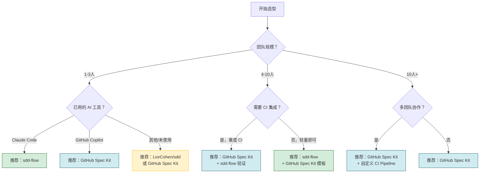
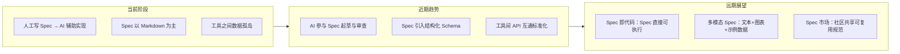

# 其他 SDD 工具与选型

GitHub Spec Kit 和 sdd-flow 已经分别在前面两章做了深入介绍。本章补充介绍社区中其他值得关注的 SDD 工具，并提供一套**实战工具选型决策框架**，帮助你在不同场景下做出最优选择。

---

## 1. 社区工具概览

### 1.1 LiorCohen/sdd — 轻量级 SDD CLI

[LiorCohen/sdd](https://github.com/LiorCohen/sdd) 是一个极简的 SDD 命令行工具，核心理念是"少即是多"——它不强加任何特定工作流，只提供最基础的规范脚手架。

```bash
# 安装
npm install -g sdd

# 基础用法
sdd init              # 初始化 .sdd/ 目录
sdd spec create       # 创建功能规范
sdd spec validate     # 校验规范格式
sdd spec list         # 列出所有规范
```

**核心特性**：

| 特性 | 说明 |
|------|------|
| 零配置启动 | 没有复杂的配置向导，init 即用 |
| Markdown 原生 | 规范就是 Markdown 文件，不引入私有格式 |
| 模板可定制 | `.sdd/templates/` 下可覆盖默认模板 |
| 校验规则 | 内置 Schema 校验，确保规范包含必要字段 |
| 生态中立 | 不绑定任何 AI 工具或 CI 平台 |

**适用场景**：
- 个人项目或小团队（1-5 人），不需要复杂流程
- 已有成熟的 AI 工具链（如 Cursor/Copilot），只需一个规范管理脚手架
- npm/Node.js 生态项目，希望工具链统一
- 对 SDD 方法论持观望态度，想低成本试用

**局限性**：
- 没有 AI Agent 集成，需要手动将 Spec 喂给 AI 工具
- 缺少 CI/CD 模板，自动化验证需自行搭建
- 社区规模小，遇到问题支持有限

### 1.2 archiet-microcodegen — 规范驱动的微代码生成实验

[archiet-microcodegen](https://github.com/archiet-ai/microcodegen) 是一个实验性项目，探索"用规范直接生成精确到函数签名的代码骨架"，而不仅仅是高层次的代码建议。

```text
工作方式：
1. 编写 Spec（比常规 SDD 更精细，包含类型定义和接口签名）
2. 运行 microcodegen
3. 生成：目录结构 + 函数签名 + 类型定义 + 测试桩
4. 开发者填充函数体
```

**核心特性**：

| 特性 | 说明 |
|------|------|
| 类型驱动 | Spec 中定义精确的类型和接口，Generator 保证类型一致性 |
| 测试先行 | 自动生成测试框架和测试桩，强制 TDD |
| 确定性输出 | 相同的 Spec 产生相同的代码骨架，消除"AI 随机性" |
| 实验性质 | 适合探索和研究，不建议生产环境直接使用 |

**适用场景**：
- 探索 SDD 与代码生成深度融合的可能边界
- 教学演示：展示规范精确到什么程度可以直接生成代码
- 类型安全要求极高的小型工具库开发

**局限性**：
- 处于实验阶段，不支持复杂业务逻辑生成
- 对 Spec 编写要求极高（需要精确到函数签名级别）
- 语言支持有限，目前主要面向 TypeScript/Node.js

---

## 2. 工具选型决策框架

### 2.1 决策树



### 2.2 决策维度详解

| 维度 | 权重 | 评估要点 |
|------|------|----------|
| 团队规模 | 高 | 1-3 人偏轻量灵活，4-10 人需 CI 集成，10+ 人需权限和审计 |
| 技术栈 | 中 | npm 生态偏 sdd，Python 生态偏 sdd-flow，多语言偏 Spec Kit |
| AI 工具绑定 | 高 | Claude Code 用户首选 sdd-flow，GitHub 生态首选 Spec Kit |
| CI/CD 深度 | 中 | 需要自动化验证优先选 Spec Kit（内置 GitHub Actions） |
| 学习成本预算 | 中 | 预算高可选功能全的工具，预算低从轻量工具起步 |
| 合规要求 | 低 | 金融/医疗行业需审计追踪，选 Spec Kit（支持 PR 审批链） |

---

## 3. 推荐工具组合

### 3.1 组合方案

```text
方案 A：全栈 GitHub 生态（推荐大多数团队）
  ├── GitHub Spec Kit：规范脚手架 + slash 命令
  ├── GitHub Actions：CI 自动验证
  ├── GitHub Copilot：AI 代码生成
  └── GitHub Issues + PR：需求跟踪 + 评审

方案 B：Claude Code 深度集成
  ├── sdd-flow：规范管理与验证
  ├── Claude Code：AI 辅助全流程
  ├── GitLab/GitHub CI：按需搭配
  └── Custom Hooks：自定义验证规则

方案 C：轻量自建组合（个人/小团队）
  ├── LiorCohen/sdd：规范管理
  ├── Markdown Lint：格式校验
  ├── Cursor/Copilot：AI 辅助
  └── Git Pre-commit Hook：基础验证
```

### 3.2 按项目类型推荐

| 项目类型 | 推荐工具组合 | 理由 |
|----------|-------------|------|
| 开源库/SDK | GitHub Spec Kit | Issue 驱动的规范管理，社区友好 |
| 内部微服务 | sdd-flow + GitLab CI | 灵活的自定义验证，与内部 Git 平台集成 |
| 个人项目 | LiorCohen/sdd 或无工具（手册流程） | 轻量，避免工具负担超过项目本身 |
| AI/ML 项目 | GitHub Spec Kit + sdd-flow 验证 | 模型行为规范需要更灵活的验证机制 |
| 合规敏感项目 | GitHub Spec Kit + 自定义审计 Pipeline | 完整的变更追溯链，支持审计要求 |

---

## 4. 未来工具发展趋势

### 4.1 趋势预判



### 4.2 关键趋势

| 趋势 | 当前状态 | 预期演进 | 对选型的影响 |
|------|----------|----------|-------------|
| **AI 原生** | 工具辅助 AI，而非 AI 驱动工具 | AI 成为 SDD 流程的主要执行者 | 选型时优先考虑 AI 集成深度 |
| **规范可执行化** | Spec 是描述性文档 | Spec 包含可执行的契约和测试 | 工具需支持 Spec → Test 自动生成 |
| **标准化** | 各工具私有格式 | 跨工具的 Spec 交换标准出现 | 避免锁定单一工具，选择支持开放格式的工具 |
| **多模态 Spec** | 纯文本 Markdown | 融合流程图、序列图、示例数据 | 工具需支持多格式渲染与校验 |
| **协作深度集成** | 以文件形式管理 | 类似数据库的实时协作规范编辑 | 实时同步、冲突解决成为必备能力 |

---

## 5. 选型 Checklist

在最终决定前，逐项确认：

```markdown
## SDD 工具选型 Checklist

### 必选项
- [ ] 团队成员能在 1 小时内完成工具安装和首次使用
- [ ] 工具生成的规范文件是纯文本格式（Markdown/YAML），不依赖私有格式
- [ ] 支持 Git 版本控制友好（diff 可读、merge 可处理）
- [ ] 有基本的规范校验能力（格式/必要字段检查）

### 加分项
- [ ] 与你团队已用的 AI 工具有集成（Claude Code / Copilot / Cursor）
- [ ] 提供 CI/CD 模板或插件（GitHub Actions / GitLab CI）
- [ ] 有活跃的社区或商业支持
- [ ] 支持自定义模板和校验规则
- [ ] 有从其他工具迁移的路径

### 否决项
- [ ] 需要团队学习一门新的 DSL 才能使用
- [ ] 规范文件绑定特定云平台（无法迁移）
- [ ] 超过 6 个月未更新且社区无响应
```

---

## 总结

选型核心原则：**工具服务于流程，而非流程迁就工具**。

1. 小团队从 GitHub Spec Kit 或 LiorCohen/sdd 起步，跑通 SDD 循环后再评估是否需要升级
2. Claude Code 用户首选 sdd-flow，它与 SDD 七步工作流深度融合
3. 多团队协作场景优先选择 GitHub Spec Kit，利用其认证评审和 CI 集成
4. 关注"可迁移性"——选择支持开放格式的工具，避免供应商锁定
5. 未来 2 年内，AI 原生和规范可执行化是两大核心演进方向，选型时预留扩展空间
