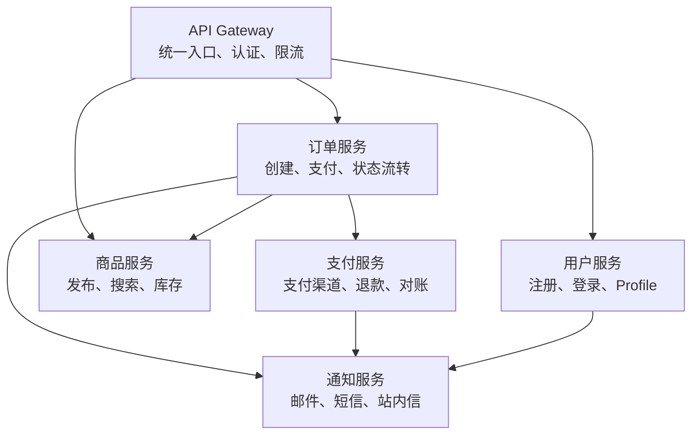
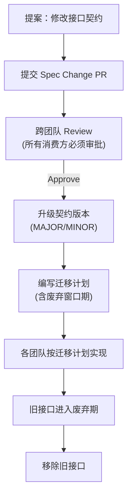
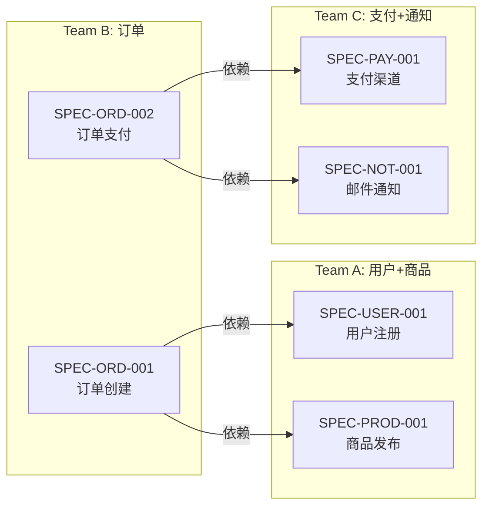
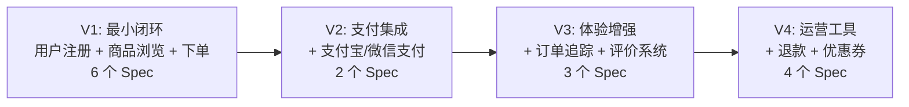

# 多模块项目 SDD 进阶实践

本教程以"电商平台"为案例，展示如何在多模块、多团队协作的大型项目中落地 SDD。从模块拆分、接口契约前置、跨模块依赖协调，到分层 Constitution 和增量交付策略。

---

## 1. 案例背景

### 项目概览

**MallPlatform**：一个中型电商平台，包含以下模块：



- **团队规模**：3 个团队，共 12 人
- **技术栈**：Python/FastAPI + PostgreSQL + Redis + RabbitMQ
- **已有基础**：单体 MVP → 计划拆分为微服务
- **核心挑战**：模块间接口耦合、需求变更频繁、多人协作时的上下文不一致

---

## 2. 模块拆分与规范前置

### 2.1 模块级 Constitution

大项目的 Constitution 采用 **两级分层**：

```
项目级 Constitution (所有模块遵守)
├── 模块级 Constitution — 用户服务
├── 模块级 Constitution — 商品服务
├── 模块级 Constitution — 订单服务
├── 模块级 Constitution — 支付服务
└── 模块级 Constitution — 通知服务
```

**项目级 Constitution 示例**：

```markdown
# MallPlatform Constitution v1.0

## 跨模块原则

### 原则 1：接口契约优先
- 所有模块间通信必须先定义 OpenAPI 3.0 契约
- 契约变更必须走 Spec Change PR
- 破坏性变更需要 MAJOR 版本号升级 + 2 周迁移窗口

### 原则 2：事件驱动松耦合
- 跨模块的异步通知使用 RabbitMQ 事件
- 事件 Schema 定义在 specs/events/ 目录
- 事件消费者必须幂等

### 原则 3：数据隔离
- 每个服务拥有独立数据库 Schema
- 禁止跨服务直接查询数据库
- 需要其他服务数据时通过 API 调用

### 原则 4：统一错误处理
- 所有 API 使用统一的错误响应格式
- 错误码跨服务全局唯一（如 USER_001, ORDER_005）
- 错误信息中英文双语
```

**模块级 Constitution 示例（订单服务）**：

```markdown
# Order Service Constitution v1.0

## 继承项目级原则：1-4 全部遵守

## 订单服务特有原则

### 原则 O1：状态机先行
- 所有订单状态变更必须先更新状态机 Spec
- 状态变更必须记录事件日志
- 非法状态转换必须在 API 层拦截

### 原则 O2：事务边界明确
- 订单创建 → 库存扣减：使用 Saga 模式
- 支付回调 → 订单状态更新：使用幂等键
- 退款 → 订单状态回退：必须人工审批

### 限制
- 订单服务不直接调用支付渠道（通过支付服务）
- 订单服务不发送用户通知（通过通知服务）
- 禁止在订单流程中做同步的库存校验（使用异步事件）
```

### 2.2 接口契约前置

多模块项目的关键挑战是 **模块间接口的同步**。SDD 的做法：**接口规范先于模块实现**。

```
specs/
├── contracts/                    # 跨模块接口契约（全局共享）
│   ├── order-payment.yaml       # 订单→支付 接口契约
│   ├── order-product.yaml       # 订单→商品 接口契约
│   └── user-notify.yaml         # 用户→通知 接口契约
├── events/                       # 跨模块事件 Schema（全局共享）
│   ├── order-created.json       # 订单创建事件
│   ├── payment-completed.json   # 支付完成事件
│   └── inventory-deducted.json  # 库存扣减事件
├── user-service/                 # 用户服务内部规范
├── product-service/              # 商品服务内部规范
├── order-service/                # 订单服务内部规范
├── payment-service/              # 支付服务内部规范
└── notify-service/               # 通知服务内部规范
```

**跨模块接口契约示例**（`specs/contracts/order-payment.yaml`）：

```yaml
# OpenAPI 3.0 — 订单服务→支付服务接口契约
openapi: "3.0.0"
info:
  title: Order-Payment Contract
  version: "1.0.0"
  description: >
    本契约为 Order Service 和 Payment Service 之间的唯一交互规范。
    任何一方修改此契约之前必须先通过 Spec Change PR。

paths:
  /api/payment/create:
    post:
      summary: 创建支付（订单服务调用）
      operationId: createPayment
      requestBody:
        required: true
        content:
          application/json:
            schema:
              type: object
              required: [order_id, amount, currency]
              properties:
                order_id:
                  type: string
                  description: 订单 ID (来自订单服务)
                amount:
                  type: number
                  minimum: 0.01
                currency:
                  type: string
                  enum: [CNY, USD]
      responses:
        "201":
          description: 支付创建成功
          content:
            application/json:
              schema:
                type: object
                properties:
                  payment_id: { type: string }
                  status: { type: string, enum: [pending, processing] }
                  pay_url: { type: string, format: uri }
        "409":
          description: 该订单已存在未完成的支付
          content:
            application/json:
              schema:
                $ref: "#/components/schemas/ErrorResponse"
        "422":
          description: 金额 / 币种参数校验失败

components:
  schemas:
    ErrorResponse:
      type: object
      properties:
        code: { type: string, example: "PAYMENT_001" }
        message: { type: string }
```

### 2.3 契约变更流程



> **核心原则**：接口契约的变更，所有消费方团队都必须参与 Review。一个人的小改动 = 另一个人的生产故障。

---

## 3. 多团队并行开发协调

### 3.1 团队分工与 Spec 矩阵



依赖关系决定开发顺序：
1. **Wave 1**（无外部依赖）：Team A 用户注册、Team C 支付渠道 → 并行
2. **Wave 2**（依赖 Wave 1）：Team A 商品发布、Team C 邮件通知 → 并行
3. **Wave 3**（依赖 Wave 1+2）：Team B 订单创建 → 串行
4. **Wave 4**（依赖 Wave 3）：Team B 订单支付 → 串行

### 3.2 并行开发时的"接口模拟"策略

当 Team B（订单）依赖 Team A（用户）的接口，但 Team A 还在开发中时：

```yaml
# 方案 1：契约驱动 Mock（推荐）
# 基于已批准的接口契约生成 Mock Server

# specs/contracts/user-order.yaml 是已批准的契约
# 使用 Prism 等工具从 OpenAPI 自动生成 Mock
npx @stoplight/prism mock specs/contracts/user-order.yaml

# Team B 的开发环境指向 Mock Server
# 真实 API 就绪后只需切换 URL，代码无需修改
```

```python
# 方案 2：契约驱动 Test Double（集成测试用）
# test/mocks/user_service.py

from fastapi import FastAPI
from specs.contracts.user_order import UserInfoResponse

app = FastAPI()

@app.get("/api/users/{user_id}", response_model=UserInfoResponse)
async def get_user(user_id: str):
    """基于 SPEC-USER-001 §3.2 的 Mock 实现"""
    return UserInfoResponse(
        user_id=user_id,
        username=f"mock_user_{user_id}",
        email=f"{user_id}@mock.example.com",
        status="active"
    )
```

> **关键**：Mock 的行为基于已批准的接口契约，不是基于开发者的"猜测"。这保证了并行开发的可靠性。

### 3.3 跨团队 Spec Review 流程

```
Step 1: Team B 发现需要"获取用户信息"接口
Step 2: Team B 起草 specs/contracts/user-order.yaml（消费方视角）
Step 3: PR 提交到 specs/contracts/
Step 4: Team A（提供方）Review + 修改
Step 5: 双方协商一致 → Merge
Step 6: Team A 创建 SPEC-USER-002（用户信息查询）内部规范
Step 7: Team B 基于契约使用 Mock 并行开发
Step 8: Team A 实现 SPEC-USER-002
Step 9: Team B 切换到真实 API，集成测试
```

---

## 4. 规范的增量交付

### 4.1 从 MVP 到全功能的 Spec 演进

电商平台不一次性写完所有 Spec，而是按业务价值增量交付：



每一版的 Spec 交付物：

| 版本 | Spec 数量 | 新接口契约 | 新增事件 | 交付周期 |
|------|----------|-----------|---------|---------|
| V1 MVP | 6 | 3 | 2 | 4 周 |
| V2 支付 | 2 | 1 | 1 | 2 周 |
| V3 体验 | 3 | 1 | 2 | 3 周 |
| V4 运营 | 4 | 2 | 3 | 4 周 |

### 4.2 版本间的 Spec 依赖管理

```bash
# Git 分支策略：版本之间的 Spec 依赖

# V1 分支
main
├── specs/user-service/SPEC-USER-001  (v1.0)  ← V1 的基础
├── specs/product-service/SPEC-PROD-001 (v1.0)
└── specs/order-service/SPEC-ORD-001   (v1.0)

# V2 分支（基于 V1）
release/v2
├── specs/user-service/SPEC-USER-001  (v1.1)  ← MINOR 升级：新增支付信息字段
├── specs/payment-service/SPEC-PAY-001 (v1.0)  ← V2 新增
└── specs/contracts/order-payment.yaml  ← V2 新增接口契约

# V3 分支（基于 V2）
release/v3
├── specs/user-service/SPEC-USER-001  (v2.0)  ← MAJOR 升级：重写用户模型
├── specs/review-service/SPEC-REV-001 (v1.0)  ← V3 新增
└── specs/contracts/user-review.yaml  ← V3 新增接口契约
```

---

## 5. 实战：订单支付 Saga 的跨模块 SDD

这是整个项目中最复杂的跨模块场景——涉及订单、支付、商品、通知四个服务。

### 5.1 Saga 的规范描述

```markdown
# Saga 规范：订单支付流程 (SAGA-ORD-001)

## 参与模块
- Order Service（编排者）
- Payment Service（支付执行）
- Product Service（库存管理）
- Notify Service（通知发送）

## 正向流程

Step 1: 用户提交订单
  → Order Service: 创建订单 (status=pending_payment)
  → 发布事件: order.created

Step 2: 扣减库存
  → Order Service 调用 Product Service: /api/inventory/deduct
  → Product Service: 扣减成功返回
  → 如果扣减失败 → 触发补偿: 订单取消

Step 3: 创建支付
  → Order Service 调用 Payment Service: /api/payment/create
  → Payment Service: 创建支付单，返回 pay_url
  → 如果支付创建失败 → 触发补偿: 库存释放 + 订单取消

Step 4: 用户支付
  → 用户在支付页面完成支付
  → Payment Service: 接收支付回调，验证签名
  → Payment Service 调用 Order Service: /api/orders/{id}/payment-callback

Step 5: 支付成功
  → Order Service: 更新订单状态 (status=paid)
  → 发布事件: order.paid
  → Notify Service 消费事件 → 发送支付成功通知

## 补偿流程（任一 Step 失败）

Compensation 1 (Step 2 失败):
  → Order Service: 订单状态 → cancelled
  → 无需释放库存（扣减未成功）

Compensation 2 (Step 3 失败):
  → Order Service 调用 Product Service: /api/inventory/release
  → Order Service: 订单状态 → cancelled

Compensation 3 (Step 4 超时 30min):
  → Order Service: 订单状态 → payment_timeout
  → Order Service 调用 Product Service: /api/inventory/release
  → 发布事件: order.payment_timeout

## 幂等保证
- /api/inventory/deduct: 幂等键 = order_id（同一订单不重复扣减）
- /api/payment/create: 幂等键 = order_id（同一订单不重复创建支付）
- /api/orders/{id}/payment-callback: 幂等键 = payment_id（同一支付不重复回调）
```

### 5.2 从 Saga Spec 到实现

**Order Service 的 Saga 编排器实现**：

```python
# order_service/saga/payment_saga.py
# @spec: SAGA-ORD-001 §1-5 — 订单支付 Saga 正向流程
# @spec: SAGA-ORD-001 §Compensation — 补偿流程
# @spec: SAGA-ORD-001 §Idempotency — 幂等保证

import asyncio
import logging
from dataclasses import dataclass, field
from enum import Enum
from typing import Callable, Awaitable

logger = logging.getLogger(__name__)

class SagaStatus(Enum):
    RUNNING = "running"
    COMPLETED = "completed"
    COMPENSATING = "compensating"
    FAILED = "failed"

@dataclass
class SagaStep:
    """Saga 步骤定义。"""
    name: str
    action: Callable[..., Awaitable[dict]]
    compensation: Callable[..., Awaitable[None]]
    action_args: dict = field(default_factory=dict)
    compensation_args: dict = field(default_factory=dict)


class PaymentSagaOrchestrator:
    """订单支付 Saga 编排器。

    参考规范：SAGA-ORD-001
    """

    def __init__(self, order_id: str):
        self.order_id = order_id
        self.status = SagaStatus.RUNNING
        self.executed_steps: list[str] = []
        self.step_results: dict[str, dict] = {}

    async def execute(self, steps: list[SagaStep]) -> SagaStatus:
        """执行 Saga 正向流程。"""
        for step in steps:
            try:
                result = await step.action(**step.action_args)
                self.executed_steps.append(step.name)
                self.step_results[step.name] = result
                logger.info(
                    f"Saga {self.order_id}: Step {step.name} 完成"
                )
            except Exception as e:
                logger.error(
                    f"Saga {self.order_id}: Step {step.name} 失败 — {e}"
                )
                # 触发补偿
                await self._compensate(steps)
                return SagaStatus.FAILED

        self.status = SagaStatus.COMPLETED
        return SagaStatus.COMPLETED

    async def _compensate(self, steps: list[SagaStep]):
        """逆序执行已成功步骤的补偿操作。"""
        self.status = SagaStatus.COMPENSATING
        logger.warning(f"Saga {self.order_id}: 开始补偿...")

        # 逆序补偿（后执行的先回滚）
        for step in reversed(steps):
            if step.name in self.executed_steps:
                try:
                    await step.compensation(**step.compensation_args)
                    logger.info(
                        f"Saga {self.order_id}: 补偿 {step.name} 完成"
                    )
                except Exception as e:
                    # 补偿失败是严重问题 — 需要人工介入
                    logger.critical(
                        f"Saga {self.order_id}: 补偿 {step.name} 失败！"
                        f"需要人工介入！错误: {e}"
                    )


# 构建支付 Saga 的步骤定义
# @spec: SAGA-ORD-001 §Step 2
async def deduct_inventory(product_service, order_id, items):
    return await product_service.post("/api/inventory/deduct", json={
        "order_id": order_id,
        "items": items,
    })

async def compensate_deduct_inventory(product_service, order_id):
    return await product_service.post("/api/inventory/release", json={
        "order_id": order_id,
    })

# @spec: SAGA-ORD-001 §Step 3
async def create_payment(payment_service, order_id, amount, currency):
    return await payment_service.post("/api/payment/create", json={
        "order_id": order_id,
        "amount": amount,
        "currency": currency,
    })

async def compensate_create_payment(payment_service, payment_id):
    return await payment_service.post(f"/api/payment/{payment_id}/cancel")


async def process_order_payment(
    order_id: str,
    items: list[dict],
    amount: float,
    currency: str = "CNY",
):
    """执行订单支付 Saga 的入口函数。

    @spec: SAGA-ORD-001 — 完整 Saga 流程
    """
    saga = PaymentSagaOrchestrator(order_id)

    steps = [
        SagaStep(
            name="deduct_inventory",
            action=deduct_inventory,
            compensation=compensate_deduct_inventory,
            action_args={"product_service": product_client, "order_id": order_id, "items": items},
            compensation_args={"product_service": product_client, "order_id": order_id},
        ),
        SagaStep(
            name="create_payment",
            action=create_payment,
            compensation=compensate_create_payment,
            action_args={"payment_service": payment_client, "order_id": order_id, "amount": amount, "currency": currency},
            compensation_args={"payment_service": payment_client, "payment_id": "PLACEHOLDER"},
        ),
    ]

    return await saga.execute(steps)
```

### 5.3 Saga 测试：从规范直接生成

```python
# tests/saga/test_payment_saga.py
# 自动生成的测试骨架，来源：SAGA-ORD-001 验收条件

class TestPaymentSaga:

    # @spec: SAGA-ORD-001 §正向流程 — Step 1-5 Happy Path
    async def test_saga_happy_path_all_steps_succeed(self, mocker):
        """正常支付流程：所有步骤成功 → Saga 状态 COMPLETED。"""
        # Given: Mock 所有下游服务返回成功
        mock_product = mocker.patch("services.product.deduct", return_value={"status": "ok"})
        mock_payment = mocker.patch("services.payment.create", return_value={"payment_id": "pay_123"})

        # When: 执行支付 Saga
        result = await process_order_payment(
            order_id="ord_001",
            items=[{"sku": "ITEM-1", "qty": 2}],
            amount=199.00,
        )

        # Then: Saga 完成
        assert result == SagaStatus.COMPLETED
        mock_product.assert_called_once()
        mock_payment.assert_called_once()

    # @spec: SAGA-ORD-001 §Compensation 2 — 库存扣减成功但支付创建失败
    async def test_saga_compensates_inventory_when_payment_fails(self, mocker):
        """支付创建失败 → 触发库存释放 + Saga 状态 FAILED。"""
        # Given: 库存扣减成功，支付创建抛出异常
        mocker.patch("services.product.deduct", return_value={"status": "ok"})
        mocker.patch("services.payment.create", side_effect=RuntimeError("支付服务不可用"))
        mock_release = mocker.patch("services.product.release")

        # When: 执行支付 Saga
        result = await process_order_payment(
            order_id="ord_002",
            items=[{"sku": "ITEM-2", "qty": 1}],
            amount=99.00,
        )

        # Then: Saga 失败，补偿执行
        assert result == SagaStatus.FAILED
        mock_release.assert_called_once_with(order_id="ord_002")

    # @spec: SAGA-ORD-001 §Compensation 3 — 支付超时
    async def test_saga_timeout_triggers_compensation(self, mocker):
        """30 分钟支付超时 → 库存释放 + 订单状态 payment_timeout。"""
        # Given: 库存扣减成功，支付创建成功但 30 分钟内无回调
        mocker.patch("services.product.deduct", return_value={"status": "ok"})
        mocker.patch("services.payment.create", return_value={"payment_id": "pay_456"})
        mock_release = mocker.patch("services.product.release")
        mock_order_update = mocker.patch("services.order.update_status")

        # When: 超时触发（模拟定时任务）
        from order_service.tasks import check_payment_timeout
        await check_payment_timeout(order_id="ord_003", timeout_minutes=30)

        # Then: 补偿执行
        mock_release.assert_called_once()
        mock_order_update.assert_called_with("ord_003", "payment_timeout")
```

---

## 6. 跨团队规范治理

### 6.1 规范治理委员会

大型 SDD 项目建议设立 **Spec Governance Board**（规范治理委员会）：

| 角色 | 职责 | 频率 |
|------|------|------|
| Spec Architect | 审查跨模块接口契约、Constitution 演进 | 每周 |
| Module Owners | 各自模块的 Spec 质量、批准模块内变更 | 每 Sprint |
| Tech Lead | 跨团队 Spec 冲突仲裁、技术风险决策 | 按需 |

### 6.2 规范质量仪表盘

```python
# tools/spec_quality_report.py
"""生成规范质量报告。"""

import json
from pathlib import Path
from datetime import datetime

def analyze_spec_file(path: Path) -> dict:
    content = path.read_text()

    return {
        "path": str(path),
        "lines": len(content.split("\n")),
        "has_user_stories": "用户故事" in content,
        "has_ac": "Given" in content and "When" in content and "Then" in content,
        "has_exceptions": "异常" in content,
        "has_nfr": "非功能" in content,
        "ac_count": content.count("### AC-"),
        "exception_count": content.count("EX-"),
        "last_modified": datetime.fromtimestamp(path.stat().st_mtime).isoformat(),
    }

def generate_report(specs_dir: str = "specs") -> str:
    report = []
    for spec_file in Path(specs_dir).glob("**/spec.md"):
        analysis = analyze_spec_file(spec_file)
        status = "✅" if all([
            analysis["has_user_stories"],
            analysis["has_ac"],
            analysis["has_exceptions"],
            analysis["ac_count"] >= 3,
            analysis["exception_count"] >= 3,
        ]) else "⚠️"

        report.append(f"{status} {analysis['path']}")
        report.append(f"   AC: {analysis['ac_count']} | 异常: {analysis['exception_count']} | NFR: {analysis['has_nfr']}")

    return "\n".join(report)

if __name__ == "__main__":
    print(generate_report())
```

输出示例：

```
✅ specs/user-service/SPEC-USER-001/spec.md
   AC: 5 | 异常: 6 | NFR: True
✅ specs/product-service/SPEC-PROD-001/spec.md
   AC: 4 | 异常: 5 | NFR: True
⚠️ specs/order-service/SPEC-ORD-001/spec.md
   AC: 2 | 异常: 2 | NFR: False
   → 建议补充：验收条件不足（需≥3）、异常场景不足（需≥3）、缺少非功能需求
```

---

## 7. 经验总结

### 多模块 SDD 的 10 条实战法则

1. **接口契约是宪法中的宪法**。跨模块接口的稳定性 > 模块内部的灵活性
2. **Constitution 分层**——项目级管"跨模块"，模块级管"模块内部"
3. **Spec 版本化**——每个接口契约都有语义化版本号（v1.0.0）
4. **消费方优先**——接口设计以消费方的需求为出发点，提供方适配
5. **Mock 基于契约，不是基于猜测**——所有 Mock 行为必须可追溯到接口契约
6. **Saga 的补偿逻辑是规范的一部分**——不是"实现细节"，必须写进 Spec
7. **规范治理委员会不是官僚机构**——是防止规范冲突和技术债累积的防火墙
8. **规范质量仪表盘**——可视化每个模块的规范完整度，用数据驱动改进
9. **增量交付，Spec 先行**——每个版本的 Spec 在 Sprint 0 完成
10. **故障演练以规范为剧本**——对照 Saga Spec 模拟每个补偿场景

### 从单体到微服务的 SDD 迁移路径

```
Phase 1 (1-2 周): 定义项目级 Constitution + 识别模块边界
Phase 2 (2-3 周): 编写跨模块接口契约 (contracts/ + events/)
Phase 3 (1 周): 各团队编写第一个模块内部 Spec
Phase 4 (Sprint 1-N): 按 Wave 顺序开发，每个 Wave 验收标准来自 Spec
Phase 5 (持续): 规范演进的治理节奏——每周回顾、每月审计
```

---

## 8. 小结

多模块 SDD 的本质是 **"先约定，后施工"**。与传统开发的"边做边调整"不同，SDD 要求模块间的交互规则在代码之前就完成共识：

| 传统开发 | SDD 多模块开发 |
|----------|---------------|
| 模块 A 开发中，模块 B 等 A 的 API 文档 | A 和 B 先共同签署接口契约，然后各自按契约开发 |
| 集成测试时发现接口不匹配 | 接口契约在 Spec Review 阶段已消除不匹配 |
| "我不知道这个字段是必填的" | 契约中的 required 字段明确标注 |
| Saga 的补偿逻辑是事后补充 | 补偿逻辑和正向流程一起写进 Spec |

> **核心洞察**：多人协作的复杂性，不是靠"更好的沟通"来解决的，而是靠**"更早的约定"**——SDD 将约定时间点从"开发中"前移到"规范阶段"。

---

## 下一步

阅读 [04-团队落地经验与度量](04-团队落地经验与度量.md) 了解如何在组织中推广 SDD。
