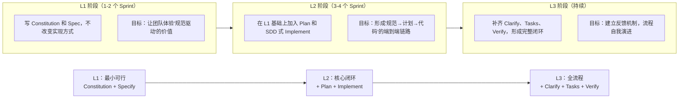
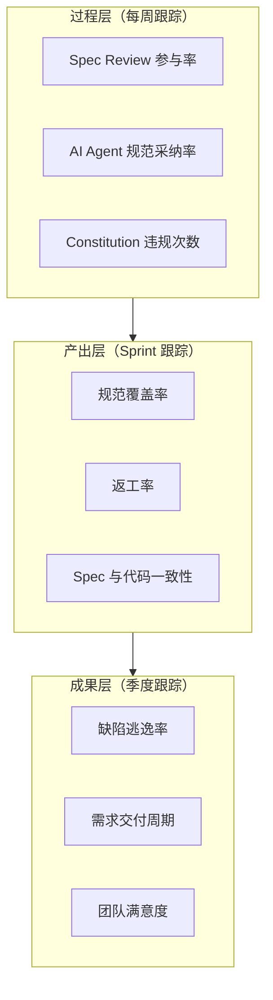
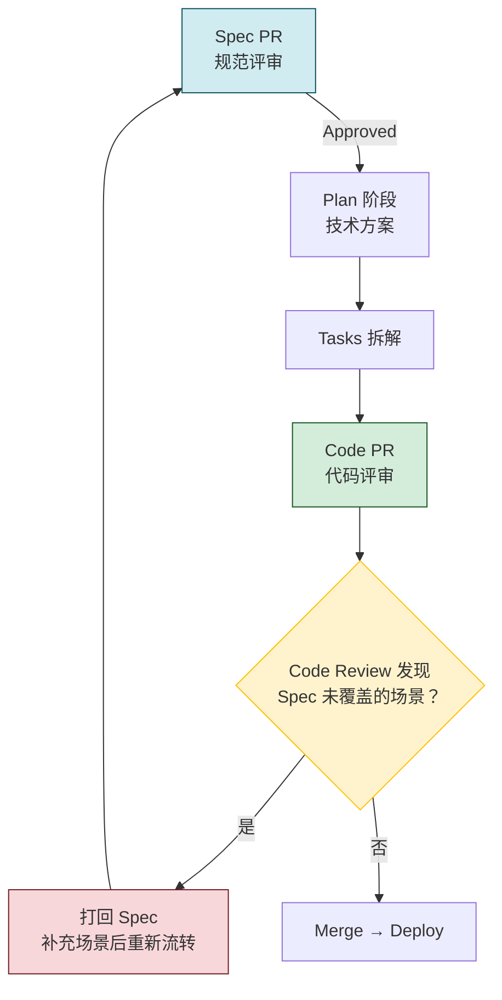

# 团队落地经验与度量

SDD 方法论的价值最终体现在团队落地效果上。本章汇集了多个团队在实际推行 SDD 过程中的经验教训，覆盖从零引入、度量设计、流程融合到阻力应对的全链路实战策略。

---

## 1. 推动团队 SDD 采纳的策略

### 1.1 引入前的准备工作

SDD 的引入本质是一次**工作习惯变革**，而非简单的"加一个工具"。在正式推行前，需要做好以下准备：

```text
准备阶段 Checklist

□ 找到 1 个"痛点场景"作为切入点
  ├── 例：需求反复变更导致返工超过 30%
  ├── 例：新成员 Onboarding 需要 3 周才能独立产出
  └── 例：AI 生成的代码与预期差距大，审查成本高

□ 选 1 个小型试点项目（1-2 周工作量）
  ├── 条件：功能边界清晰、不涉及跨团队协作
  └── 目的：低成本跑通全流程，积累信心和数据

□ 准备"Before/After"对比数据模板
  ├── 返工工时对比
  ├── Bug 发现阶段分布对比
  └── 新人上手时间对比

□ 找到 1-2 位"早期采用者"（Early Adopter）
  └── 关键：他们愿意尝试新方法，并在团队内有影响力
```

### 1.2 渐进式引入策略

不要试图一步到位推行完整的七步流程。采用 **L1 → L2 → L3 渐进式** 推入：



**每个阶段的准入条件**：

| 阶段 | 准入条件 | 退出标准 |
|------|----------|----------|
| L1 | 试点项目选定 + 早期采用者就位 | Constitution 被团队接受 + Spec 覆盖 2+ 个功能 |
| L2 | L1 产出获得团队认可 | Plan 与实际实现偏差率 < 15% |
| L3 | L2 偏差率达标 + 团队无抵触情绪 | 全流程运行 3 个 Sprint + 返工率下降 > 20% |

### 1.3 自底向上 vs 自顶向下

```text
自底向上（推荐大多数团队）
  工程师先在个人项目中尝试 → 在小组内分享成果 → 扩大到团队
  优势：阻力小，数据真实，基于自愿
  劣势：推广周期长（2-3 个月）

自顶向下（适用于有强技术领导力的团队）
  Tech Lead 决策推行 → 设定强制流程 → 纳入绩效考核
  优势：落地快（2-4 周）
  劣势：若没有数据支撑，容易引发抵触
```

> **推荐做法**：自底向上做推广，自顶向下做固化。先用数据和案例说服，再用流程和工具保障执行。

---

## 2. 度量指标体系设计

### 2.1 核心度量金字塔



### 2.2 各指标详解

**规范覆盖率（Spec Coverage Rate）**：

```text
规范覆盖率 = 有正式 Spec 的功能数 / 总功能数 × 100%

目标：
  L1 阶段：> 50%（核心功能必须有 Spec）
  L2 阶段：> 80%（所有新功能必须有 Spec）
  L3 阶段：> 95%（遗留功能逐步补 Spec）
```

**返工率（Rework Rate）**：

```text
返工率 = 因规范不清或偏差导致的返工工时 / 总开发工时 × 100%

对比基线：
  引入 SDD 前：记录 2-3 个 Sprint 的返工率作为基线
  L1 阶段目标：比基线下降 15%
  L2 阶段目标：比基线下降 30%
  L3 阶段目标：< 10%
```

**缺陷逃逸率（Defect Escape Rate）**：

```text
缺陷逃逸率 = 生产环境发现的缺陷数 / (测试环境 + 生产环境) 缺陷总数 × 100%

健康值：< 5%
警戒线：> 10% 触发流程审查

注意：这个指标反映的是"SDD + 测试 + CI"的综合效果，不单独归因于 SDD。
```

### 2.3 数据采集方法

| 指标 | 数据来源 | 采集频率 | 自动化程度 |
|------|----------|----------|-----------|
| 规范覆盖率 | Spec 目录 + 功能清单对照 | 每 Sprint | 半自动（需人工维护功能清单） |
| 返工率 | Jira/Linear Issue 标签 | 每 Sprint | 可自动化（Issue 标签 `cause:spec-gap`） |
| 缺陷逃逸率 | Bug Tracker + 部署记录 | 每月 | 可自动化 |
| Spec Review 参与率 | PR Review 记录 | 每周 | 可自动化（Git 统计） |
| AI 规范采纳率 | AI 工具使用日志 | 每周 | 取决于工具有无日志输出 |

---

## 3. 团队规范评审机制

### 3.1 Spec Review 流程

将 Spec Review 定位为**轻量级的前置评审**，不需要像 Code Review 那样逐行审查：

```text
Spec Review 流程（耗时目标：≤ 30 分钟/次）

Step 1：作者发起 Spec PR（5 分钟准备）
  ├── 提交 spec.md 到 spec/<feature-slug> 分支
  ├── 在 PR 描述中标注：核心场景、边界条件、待确认点
  └── @至少 1 位 Reviewer

Step 2：Reviewer 审查（15 分钟）
  ├── 检查 1：场景完整性 — 正常路径、异常路径、边界条件是否覆盖？
  ├── 检查 2：Constitution 合规 — 是否违反项目宪法？
  ├── 检查 3：可验证性 — 每个场景是否可以写出测试用例？
  └── 评论分类：必须修改（blocking）、建议优化（non-blocking）

Step 3：评审结论（10 分钟）
  ├── Approved：Spec 冻结，进入 Plan 阶段
  ├── Changes Requested：作者修改后重新提交
  └── 记录评审耗时，持续优化流程
```

### 3.2 Spec Review 与 Code Review 的职责边界

| 维度 | Spec Review | Code Review |
|------|-------------|-------------|
| 时机 | Plan 之前 | Implement 之后 |
| 审查对象 | 规范文档（做什么 + 为什么） | 代码实现（怎么做） |
| 关注点 | 场景完整性、边界条件、术语一致性 | 代码质量、性能、安全性、可维护性 |
| 修改成本 | 低（改 Markdown） | 中高（改代码 + 测试） |
| 评审人 | 产品/架构 + 开发者 | 开发者 + 架构 |
| 阻断条件 | 场景遗漏、宪法违规、不可验证 | 逻辑错误、安全漏洞、性能问题 |

**融合原则**：Code Review 时如果发现"这个场景 Spec 里没定义"的问题，应该**直接打回 Spec Review**而不是在代码层面猜测修改——这本身就是反馈闭环的触发点。

---

## 4. SDD 与 Code Review 流程融合

### 4.1 融合后的 PR 生命周期



### 4.2 Code Review Checklist（SDD 增强版）

在传统 Code Review Checklist 基础上增加 SDD 专项检查项：

```markdown
## Code Review Checklist

### 传统检查项
- [ ] 代码逻辑正确，无明显 Bug
- [ ] 变量命名清晰，遵循团队规范
- [ ] 异常处理完整，无静默吞异常
- [ ] 有对应的单元测试/集成测试
- [ ] 无安全隐患（SQL 注入、XSS 等）
- [ ] 性能无明显退化

### SDD 专项检查项
- [ ] 实现与 Spec 一致，无遗漏场景
- [ ] 未超出 Spec 范围（无 Gold Plating）
- [ ] 遵守 Constitution 相关约束
- [ ] 若 Spec 有歧义，已在 Clarify 阶段记录
- [ ] API 签名与 Plan 阶段设计一致
- [ ] 如有 Spec 变更，已同步更新 Spec 文档
```

---

## 5. 常见阻力与应对

### 5.1 阻力全景

| 阻力类型 | 典型言论 | 深层原因 | 应对策略 |
|----------|----------|----------|----------|
| **"浪费时间"** | "写 Spec 的时间够我把代码写完了" | 只看短期成本，未体验长期收益 | 用返工率数据对比，展示"省下来的时间" |
| **"Spec 会过时"** | "需求一直在变，Spec 写完就过时了" | 担心维护成本 | 展示 Spec Review 的轻量性（< 30 分钟），以及过时 Spec 比无 Spec 强 |
| **"限制创造力"** | "都写死了，还有什么发挥空间" | 误解 Spec 为"详细设计文档" | 澄清 Spec 定义 What 而非 How，实现细节留给开发者 |
| **"不适合我们"** | "我们项目太特殊了，SDD 用不上" | 对改变的天然抵触 | 在试点项目上用数据说话，不做理论辩论 |
| **"工具太复杂"** | "学这个工具比我写代码还累" | 工具学习曲线 > 感知价值 | 从 L1 起步，只用手动 Markdown，工具在 L2 后再引入 |

### 5.2 应对策略工具箱

**策略 1：数据说服**

```text
不要讲道理，展示数据：
"上个月我们有 4 个需求因为理解不一致返工，共耗费 12 人天。
如果每个 Spec 花 2 小时写清楚，只需 2×4=8 小时 = 1 人天。"

这个对比大多数工程师能接受。
```

**策略 2：降低门槛**

```text
不做"全套 SDD"，只做"用 Markdown 把需求写清楚再写代码"。

具体做法：
1. 不引入任何新工具——就用现有的 Markdown 编辑器
2. 不要求完整模板——只需覆盖：做什么、正常流程、异常情况
3. 不做强制评审——写完 Spec 贴在群里，有人看就行
4. 不设 KPI——纯自愿，先让愿意试的人试
```

**策略 3：内部布道**

```text
布道优先级：
1. 先让 Tech Lead/架构师深度使用 1 个月
2. 在技术分享会上做 Demo（15 分钟，不要讲理论）
3. 选最配合的 1 个人做 1v1 结对
4. 等有 2-3 个成功案例后，再开全员推广
```

**策略 4：管理上级预期**

```text
对管理层的话术模板：

"我们在推一套规范驱动的开发方法。
目标不是增加流程，而是减少返工。
前 1-2 个 Sprint 会因为学习成本有一点效率下降（约 10-15%），
之后预期返工率下降 30%+，新人上手时间缩短 40%+。
我们会用数据跟踪效果，如果 3 个 Sprint 后没有改善，就回退。"
```

---

## 6. 落地节奏参考

以一个 8 人团队为例，完整的 SDD 落地时间线：

```text
第 1-2 周：准备期
  ├── Tech Lead 深度试用 SDD 工具和方法论
  ├── 选定试点项目（小型、低风险）
  └── 准备数据采集模板（返工率、Bug 分布）

第 3-6 周：L1 试点
  ├── 1-2 位早期采用者在试点项目上走 L1 流程
  ├── 每周同步体验和问题
  └── 收集 Before/After 数据

第 7-8 周：内部分享 + 扩大
  ├── 技术分享会：Demo 试点成果和数据对比
  ├── 招募第 2 批试用者（2-3 人）
  └── 升级到 L2 流程

第 9-14 周：L2 推广
  ├── 试点人数扩大到 5-6 人
  ├── 引入 SDD 工具（Spec Kit 或 sdd-flow）
  ├── 建立 Spec Review 机制
  └── 开始在更多项目上应用

第 15 周+：L3 固化
  ├── 全团队推行
  ├── 补齐 Verify 和反馈闭环
  ├── 将 SDD 纳入新人 Onboarding 流程
  └── 每季度做流程回顾和优化
```

---

## 总结

团队落地 SDD 的关键不在方法论本身，而在于**变革管理**：

1. **数据驱动说服**：用返工率、Bug 逃逸率等硬数据说话，而非理念推销
2. **渐进式推进**：L1 → L2 → L3，每一步都有准入和退出标准
3. **降低门槛优先**：宁可先用简陋的方式跑通，也不要因为工具复杂度吓退团队
4. **Spec Review 轻量化**：目标 30 分钟内完成一次审查，不让规范成为瓶颈
5. **正视阻力**：每种抵触背后都有合理关切，用数据和体验回应，而非行政命令压制

> SDD 从来不是"要不要做"的问题，而是"什么时候开始做"和"从哪开始做"的问题。最好的开始时间是一个月前，其次是现在。
