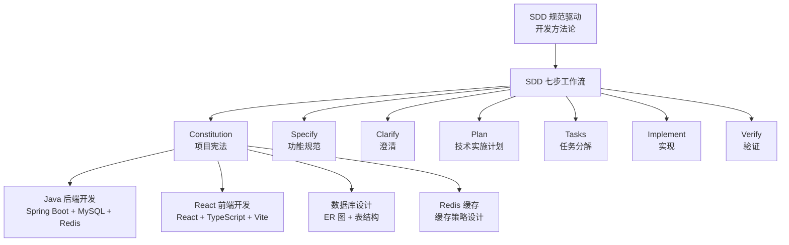

# 项目背景与技术选型

---

## 1. 项目背景

### 1.1 为什么选择 CRM 场景

企业 CRM（客户关系管理）系统是展示前后端分离架构、多模块业务逻辑、复杂数据库设计的最佳场景。选择 CRM 的原因包括多表关联、复杂业务逻辑、前后端分离、缓存需求、权限管理、真实业务价值。

### 1.2 核心功能清单

本案例包含以下 15 个核心功能模块：

#### 客户管理模块（6 个功能）
1. 客户列表查询（分页、搜索、筛选）
2. 客户详情查看
3. 客户添加
4. 客户编辑
5. 客户删除（逻辑删除）
6. 客户导入/导出

#### 商机管理模块（5 个功能）
7. 商机列表查询（按阶段筛选、分页）
8. 商机详情查看
9. 商机创建
10. 商机编辑
11. 商机统计

#### 销售机会模块（3 个功能）
12. 机会列表查询
13. 机会详情查看
14. 机会关闭

#### 跟进记录模块（2 个功能）
15. 跟进记录管理

### 1.3 技术栈详解

**后端技术栈**：
- Spring Boot 3.2.0 + MySQL 8.0 + Redis 7.0 + MyBatis-Plus 3.5.5
- Spring Security 6.2.0 + Swagger 3.0 + Lombok 1.18.30

**前端技术栈**：
- React 18.2.0 + TypeScript 5.0+ + Vite 5.0+
- React Router 6.20.0 + React Query 5.0+ + Zustand 4.5.0
- Tailwind CSS 3.4.0 + Axios 1.6.0

---

## 2. 开发环境搭建

### 2.1 后端环境搭建

**JDK 17 安装**：
- Windows: `winget install Oracle.JDK.17`
- macOS: `brew install openjdk@17`
- Linux: `sudo apt install openjdk-17-jdk`

**MySQL 8.0 安装**：
```sql
CREATE DATABASE crm_db CHARACTER SET utf8mb4 COLLATE utf8mb4_unicode_ci;
CREATE USER 'crm_user'@'localhost' IDENTIFIED BY 'crm123456';
GRANT ALL PRIVILEGES ON crm_db.* TO 'crm_user'@'localhost';
```

**Redis 7.0 安装**：
```bash
redis-server
```

**Spring Boot 项目创建**：
访问 https://start.spring.io/，选择：
- Spring Boot: 3.2.0
- Java: 17
- Dependencies: Web, MyBatis Framework, MySQL Driver, Redis, Validation, Lombok, Swagger

### 2.2 前端环境搭建

**Node.js 18+ 安装**：
```bash
npm create vite@latest frontend -- --template react-ts
cd frontend
npm install
```

**安装前端依赖**：
```bash
npm install react-router-dom @tanstack/react-query zustand axios tailwindcss postcss autoprefixer
npm install -D @playwright/test
```

**初始化 Tailwind CSS**：
```bash
npx tailwindcss init -p
```

---

## 3. 项目目录结构

### 3.1 后端目录结构

```
crm-system/backend/
├── pom.xml
├── application.yml
├── src/main/java/com/crm/
│   ├── CrmApplication.java
│   ├── config/
│   ├── controller/
│   ├── service/
│   ├── repository/
│   ├── entity/
│   ├── dto/
│   ├── exception/
│   └── common/
```

### 3.2 前端目录结构

```
crm-system/frontend/
├── package.json
├── vite.config.ts
├── src/
│   ├── main.tsx
│   ├── App.tsx
│   ├── pages/
│   ├── components/
│   ├── services/
│   ├── types/
│   ├── store/
│   └── hooks/
```

---

## 4. 快速开始

### 4.1 启动后端

```bash
cd backend
mvn spring-boot:run
```

访问 Swagger 文档：http://localhost:8080/swagger-ui/index.html

### 4.2 启动前端

```bash
cd frontend
npm run dev
```

访问应用：http://localhost:5173

### 4.3 首次登录

默认账号：
- 用户名：admin
- 密码：admin123

---

## 5. 与其他路径的关系



---

## 6. 下一步

阅读 [02-Constitution项目宪法](02-Constitution项目宪法.md)。
