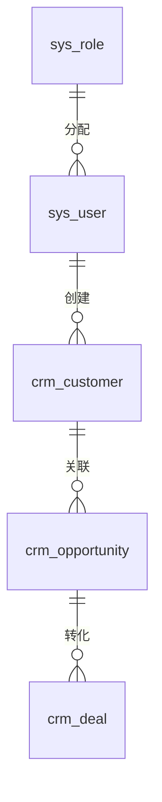

# Plan 技术实施计划

---

## 1. 架构设计

### 分层架构

```
前端层 → API 网关层 → Controller 层 → Service 层 → Repository 层 → Entity 层 → 数据层
```

### 职责划分

- **Controller**：接收请求、参数校验、统一响应
- **Service**：业务逻辑、事务管理、缓存管理
- **Repository**：数据访问、SQL 查询
- **Entity**：数据库表映射

---

## 2. 数据库设计

### ER 图



### 核心表结构

1. **sys_user**（用户表）
2. **sys_role**（角色表）
3. **crm_customer**（客户表）
4. **crm_opportunity**（商机表）
5. **crm_deal**（销售机会表）
6. **crm_activity**（跟进记录表）
7. **crm_report**（报表统计表）
8. **crm_config**（系统配置表）

---

## 3. API 设计

### 统一响应格式

```java
public class Result<T> {
    private Integer code;
    private String message;
    private T data;
    private Long timestamp;
}
```

### 核心 API 端点

| 方法 | 路径 | 说明 |
|------|------|------|
| GET | /api/v1/customers | 客户列表 |
| POST | /api/v1/customers | 创建客户 |
| GET | /api/v1/opportunities | 商机列表 |
| GET | /api/v1/opportunities/stats | 商机统计 |

---

## 4. Redis 缓存策略

### 缓存 Key 设计

- 用户信息：`crm:user:{userId}`（TTL: 2小时）
- 客户列表：`crm:customer:list:{page}:{size}`（TTL: 30分钟）
- 报表数据：`crm:report:{type}:{date}`（TTL: 1小时）

### 缓存更新策略

先更新数据库，再删除缓存。

---

## 5. 项目依赖

### 后端（pom.xml）

- Spring Boot 3.2.0
- MyBatis-Plus 3.5.5
- MySQL 8.0
- Redis 7.0

### 前端（package.json）

- React 18.2.0
- TypeScript 5.0+
- Vite 5.0+
- Tailwind CSS 3.4.0

---

## 6. 下一步

阅读 [06-Tasks任务分解](06-Tasks任务分解.md)。
