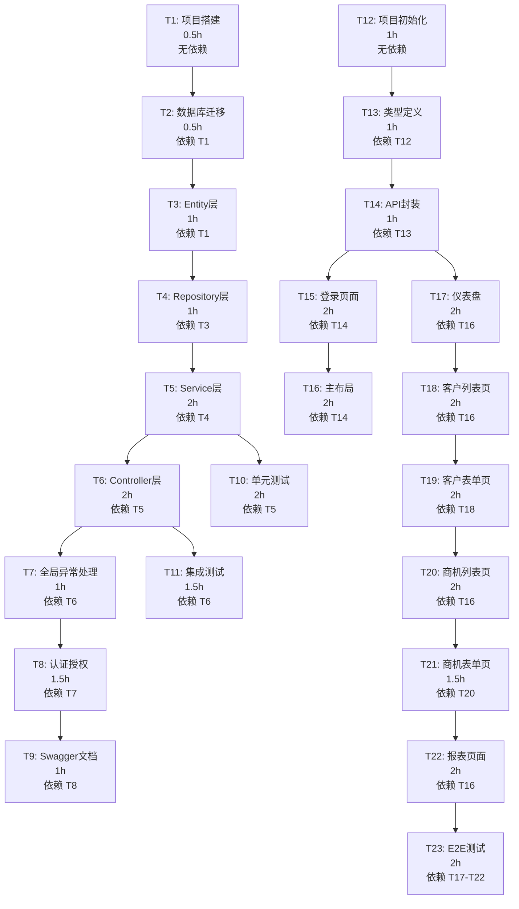

# Tasks 任务分解

---

## 1. 任务依赖关系图



---

## 2. 任务清单

### 后端任务（3-4天，11个任务）

#### T1: 项目搭建
- **预估时间**：0.5h
- **依赖**：无
- **验收条件**：
  - [ ] Spring Boot 项目创建成功
  - [ ] pom.xml 包含所有依赖
  - [ ] application.yml 配置完成
  - [ ] 项目可启动

#### T2: 数据库迁移
- **预估时间**：0.5h
- **依赖**：T1

---

### 前端任务（3-4天，12个任务）

#### T12: 项目初始化
- **预估时间**：1h
- **依赖**：无

---

## 3. 总体进度

```
后端: 0/11 (0%)
前端: 0/12 (0%)
总计: 0/23 (0%)
```

---

## 4. 下一步

阅读 [07-Implement实现](07-Implement实现.md)。
