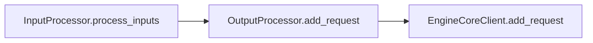
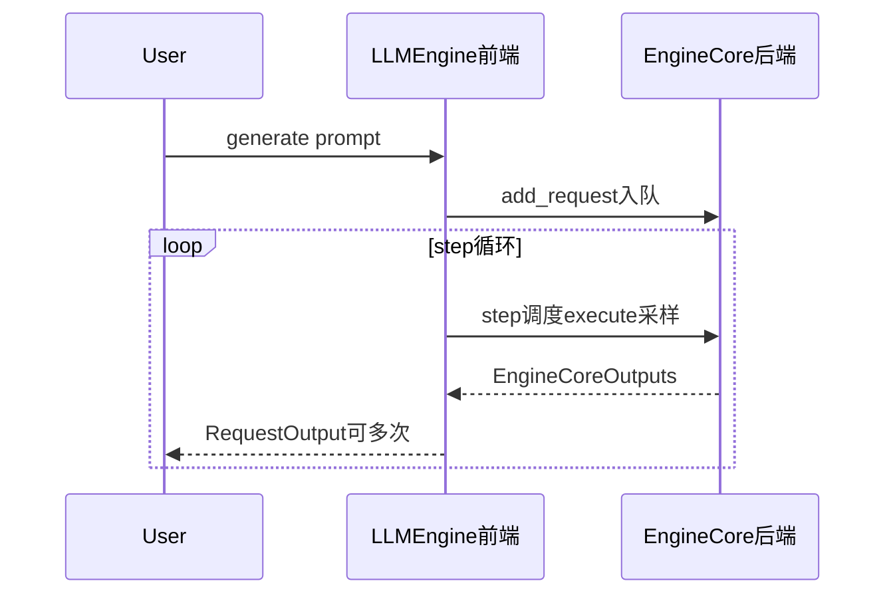

# 03 · 前端引擎：`LLMEngine`

**源码**：[`code/vllm/vllm/v1/engine/llm_engine.py`](../../code/vllm/vllm/v1/engine/llm_engine.py)

## 职责

`LLMEngine` 是引擎的**前端**。它不管调度，不管 GPU 计算。它只做三件事：
1. 把用户输入转成内部格式（通过 `InputProcessor`）
2. 把内部输出转回用户可读的格式（通过 `OutputProcessor`）
3. 驱动前后端之间的数据流通

## 三个核心成员

| 成员 | 类型 | 职责 |
|------|------|------|
| `self.input_processor` | `InputProcessor` | tokenize / 规范化 / 多模态特征提取 / 输入验证 |
| `self.output_processor` | `OutputProcessor` | detokenize / logprobs 处理 / stop string 检查 / 输出状态维护 |
| `self.engine_core` | `EngineCoreClient` | 与后端通信的 IPC 句柄 |

## 核心方法

### `add_request(request_id, prompt, sampling_params)`



产出 **`EngineCoreRequest`**（含 `prompt_token_ids`）；**仅入队**，真正计算发生在后续 **`step()`**。

### `step()` — 主循环方法

```python
def step(self) -> list[RequestOutput]:
    # 1. 从后端拿本步产出
    outputs: EngineCoreOutputs = self.engine_core.get_output()

    # 2. 转换成用户可读的 RequestOutput
    #    （OutputProcessor 做 detokenize、logprobs 处理、stop 检查）
    for req_id, engine_output in outputs.outputs.items():
        processed = self.output_processor.process_outputs(
            req_id, engine_output.new_token_ids, engine_output
        )

    # 3. Abort 已完成的请求（释放后端资源）
    for req_id in finished_requests:
        self.engine_core.abort_requests([req_id])

    # 4. 返回所有已完成或正进行的请求
    return list(processed.values())
```

`step()` 不是引擎的紧循环——它只是从前端视角的一次推进。真正的紧循环在 `EngineCore.step()`。

### `start_profile()` / `stop_profile()` — 性能分析

调用后端 `EngineCore.profile(start/stop)` 来收集 profiling 数据。用于 torch.profiler / PyTorch Profiler 集成。

## 完整交互序列



## `from_engine_args()` 工厂方法

```python
@classmethod
def from_engine_args(cls, engine_args: EngineArgs, ...):
    vllm_config = engine_args.create_engine_config()
    return cls(vllm_config, ...)
```

## 阅读重点

- 理解 `LLMEngine` 是「前端」，不包含调度逻辑——它只是数据格式转换 + IPC 驱动
- `add_request()` 的输入处理链：prompt → InputProcessor → EngineCoreRequest → EngineCoreClient
- `step()` 只是一个「拿结果」的动作，不是计算循环
- 前端和后端完全解耦：换一个 IPC 方式不影响前端代码
