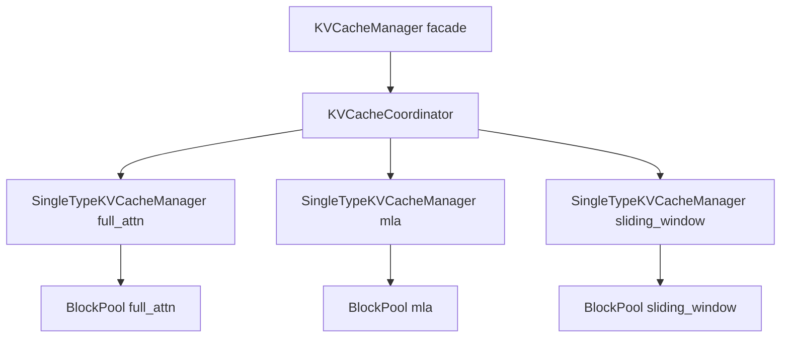
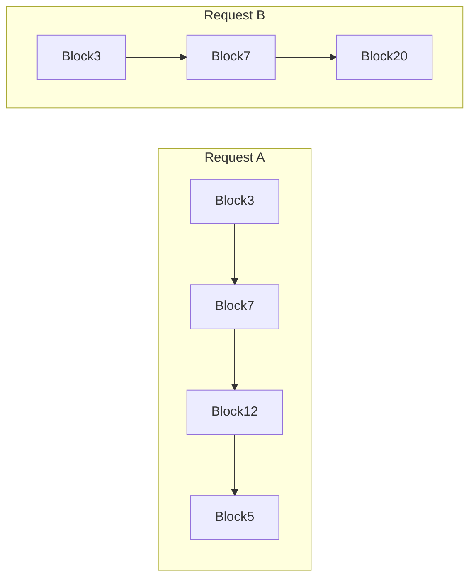

# 04 · KV 缓存协调器与块池

**源码**：[`code/vllm/vllm/v1/core/kv_cache_coordinator.py`](../../code/vllm/vllm/v1/core/kv_cache_coordinator.py)

## 整体架构



## 三种 KVCacheCoordinator 实现

KVCacheCoordinator 是一个 ABC，有三个具体实现：

| 实现 | 文件 | 说明 |
|------|------|------|
| `KVCacheCoordinatorNoPrefixCache` | `kv_cache_coordinator.py` | 无 prefix cache，简单 FIFO |
| `UnitaryKVCacheCoordinator` | `kv_cache_coordinator.py` | 统一块池，支持 prefix cache，适合单一 attention 类型的模型 |
| `HybridKVCacheCoordinator` | `kv_cache_coordinator.py` | 混合 coordinator，支持多种 attention 类型 + prefix cache |

## BlockPool — 所有 KV 块的大池子

```python
class BlockPool:
    blocks: list[KVCacheBlock]       # 所有块（固定大小数组）
    free_blocks: FreeKVCacheBlockQueue  # 空闲块队列（O(1) 分配/释放）
    prefix_cache: BlockHashToBlockMap    # prefix cache 的哈希→块映射
```

## KVCacheBlock — 单个 KV 块

```python
class KVCacheBlock:
    block_id: int
    ref_count: int           # 被几个请求引用（prefix cache 共享时 > 1）
    block_hash: BlockHash    # 块内容的哈希（prefix cache key）
    prev_block: KVCacheBlock | None  # 链表指针（请求的 KV 缓存是单向链表）
```

KV 块组织成**单向链表**。下图示意 **Request A / B** 在 prefix 上共享前置块（`ref_count` 可大于 1）：



**Block7** 与 **Block3** 可被两请求共享（图中同名表示同一物理块）。

## SingleTypeKVCacheManager

每种注意力类型有自己独立的 `SingleTypeKVCacheManager`：

```python
class SingleTypeKVCacheManager:
    block_pool: BlockPool
    kv_cache_spec: KVCacheSpec   # 该类型的规格（page_size_bytes 等）
    
    def allocate_slots(request, num_new_tokens) -> KVCacheBlocks | None:
        # 1. 计算需要几个新块
        # 2. 从 free_blocks 取出块
        # 3. 追加到请求的块链表
        # 4. 如果不够，return None → 触发上层抢占
    
    def get_computed_blocks(request) -> KVCacheBlocks | None:
        # 遍历 request.block_hashes
        # 在 prefix_cache 中查找匹配
        # 命中则返回已存在的块列表
```

## 为什么需要多种 KV 缓存类型

以 DeepSeek V3 为例：
- **部分层用 FullAttention**：KV 缓存是标准的 `[num_layers, 2, num_blocks, block_size, num_kv_heads, head_size]` 张量对（K 和 V）
- **部分层用 MLA（Multi-head Latent Attention）**：KV 缓存是被压缩过的 latent 表示，结构完全不同——只有 `[num_layers, num_blocks, block_size, kv_lora_rank + qk_rope_dim]`

两种结构的 `page_size_bytes` 相差很大，必须分开管理。`HybridKVCacheCoordinator` 为每种类型维护独立的块池和 coordinator。

## FreeKVCacheBlockQueue

单链表实现的空闲块队列。当所有块都被使用时，队列为空 → `allocate_slots()` 返回 None → 触发抢占。

## 阅读重点

- 理解 KV 块是链表结构（不是数组），每个请求持有块链表的 head
- 理解 `ref_count` 用于 prefix cache 的引用计数——`ref_count > 1` 表示块被多个请求共享
- 知道三种 coordinator 实现的差异：`HybridKVCacheCoordinator` 最复杂也最通用
- 知道「多种 KV 缓存类型」的动机（同一模型不同层可能用不同 attention 结构）
