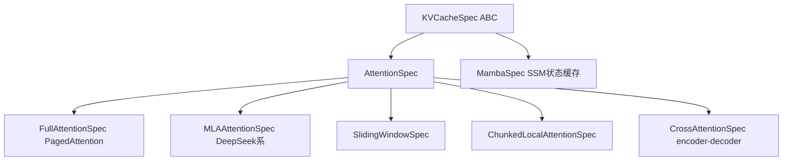

# 05 · KV 缓存规格定义

**源码**：[`code/vllm/vllm/v1/kv_cache_interface.py`](../../code/vllm/vllm/v1/kv_cache_interface.py)

## 为什么需要规格定义

调度器和 Worker 需要就「KV 缓存长什么样」达成一致。调度器用它算能分几块，Worker 用它分配物理张量。这些规格定义就是两者之间的契约。

## 规格类型层级



各子类字段（如 `num_kv_heads`、`kv_lora_rank`、`encoder_seq_len`、`d_state` 等）仍以源码 [`kv_cache_interface.py`](../../code/vllm/vllm/v1/kv_cache_interface.py) 为准。

## 关键方法

### `page_size_bytes()` — 核心公式

```python
# FullAttentionSpec 的 page_size_bytes
def page_size_bytes(self) -> int:
    kv_size_per_token = (
        self.num_kv_heads * self.head_size * self.dtype_size  # K 的大小
        + self.num_kv_heads * self.head_size * self.dtype_size  # V 的大小
    )
    return kv_size_per_token * self.block_size * 2  # *2 = K + V
```

```
单块字节数 = page_size_bytes(spec)
总块数 = 可用 GPU 内存 × gpu_memory_utilization / 单块字节数
```

不同 attention 类型算出来的 `page_size_bytes()` 值不同，所以不同 group 能分配的块数也各自不同。

### `get_kv_cache_shape()` — 物理张量形状

Worker 调用这个方法来分配物理 KV 缓存张量。例如 FullAttention 返回：
```
[num_blocks, 2, block_size, num_kv_heads, head_size]
```
MLA 返回：
```
[num_blocks, block_size, kv_lora_rank + qk_rope_dim]  # 压缩的 latent 表示
```

## KVCacheConfig — 最终配置

```python
class KVCacheConfig:
    num_blocks: int                     # 总共多少块
    kv_cache_tensors: list[torch.Tensor]  # 物理张量（已分配到 GPU）
    kv_cache_groups: list[KVCacheGroup]   # 各组规格
    block_size: int                     # 每块存几个 token 的 KV
```

## 阅读重点

- 理解 `FullAttentionSpec` 和 `MLAAttentionSpec` 的区别（MLA 存储压缩 latent，页大小完全不同）
- Scheduler 用 `page_size_bytes()` 算块数，Worker 用 `get_kv_cache_shape()` 分配张量
- 同一个模型可能产生多个 KVCacheGroup（不同层不同 attention 类型）
- 其他子类（SlidingWindow、CrossAttention、Mamba）按需了解
