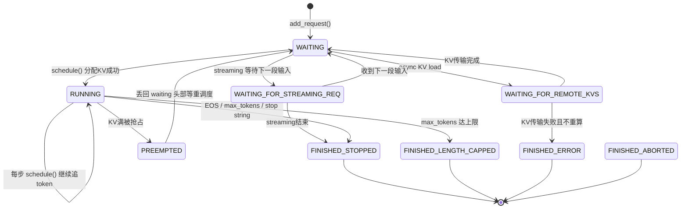
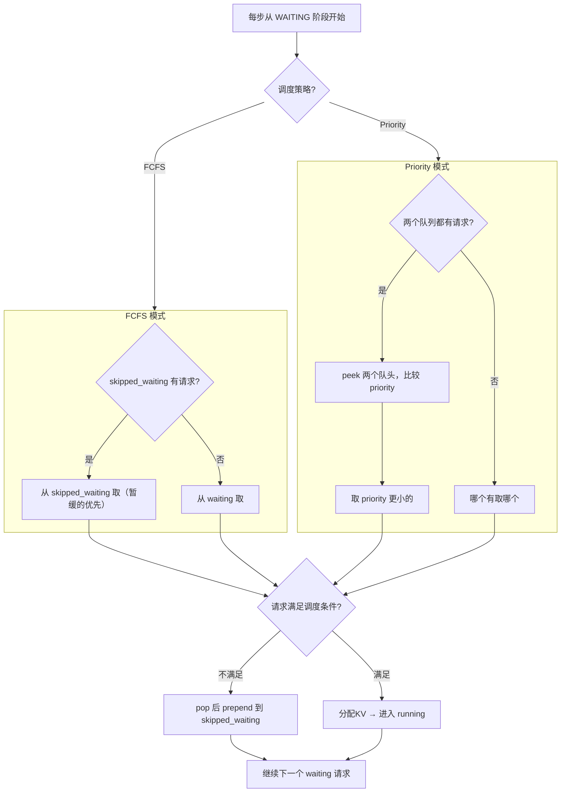
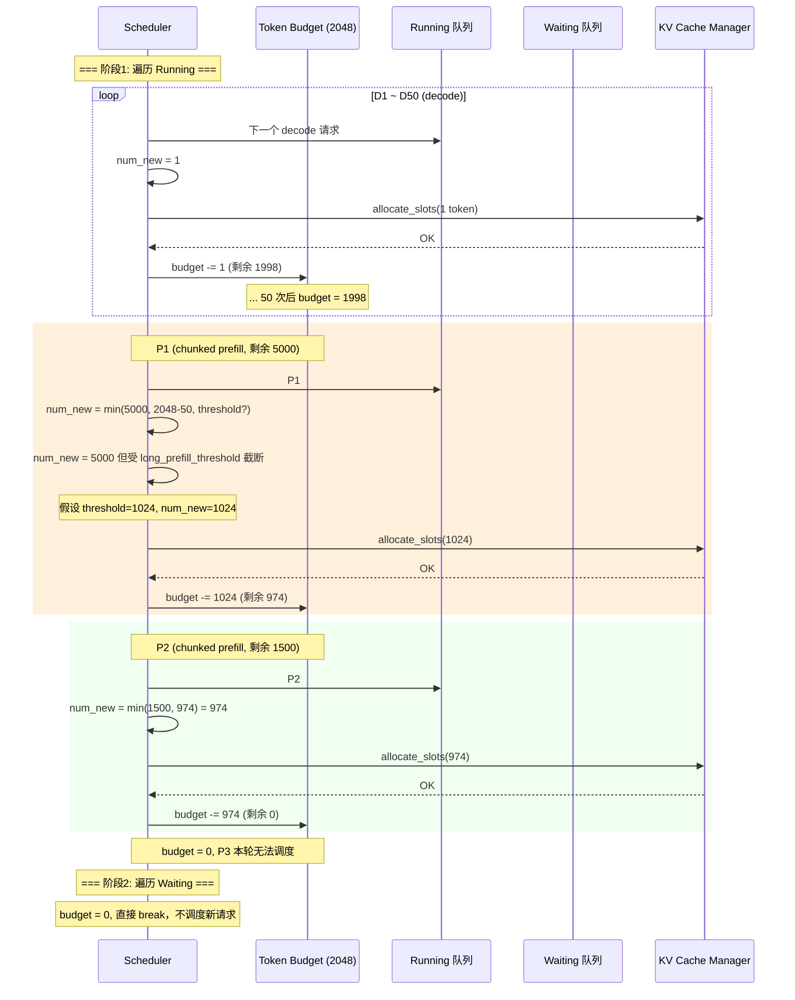
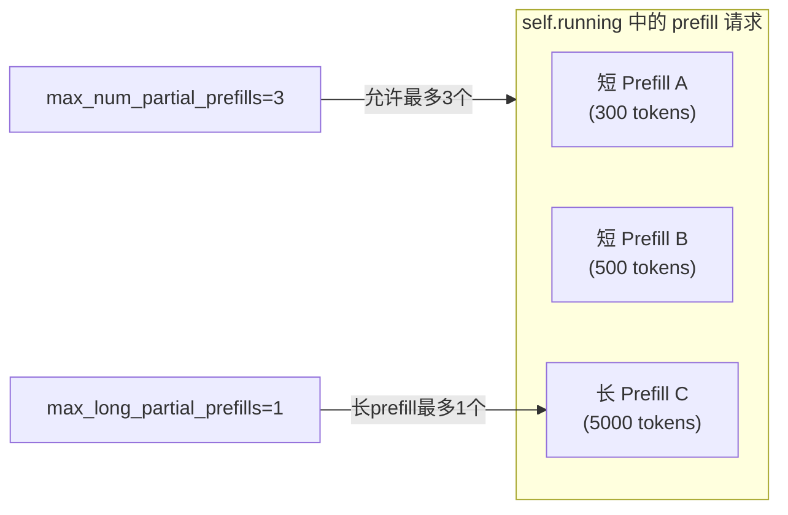
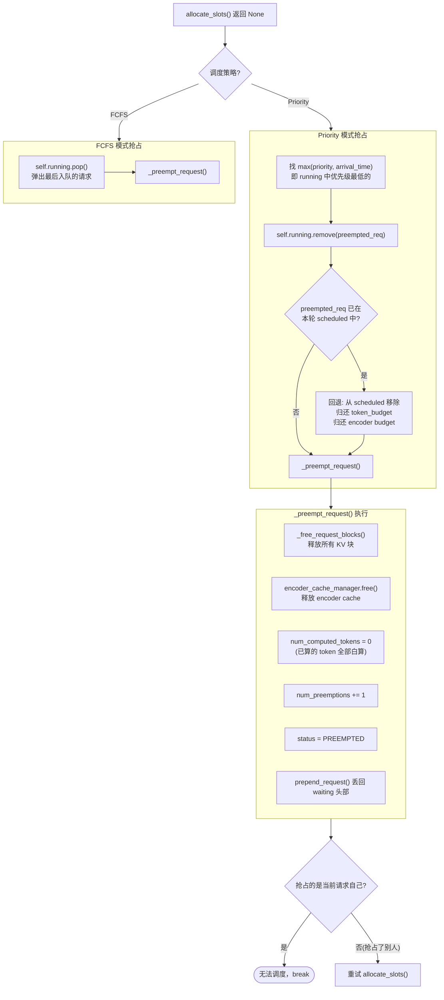
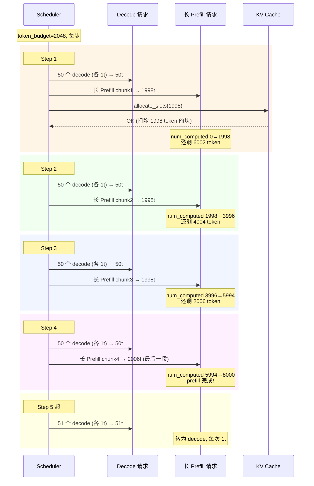

# 06 · 高并发多 Prefill 多 Decode 调度详解

**源码**：
- [`code/vllm/vllm/v1/core/sched/scheduler.py`](../../code/vllm/vllm/v1/core/sched/scheduler.py) — 调度器主逻辑
- [`code/vllm/vllm/v1/core/sched/request_queue.py`](../../code/vllm/vllm/v1/core/sched/request_queue.py) — 排队系统
- [`code/vllm/vllm/v1/core/kv_cache_manager.py`](../../code/vllm/vllm/v1/core/kv_cache_manager.py) — KV 缓存管理

前置阅读：[01-调度器.md](01-调度器.md)（V1 统一调度思想、三阶段算法概览）。

本文聚焦**高并发场景**：当同时有几十个请求在 running、几百个请求在 waiting 时，调度器如何在有限的 `token_budget` 和 KV Cache 下编排多个 Prefill 和 Decode。

---

## 1. 核心概念速览

V1 调度器的核心抽象：**让 `num_computed_tokens` 追上 `num_tokens_with_spec`**。

| 场景 | 差值 | 本步调度含义 |
|------|------|------------|
| 纯 Prefill（prompt 1000 tokens） | 1000 | 一次算 1000 个（或分 chunk） |
| Chunked Prefill（prompt 还剩 800） | 800 | 本步追一部分，下步继续追 |
| Decode | 1 | 每次生成 1 个新 token |
| Speculative Decode | 5 | 一次验证 5 个 draft token |
| Prefix Cache 命中 300 | 700 | 跳过已缓存的 300，只算 700 |

**三个硬约束决定每步能调度多少请求**：

| 约束 | 配置项 | 含义 |
|------|--------|------|
| Token Budget | `max_num_batched_tokens`（默认 2048） | 每步最多计算几个 token |
| 请求数上限 | `max_num_seqs`（默认 128） | 同时 running 的请求数上限 |
| KV Cache 容量 | GPU 显存决定 `num_gpu_blocks` | 物理 KV 块数量 |

高并发调度的本质是：**在这三个约束下，每步合理分配 token 额度给 Decode（每人 1 token）、Chunked Prefill（每人若干 chunk）、以及新入队的请求**。

---

## 2. 请求全生命周期状态机



**关键点**：
- `PREEMPTED` 是唯一「倒退」的状态：已计算的 token 全部白算，`num_computed_tokens = 0`
- `WAITING_FOR_REMOTE_KVS` 用于 P/D 分离或 KV 卸载场景，请求在 waiting 和 skipped 间流转
- `WAITING_FOR_STREAMING_REQ` 用于 streaming 输入，请求不占 running 位但计入请求数上限

---

## 3. 排队系统：双队列协作

调度器维护**两个队列**，而非一个：

| 队列 | 类型 | 含义 |
|------|------|------|
| `self.waiting` | `RequestQueue` | 可以立即尝试调度的请求 |
| `self.skipped_waiting` | `RequestQueue` | 上一步被跳过、暂不满足条件的请求 |

### 3.1 两种排队策略

**FCFS（默认）**：底层是 `collections.deque`，严格先进先出。

```python
# FCFSRequestQueue — deque 封装
def add_request(self, request): self.append(request)
def pop_request(self):          return self.popleft()
def prepend_request(self, req): self.appendleft(req)  # 抢占恢复用
```

**Priority**：底层是 `heapq`，按 `(priority, arrival_time)` 排序：

```python
# PriorityRequestQueue — heap 封装
def add_request(self, request): heapq.heappush(self._heap, request)
def pop_request(self):          return heapq.heappop(self._heap)
# Request.__lt__ 定义: (self.priority, self.arrival_time) < (other.priority, other.arrival_time)
```

### 3.2 双队列出队决策



### 3.3 请求被 Skip 的情况

以下情况请求会被 pop 并移入 `skipped_waiting`（暂不满足条件，不阻塞后面的请求）：

| Skip 原因 | 对应检查 |
|-----------|---------|
| LoRA 数量超限 | `len(scheduled_loras) == max_loras` 且该请求的 LoRA 不在已调度集合 |
| 等待远程 KV | `request.status == WAITING_FOR_REMOTE_KVS` 且未传输完成 |
| 等待 Grammar | `request.status == WAITING_FOR_STRUCTURED_OUTPUT_GRAMMAR` |
| 等待 Streaming 输入 | `request.status == WAITING_FOR_STREAMING_REQ` |
| KV Connector 无法确定匹配 | `ext_tokens is None` |
| EC Connector 缓存不可用 | `ec_connector.ensure_cache_available()` 返回 False |

---

## 4. 单步调度全景图

```mermaid
flowchart TD
    Start(["schedule() 开始<br>token_budget = max_num_scheduled_tokens"]) --> Phase1

    subgraph Phase1["阶段1: 遍历 self.running（已运行的请求优先）"]
        direction TB
        R1["for each request in self.running"]
        R1 --> RSkip{"跳过检查"}
        RSkip -->|"已完成 max_tokens"| RNext["req_index++"]
        RSkip -->|"decode节流<br>current_step < next_decode_eligible_step"| RNext
        RSkip -->|"DP prefill延迟<br>defer_prefills && is_prefill_chunk"| RNext

        RSkip -->|"通过"| RCalc["num_new_tokens =<br>num_tokens_with_spec + output_placeholders<br>- num_computed_tokens"]
        RCalc --> RThresh{"long_prefill_threshold?"}
        RThresh -->|"超过阈值"| RCap["截断到 long_prefill_token_threshold"]
        RThresh -->|"否"| RBudget["min(num_new_tokens, token_budget,<br>max_model_len - num_computed)"]

        RBudget --> RZero{"> 0?"}
        RZero -->|"=0"| RNext
        RZero -->|">0"| RAlloc["allocate_slots(request, num_new_tokens)"]

        RAlloc -->|分配成功| RSched["加入 scheduled_running_reqs<br>token_budget -= num_new_tokens"]
        RAlloc -->|分配失败| RPreempt["抢占最低优先级请求<br>释放其KV → 丢回waiting"]
        RPreempt -->|"抢占了别人"| RAlloc
        RPreempt -->|"自己被抢占"| RBreak1(["break 阶段1"])

        RSched --> RNext
        RNext --> R1
    end

    Phase1 --> Phase2

    subgraph Phase2["阶段2: 遍历 waiting + skipped_waiting"]
        direction TB
        WCheck{"len(running) >= max_num_seqs<br>或 token_budget == 0<br>或 preempted_reqs 非空?"}
        WCheck -->|是| WBreak(["break 阶段2"])
        WCheck -->|否| WSelect["_select_waiting_queue()<br>双队列选一"]
        WSelect --> WPeek["peek_request()"]

        WPeek --> WBlock{"被 blocked?"}
        WBlock -->|是,无法promote| WSkip["pop → skipped_waiting<br>continue"]
        WBlock -->|"否/已promote"| WLoRA{"LoRA 超限?"}
        WLoRA -->|是| WSkip

        WLoRA -->|否| WPrefix["Prefix Cache 查询<br>get_computed_blocks()"]
        WPrefix --> WExt{"有 KV Connector?"}
        WExt -->|是| WExtCalc["查询远程匹配 token 数<br>可能触发 async KV load"]
        WExt -->|否| WNewTokens

        WExtCalc --> WAsync{"需要 async load?"}
        WAsync -->|是| WAsyncLoad["num_new_tokens=0<br>→ WAITING_FOR_REMOTE_KVS<br>→ skipped_waiting"]
        WAsync -->|否| WNewTokens

        WNewTokens["num_new_tokens =<br>num_tokens - num_computed_tokens"]
        WNewTokens --> WChunk{"enable_chunked_prefill<br>且 num_new > token_budget?"}
        WChunk -->|"是(chunk)"| WChunkCap["截断到 token_budget<br>受 long_prefill_threshold 约束"]
        WChunk -->|"否(不需chunk<br>或chunked被禁用)"| WChunkBreak
        WChunkCap --> WChunkBreak{"num_new > token_budget<br>且 chunked 禁用?"}
        WChunkBreak -->|是| WBreak
        WChunkBreak -->|否| WAlloc["allocate_slots()<br>含 watermark 预留检查"]

        WAlloc -->|成功| WRunning["running.append(request)<br>token_budget -= num_new_tokens<br>request.status = RUNNING"]
        WAlloc -->|失败| WBreak

        WRunning --> WCheck
        WSkip --> WCheck
    end

    Phase2 --> Assemble

    subgraph Assemble["组装输出"]
        A1["构造 NewRequestData (新请求全量)"]
        A2["构造 CachedRequestData (旧请求增量)"]
        A3["收集 finished_req_ids / preempted_req_ids"]
        A4["_update_after_schedule:<br>推进 num_computed_tokens"]
    end

    Assemble --> Return(["返回 SchedulerOutput"])
```



**调度优先级设计**：
1. **Running 请求永远优先**于 Waiting —— Decode 的延迟是用户可感知的，Prefill 的延迟可排队消化
2. Running 内部按 `self.running` 列表顺序遍历（非严格 FCFS，但新请求追加到尾部）
3. Waiting 请求只有在 Running 全部处理完（或 token_budget 耗尽）后才被调度

---

## 5. 高并发场景：多 P 多 D 混合编排

### 5.1 场景设定

假设一个典型的高并发时刻：

```
token_budget = 2048
max_num_seqs = 128

self.running (已运行的请求):
  D1~D50:  50 个 decode 请求 (每个差1)
  P1:      1 个 chunked prefill (总 prompt 8000，还剩 5000)
  P2:      1 个 chunked prefill (总 prompt 3000，还剩 1500)
  P3:      1 个 chunked prefill (总 prompt 6000，还剩 4000)

self.waiting:
  W1: prompt 200 tokens   (短请求)
  W2: prompt 12000 tokens (长请求)
  W3: prompt 500 tokens
  W4: prompt 300 tokens   (prefix cache 命中 200)
  ...
```

### 5.2 单 Step 内 Token Budget 分配



**观察**：
- D1~D50 虽然每个只消耗 1 token，但 50 个累计消耗 50，挤占了 prefill 的 budget
- P1 被 `long_prefill_token_threshold` 截断（防止单个长 prefill 垄断整个 step）
- P3 即使已经在 running，也可能因 budget 不足被推迟到下一步

### 5.3 多 Step 视角：P/D 交替编排

```mermaid
---
displayMode: compact
---
gantt
    title 多 Step 下的 P/D 混合调度 (token_budget=2048)
    dateFormat X
    axisFormat Step %s

    section Decode D1~D50
    D1~D50 decode (各1t): 0, 1
    D1~D50 decode (各1t): 1, 2
    D1~D50 decode (各1t): 2, 3
    D1~D50 decode (各1t): 3, 4
    D1~D50 decode (各1t): 4, 5
    D1~D50 decode (各1t): 5, 6

    section Prefill P1 (prompt 8000)
    P1 chunk1 (1024t): 0, 1
    P1 chunk2 (1024t): 1, 2
    P1 chunk3 (1024t): 2, 3
    P1 chunk4 (1024t): 3, 4
    P1 chunk5 (1024t): 4, 5
    P1 chunk6 (余量，完成): 5, 6

    section Prefill P2 (prompt 3000)
    P2 chunk1 (974t): 0, 1
    P2 chunk2 (1024t): 1, 2
    P2 chunk3 (余量+转decode): 2, 3
    D52 decode (1t): 3, 4
    D52 decode (1t): 4, 5
    D52 decode (1t): 5, 6

    section 新请求 W1 (prompt 500)
    waiting中: 0, 1
    waiting中: 1, 2
    W1 prefill (500t): 2, 3
    D53 decode (1t): 3, 4
    D53 decode (1t): 4, 5
    D53 decode (1t): 5, 6
```



**Step 分配详解**（假设 `long_prefill_token_threshold=1024`）：

```
Step 0:
  Running: D1~D50(50t) + P1(1024t) + P2(974t) = 2048t (budget 满)
  P3 在 running 但无 budget 调度；Waiting 不调度

Step 1:
  Running: D1~D50(50t) + P1(1024t) + P2(1024t) = 2098? → P2 被截断到 974
  P2 转为 decode (prefill 完成)；新请求仍不调度（budget 满）

Step 2:
  Running: D1~D50(50t) + P1(1024t) + P3(974t)
  P2 变成 D52(1t) → 加入 decode 组
  Budget 剩余约 0；W1 继续 waiting

Step 3:
  Running: D1~D52(52t) + P1(1024t) + P3(974t) ≈ 2046t
  预算用尽，W1 出队但仍无法调度
  ...直到某步有 decode 完成释放 budget，W1 等短请求才能入场
```

### 5.4 并发 Prefill 限流机制

vLLM 通过两个配置项控制同时 prefill 的请求数，防止 decode 延迟被 prefill 拖垮：

| 配置项 | 默认值 | 作用 |
|--------|--------|------|
| `max_num_partial_prefills` | 1 | 最多同时有多个 chunked prefill 并发 |
| `max_long_partial_prefills` | 1 | 其中长 prefill（> `long_prefill_token_threshold`）的上限 |
| `long_prefill_token_threshold` | 0 (禁用) | 超过此 token 数的 prefill 视为「长 prefill」 |



**实际行为**：当 `max_num_partial_prefills > 1` 时，短 prompt 可以「插队」到长 prompt 前面。这通过 `long_prefill_token_threshold` 实现——长 prefill 被截断到 threshold，腾出 budget 给短 prefill。

---

## 6. KV Cache 分配与抢占

当 `allocate_slots()` 返回 `None`（KV 缓存不足）时触发抢占。

### 6.1 抢占决策流程



### 6.2 抢占代价示意

```
请求 A (prompt 5000 tokens, 已 prefill 4000)
    ↓ KV 满，被抢占
 num_computed_tokens = 0  ← 4000 token 的计算全部浪费
 status = PREEMPTED
    ↓ 重新入队 waiting
 下次调度: 从头 prefill 5000 token
```

**Watermark 机制**：配置项 `watermark`（0.0~1.0）在 KV 缓存中预留一定比例的空闲块，减少抢占发生频率。默认 0.0（禁用）。

---

## 7. Chunked Prefill 与 Decode 交替

### 7.1 为什么需要 Chunked Prefill

如果禁止 chunked prefill（`enable_chunked_prefill=False`），一个 prompt 8000 token 的请求需要**独占整个 step 的 8000 token budget**。这期间所有 decode 请求都被阻塞——TTFT（Time To First Token）和 TPOT（Time Per Output Token）都受影响。

开启 chunked prefill 后，长 prompt 被切成若干 chunk，每个 chunk 与 decode 请求在同一 batch 中并行计算。

### 7.2 交替调度示意



**关键效果**：
- Decode 请求每个 step 都能得到服务（延迟不受长 prefill 影响）
- 长 prefill 在多个 step 中逐步完成（吞吐量略降，但延迟显著改善）
- 每个 chunk 的 KV cache 在 chunk 间保留，不需要重新计算

### 7.3 Chunked Prefill 截断规则

```
num_new_tokens = min(
    raw_new_tokens,              # 请求还剩多少 token
    token_budget,                # 本步还剩多少预算
    long_prefill_token_threshold # 长 prefill 截断阈值（如果配置 > 0）
)
```

当 `long_prefill_token_threshold > 0` 且 `num_new_tokens > threshold`：
- 截断到 threshold，释放的 budget 可让更多短请求/新请求入场
- 此机制本质是**短请求优先**：防止单个长 prompt 吃掉过多连续 step 的 budget

---

## 8. 关键代码锚点

| 关注点 | 源码位置 | 行号范围 |
|--------|---------|---------|
| `schedule()` 主方法 | `scheduler.py` | L421–L1184 |
| Running 请求遍历 | `scheduler.py` | L467–L660 |
| Waiting 请求遍历 | `scheduler.py` | L661–L1050 |
| 双队列选择 | `scheduler.py` | L1958–L1968 |
| 抢占逻辑 | `scheduler.py` | L1205–L1227 |
| `update_from_output` | `scheduler.py` | L1582–L1942 |
| FCFS 队列实现 | `request_queue.py` | L75–L128 |
| Priority 队列实现 | `request_queue.py` | L131–L198 |
| `allocate_slots()` | `kv_cache_manager.py` | —（见 03-KV缓存管理器.md） |
| 调度配置 | `config/scheduler.py` | 全部 |

---

## 总结

高并发多 P 多 D 调度的核心机制：

1. **双阶段优先级**：Running（decode + 进行中 prefill）> Waiting（新请求）
2. **Token Budget 切分**：decode 每个 1t、prefill chunk 受 threshold 截断、新请求用剩余 budget
3. **双队列解耦**：不满足条件的请求进 `skipped_waiting`，不阻塞后续请求
4. **抢占保底**：KV 满时牺牲低优先级请求，优先保障高优先级的顺利进行
5. **Chunked Prefill**：长 prompt 分步执行，与 decode 交替，保证 decode 延迟稳定
6. **Watermark 缓冲**：预留 KV 空闲块，减少抢占抖动
