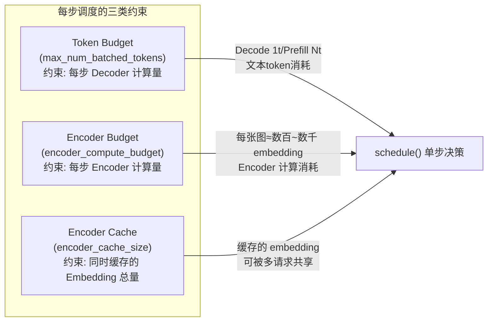
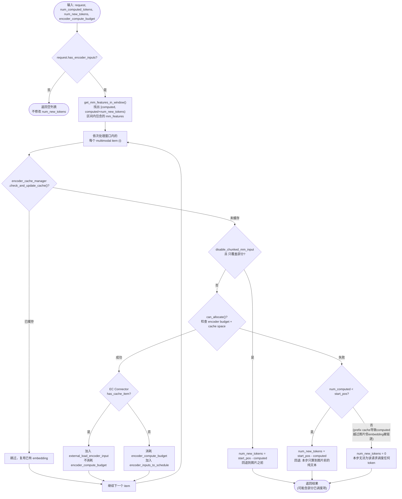
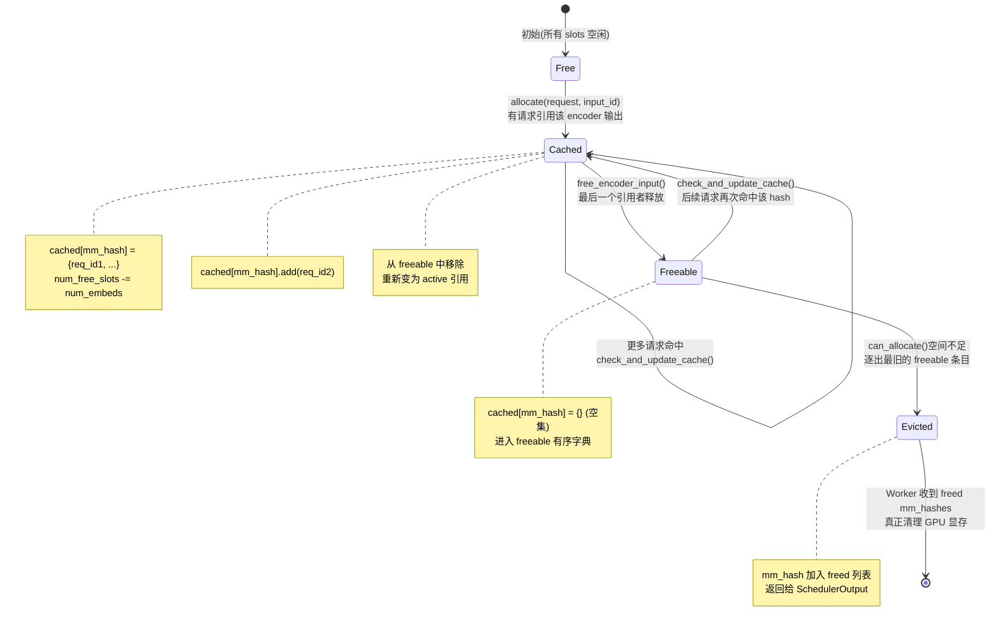
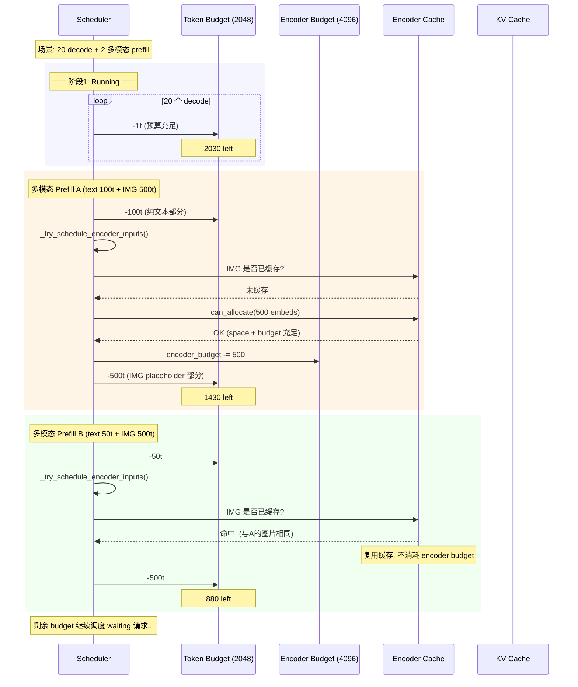
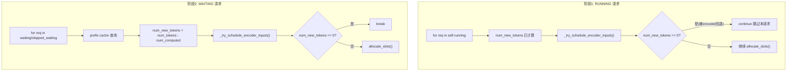
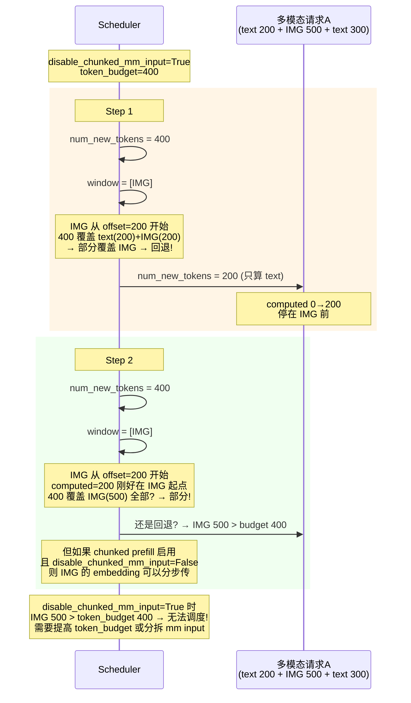
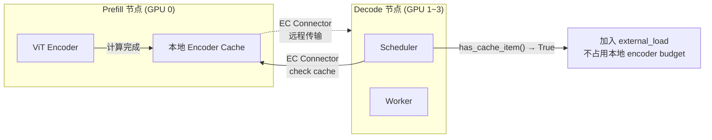

# 07 · 多模态 Encoder 调度详解

**源码**：
- [`code/vllm/vllm/v1/core/sched/scheduler.py`](../../code/vllm/vllm/v1/core/sched/scheduler.py) — `_try_schedule_encoder_inputs()`
- [`code/vllm/vllm/v1/core/encoder_cache_manager.py`](../../code/vllm/vllm/v1/core/encoder_cache_manager.py) — Encoder Cache 管理
- [`code/vllm/vllm/multimodal/encoder_budget.py`](../../code/vllm/vllm/multimodal/encoder_budget.py) — `MultiModalBudget`
- [`code/vllm/vllm/distributed/ec_transfer/ec_connector/base.py`](../../code/vllm/vllm/distributed/ec_transfer/ec_connector/base.py) — EC Connector 接口

前置阅读：[01-调度器.md](01-调度器.md)（三阶段调度概览）、[06-高并发多P多D调度详解.md](06-高并发多P多D调度详解.md)（多 P/D 混合编排）。

本文聚焦**多模态请求的 Encoder 调度**：图片/视频/音频等输入如何与文本 token 一起被编排，以及 Encoder 的独立预算和缓存机制如何影响调度决策。

---

## 1. 多模态请求的 Prompt 结构

多模态请求的 prompt 并非全是文本 token——图像等非文本输入会先被替换为 placeholder token，等待 Encoder 计算后才能得到真正的 embedding。

```
Prompt: "描述这张图片：[IMAGE] 它是什么颜色？"

vLLM 内部表示:
┌──────────────────────────────────────────────────────────────┐
│ 纯文本 token          placeholder tokens          纯文本 token │
│ "描述这张图片："  →  [IMG_START, ..., IMG_END]  →  "它是什么颜色？" │
│                         ↑                                      │
│              需要 Encoder(ViT) 先算完                            │
│              得到 embedding 才能喂给 LLM                        │
└──────────────────────────────────────────────────────────────┘
```

每个多模态输入在 `Request` 中表示为 `mm_features[i]`：

| 字段 | 含义 | 示例 |
|------|------|------|
| `mm_features[i].identifier` | 内容的哈希值，用于 encoder cache 去重 | `"sha256:abc123..."` |
| `mm_features[i].mm_position.offset` | placeholder 在 prompt 中的起始 token 位置 | `500` |
| `mm_features[i].mm_position.length` | placeholder 占用的 token 数量 | `576`（ViT 输出） |
| `mm_features[i].mm_position.get_num_embeds()` | encoder 需要计算的 embedding 数量 | `576` |

**关键含义**：一个 prompt 中可能穿插多个多模态输入（如「图片A + 文本 + 图片B」），调度器必须确保在处理到某个图片的 placeholder token 之前，该图片的 embedding 已经算好。

---

## 2. 双 Budget 约束模型

纯文本调度只有一个 `token_budget`（Decoder token 计算量）。多模态调度引入两个额外约束：



**为什么需要独立的 Encoder Budget？**

Decoder（LLM）和 Encoder（ViT/音频编码器）在**不同的硬件上计算**（如 LLM 在 GPU 0~3，ViT 在 GPU 0），资源独立。Encoder budget 防止单步内堆积过多图片/视频编码任务导致 Encoder 成为瓶颈。

Encoder Budget 的计算逻辑（[`encoder_budget.py`](../../code/vllm/vllm/multimodal/encoder_budget.py) L117-L121）：

```python
encoder_compute_budget = max(
    scheduler_config.max_num_encoder_input_tokens,  # 默认 = max_num_batched_tokens
    max_tokens_per_mm_item                          # 最大单 item token 数
)
```

---

## 3. `_try_schedule_encoder_inputs()` 决策流程

这是 Encoder 调度的核心方法。它的职责是：给定本步拟调度的 token 范围，找出需要新计算的 encoder 输入，并在不可调度时回退 `num_new_tokens`。



### 3.1 关键回退逻辑

Encoder 调度的核心设计是**宁可少算，不可跨图**。当 Encoder cache 满或 budget 不足时：

1. **图前有文本**：`num_new_tokens` 回退到图片起点之前，只算纯文本部分
2. **图前无文本（或已算过）**：`num_new_tokens = 0`，请求本步完全无法推进

这防止了「decoder 算到图片 placeholder token 但 embedding 还没准备好」的错误。

### 3.2 完整回退示例

```
Prompt: "text_A [IMAGE_1: 500 tokens] text_B [IMAGE_2: 500 tokens] text_C"
假设 num_computed_tokens = 0, num_new_tokens = 2000

步骤1: window = [IMAGE_1, IMAGE_2]
步骤2: IMAGE_1 未缓存, can_allocate() → OK, 消耗 500 encoder budget
步骤3: IMAGE_2 未缓存, can_allocate() → 失败(encoder cache 满)

→ num_new_tokens 回退到 IMAGE_2 起点 = text_A(200t) + IMAGE_1(500t) = 700
→ 本步只调度 700 个 decoder token
→ IMAGE_2 留到下一步
```

---

## 4. Encoder Cache 生命周期

Encoder Cache 用于缓存 Encoder（如 ViT）的计算输出，避免同一张图被多次编码。cache 以 `mm_hash`（内容哈希）为 key。



**缓存逐出策略**：FIFO（先进入 freeable 的先被逐出），不是 LRU。逐出发生在 `can_allocate()` 检测到空闲不足时，而非独立的后台线程。

**跨请求共享**：两个请求的 prompt 中如果包含相同的图片（相同 `identifier`），Encoder Cache 确保只计算一次。这在多轮对话（用户反复提同一张图）或批量推理中特别有效。

---

## 5. 多模态 + 纯文本混合调度

### 5.1 一个 Step 内的双 Budget 分配



### 5.2 Encoder 瓶颈时的降级行为

当 Encoder budget 或 cache 满时，多模态请求会被「部分调度」——只推进纯文本部分，图片部分等待下一步：

```
Step N:
  Decode × 20: done (20t)
  多模态 Prefill A: text 100t done, IMG 500t done (encoder budget -500)
  多模态 Prefill B: text 50t done, IMG → can_allocate() 失败!
    → num_new_tokens 回退 = 150 (只算到 IMG 前的 text)
    → 本步贡献 150t, 下步继续

Step N+1:
  Decode × 20: done (20t)
  多模态 Prefill B: IMG 500t done (encoder cache 有空位了)
```

**关键观察**：多模态请求不会阻塞纯文本请求。当 Encoder 不可用时，只是多模态请求自己降速，decode 和其他纯文本 prefill 不受影响。

---

## 6. 在 `schedule()` 两阶段中的调用位置

`_try_schedule_encoder_inputs()` 在 `schedule()` 的两个阶段都会调用：



**两阶段差异**：

| 方面 | RUNNING 阶段 | WAITING 阶段 |
|------|-------------|-------------|
| `num_computed_tokens` | 可能 > 0（已部分 prefill） | 通常 = 0（或 prefix cache 命中后 > 0） |
| 图片可能已缓存 | 是（之前 step 已编码过） | 可能未缓存，首次查询 |
| EC Connector 行为 | 通常不触发 async load | 可能触发 `external_load_encoder_input` |
| 失败处理 | `continue`（跳过，不阻断其他 running 请求） | `break`（停止调度新请求） |

---

## 7. 多模态 Chunked Prefill 特殊性

### 7.1 `disable_chunked_mm_input` 参数

默认 `False`。设为 `True` 时，禁止 decoder chunk 跨越 multimodal item 边界：

```
Prompt: text_A(100t) + IMG(500t) + text_B(100t)
token_budget = 300, disable_chunked_mm_input = False

Step 1: num_new_tokens = 300 → text_A(100t) + IMG(部分 200t)
        允许! IMG 的 placeholder 被分块
```

```
token_budget = 300, disable_chunked_mm_input = True

Step 1: num_new_tokens = 300 → 覆盖 [text_A, IMG前半, ...]
        → chunk 跨越 IMG 边界 → 回退!
        → num_new_tokens = 100 (只算 text_A)
        需要等下一步 IMG 能被完整调度
```

### 7.2 回退时序示例



**设置建议**：`disable_chunked_mm_input=True` 保证 Encoder 输入的完整性（某些 Encoder 不支持分块），但代价是大图可能阻塞请求。默认为 `False` 对多数模型适用。

---

## 8. EC Connector：远程 Encoder Cache

EC Connector（Encoder Cache Connector）用于 **P/D 分离场景**——Prefill 节点的 Encoder 输出可以被 Decode 节点远程加载：



在 `_try_schedule_encoder_inputs()` 中的代码路径（[scheduler.py:1521-1527](../../code/vllm/vllm/v1/core/sched/scheduler.py) L1521-L1527）：

```python
if self.ec_connector is not None and self.ec_connector.has_cache_item(item_identifier):
    mm_hashes_to_schedule.add(item_identifier)
    external_load_encoder_input.append(i)  # 不消耗 encoder_compute_budget
    num_embeds_to_schedule += num_encoder_embeds
    continue
```

远程加载的 encoder 输入**不消耗本地的 `encoder_compute_budget`**——因为计算在其他节点上。

---

## 9. 关键代码锚点

| 关注点 | 源码位置 |
|--------|---------|
| `_try_schedule_encoder_inputs()` | [`scheduler.py`](../../code/vllm/vllm/v1/core/sched/scheduler.py) L1381–L1539 |
| Running 阶段调用 encoder 调度 | [`scheduler.py`](../../code/vllm/vllm/v1/core/sched/scheduler.py) L516–L532 |
| Waiting 阶段调用 encoder 调度 | [`scheduler.py`](../../code/vllm/vllm/v1/core/sched/scheduler.py) L872–L887 |
| Encoder Cache Manager | [`encoder_cache_manager.py`](../../code/vllm/vllm/v1/core/encoder_cache_manager.py) 全部 |
| `MultiModalBudget` | [`encoder_budget.py`](../../code/vllm/vllm/multimodal/encoder_budget.py) L44–L194 |
| EC Connector 接口 | [`ec_connector/base.py`](../../code/vllm/vllm/distributed/ec_transfer/ec_connector/base.py) |
| `SchedulerOutput` encoder 字段 | [`output.py`](../../code/vllm/vllm/v1/core/sched/output.py) L213, L225 |

---

## 总结

多模态 Encoder 调度的核心机制：

1. **双 Budget 独立约束**：`token_budget`（Decoder）和 `encoder_compute_budget`（Encoder）独立管理
2. **回退保安全**：Encoder 不可用时，`num_new_tokens` 回退到图片之前——宁可少算，不可跨图
3. **Encoder Cache 复用**：相同图片只编码一次，`mm_hash` 去重，FIFO 逐出
4. **混合调度不阻塞**：多模态请求的 Encoder 瓶颈不影响纯文本 decode/prefill
5. **EC Connector 远程加载**：P/D 分离时，远程 Encoder 输出不消耗本地 budget
6. **Chunked MM Input 控制**：`disable_chunked_mm_input` 决定是否允许 decoder chunk 跨越多模态 item 边界
