# 08 · 图解调度逻辑与批量推理执行原理

**源码参考**：
- [`code/vllm/vllm/v1/core/sched/scheduler.py`](../../code/vllm/vllm/v1/core/sched/scheduler.py) — 调度器主逻辑
- [`code/vllm/vllm/v1/engine/core.py`](../../code/vllm/vllm/v1/engine/core.py) — 引擎主循环 `step()`
- [`code/vllm/vllm/v1/worker/gpu/model_runner.py`](../../code/vllm/vllm/v1/worker/gpu/model_runner.py) — 批量执行 `execute_model()`

---

本文档用图解方式串联 **调度** 与 **批量执行** 两大核心机制，帮助从全局视角理解 vLLM 每一步推理的完整链路。

阅读前建议先看过 [01-调度器.md](01-调度器.md) 和 [02-V1引擎主循环/05-后端引擎.md](../02-V1引擎主循环/05-后端引擎.md)。

## 一、总体流程：一个 step 的全景图

vLLM V1 的推理过程是一个**紧循环**（tight loop），每一步经历「调度 → 执行 → 采样 → 更新」四个阶段：

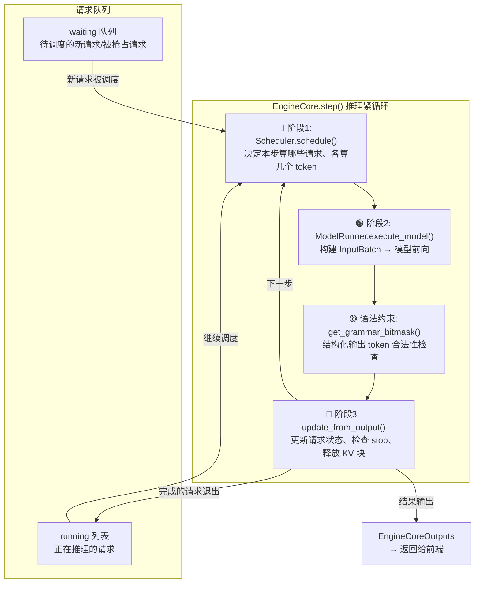

### 核心数据结构流转

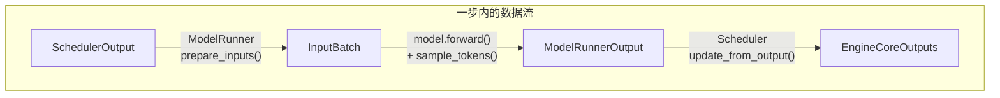

**关键点**：`SchedulerOutput` 是调度和执行之间的契约——调度器告诉执行器「算什么」，执行器返回「算出了什么」。

---

## 二、调度逻辑详解（三阶段算法）

### 2.1 统一调度模型

V1 不区分 prefill/decode 阶段。每个请求的核心状态只有两个计数器：

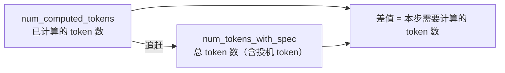

| 场景 | num_computed_tokens | num_tokens_with_spec | 差值（本步要算） |
|------|---------------------|----------------------|:---:|
| 新请求 prefill | 0 | 1000 | 1000 |
| chunked prefill | 200 | 1000 | ≤800 (被 token_budget 截断) |
| decode | 999 | 1000 | 1 |
| speculative decoding | 990 | 1000 | 10 (5 bonus + 5 draft) |

### 2.2 三阶段调度算法

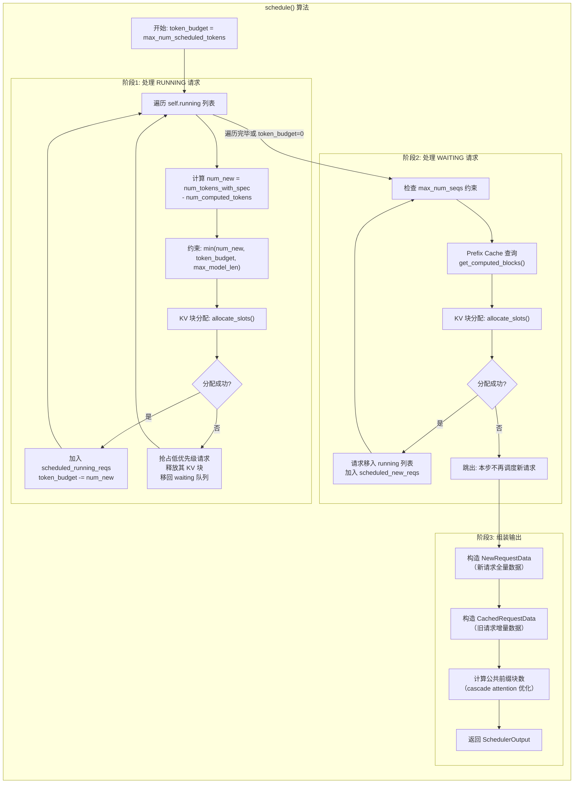

### 2.3 Token Budget 分配（气泡图）

每步有 `max_num_scheduled_tokens`（默认= `max_num_batched_tokens`，如 16384）。调度器的任务是把这笔「预算」分配给各个请求：

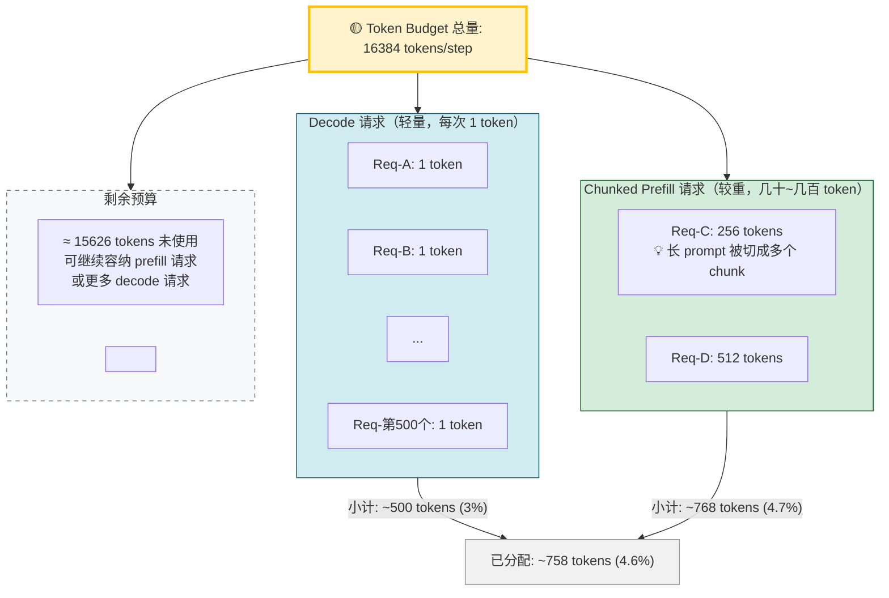

> **💡 图解要点**：Decode 请求每次只消耗 1 token，即使 500 个并发也只占预算的 ~3%。真正的预算消耗大户是 **Chunked Prefill**——长 prompt 被切分为多个 chunk，每步消耗一部分预算。当预算用尽时，新 prefill 请求必须等待下一轮。

**核心要点**：
- **Decode 请求**：每次只消耗 1 token（生成下一个 token），极轻量
- **Chunked prefill**：长 prompt 被切成多个 chunk，每步消耗一部分预算
- **预算用尽 → 停止调度**：哪怕 waiting 队列还有请求，也不能在本步调度
- **Decode 优先于 prefill**：先处理 running 中的 decode（阶段1），再调度新 prefill（阶段2）

### 2.4 Chunked Prefill 的 token 预算切分

当 `num_new_tokens > token_budget` 且启用 chunked prefill 时：

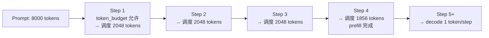

如果**禁用** chunked prefill，长 prompt 无法拆分，会直接 `break` 跳过（等待更多预算释放）。

---

## 三、KV 缓存块分配流程

### 3.1 Block Pool 与分配逻辑

KV 缓存以 **Block** 为单位管理（默认 block_size=16 tokens）。Block Pool 是所有请求共享的物理块池：

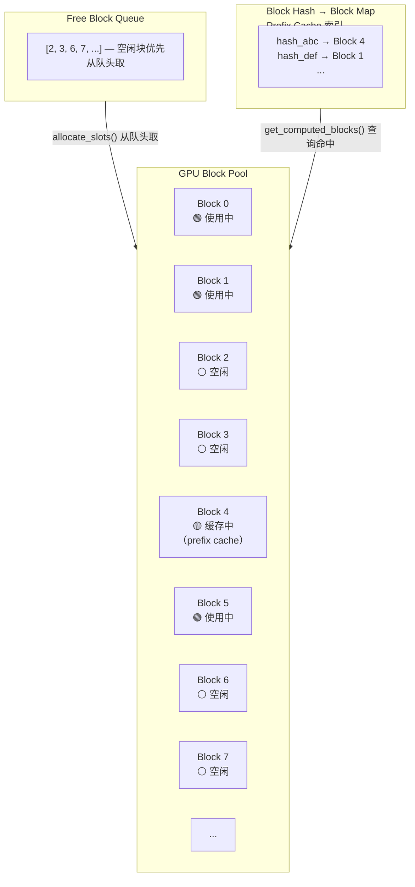

### 3.2 Prefix Cache 命中流程

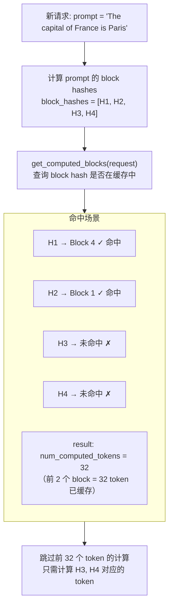

**意义**：Prefix Cache 让相同前缀的请求共享 KV 缓存块，避免重复计算。系统提示词固定的场景下效果显著。

### 3.3 抢占（Preemption）机制

当 KV 缓存池不足以分配新请求所需的 block 时：

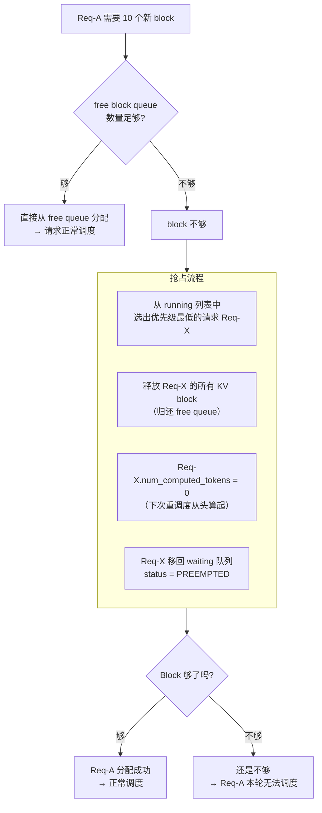

**代价**：被抢占请求的所有已计算 KV 全部丢失——下次从 0 重新 prefill。这是 kv cache 严重不足时的最后手段。

---

## 四、批量推理执行原理

### 4.1 从 SchedulerOutput 到 InputBatch

调度器产出 `SchedulerOutput` 后，`GPUModelRunner.execute_model()` 将其转换为模型可以消费的 InputBatch：

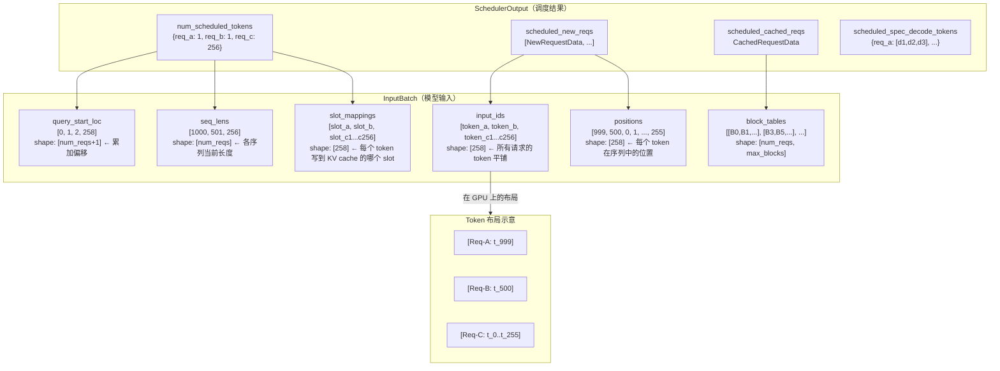

### 4.2 Batch 执行的完整流程

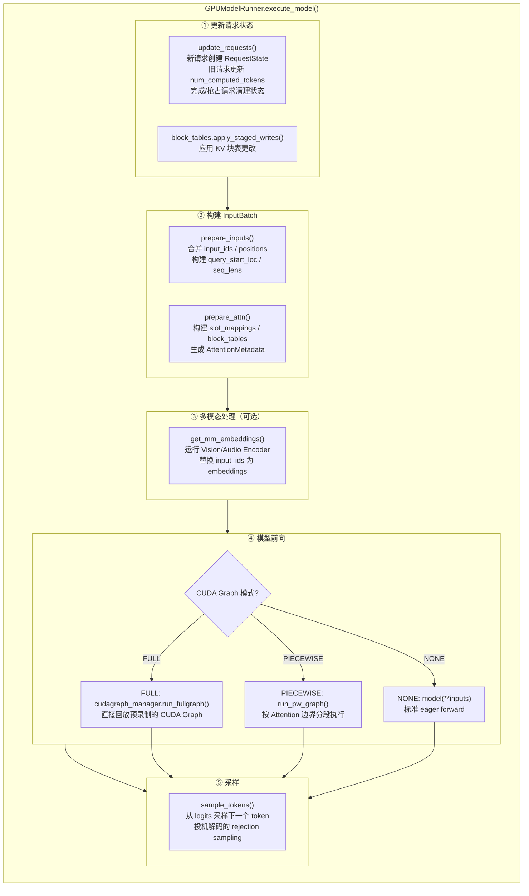

### 4.3 单 Token vs 多 Token 的 Batch 形态

不同请求在同一 batch 中可以有不同的 query 长度——这就是 V1 混合 batch 的核心能力：

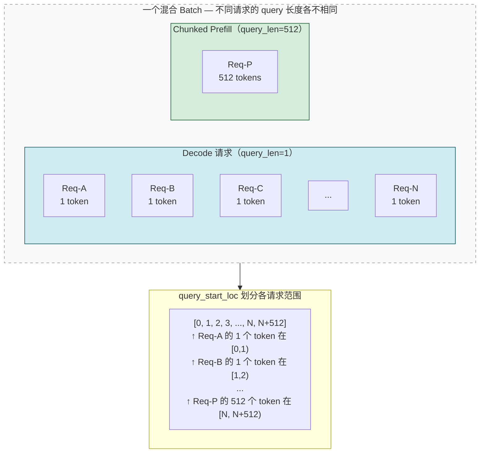

**注意**：decode 请求的 query 长度 = 1（只算最后一个 token），而 chunked prefill 请求的 query 长度 = 本步分配的 chunk 大小。Attention kernel 通过 `query_start_loc`（累加偏移量数组）知道每个请求的 token 从哪开始、到哪结束。

### 4.4 Attention 与 KV Cache 写入

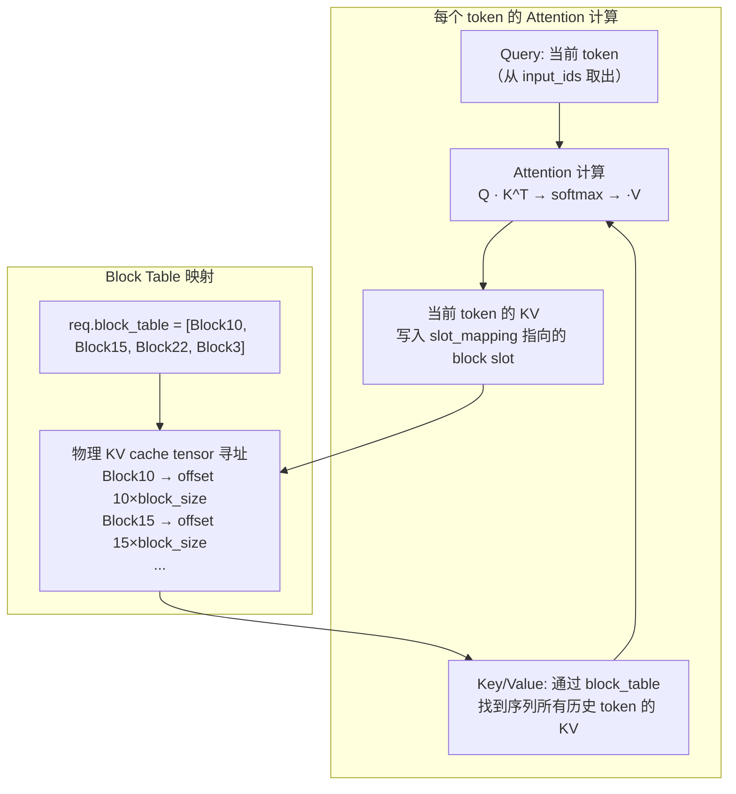

**关键设计**：Block Table 提供虚拟到物理的映射，使 KV cache 块可以不连续分配。这是 PagedAttention 的核心——像操作系统的虚拟内存页表一样管理 KV 缓存。

### 4.5 CUDA Graph 加速

vLLM 通过预录制 CUDA Graph 消除 kernel launch overhead：

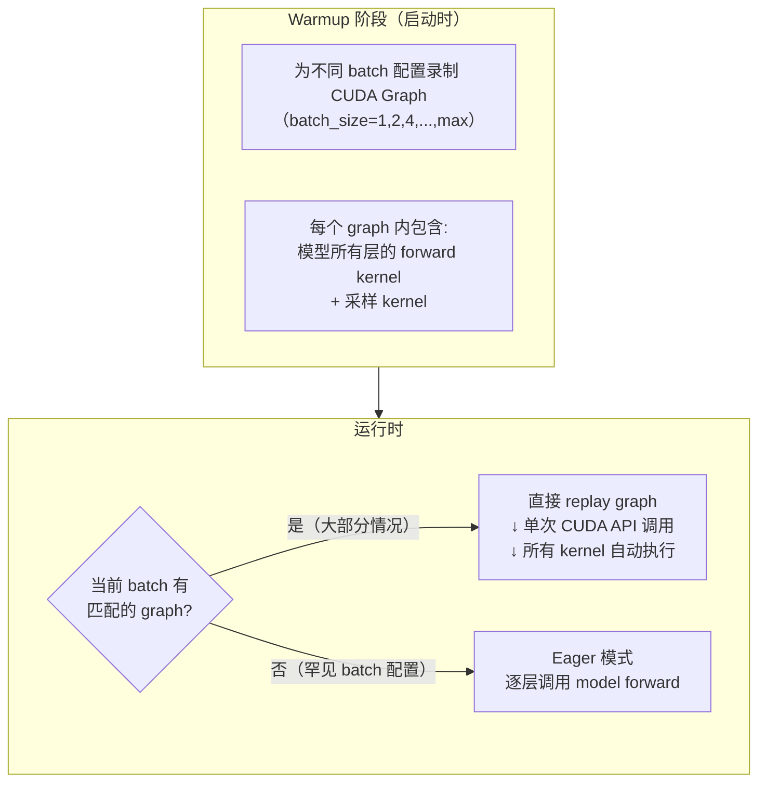

CUDA Graph 的前提是 batch 的 **token 总数和请求数** 必须与录制时一致。对于「全 decode」（每个请求 1 token）的场景，graph 录制很容易覆盖；对于混合 batch 中包含变长 chunked prefill 的场景，可能需要 eager 或 PIECEWISE 模式。

---

## 五、完整体验：一个请求从进入到产出

以一次 decode 步骤为例，跟踪一个 token 的完整旅程：

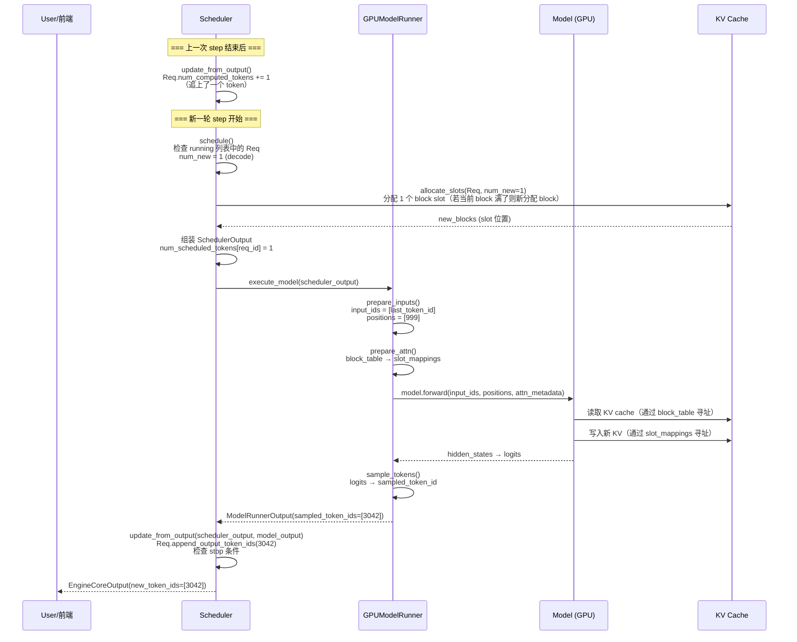

---

## 六、关键概念速查

| 概念 | 一句话解释 | 管理方 |
|------|-----------|--------|
| **token_budget** | 每步最多算多少 token（如 16384），限制 batch 总计算量 | Scheduler |
| **max_num_seqs** | 最多同时 running 多少请求（如 256），限制并发数 | Scheduler |
| **chunked prefill** | 长 prompt 分多步计算，避免单步计算量过大 | Scheduler |
| **prefix cache** | 相同 prompt 前缀共享 KV block，避免重复计算 | KVCacheManager |
| **block_table** | 每个请求的虚拟块号→物理块号的映射表 | BlockTables (Worker) |
| **slot_mapping** | 每个 token 的 KV 写入位置（block_id × block_size + offset） | ModelRunner |
| **query_start_loc** | 累加偏移数组，Attention kernel 用此划分 batch 中各请求的 token 范围 | InputBatch |
| **抢占** | KV cache 不足时踢出低优先级请求，其已算 KV 全部丢失 | Scheduler |
| **CUDA Graph** | 预录制 kernel 序列，运行时一次 API 调用重放，消除 launch overhead | CUDAGraphManager |

---

## 阅读重点

- 理解「统一调度模型」：`num_computed_tokens` 追 `num_tokens_with_spec`，一个模型覆盖所有场景
- 跟一遍三阶段调度：running → waiting → assemble
- 记住 `token_budget` 和 `max_num_seqs` 是两个独立约束
- 理解 InputBatch 的 flat 布局：所有请求的 token 合并为一个一维数组，通过 `query_start_loc` 划分边界
- 知道 block_table 是实现 PagedAttention 的核心：虚拟块号→物理块号映射
- CUDA Graph 是性能关键：预录制避免 kernel launch overhead

**相关文档**：
- [01-调度器.md](01-调度器.md) — `Scheduler.schedule()` 源码详解
- [02-调度输出结构.md](02-调度输出结构.md) — SchedulerOutput / InputBatch 数据结构
- [03-KV缓存管理器.md](03-KV缓存管理器.md) — KV block 分配与 prefix cache
- [../04-模型执行与采样/03-GPUModelRunner.md](../04-模型执行与采样/03-GPUModelRunner.md) — execute_model() 源码详解
- [06-高并发多P多D调度详解.md](06-高并发多P多D调度详解.md) — 高并发场景调度详解
- [09-GPU执行并行流水线图解.md](09-GPU执行并行流水线图解.md) — 计算与数据加载的并行流水线机制，了解极致性能怎么来
