# 09 · GPU 执行并行流水线图解：计算 vs 数据加载

**源码参考**：
- [`code/vllm/vllm/v1/worker/gpu/model_runner.py`](../../code/vllm/vllm/v1/worker/gpu/model_runner.py) — 模型执行主逻辑
- [`code/vllm/vllm/v1/worker/gpu/async_utils.py`](../../code/vllm/vllm/v1/worker/gpu/async_utils.py) — 异步 D2H 拷贝与流管理
- [`code/vllm/vllm/v1/worker/gpu/buffer_utils.py`](../../code/vllm/vllm/v1/worker/gpu/buffer_utils.py) — 异步 H2D 拷贝与 UVA 缓冲池
- [`code/vllm/vllm/v1/worker/gpu/pp_utils.py`](../../code/vllm/vllm/v1/worker/gpu/pp_utils.py) — 流水线并行采样广播
- [`code/vllm/vllm/v1/engine/core.py`](../../code/vllm/vllm/v1/engine/core.py) — `step_with_batch_queue()` 调度-执行重叠
- [`code/vllm/vllm/v1/worker/gpu/dp_utils.py`](../../code/vllm/vllm/v1/worker/gpu/dp_utils.py) — 数据并行批次协调

---

vLLM 达到极致推理吞吐的秘诀在于**把计算和数据加载完全重叠**。本文档用气泡图拆解这背后的并行流水线机制。

阅读前建议先看过 [08-调度与批量执行图解.md](08-调度与批量执行图解.md)。

## 一、一张图看懂：GPU 时间线并行全景

一个推理 step 中，计算（蓝色）和数据加载（橙色）在两条 CUDA Stream 上并行推进：

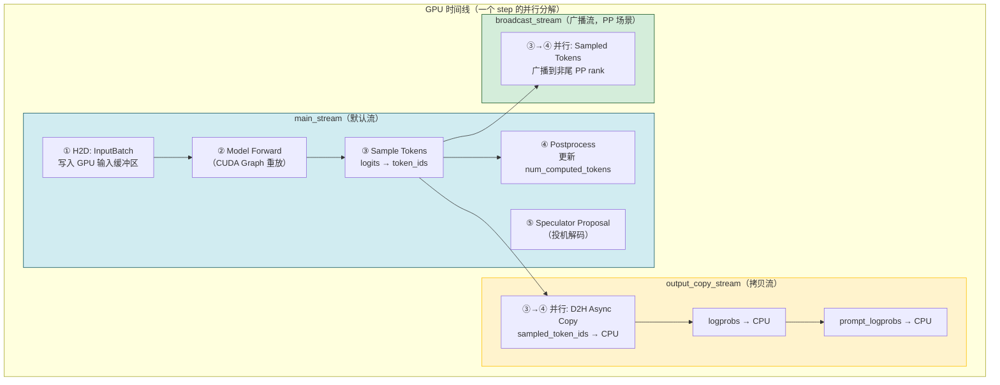

> **核心原理**：模型前向在 `main_stream` 上执行完毕后，采样结果立即被 `output_copy_stream` 异步拷贝到 CPU。与此同时，`main_stream` 不等待拷贝完成，继续执行后处理和投机解码 draft 生成。两条流之间通过 CUDA Event 同步，确保拷贝完成时才读取 CPU 端数据。

## 二、六大并行维度气泡图

### 2.1 维度一：异步 D2H 拷贝（AsyncOutput）

模型前向完成后，采样结果要从 GPU 拷回 CPU。这一拷贝与后续 GPU 计算**完全并行**：

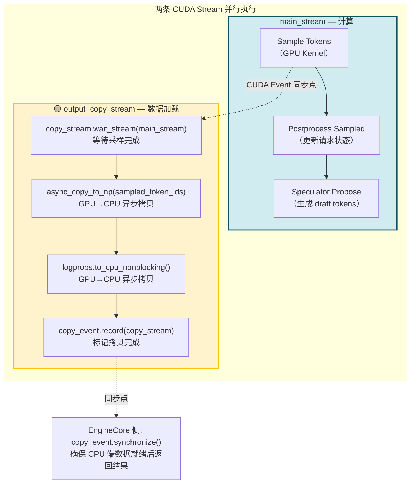

**源码关键代码**（[async_utils.py](../../code/vllm/vllm/v1/worker/gpu/async_utils.py)）：

```python
class AsyncOutput:
    def __init__(self, model_runner_output, sampler_output,
                 num_sampled_tokens, main_stream, copy_stream):
        self.copy_event = torch.cuda.Event(blocking=True)
        with stream(copy_stream, main_stream):
            copy_stream.wait_stream(main_stream)           # ← 等主流的采样 kernel 跑完
            self.sampled_token_ids = async_copy_to_np(...) # ← 异步拷贝（非阻塞）
            self.logprobs_tensors = logprobs.to_cpu_nonblocking()
            self.copy_event.record(copy_stream)            # ← 记录拷贝完成信号
        # 控制权立即返回 — main_stream 继续往后跑，不等拷贝
```

**收益**：每次 step 节省 ~50-200μs 的 D2H 等待时间。在 decode-heavy 场景下，这相当于 3~8% 的延迟降低。

### 2.2 维度二：异步 H2D 拷贝（InputBatch 构建）

每步调度结束后，CPU 上的 `SchedulerOutput` 需要拷贝到 GPU 的 InputBatch 缓冲区。这些 H2D 拷贝全部使用 `non_blocking=True`：

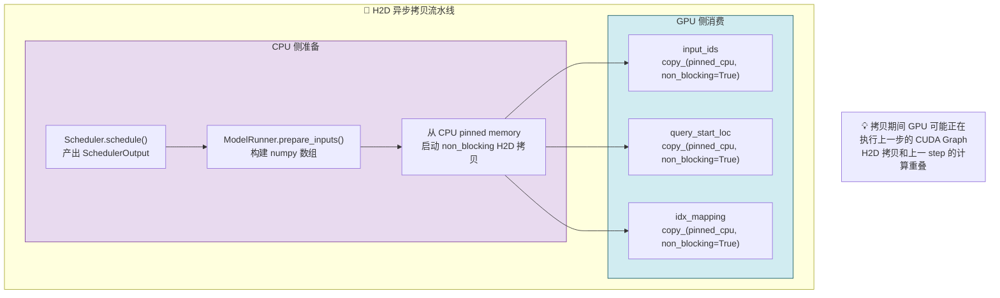

**关键机制**：
- CPU 端使用 **pinned memory**（`pin_memory()`），DMA 引擎可直接读写，无需 CPU 中转
- `non_blocking=True` 让拷贝命令提交后立即返回，GPU 在后台完成传输
- **UVA Buffer Pool**（[buffer_utils.py](../../code/vllm/vllm/v1/worker/gpu/buffer_utils.py)）：环形缓冲池，支持多步并发的 H2D 拷贝互不覆盖

### 2.3 维度三：流水线并行 — 调度与执行重叠

当启用 PP（Pipeline Parallelism）时，`step_with_batch_queue()` 通过 Batch Queue 让 CPU 调度和 GPU 执行完全重叠：

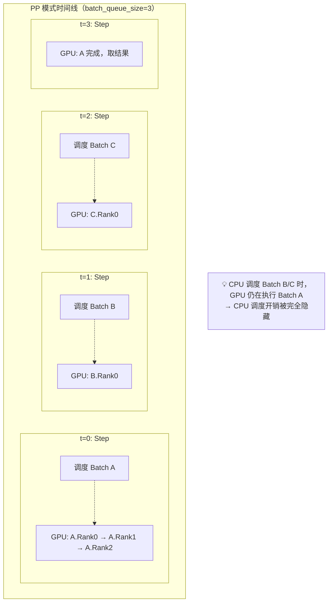

**Batch Queue 机制**：

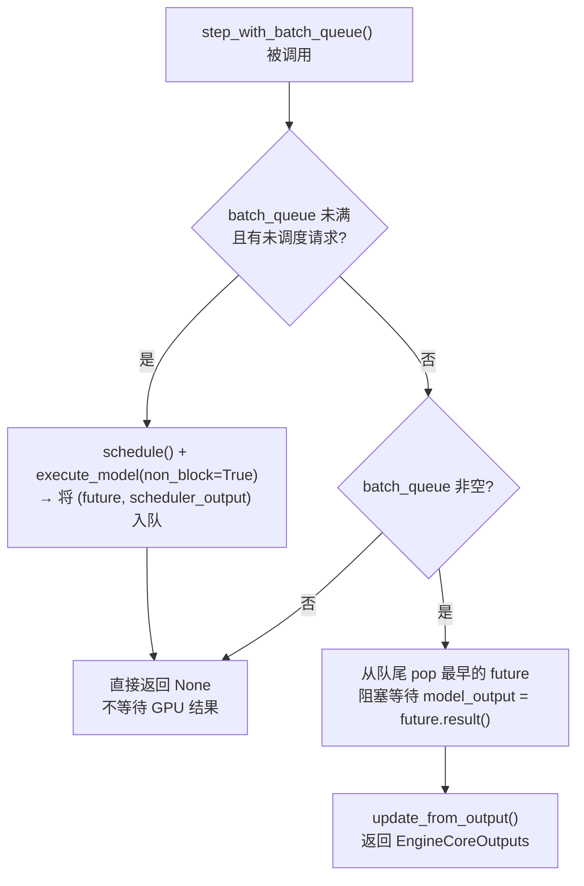

**PP 采样广播并行**（[pp_utils.py](../../code/vllm/vllm/v1/worker/gpu/pp_utils.py)）：

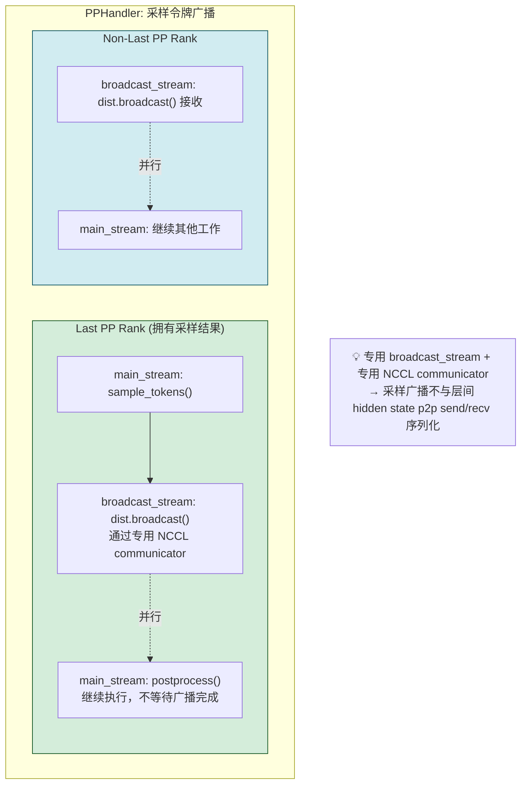

### 2.4 维度四：CUDA Graph — 消灭 Kernel Launch 开销

CUDA Graph 将整个模型前向的所有 kernel 调用预录制为单个可重放的计算图：

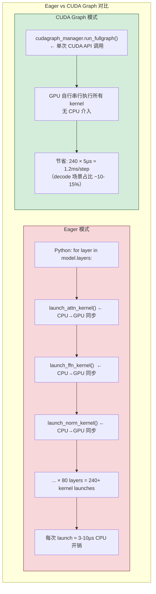

**三种 CUDA Graph 模式**：

| 模式 | 适用场景 | batch 形状要求 |
|------|---------|:---:|
| **FULL** | 全 decode（每个请求 1 token） | batch_size 和 token 数必须精确匹配录制时的值 |
| **PIECEWISE** | 混合 batch（含 chunked prefill） | 按 Attention 边界分段的可中断图 |
| **NONE** | 罕见 batch 配置、profile | 直接 eager forward |

### 2.5 维度五：数据并行（DP）— 多 GPU 独立调度

DP 模式下，多个 GPU 独立运行各自的 EngineCore，通过 all_reduce 协调 batch 形状：

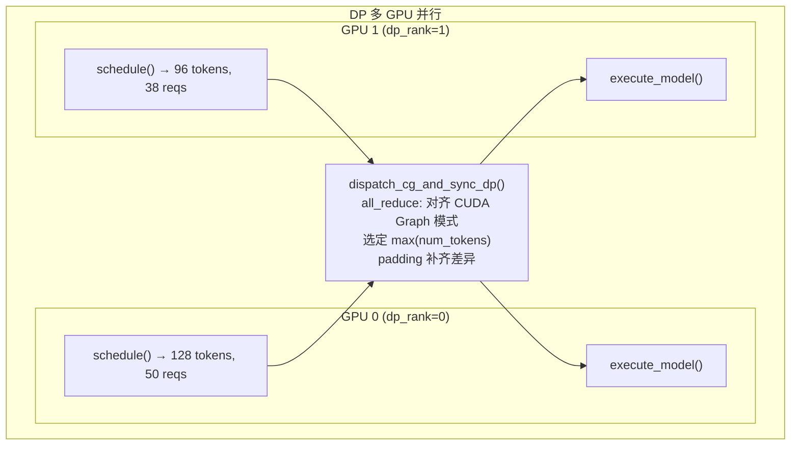

**DP 预填充平衡（prefill throttling）**：非对齐步骤推迟 prefill compute，确保 DP rank 间的 prefill 批次对齐，避免某个 rank 过载。

### 2.6 维度六：KV Cache Offload 异步传输

KV 缓存可以在 GPU ↔ CPU ↔ 远程存储之间异步迁移，与计算并行：

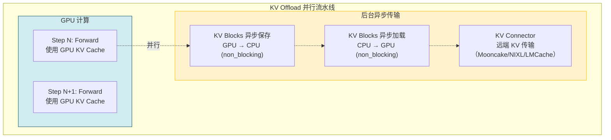

**调度器侧的配合**：
- `defer_block_free`：异步调度场景下延迟释放 KV block，避免消费者 connector 的加载与写入产生竞争
- `WAITING_FOR_REMOTE_KVS`：请求等待远端 KV 加载完成的状态，加载期间不调度该请求的 prefill

---

## 三、端到端流水线气泡图

将六大维度合并，一个 step 的 GPU 时间线全景：

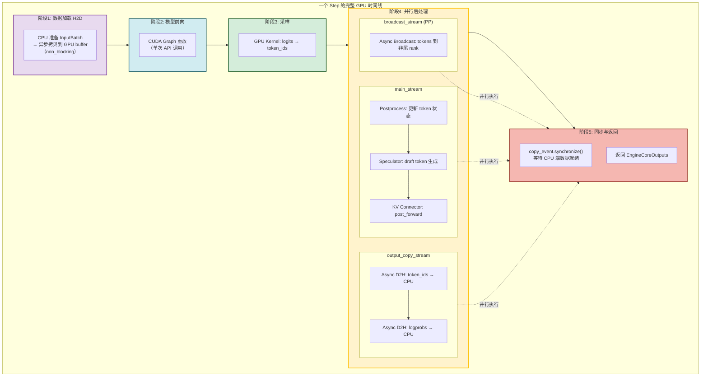

---

## 四、性能收益总结

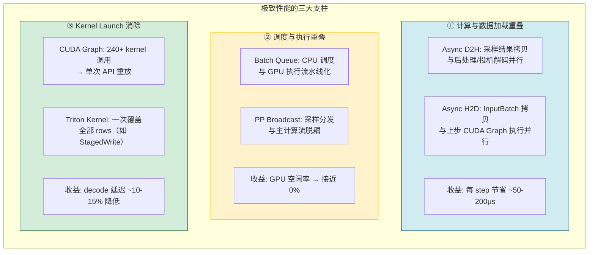

---

## 五、关键概念速查

| 概念 | 机制 | 并行对象 |
|------|------|---------|
| **CUDA Stream** | 同一 GPU 上独立执行队列，不同 stream 的操作可并行 | 计算(主) ↔ 数据拷贝(副) |
| **AsyncOutput** | `copy_stream` 异步 D2H + `copy_event` 同步点 | 采样结果拷贝 ↔ Postprocess |
| **Batch Queue** | deque 持有多个 in-flight step，调度和 GPU 执行流水线化 | CPU 调度 ↔ GPU 执行 |
| **PPHandler** | 专用 `broadcast_stream` + 专用 NCCL communicator | 采样广播 ↔ 层间 p2p send/recv |
| **CUDA Graph** | 预录制 kernel 序列，运行时单次重放 | Kernel launch 开销 → 0 |
| **StagedWriteTensor** | 批量积累写入，单次 Triton kernel 应用 | CPU 侧多次小写入 ↔ GPU 侧单次批量写入 |
| **UVA Buffer Pool** | 环形 pinned memory 缓冲，多步并发 H2D | 多个 step 的 H2D 拷贝互不覆盖 |
| **KV Offload** | GPU↔CPU KV block 异步传输，与 forward 并行 | KV 移动 ↔ 模型计算 |

---

## 阅读重点

- 理解**两条 CUDA Stream**（main + copy）如何并行：main 算后续步骤，copy 搬运采样结果
- 背下 AsyncOutput 的时序：`copy_stream.wait_stream(main)` → async copy → `copy_event.record` → EngineCore 侧 `synchronize()`
- 理解 **Batch Queue** 如何消除 PP 气泡：CPU 永远提前调度好下一个 batch
- CUDA Graph 不是"优化"而是"基础设施"——默认开启，对用户透明
- UVA Buffer Pool 的环形设计保证了多步并发 H2D 的安全性

**相关文档**：
- [08-调度与批量执行图解.md](08-调度与批量执行图解.md) — 调度→执行全链路 Mermaid 图解
- [01-调度器.md](01-调度器.md) — `Scheduler.schedule()` 源码详解
- [../04-模型执行与采样/03-GPUModelRunner.md](../04-模型执行与采样/03-GPUModelRunner.md) — execute_model() 源码详解
- [../02-V1引擎主循环/05-后端引擎.md](../02-V1引擎主循环/05-后端引擎.md) — step() / step_with_batch_queue() 源码
