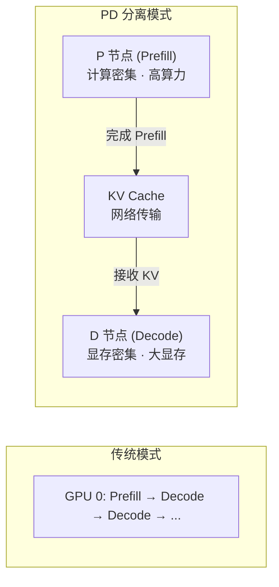
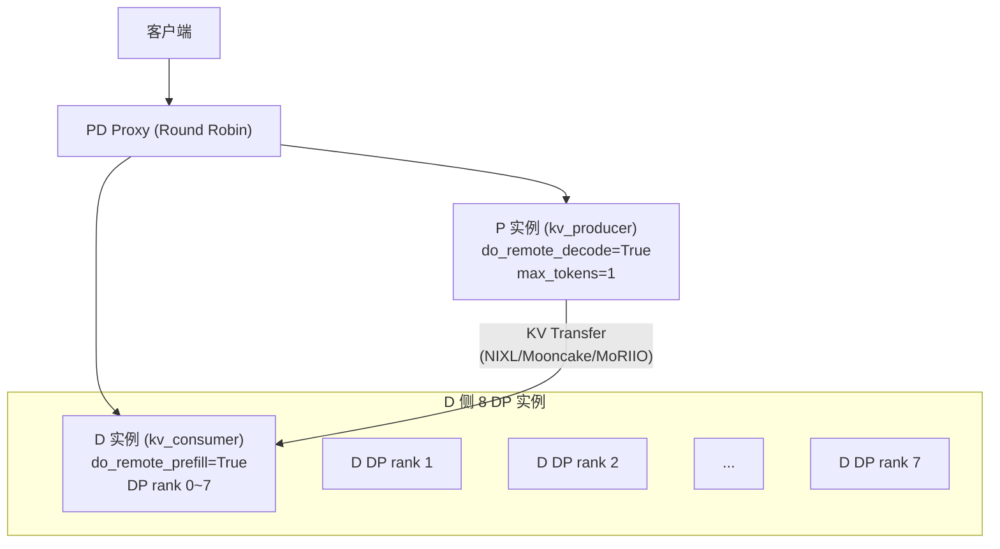
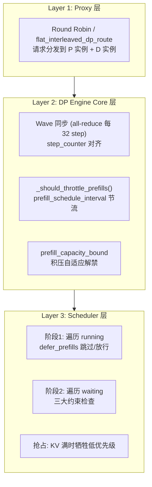
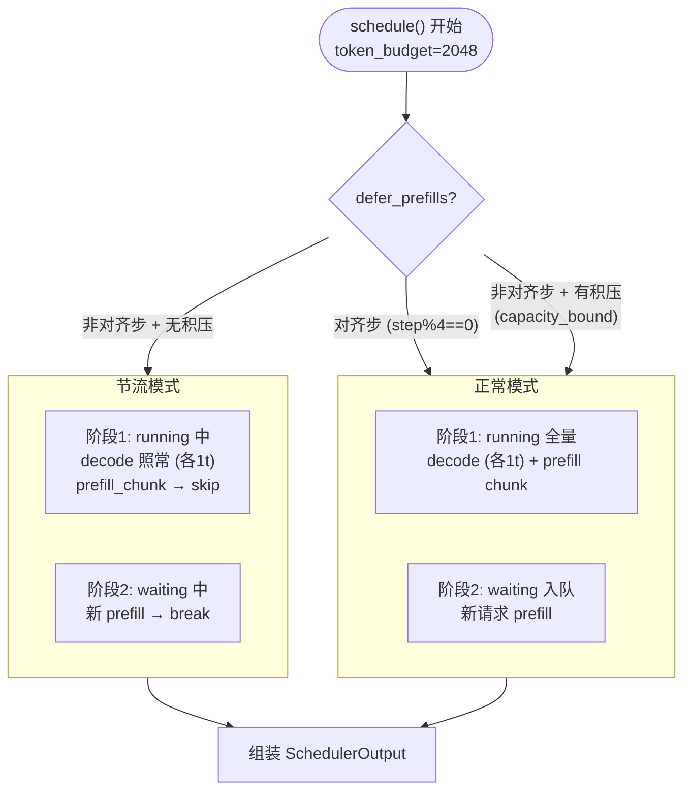
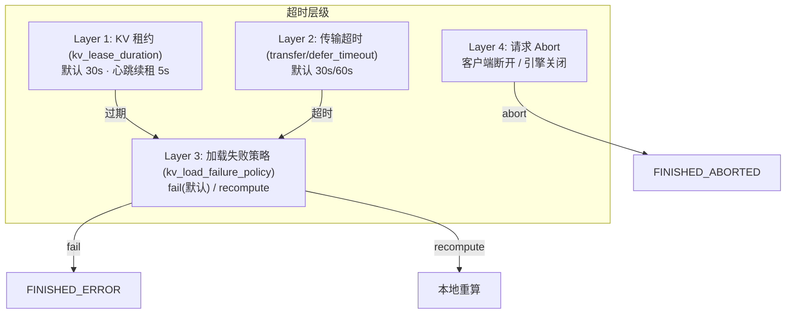

# 10 · PD 分离多 DP 调度与超时机制

**源码**：
- [`code/vllm/vllm/v1/core/sched/scheduler.py`](../../code/vllm/vllm/v1/core/sched/scheduler.py) — 调度器主逻辑、DP prefill 节流
- [`code/vllm/vllm/v1/engine/core.py`](../../code/vllm/vllm/v1/engine/core.py) — `DPEngineCoreProc`、wave 同步、`_should_throttle_prefills()`
- [`code/vllm/vllm/v1/engine/coordinator.py`](../../code/vllm/vllm/v1/engine/coordinator.py) — DP Coordinator 协调多 DP rank
- [`code/vllm/vllm/config/scheduler.py`](../../code/vllm/vllm/config/scheduler.py) — `prefill_schedule_interval` 配置
- [`code/vllm/vllm/config/kv_transfer.py`](../../code/vllm/vllm/config/kv_transfer.py) — KV 传输配置、`kv_load_failure_policy`
- [`code/vllm/vllm/distributed/kv_transfer/kv_connector/v1/nixl/base_scheduler.py`](../../code/vllm/vllm/distributed/kv_transfer/kv_connector/v1/nixl/base_scheduler.py) — NIXL Connector 调度端、租约与心跳
- [`code/vllm/vllm/distributed/kv_transfer/kv_connector/v1/moriio/moriio_common.py`](../../code/vllm/vllm/distributed/kv_transfer/kv_connector/v1/moriio/moriio_common.py) — MoRIIO 超时常量
- [`code/vllm/vllm/distributed/kv_transfer/kv_connector/v1/moriio/moriio_connector.py`](../../code/vllm/vllm/distributed/kv_transfer/kv_connector/v1/moriio/moriio_connector.py) — MoRIIO 调度端超时处理
- [`code/vllm/examples/disaggregated/disaggregated_serving/disagg_proxy_demo.py`](../../code/vllm/examples/disaggregated/disaggregated_serving/disagg_proxy_demo.py) — PD Proxy 轮询路由
- [`code/vllm/examples/disaggregated/disaggregated_serving/moriio_toy_proxy_server.py`](../../code/vllm/examples/disaggregated/disaggregated_serving/moriio_toy_proxy_server.py) — `flat_interleaved_dp_route` 多 DP 路由

前置阅读：[01-调度器.md](01-调度器.md)（三阶段调度）、[06-高并发多P多D调度详解.md](06-高并发多P多D调度详解.md)（单实例内 P/D 混合编排）。扩展阅读：[10-推理增强特性/03-分布式深化.md](../10-推理增强特性/03-分布式深化.md)（KV Transfer Connector 总览）、[10-推理增强特性/05-KV卸载扩展.md](../10-推理增强特性/05-KV卸载扩展.md)（KV 卸载与远程 KV）。

本文聚焦 **PD 分离（Prefill-Decode Disaggregation）架构下 D 侧多 DP 的调度逻辑**：当 D 节点以 `--data-parallel-size 8` 部署 8 个 DP 实例时，满载场景下的三层调度编排、Prefill 节流自适应、Wave 同步机制，以及从 KV 租约到请求级别的完整超时体系。

---

## 1. PD 分离架构概述

### 1.1 为什么需要 PD 分离

| 阶段 | 特征 | 瓶颈 |
|------|------|------|
| **Prefill**（预填充） | 一次处理全部 prompt token，建立 KV Cache | **计算密集型**，需要高算力 |
| **Decode**（解码） | 逐 token 生成，每个 step 计算 1 个 token | **显存密集型**，KV Cache 占用大 |

传统模式下 P/D 在同一 GPU 上进行，两种负载混合导致资源利用不均衡。PD 分离将 P 和 D 部署在不同实例上：



### 1.2 部署角色



**关键配置项**：

| 配置 | 含义 | 典型值 |
|------|------|--------|
| `--kv-transfer-config` | KV Connector 类型与参数 | `{"kv_connector":"NixlPushConnector","kv_role":"kv_consumer"}` |
| `--data-parallel-size` | D 侧 DP 实例数 | 8 |
| `--prefill-schedule-interval` | Prefill 节流间隔（每 N step 允许一次） | 1（禁用）或 2~8 |
| `--kv-transfer-config.kv_load_failure_policy` | KV 加载失败策略 | `"fail"` (默认) 或 `"recompute"` |

---

## 2. 三层调度架构

PD 分离场景下，调度分三个层次协同工作：



### 2.1 Proxy 层：轮询路由

当前 Proxy 使用 `itertools.cycle` 轮询分发（[disagg_proxy_demo.py](../../code/vllm/examples/disaggregated/disaggregated_serving/disagg_proxy_demo.py#L58-L59)）：

```python
self.prefill_cycler = itertools.cycle(prefill_instances)
self.decode_cycler = itertools.cycle(decode_instances)
```

**DP8 的 `flat_interleaved_dp_route`**（[moriio_toy_proxy_server.py:213-237](../../code/vllm/examples/disaggregated/disaggregated_serving/moriio_toy_proxy_server.py#L213-L237)）：单一计数器遍历 `(instance × dp_size)` 的全部 slot，交错分配——`inst0_r0, inst1_r0, inst0_r1, inst1_r1, ...`——确保每个 DP rank 都有请求。

> **限制**：当前 Proxy 不感知 D 实例负载。vLLM 正在进行中的 PD Controller（PR 15343）将引入负载感知调度，根据各 D 的 running/waiting 队列长度智能路由。

### 2.2 DP Engine Core 层：Wave 同步 + Prefill 节流

#### a) Prefill 节流

`prefill_schedule_interval`（[scheduler.py:153-156](../../code/vllm/vllm/config/scheduler.py#L153)）控制每 N 个 engine step 才允许一次 prefill：

```python
# DPEngineCoreProc._should_throttle_prefills()
def _should_throttle_prefills(self) -> bool:
    return (
        self.prefill_schedule_interval > 1
        and self.step_counter % self.prefill_schedule_interval != 0
    )
```

所有 DP rank 的 `step_counter` 从同一 wave 起点对齐，因此 **所有 D 在同一个 step 同时做 prefill**，防止个别 rank 因 prefill 计算过重而拖慢 all-reduce 同步点。

#### b) defer_prefills 自适应

```python
# scheduler.py:461-463
defer_prefills = (
    throttle_prefills and not self.prefill_capacity_bound
) and any(not r.is_prefill_chunk for r in self.running)
```

三个条件全部满足才推迟 prefill：
1. `throttle_prefills=True`（当前不在对齐步）
2. **`prefill_capacity_bound=False`**（等待队列无积压）
3. running 中至少有一个 decode 请求

**`prefill_capacity_bound` 的自动切换**（[scheduler.py:1054-1055](../../code/vllm/vllm/v1/core/sched/scheduler.py#L1054)）：

```
Step 0 (对齐): defer_prefills=False → prefill 入队 → waiting 非空
              → prefill_capacity_bound = True
Step 1 (非对齐): prefill_capacity_bound=True → defer_prefills=False
              → 继续消化积压！
Step N: waiting 清空 → prefill_capacity_bound=False → 恢复节流
```

**满载时的核心行为**：当 8 个 D 全部满载、waiting 积压时，调度器**自动跳过节流持续消化**，而不是死等下一个对齐步。

#### c) Wave 同步

所有 DP rank 通过 all-reduce 同步状态（[core.py:2089-2106](../../code/vllm/vllm/v1/engine/core.py#L2089)）：

```python
def _has_global_unfinished_reqs(self, local_unfinished: bool) -> bool:
    self.step_counter += 1
    if self.step_counter % 32 != 0:
        return True  # 非同步步乐观假设有活
    # all-reduce: 任一 rank 有未完成请求 → 继续
    has_unfinished, pause_consensus = ParallelConfig.sync_dp_state(...)
    return has_unfinished
```

**8 DP 全满载时**：`local_unfinished=True` → `has_unfinished=True` → 全部继续运行。

**某个 D 先跑完时**：该 rank 执行 dummy batch 空转，等其余 rank 完成。全部跑完后 wave 结束，`step_counter` 归零，新一轮对齐开始。

---

## 3. Scheduler 层：满载时的逐 Step 行为

### 3.1 满载场景设定

```
场景: D 侧 8 个 DP rank，每个 rank 配置:
  token_budget = 2048
  max_num_seqs = 128
  prefill_schedule_interval = 4

某个满载时刻 D DP rank 0:
  self.running: 50 个 decode (各差 1 token) + 2 个 chunked prefill
  self.waiting: 30+ 个新请求排队中
```

### 3.2 单 Step 调度流程



**阶段 1 遍历 running**（[scheduler.py:467-496](../../code/vllm/vllm/v1/core/sched/scheduler.py#L467)）：

```
for each request in self.running:
    if request is prefill_chunk:
        if defer_prefills:
            req_index += 1; continue   ← 跳过，decode 照常
        else:
            allocate_slots(chunk)      ← 正常调度 prefill chunk
    else (decode):
        allocate_slots(1 token)        ← decode 始终调度
```

**阶段 2 遍历 waiting**（[scheduler.py:825-828](../../code/vllm/vllm/v1/core/sched/scheduler.py#L825)）：

```
for each request in waiting:
    if defer_prefills and 需要 prefill:
        break   ← 不再调度新 prefill 请求
    else:
        allocate_slots(num_new_tokens)
```

### 3.3 满载时的抢占

当 KV Cache 不足时触发抢占（[scheduler.py:571-603](../../code/vllm/vllm/v1/core/sched/scheduler.py#L571)）：

| 策略 | 行为 |
|------|------|
| **FCFS** | `self.running.pop()` 弹出尾部请求，释放全部 KV 块 |
| **Priority** | 找 `running` 中优先级最低的请求抢占 |

被抢占的请求 `num_computed_tokens = 0`（**已算全部白算**），丢回 waiting 头部等待重调度。

### 3.4 多 Step 满载时序

```
时间 →
        Step 0            Step 1           Step 2           Step 3
        (对齐, 节流关闭)   (非对齐, 有积压)  (非对齐, 有积压)  (非对齐)
        
D0:  [50 decode + P chunk] [50 decode + P入] [50 decode + P入] [50 decode]
D1:  [50 decode + P chunk] [50 decode + P入] [50 decode + P入] [50 decode]
...
D7:  [50 decode + P chunk] [50 decode + P入] [50 decode + P入] [50 decode]
     
     ↑ capacity_bound=True → Step 1~2 也持续消化

        Step 4            Step 5           ...
        (对齐, waiting已清)
        
D0~D7: [50 decode + P chunk] [50 decode]
       ↑ waiting为空 → capacity_bound=False → 恢复节流
```

**关键结论**：

1. **对齐步**上所有 D 同时做 prefill，per-step 计算量均匀
2. **满载时自动解禁**，不停消化积压
3. **空闲时恢复节流**，减少不必要的 prefill 开销
4. **decode 不受节流影响**，始终得到 1 token/step 的服务

---

## 4. 超时与容错机制

PD 分离涉及跨节点的 KV 传输，P 侧 KV 块不能无限期持有。vLLM 设计了**四层超时保护**：



### 4.1 KV 租约超时 —— 默认 30 秒

P 完成 Prefill 后，KV 块在 P 侧有租约（[base_scheduler.py:70-72](../../code/vllm/vllm/distributed/kv_transfer/kv_connector/v1/nixl/base_scheduler.py#L70)）：

```python
self._kv_lease_duration: int = int(
    vllm_config.kv_transfer_config.get_from_extra_config("kv_lease_duration", 30)
)
```

**完整租约生命周期**：

```
P 完成 Prefill → _reqs_need_send[req_id] = time.perf_counter() + 30s
                  ↓
D 调度请求 (heartbeat 跟踪建立) → 每 5s (30//6) 给 P 发 Heartbeat
                  ↓
P 收到 Heartbeat → 刷新租约过期时间 (lease_extension = 20s)
                  ↓
D 完成 Decode → 停止 Heartbeat → P 释放 KV 块
```

**如果 D 前面有长任务导致请求一直在 waiting**：

```
t=0s:  P 完成 Prefill，KV 块 30s 租约开始
t=0~30s: 请求在 D waiting 中排队（D 尚未调度此请求）
       → D 端未建立 heartbeat 跟踪！
       → 没有续租发生
t=30s: P 侧租约到期 → KV 块释放
       → 下次 D 调度此请求时: KV 加载失败
```

**Worker 侧续租**（[base_worker.py:264-268](../../code/vllm/vllm/distributed/kv_transfer/kv_connector/v1/nixl/base_worker.py#L264)）：

```python
kv_lease_duration: int = vllm_config.kv_transfer_config.get_from_extra_config(
    "kv_lease_duration", 30
)
self._lease_extension = kv_lease_duration * 2 // 3  # 20s
```

### 4.2 传输超时 —— 默认 30s / 60s

针对 RDMA 传输层（[moriio_common.py:338-350](../../code/vllm/vllm/distributed/kv_transfer/kv_connector/v1/moriio/moriio_common.py#L338)）：

| 参数 | 默认值 | 含义 |
|------|--------|------|
| `transfer_timeout` | **30s** | RDMA 传输完成的最大等待时间 |
| `defer_timeout` | **60s** | P 等待 D 确认接收（`finished_sending` ACK）的最大时间 |
| `VLLM_MORI_READ_ABORT_REQUEST_TIMEOUT` | **3600s (1h)** | READ 模式下 P 保留 KV 块的最长时间 |

RDMA 传输失败时的处理（[moriio_connector.py:1637-1641](../../code/vllm/vllm/distributed/kv_transfer/kv_connector/v1/moriio/moriio_connector.py#L1637)）：

```
RDMA transfer failed → 通知 P 释放块 → request aborted by timeout
```

### 4.3 KV 加载失败策略 —— 默认 "fail"

当 KV 传输不可恢复地失败（租约过期、网络中断、block 损坏），策略由 `kv_load_failure_policy` 决定（[kv_transfer.py:69-72](../../code/vllm/vllm/config/kv_transfer.py#L69)）：

| 策略 | 行为 | 适用场景 |
|------|------|---------|
| **`fail`**（默认） | 请求立即返回错误 `FINISHED_ERROR`，释放 KV 块 | 延迟敏感，不允许重算 |
| **`recompute`** | 请求截断 `num_computed_tokens` 到有效前缀，**本地重算**失败部分 | 可用性优先，宁可慢不可错 |

**`fail` 策略**（[scheduler.py:1854-1856](../../code/vllm/vllm/v1/core/sched/scheduler.py#L1854)）：

```python
if failed_kv_load_req_ids and not self.recompute_kv_load_failures:
    requests = [self.requests[req_id] for req_id in failed_kv_load_req_ids]
    self.finish_requests(failed_kv_load_req_ids, RequestStatus.FINISHED_ERROR)
```

**`recompute` 策略 — 截断重算**（[scheduler.py:2708-2709](../../code/vllm/vllm/v1/core/sched/scheduler.py#L2708)）：

```python
# 截断到第一个失败 block 之前
request.num_computed_tokens = idx * self.block_size
# 下次调度: 差值 = num_tokens - num_computed_tokens → 触发本地 prefill 重算
```

### 4.4 KV 重算阈值 —— 默认 64 tokens

当需从远程拉取的 token 数少于阈值时，直接本地重算跳过网络（[base_scheduler.py:141-144](../../code/vllm/vllm/distributed/kv_transfer/kv_connector/v1/nixl/base_scheduler.py#L141)）：

```python
self.kv_recompute_threshold: int = int(
    vllm_config.kv_transfer_config.get_from_extra_config("kv_recompute_threshold", 64)
)
```

**决策逻辑**：`远程 token 数 < 64` → 跳过网络传输，本地重算（延迟换可靠性）。

### 4.5 请求 Abort —— 客户端断开

客户端断连时，`abort_immediately=True`（[request.py:79](../../code/vllm/vllm/v1/request.py#L79)），调度器立即终止请求：

```python
# scheduler.py:2116
self.finish_requests(request.request_id, RequestStatus.FINISHED_ABORTED)
```

即使请求在 running 中也会从队列移除、释放 KV 块。

### 4.6 引擎关闭超时 —— 默认 0s

```python
# config/vllm.py:397
shutdown_timeout: int = Field(default=0, ge=0)
# 0 → "abort": 立即中止所有请求
# >0 → "drain": 等待N秒后强制中止
```

### 4.7 超时参数速查表

| 参数 | 默认值 | 配置路径 | 作用层 |
|------|--------|---------|--------|
| `kv_lease_duration` | 30s | `kv_connector_extra_config` | KV 租约 |
| `heartbeat_interval` | 5s (lease/6) | 自动计算 | 租约续租 |
| `lease_extension` | 20s (lease×2/3) | 自动计算 | Worker 续租量 |
| `transfer_timeout` | 30s | `kv_connector_extra_config` | RDMA 传输 |
| `defer_timeout` | 60s | `kv_connector_extra_config` | 发送确认等待 |
| `kv_recompute_threshold` | 64 tokens | `kv_connector_extra_config` | 传输/重算取舍 |
| `kv_load_failure_policy` | `"fail"` | `kv_transfer_config` | 失败处理策略 |
| `decoder_kv_blocks_ttl` | 480s | `kv_connector_extra_config` | 双向传输 D→P |
| `shutdown_timeout` | 0s | `vllm_config` | 引擎关闭 |

### 4.8 超时全景时序图

```
时刻    P 侧                           D 侧
────    ────                           ────
t=0     Prefill 完成                   请求入 waiting 队列
        设置 KV 租约 30s               （前面有长任务排队）
        
t=5     (无 heartbeat)                请求仍在 waiting
t=10    (无 heartbeat)                （heartbeat 未建立！）
t=15    (无 heartbeat)
t=20    (无 heartbeat)
t=25    (无 heartbeat)

t=30    租约到期! KV 块释放            
        
t=35                                  前面长任务完成
                                      请求被调度 → KV 加载
                                      发现块已释放/无效
                                      
t=35    ┌─ fail 策略 → FINISHED_ERROR
        └─ recompute 策略:
            num_computed_tokens 截断
            → 差值 < 64? 本地重算
            → 差值 ≥ 64? 重新 P → 可能再超时
```

**关键结论**：D 前面的长任务导致请求排队超过 30s → P 侧 KV 租约到期 → 取决于 `kv_load_failure_policy`：
- `fail`：请求**报错**，客户端需要重试
- `recompute`：**本地重算**短 prompt（< 64 tokens），长 prompt 面临二次超时风险

---

## 5. 关键源码锚点

| 关注点 | 源码位置 | 行号 |
|--------|---------|------|
| `defer_prefills` 决策 | `scheduler.py` | L461–463 |
| running 中跳过 prefill | `scheduler.py` | L492–496 |
| waiting 中跳过 prefill | `scheduler.py` | L825–828 |
| `prefill_capacity_bound` 更新 | `scheduler.py` | L1054–1055 |
| `_should_throttle_prefills()` | `core.py` | L2015–2022 |
| Wave 同步 `_has_global_unfinished_reqs` | `core.py` | L2089–2106 |
| `prefill_schedule_interval` | `config/scheduler.py` | L153–156 |
| KV 租约 `_kv_lease_duration` | `nixl/base_scheduler.py` | L70–72 |
| 心跳 `_heartbeat_interval` | `nixl/base_scheduler.py` | L76 |
| 续租扩展 `_lease_extension` | `nixl/base_worker.py` | L268 |
| 传输超时常量 | `moriio/moriio_common.py` | L338–350 |
| 重算阈值 | `nixl/base_scheduler.py` | L141–144 |
| 加载失败 fail 策略 | `scheduler.py` | L1854–1856 |
| 加载失败 recompute 策略 | `scheduler.py` | L2708–2709 |
| `kv_load_failure_policy` | `config/kv_transfer.py` | L69–72 |
| Proxy 轮询路由 | `disagg_proxy_demo.py` | L58–59 |
| DP8 交错路由 | `moriio_toy_proxy_server.py` | L213–237 |
| `finish_requests()` | `scheduler.py` | L2127–2167 |

---

## 总结

PD 分离下 D 侧 8 DP 的调度由三层协同完成：

1. **Proxy 层**：轮询分发（当前无负载感知），DP8 使用 `flat_interleaved_dp_route` 交错路由确保每个 rank 都有请求
2. **DP Engine Core 层**：`prefill_schedule_interval` 节流对齐 + `prefill_capacity_bound` 积压自适应 + Wave all-reduce 同步
3. **Scheduler 层**：`defer_prefills` 控制逐 step 的 P/D 编排 + 抢占保底

**满载时的核心行为**：
- 对齐步统一 prefill，非对齐步只做 decode（节流开启时）
- 积压时自动跳过节流持续消化
- 所有 rank 通过 wave 屏障保持同步，先跑完的空转等待

**超时保护**：KV 租约 30s → 心跳 5s 续租 → 到期触发 fail/recompute → 传输超时 30s/60s 兜底 → 请求 abort 作为最后手段。当前 **D 端 waiting 队列无请求级超时**，依赖 KV 租约间接保护。
