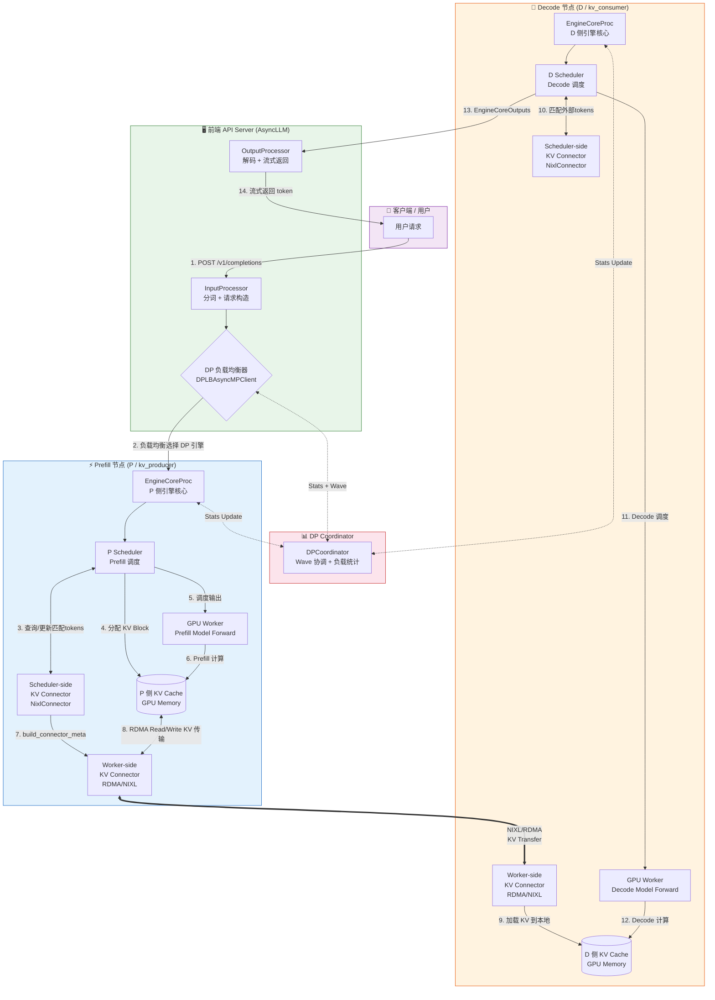
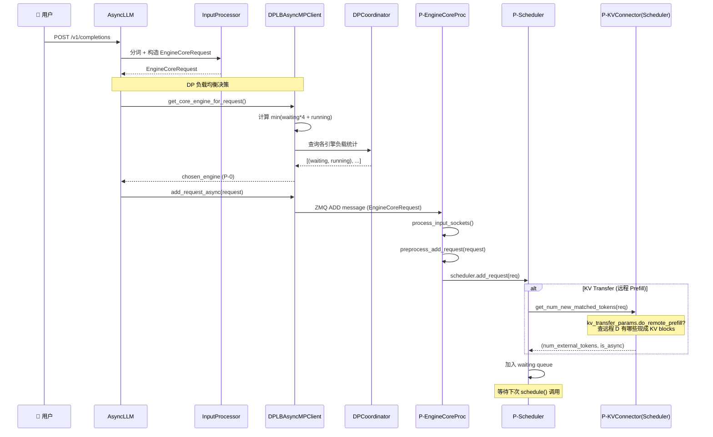
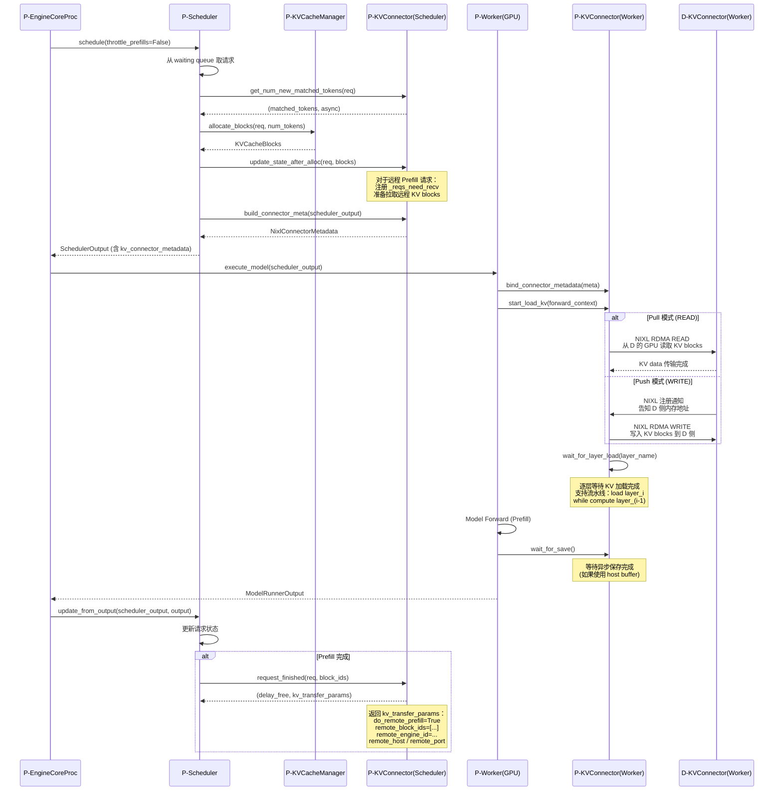
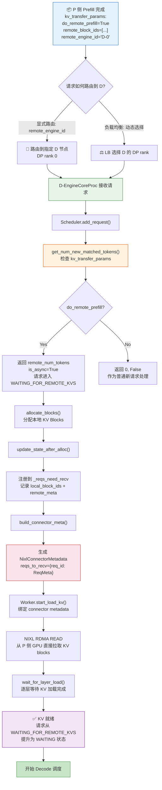
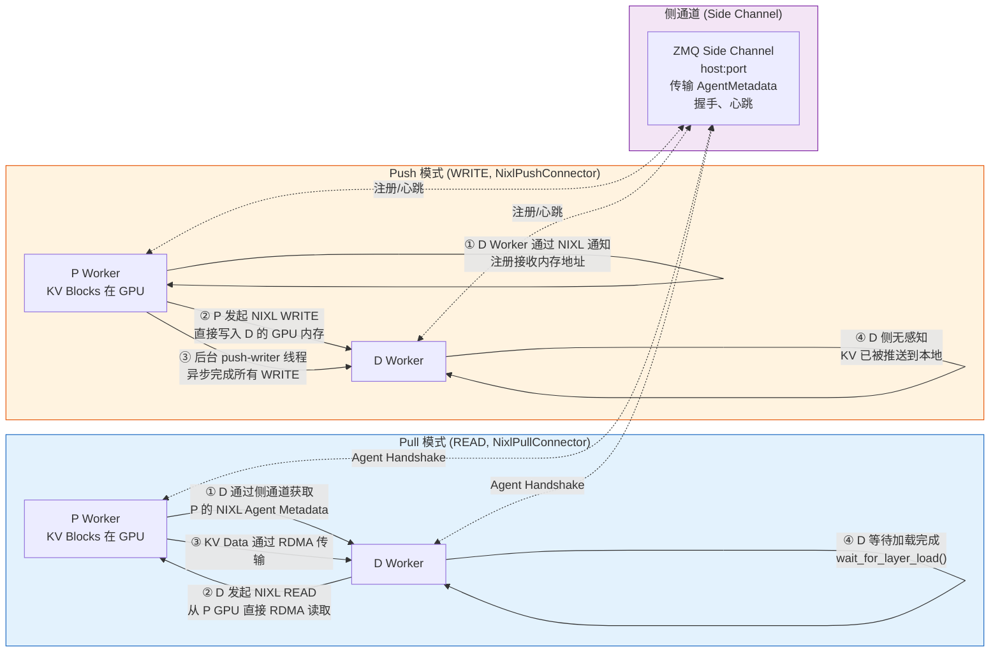
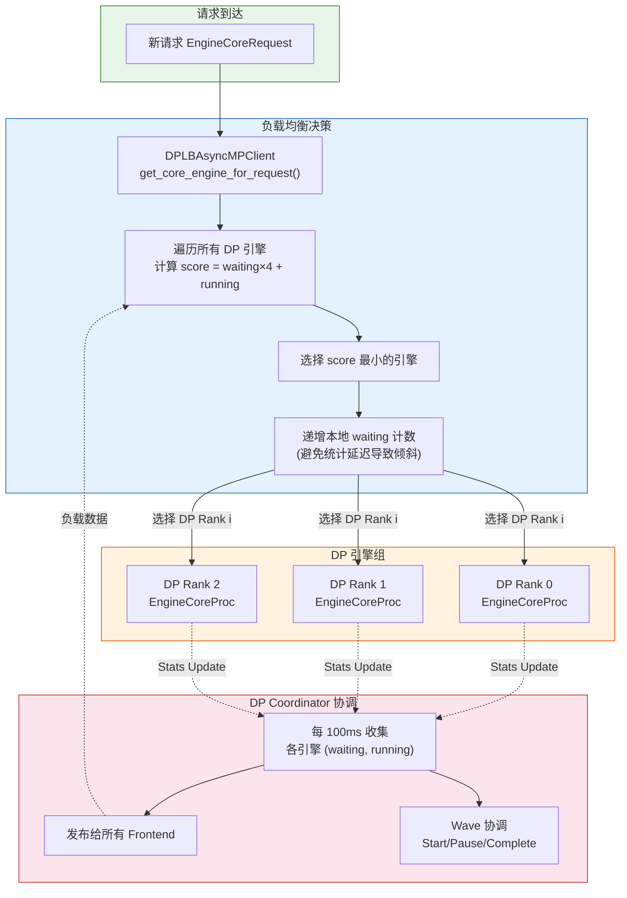
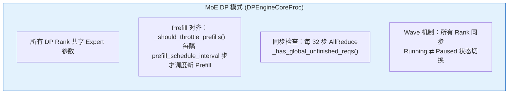
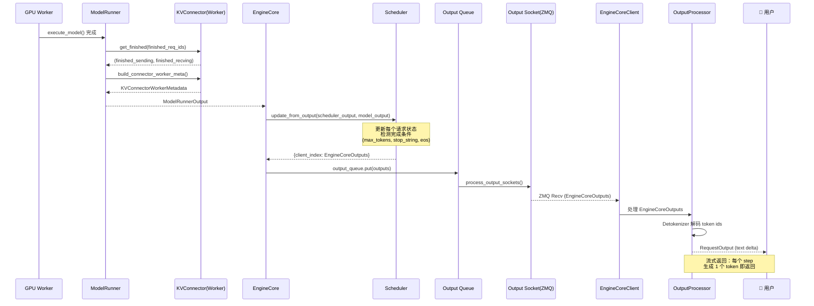
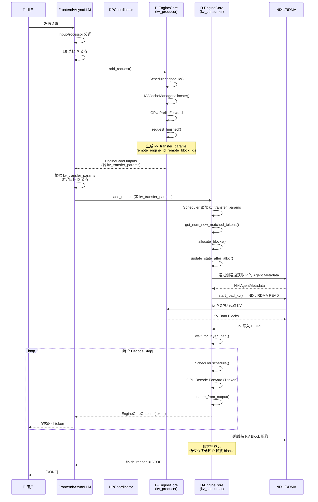

# PD 分离架构详解

> 基于 vLLM v0.20.0 源码分析，覆盖请求入口、调度、P/D DP 选择、KV 传输、响应返回全链路。

---

## 一、宏观架构概览



---

## 二、请求入口到 P 节点调度



---

## 三、P 侧 Prefill 调度与 KV 传输



---

## 四、D 侧如何被选择并接收 KV



---

## 五、KV 传输协议详解 (NIXL Pull vs Push)



### NixlAgentMetadata 握手数据

```
NixlAgentMetadata:
├── engine_id: str              # 引擎唯一标识
├── agent_metadata: bytes       # NIXL Agent 注册信息
├── kv_caches_base_addr: [int]  # KV Cache GPU 基地址
├── device_id: int              # GPU 设备号
├── num_blocks: int             # Block 总数
├── block_lens: [int]           # 每个 Block 大小
├── kv_cache_layout: str        # HND / NHD 布局
├── block_size: int             # Block Size
└── physical_blocks_per_logical_kv_block: int  # 物理/逻辑块比例
```

---

## 六、DP 选择机制详解

### P 侧 DP 选择（Prefill 阶段）



### D 侧 DP 选择（Decode 阶段）

D 侧节点的选择有两种方式：

1. **显式指定**：P 完成 Prefill 后，`kv_transfer_params` 中携带目标 D 的 `remote_engine_id`，直接路由到该 D 引擎
2. **负载均衡**：如果是新 Decode 请求（没有关联的 P），由 `DPLBAsyncMPClient` 使用同样算法动态选择

### MoE 模型 Expert Parallel (EP) 的特殊处理



---

## 七、响应返回全链路



---

## 八、完整生命周期时序图



---

## 九、关键源码索引

| 模块 | 文件 | 核心职责 |
|------|------|---------|
| **KV Transfer 配置** | `config/kv_transfer.py` | `kv_role`, `kv_connector`, `engine_id` 等配置 |
| **KV Connector 基类** | `distributed/kv_transfer/kv_connector/v1/base.py` | `KVConnectorBase_V1` — Scheduler/Worker 两侧接口定义 |
| **KV Connector 工厂** | `distributed/kv_transfer/kv_connector/factory.py` | `KVConnectorFactory` — 动态注册/加载 Connector |
| **NIXL Connector** | `distributed/kv_transfer/kv_connector/v1/nixl/connector.py` | Pull/Push 两种模式的外观类 |
| **NIXL Scheduler** | `distributed/kv_transfer/kv_connector/v1/nixl/pull_scheduler.py` | Pull 模式 Scheduler 侧逻辑 |
| **NIXL Worker** | `distributed/kv_transfer/kv_connector/v1/nixl/pull_worker.py` | Pull 模式 Worker 侧 RDMA 读写 |
| **NIXL Metadata** | `distributed/kv_transfer/kv_connector/v1/nixl/metadata.py` | `NixlConnectorMetadata`, `NixlAgentMetadata` |
| **Scheduler 接口** | `v1/core/sched/interface.py` | `SchedulerInterface` — KV Connector 集成点 |
| **Scheduler 实现** | `v1/core/sched/scheduler.py` | 完整调度逻辑，KV Connector 初始化和调用 |
| **EngineCore** | `v1/engine/core.py` | 引擎主循环，DP 引擎变体 `DPEngineCoreProc` |
| **EngineCoreClient** | `v1/engine/core_client.py` | `DPLBAsyncMPClient` — DP 负载均衡选择逻辑 |
| **DP Coordinator** | `v1/engine/coordinator.py` | Wave 协调、负载统计收集发布 |
| **Worker KV Mixin** | `v1/worker/kv_connector_model_runner_mixin.py` | Worker 侧 KV Connector 生命周期管理 |
| **KV Transfer State** | `distributed/kv_transfer/kv_transfer_state.py` | 全局 KV Connector 实例管理 |

---

## 十、核心数据流总结

```mermaid
flowchart LR
    subgraph P_SIDE["⚡ Prefill 侧 (kv_producer)"]
        A["① 请求到达"] --> B["② Prefill 调度"]
        B --> C["③ GPU Prefill Forward"]
        C --> D["④ request_finished()<br/>生成 kv_transfer_params"]
    end

    subgraph TRANSIT["🔀 KV 传输"]
        D --> E["⑤ kv_transfer_params<br/>传给 Client/Frontend"]
        E --> F["⑥ Client 路由到 D 节点"]
        F --> G["⑦ Scheduler 读取 params"]
        G --> H["⑧ update_state_after_alloc()<br/>注册 _reqs_need_recv"]
        H --> I["⑨ build_connector_meta()"]
        I --> J["⑩ start_load_kv()<br/>NIXL RDMA READ/WRITE"]
    end

    subgraph D_SIDE["🔄 Decode 侧 (kv_consumer)"]
        J --> K["⑪ wait_for_layer_load()"]
        K --> L["⑫ GPU Decode Forward"]
        L --> M["⑬ update_from_output()<br/>生成 EngineCoreOutputs"]
        M --> N["⑭ OutputProcessor<br/>解码返回用户"]
    end

    style P_SIDE fill:#e3f2fd,stroke:#1565c0
    style TRANSIT fill:#fff3e0,stroke:#e65100
    style D_SIDE fill:#e8f5e9,stroke:#2e7d32
```



> **关键设计原则**：
> 1. **P/D 分离**：Prefill 是高计算量（O(n²)）一次处理全部 prompt tokens；Decode 是低计算量（O(n)）逐个生成 token。分离后可以独立扩缩容。
> 2. **KV Connector 抽象**：Scheduler 侧管理元数据和调度决策，Worker 侧执行实际的 KV 传输（RDMA/NIXL/Mooncake 等）。
> 3. **异步传输**：KV 加载可以与 Model Forward 流水线化（`start_load_kv` → `wait_for_layer_load`），隐藏网络延迟。
> 4. **DP 负载均衡**：通过 `DPCoordinator` 实时收集各引擎负载，`DPLBAsyncMPClient` 基于 `waiting×4 + running` 打分选择最优引擎。
> 5. **MoE EP 特殊处理**：DPEngineCoreProc 增加了 Prefill 对齐（`prefill_schedule_interval`）和 Wave 同步（AllReduce）机制。
