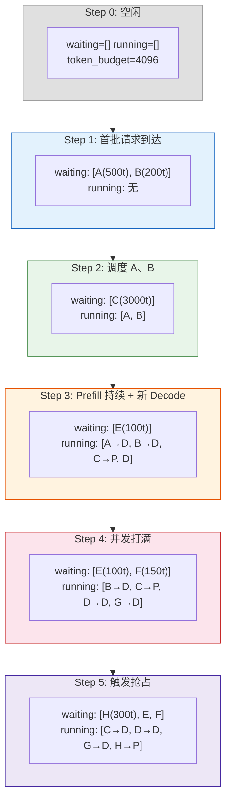

# Batch 组批全流程详解

> 以时间线方式展示请求不断到达时，vLLM Scheduler 如何逐步组 Batch。

---

## 一、假设条件

```
配置:
  max_num_scheduled_tokens = 4096   (每步 token 预算)
  max_num_seqs             = 4      (最大并发请求数)
  long_prefill_token_threshold = 2048
  block_size               = 16
  enable_chunked_prefill   = True
  enable_prefix_caching    = True

GPU KV Cache: 共 10 个 Block (可容纳 160 tokens)
```

---

## 二、Step 时间线全景



---

## 三、逐 Step 详解

### Step 0 — 初始状态

```
┌─────────────────────────────────────────────────────────┐
│                    EngineCore Step 0                     │
├──────────────┬──────────────┬────────────────────────────┤
│   Waiting    │   Running    │      KV Cache (10 blocks)  │
│   []         │   []         │  ░░░░░░░░░░░░░░░░░░░░░░░░  │
├──────────────┴──────────────┴────────────────────────────┤
│  schedule(): token_budget=4096, 无请求, 返回空 batch       │
└─────────────────────────────────────────────────────────┘
```

---

### Step 1 — 请求到达

```
┌─────────────────────────────────────────────────────────┐
│  API Server 发来 2 个请求:                                │
│                                                         │
│    req_A: prompt=500 tokens                              │
│    req_B: prompt=200 tokens                              │
│                                                         │
│  Scheduler.add_request():                                │
│    → 查 PrefixCache: 无命中                               │
│    → 进入 waiting 队列 (FCFS): [A, B]                     │
├──────────────┬──────────────┬────────────────────────────┤
│   Waiting    │   Running    │      KV Cache (10 blocks)  │
│   [A(500t)   │   []         │  ░░░░░░░░░░░░░░░░░░░░░░░░  │
│    B(200t)]  │              │                            │
└──────────────┴──────────────┴────────────────────────────┘
```

---

### Step 2 — 首次调度，A 和 B 入 Batch

```
调度过程:
  ┌─ 阶段一: running 队列为空, 跳过 ─────────────────────┐
  │                                                    │
  └────────────────────────────────────────────────────┘

  ┌─ 阶段二: 调度 waiting 队列 ─────────────────────────┐
  │                                                    │
  │  req_A (500t):                                     │
  │    → 无 prefix cache 命中                          │
  │    → num_new = 500, 但 > long_threshold(2048)? NO  │
  │    → clip 到 token_budget: min(500, 4096) = 500    │
  │    → allocate_slots(500t): 500/16 = 32 blocks      │
  │      ⚠️ 超过 10 blocks! 分配失败!                   │
  │    → enable_chunked_prefill: num_new = min(        │
  │        500, token_budget, 可分配的最高 token 数)     │
  │      → 实际分配 160 tokens (10 blocks)              │
  │      → token_budget: 4096 → 3936                   │
  │      → 加入 running, status=RUNNING                │
  │                                                    │
  │  req_B (200t):                                     │
  │    → num_new = 200                                 │
  │    → clip: min(200, 3936, 2048) = 200              │
  │    → allocate_slots(200t): ⚠️ 0 blocks 剩余!        │
  │    → 分配失败, break (停止取新请求)                   │
  │                                                    │
  └────────────────────────────────────────────────────┘

  此时 API Server 又发来请求:
    req_C: prompt=3000 tokens

  状态变迁:
    A: WAITING → RUNNING (prefill chunk 160/500)
    B: WAITING → PREEMPTED (KV Cache 不足, 回到 waiting)

┌──────────────┬──────────────┬────────────────────────────┐
│   Waiting    │   Running    │      KV Cache (10 blocks)  │
│   [B(200t)   │   [A(160/500 │  ██████████████████████████ │
│    C(3000t)] │    P)]       │  全部占用                   │
└──────────────┴──────────────┴────────────────────────────┘

本次 batch:
  ┌──────────────────────────────────────────────────────┐
  │  scheduled_new:    [A]           (新入 running)       │
  │  scheduled_cached: []                                │
  │  total_tokens:     160                               │
  │  preempted:        [B]           (KV 不足被抢)        │
  └──────────────────────────────────────────────────────┘
```

---

### Step 3 — A 完成首段 Prefill，释放部分 blocks

```
A 完成第一个 chunk (160 tokens):
  → num_computed: 0+160=160
  → 仍处于 prefill 中 (160 < 500), 保留在 running

调度过程:
  ┌─ 阶段一: 调度 running ──────────────────────────────┐
  │                                                    │
  │  req_A (160/500, prefill 中):                      │
  │    → num_new = 500-160 = 340                       │
  │    → clip: min(340, 4096, 2048) = 340              │
  │    → allocate_slots(340): 需要 22 blocks            │
  │    → 可用: 10 blocks - A 自身已用 = 重新分配         │
  │    → 实际上 A 是追加分配 180 tokens (新 block)       │
  │    → token_budget: 4096 → 3916                     │
  │                                                    │
  └────────────────────────────────────────────────────┘

  ┌─ 阶段二: 调度 waiting ──────────────────────────────┐
  │                                                    │
  │  req_B (200t, 之前被抢占):                          │
  │    → num_new = 200                                 │
  │    → allocate_slots(200): 需要 13 blocks, 不够!     │
  │    → skip                                           │
  │                                                    │
  │  req_C (3000t):                                    │
  │    → num_new = 3000                                │
  │    → clip: min(3000, 3916, 2048) = 2048            │
  │    → allocate_slots(2048): 不够!                    │
  │    → 尝试分配更少... 仍然不够 (A 占了部分 blocks)    │
  │    → skip                                           │
  │                                                    │
  └────────────────────────────────────────────────────┘

  此时到达短请求:
    req_D: prompt=10 tokens (几乎瞬时完成)

┌──────────────┬──────────────┬────────────────────────────┐
│   Waiting    │   Running    │      KV Cache              │
│   [B(200t)   │   [A(340/500 │  ████████████░░░░░░░░░░░░  │
│    C(3000t)  │    P)]       │  A 占用 ~50%               │
│    D(10t)]   │              │                            │
└──────────────┴──────────────┴────────────────────────────┘

本次 batch:
  scheduled_cached: [A] (340t, 继续 prefill)
  scheduled_new:    []   (KV 不足, 无新请求入 batch)
  total_tokens:     340
```

---

### Step 4 — A 完成 Prefill，batch 腾出空间

```
A 在 Step 3 计算到 340 tokens 后:
  → num_computed: 160+340 = 500 ✓ Prefill 完成!
  → 变成 Decode 模式: 下步只需 1 token

调度过程:
  ┌─ 阶段一: 调度 running ──────────────────────────────┐
  │                                                    │
  │  req_A (500/500, 转为 Decode):                      │
  │    → num_new = 1 (下一个 token)                     │
  │    → allocate_slots(1): 追加 1 tokens 的 blocks     │
  │    → token_budget: 4096 → 4095                     │
  │                                                    │
  └────────────────────────────────────────────────────┘

  ┌─ 阶段二: 调度 waiting ──────────────────────────────┐
  │                                                    │
  │  req_B (200t):                                     │
  │    → num_new = 200                                 │
  │    → allocate_slots(200): 成功!                    │
  │    → token_budget: 4095 → 3895                     │
  │    → status = RUNNING, 加入 running                │
  │                                                    │
  │  req_C (3000t):                                    │
  │    → num_new = 3000                                │
  │    → clip: min(3000, 3895, 2048) = 2048            │
  │    → allocate_slots(2048): 空间不够!                │
  │    → skip                                           │
  │                                                    │
  │  req_D (10t):                                      │
  │    → num_new = 10                                  │
  │    → allocate_slots(10): 成功!                     │
  │    → token_budget: 3895 → 3885                     │
  │    → status = RUNNING, 加入 running                │
  │                                                    │
  └────────────────────────────────────────────────────┘

┌──────────────┬──────────────┬────────────────────────────┐
│   Waiting    │   Running    │      KV Cache              │
│   [C(3000t)] │   [A(1t D)   │  ██████████████████████████ │
│              │    B(200t P) │  接近满                     │
│              │    D(10t P)] │                            │
└──────────────┴──────────────┴────────────────────────────┘

本次 batch:
  scheduled_cached: [A] (1t, Decode)
  scheduled_new:    [B] (200t, Prefill), [D] (10t, Prefill)
  total_tokens:     211
```

---

### Step 5 — D 完成, B 完成首段, C 仍然等待

```
Step 4 执行结果:
  A: Decode 1 token, 仍需继续 → 仍 running
  B: Prefill 200t, 200/200 ✓ → 转为 Decode
  D: Prefill 10t, 10/10 ✓ → Finished!

调度过程:
  ┌─ 阶段一: 调度 running ──────────────────────────────┐
  │                                                    │
  │  req_A (继续 Decode): num_new=1                    │
  │    → token_budget: 4096 → 4095                     │
  │                                                    │
  │  req_B (转 Decode): num_new=1                      │
  │    → token_budget: 4095 → 4094                     │
  │                                                    │
  │  req_D (在 Step 4 已 FINISHED):                     │
  │    → 从 running 移除                                │
  │    → 释放 KV blocks (约 1 个 block)                  │
  │                                                    │
  └────────────────────────────────────────────────────┘

  ┌─ 阶段二: 调度 waiting ──────────────────────────────┐
  │                                                    │
  │  req_C (3000t):                                    │
  │    → num_new = 3000                                │
  │    → clip: min(3000, 4094, 2048) = 2048            │
  │    → allocate_slots(2048): 成功了! (D 释放了空间)   │
  │    → token_budget: 4094 → 2046                     │
  │    → 加入 running                                  │
  │                                                    │
  └────────────────────────────────────────────────────┘

  此时又到达:
    req_E: prompt=100 tokens

┌──────────────┬──────────────┬────────────────────────────┐
│   Waiting    │   Running    │      KV Cache              │
│   [E(100t)]  │   [A(1t D)   │  ██████████████████████████ │
│              │    B(1t D)   │  几乎满                     │
│              │    C(2048 P)]│                            │
└──────────────┴──────────────┴────────────────────────────┘

本次 batch:
  scheduled_cached: [A] (1t), [B] (1t)
  scheduled_new:    [C] (2048t, chunked prefill)
  finished:         [D]
  total_tokens:     2050
```

---

### Step 6 — C 的 Prefill 持续, E 入列

```
Step 5 执行结果:
  A: Decode 1 token (已达到 max_tokens?) → FINISHED
  B: Decode 1 token → 仍 running
  C: Prefill 2048t, 仍有 952t 剩余

调度:
  ┌─ 阶段一: running ──────────────────────────────────┐
  │  A: 已 FINISHED, 释放 blocks                        │
  │  B: num_new=1 → budget=4095                        │
  │  C: num_new=952 (剩余 prefill)                     │
  │    → clip: min(952, 4095, 2048)=952                │
  │    → token_budget: 4095 → 3143                     │
  └────────────────────────────────────────────────────┘

  ┌─ 阶段二: waiting ──────────────────────────────────┐
  │  req_E (100t):                                     │
  │    → allocate_slots(100): 成功! (A 释放了空间)      │
  │    → token_budget: 3143 → 3043                     │
  │    → 加入 running                                  │
  └────────────────────────────────────────────────────┘

  又到达:
    req_F: prompt=150 tokens
    req_G: prompt=4000 tokens

┌──────────────┬──────────────┬────────────────────────────┐
│   Waiting    │   Running    │      KV Cache              │
│   [F(150t)   │   [B(1t D)   │  ██████████████████████████ │
│    G(4000t)] │    C(952t P) │                            │
│              │    E(100t P)]│                            │
└──────────────┴──────────────┴────────────────────────────┘

本次 batch:
  scheduled_cached: [B] (1t), [C] (952t)
  scheduled_new:    [E] (100t)
  finished:         [A]
  total_tokens:     1053
```

---

### Step 7 — E 完成, 并发数打满

```
Step 6 执行结果:
  B: Decode 1 token → 完成!
  C: Prefill 952t → Prefill 完成, 转 Decode
  E: Prefill 100t → 全部完成 (100/100)

调度:
  ┌─ 阶段一: running ──────────────────────────────────┐
  │  B: 已 FINISHED                                    │
  │  C: num_new=1 (转 Decode) → budget=4095            │
  │  E: 已 FINISHED                                    │
  └────────────────────────────────────────────────────┘

  ┌─ 阶段二: waiting ──────────────────────────────────┐
  │                                                    │
  │  req_F (150t):                                     │
  │    → allocate(150): 成功 → budget=3945              │
  │    → 加入 running                                  │
  │                                                    │
  │  req_G (4000t):                                    │
  │    → num_new=4000                                  │
  │    → clip: min(4000, 3945, 2048)=2048              │
  │    → allocate(2048): 成功! → budget=1897            │
  │    → 加入 running                                  │
  │                                                    │
  └────────────────────────────────────────────────────┘

  又到达:
    req_H: prompt=200 tokens

┌──────────────┬──────────────┬────────────────────────────┐
│   Waiting    │   Running    │      KV Cache              │
│   [H(200t)]  │   [C(1t D)   │  ██████████████████████████ │
│              │    F(150t P) │  ⚠️ 已满!                   │
│              │    G(2048 P)]│                            │
└──────────────┴──────────────┴────────────────────────────┘

本次 batch:
  scheduled_cached: [C] (1t)
  scheduled_new:    [F] (150t), [G] (2048t)
  finished:         [B, E]
  total_tokens:     2199
```

---

### Step 8 — KV Cache 满, 抢占发生！F 被抢占，H 也无空间

```
Step 7 执行结果:
  C: Decode 1 token
  F: Prefill 150/150 → 转 Decode
  G: Prefill 2048t, 剩余 1952t

调度:
  ┌─ 阶段一: running ──────────────────────────────────┐
  │  C: num_new=1 → budget=4095                        │
  │  F: num_new=1 (转 Decode) → budget=4094            │
  │  G: num_new=1952                                   │
  │    → clip: min(1952, 4094, 2048)=1952              │
  │    → allocate(1952): ⚠️ 空间不够!                   │
  │    → 抢占! FCFS 模式: 抢占 running 末尾 → G 在末尾?  │
  │      running = [C, F, G], 末尾是 G                  │
  │      → 不能抢占自己, running.pop() 弹出 F           │
  │    → F 被抢占 → PREEMPTED → 放回 waiting 队首       │
  │    → allocate(1952): 再次尝试... 仍然不够!          │
  │    → running.pop() 弹出 C?                          │
  │      → 不, 抢占需要释放足够的 blocks                 │
  │      → 最终释放 F 后成功分配 G                      │
  │    → token_budget: 4094 → 2142                     │
  └────────────────────────────────────────────────────┘

  ┌─ 阶段二: waiting ──────────────────────────────────┐
  │                                                    │
  │  req_F (200t, PREEMPTED 回到队首):                  │
  │    → num_computed 重置为 0, 从头 Prefill            │
  │    → num_new=200                                   │
  │    → allocate(200): KV Cache 不够! (G 占满了)       │
  │    → break, 停止取新请求                            │
  │                                                    │
  │  req_H (200t):                                     │
  │    → 还没轮到, waiting 队列阻塞                     │
  │                                                    │
  └────────────────────────────────────────────────────┘

  又到达:
    req_I: prompt=50 tokens

┌──────────────┬──────────────┬────────────────────────────┐
│   Waiting    │   Running    │      KV Cache              │
│   [F(200tP*) │   [C(1t D)   │  ██████████████████████████ │
│    H(200t)   │    G(1952 P)]│  ⚠️ 只剩 C 和 G            │
│    I(50t)]   │              │                            │
└──────────────┴──────────────┴────────────────────────────┘

  * F: PREEMPTED 状态, 从头重算

本次 batch:
  scheduled_cached: [C] (1t), [G] (1952t)
  preempted:        [F]
  total_tokens:     1953
```

---

### Step 9 — G 完成 Prefill, 空间释放, F 重新入 Batch

```
Step 8 执行结果:
  C: Decode 1 token → 仍在运行 (未达 max_tokens)
  G: Prefill 1952t → 4000/4000 ✓ Prefill 完成! → 转 Decode

G 完成 Prefill 后释放了大量 blocks (chunked prefill 期间占用的)

调度:
  ┌─ 阶段一: running ──────────────────────────────────┐
  │  C: num_new=1 → budget=4095                        │
  │  G: num_new=1 (转 Decode) → budget=4094            │
  │  (之前被占的大量 prefill blocks 已释放)              │
  └────────────────────────────────────────────────────┘

  ┌─ 阶段二: waiting ──────────────────────────────────┐
  │                                                    │
  │  req_F (200t, PREEMPTED → 重新调度):                │
  │    → num_new=200                                   │
  │    → allocate(200): 成功! (G 释放了大量空间)         │
  │    → budget: 4094 → 3894                           │
  │    → status=RUNNING (重新 Prefill)                 │
  │                                                    │
  │  req_H (200t):                                     │
  │    → num_new=200                                   │
  │    → allocate(200): 成功!  → budget=3694            │
  │    → 加入 running                                  │
  │                                                    │
  │  req_I (50t):                                      │
  │    → num_new=50                                    │
  │    → allocate(50): 成功!  → budget=3644             │
  │    → 加入 running                                  │
  │                                                    │
  └────────────────────────────────────────────────────┘

  此时并发数: C, G, F, H, I = 5 个
  → 超过 max_num_seqs=4!
  → waiting 队列中 I(50t) 需要等某个 running 完成后才能入列

┌──────────────┬──────────────┬────────────────────────────┐
│   Waiting    │   Running    │      KV Cache              │
│   [I(50t)]   │   [C(1t D)   │  ██████████████████░░░░░░  │
│              │    G(1t D)   │                            │
│              │    F(200t P) │                            │
│              │    H(200t P)]│                            │
└──────────────┴──────────────┴────────────────────────────┘

本次 batch:
  scheduled_cached: [C] (1t), [G] (1t)
  scheduled_new:    [F] (200t), [H] (200t)
  (I 无法入列: max_num_seqs=4 已达上限)
  total_tokens:     402
```

---

### Step 10 — 稳态运行

```
Step 9 执行结果:
  C: Decode 1 token → 仍在运行
  G: Decode 1 token → 仍在运行
  F: Prefill 200/200 ✓ → 转 Decode
  H: Prefill 200/200 ✓ → 转 Decode

调度:
  ┌─ 阶段一: running ──────────────────────────────────┐
  │  全部 1 token Decode: budget=4096-4=4092           │
  └────────────────────────────────────────────────────┘

  C 达到 max_tokens=100 → FINISHED! 释放 blocks

  ┌─ 阶段二: waiting ──────────────────────────────────┐
  │  C 释放后: num_running=3 < max_num_seqs=4          │
  │  req_I (50t):                                      │
  │    → allocate(50): 成功  → budget=4042              │
  │    → 加入 running                                  │
  └────────────────────────────────────────────────────┘

┌──────────────┬──────────────┬────────────────────────────┐
│   Waiting    │   Running    │      KV Cache              │
│   []         │   [G(1t D)   │  ████████████░░░░░░░░░░░░  │
│              │    F(1t D)   │  约 60% 占用                │
│              │    H(1t D)   │                            │
│              │    I(50t P)] │                            │
└──────────────┴──────────────┴────────────────────────────┘

本次 batch:
  scheduled_cached: [G] (1t), [F] (1t), [H] (1t)
  scheduled_new:    [I] (50t)
  finished:         [C]
  total_tokens:     53

→ 系统进入稳态: 大部分请求是 Decode (每步 1 token)
```

---

## 四、全景时间线汇总

```mermaid
gantt
    title 请求生命周期与 Batch 组成
    dateFormat X
    axisFormat %s

    section req_A
    WAITING      :a1, 0, 1
    Prefill chunk1: a2, 1, 2
    Prefill chunk2: a3, 2, 4
    Decode       :a4, 4, 9
    FINISHED     :milestone, a5, 9, 0

    section req_B
    WAITING      :b1, 0, 1
    PREEMPTED    :b2, 1, 2
    WAITING      :b3, 2, 5
    Prefill      :b4, 5, 6
    Decode       :b5, 6, 9
    FINISHED     :milestone, b6, 9, 0

    section req_C
    WAITING      :c1, 1, 5
    Prefill chk1 :c2, 5, 7
    Prefill chk2 :c3, 7, 10
    Decode       :c4, 10, 13
    FINISHED     :milestone, c5, 13, 0

    section req_D
    WAITING      :d1, 3, 5
    Prefill+Fin  :d2, 5, 6
    FINISHED     :milestone, d3, 6, 0

    section req_F
    WAITING      :f1, 4, 8
    Prefill      :f2, 8, 9
    PREEMPTED    :f3, 9, 10
    WAITING      :f4, 10, 11
    Prefill+Dec  :f5, 11, 14
```



---

## 五、核心规律总结

### 5.1 Batch 组成的动态平衡

```
                     Prefill 多 (token 重)          Decode 多 (并发高)
                          │                              │
  ┌───────────────────────┼──────────────────────────────┼───────────────────┐
  │ Step 2:  A(160t P)    │ Step 5: A(1t D) B(1t D)     │ Step 10: G(1t D)  │
  │          (1个请求)     │         C(2048t P)           │          F(1t D)  │
  │                       │         (1P + 2D)            │          H(1t D)  │
  │  total: 160 tokens    │  total: 2050 tokens          │          I(50t P) │
  │                       │                              │  total: 53 tokens │
  └───────────────────────┴──────────────────────────────┴───────────────────┘
```

### 5.2 三条铁律

```
① Token Budget 决定「每步能干多少活」
   → Prefill 大请求会被 chunked, 保证 Decode 不被饿死

② KV Cache 决定「能同时服务多少请求」
   → 满了就抢占, 被抢占的从头重算

③ max_num_seqs 决定「最多同时跟几个请求」
   → Decode 轻量但占 slot, 满了新请求排队等
```

### 5.3 抢占的代价

```
F 被抢占时:
  已计算: 200/200 tokens Prefill ✓ (浪费!)
  抢占后: num_computed_tokens → 0, 重新 Prefill
  KV blocks: 全部释放, 重新分配
  
  → 浪费了 200 tokens 的计算量
  → 这也是为什么 KV Cache 容量配置非常关键
```

### 5.4 PD 分离场景下的额外路径

```
普通模式:
  WAITING → (prefix cache 命中) → RUNNING

PD 分离的 D 侧:
  WAITING → get_num_new_matched_tokens() → 有远程 KV?
    ├── Yes → WAITING_FOR_REMOTE_KVS (不消耗 token budget)
    │         → (异步 RDMA 加载) → WAITING → RUNNING
    └── No  → 正常路径
```
