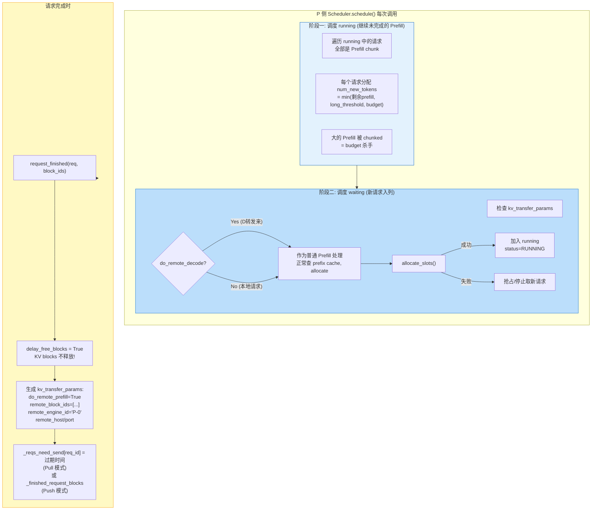
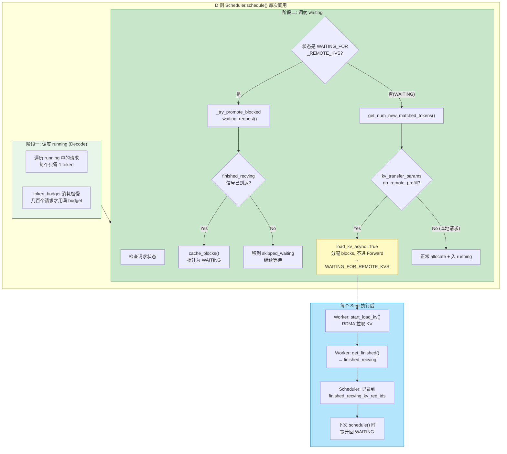
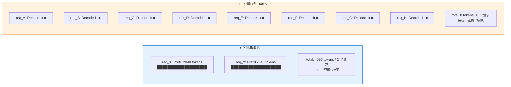
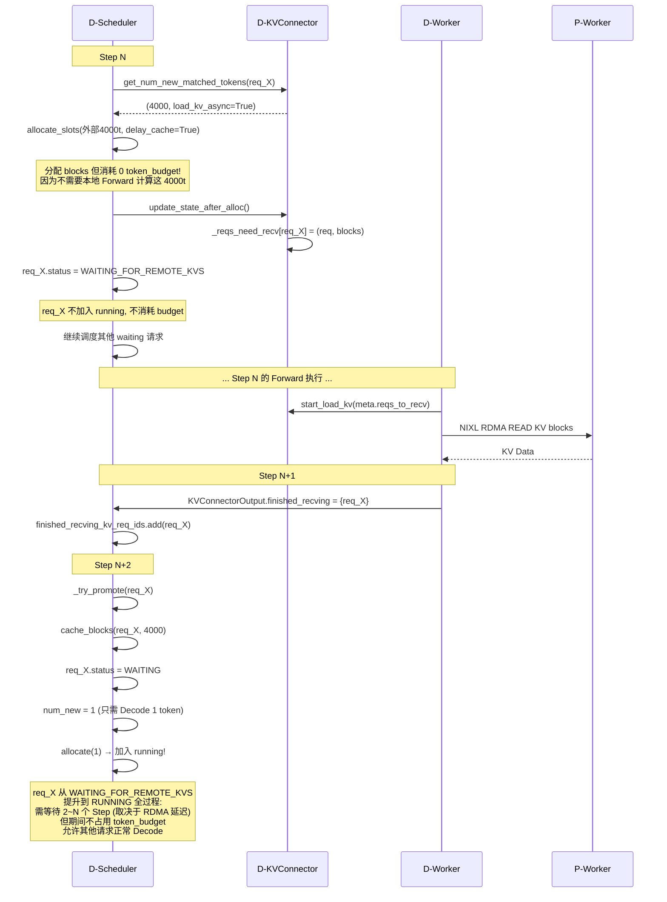

# PD 分离组 Batch 全流程

> P 和 D 各自独立调度，通过 `kv_transfer_params` + `KVConnector` 协调。两者 Batch 特征截然不同。

---

## 一、P/D 双视角并行时间线

```
配置:
  P 节点: max_scheduled_tokens=8192, max_seqs=4
  D 节点: max_scheduled_tokens=512,  max_seqs=8
  KV 传输: NixlPullConnector (RDMA READ)

请求流:
  req_X: prompt=4000t → 先到 P 做 Prefill, 再转发到 D 做 Decode
  req_Y: prompt=3000t → 同上
  req_Z: prompt=10t   → 同上
```

```
时间 ─────────────────────────────────────────────────────────────────────►

P 侧 (kv_producer)
┌──────────────────────────────────────────────────────────────────────────┐
│ Step P0          Step P1          Step P2          Step P3              │
│                                                                          │
│ waiting:[]       waiting:[Y,Z]    waiting:[Z]       waiting:[]           │
│ running:[]       running:[X]      running:[X,Y]     running:[]          │
│                  X:prefill 1024t  X:prefill 2976t                       │
│ batch: 空         batch: [X]       Y:prefill 1024t   batch: 空           │
│                  tokens:1024      batch:[X,Y]                            │
│                                   tokens:4000                            │
│                                                                          │
│ 收到 X(4000t)    收到 Y(3000t)    X:prefill完成!    Y:prefill完成!       │
│ 入 waiting       入 waiting       → request_finished → request_finished  │
│                                   → kv_transfer_    → kv_transfer_       │
│                                     params 返回       params 返回        │
│                                     给 API Server      给 API Server     │
└──────────────────────────────────────────────────────────────────────────┘
         │                │                │                │
         │   kv_transfer  │                │   X 的 KV     │   Y 的 KV
         │   _params      │                │   blocks 就绪  │   blocks 就绪
         ▼                ▼                ▼                ▼
┌──────────────────────────────────────────────────────────────────────────┐
│ Step D0          Step D1          Step D2          Step D3              │
│                                                                          │
│ waiting:[]       waiting:[X]      waiting:[]       waiting:[Y]           │
│ skipped:[]       skipped:[]       skipped:[]       skipped:[]           │
│ running:[]       running:[Z]      running:[X,Z]    running:[X,Y,Z]      │
│                                  X:1t Decode      X:1t Decode            │
│ batch: 空         batch:[Z]       batch:[X,Z]      Y:1t Decode           │
│                  Z:prefill 10t   Z:1t Decode       Z:1t Decode           │
│                  tokens:10       tokens:2           batch:[X,Y,Z]        │
│                                                    tokens:3              │
│                                                                          │
│ 收到 Z(10t)      收到 X(kv_trans  X:KV加载完成     收到 Y(kv_trans       │
│ (本地请求)       fer_params)     → finished_       fer_params)           │
│ 入 waiting       → 识别为远程     recving          → 识别为远程           │
│                   Prefill        → 提升→WAITING    Prefill               │
│                  → WAITING_FOR   → 正常入batch    → WAITING_FOR          │
│                    _REMOTE_KVS                     _REMOTE_KVS           │
│                  Z:prefill完成!                    → (下步加载)           │
└──────────────────────────────────────────────────────────────────────────┘
```

---

## 二、P 侧 Batch 详解

P 侧的 batch 特征是 **token 量大、请求数少**。



**P 侧 batch 示例（Step P2 时刻）：**

```
┌────────────────────────────────────────────────────────────┐
│ P 侧 Step P2                                               │
├────────────────────────────────────────────────────────────┤
│                                                            │
│  running (调度前): [X(1024/4000), Y(0/3000)]               │
│                                                            │
│  阶段一:                                                   │
│    X: num_new = 4000-1024 = 2976                          │
│       clip: min(2976, 8192, 2048) = 2048                  │
│       allocate(2048): 成功 → budget = 8192-2048 = 6144    │
│                                                            │
│    Y: num_new = 3000 (全新开始)                            │
│       clip: min(3000, 6144, 2048) = 2048                  │
│       allocate(2048): 成功 → budget = 6144-2048 = 4096    │
│                                                            │
│  scheduled: [X(2048t P), Y(2048t P)]                      │
│  total_tokens: 4096                                        │
│  batch_size: 2 个请求                                      │
│                                                            │
│  对比 D 侧同 step:                                          │
│    D 侧 total_tokens: ~2-3 (多个 Decode 请求各 1 token)    │
│    D 侧 batch_size: 可能 8 个 (max_seqs=8)                 │
└────────────────────────────────────────────────────────────┘
```

**P 侧 batch 特点：**

| 特征 | 值 | 原因 |
|------|-----|------|
| 每步 token 量 | 大 (1024~4096) | Prefill 是计算密集型 |
| 并发请求数 | 少 (1~4) | Token budget 被少数大请求吃满 |
| 请求类型 | 几乎全是 Prefill chunk | P 的职责就是做 Prefill |
| KV 来源 | 本地计算 | P 自己计算 KV, 不需要拉取 |
| 请求完成时 | blocks 不释放 | 等待 D 侧 RDMA 读取 |
| `connector` 操作 | `request_finished()` 时注册 send | 准备被 D 拉取 |

---

## 三、D 侧 Batch 详解

D 侧的 batch 特征是 **token 量小、并发数高、有异步 KV 加载中间态**。



**D 侧 batch 示例（Step D2 时刻 —— X 的 KV 刚加载完）：**

```
┌────────────────────────────────────────────────────────────┐
│ D 侧 Step D2                                               │
├────────────────────────────────────────────────────────────┤
│                                                            │
│  调度前状态:                                                │
│    running: [Z]            (Z 已完成 prefill, 在 decode)    │
│    skipped_waiting: [X]    (X 在等 KV 加载)                │
│    finished_recving_kv_req_ids: {X}  ← Worker 刚完成!      │
│                                                            │
│  阶段一:                                                   │
│    Z: num_new=1 → budget=512-1=511                        │
│                                                            │
│  阶段二:                                                   │
│    X (WAITING_FOR_REMOTE_KVS):                            │
│      → _try_promote: X 在 finished_recving 中!            │
│      → cache_blocks(X, 4000)  # 缓存远程加载的 KV         │
│      → X.status = WAITING                                 │
│      → 重新参与调度:                                       │
│        num_computed=4000 (KV已就绪)                        │
│        num_new=4001-4000=1                                │
│        → 加入 running, 开始 Decode!                       │
│                                                            │
│  当前步 batch:                                             │
│    scheduled_cached: [Z(1t D), X(1t D)]                   │
│    total_tokens: 2                                         │
│    batch_size: 2                                           │
│                                                            │
│  对比 P 侧同 step:                                          │
│    P 侧: X 正在跑 2048t Prefill chunk                      │
│    D 侧: X 刚完成 KV 加载, 开始 1t Decode                  │
│    → P 和 D 的 batch 容量差了 1000 倍!                     │
└────────────────────────────────────────────────────────────┘
```

**D 侧 batch 特点：**

| 特征 | 值 | 原因 |
|------|-----|------|
| 每步 token 量 | 极小 (1 token/请求) | Decode 每次只生成 1 token |
| 并发请求数 | 多 (可达 8~64) | Token 轻量, 受 max_seqs 限制 |
| 请求类型 | 几乎全是 Decode | D 可以用 P 的 KV, 自己只解码 |
| KV 来源 | RDMA 从 P 拉取 | 远程 Prefill 场景 |
| 特殊状态 | `WAITING_FOR_REMOTE_KVS` | PD 分离独有的异步加载状态 |
| `connector` 操作 | `get_num_new_matched_tokens()`<br/>`update_state_after_alloc()` | 识别远程 Prefill, 准备 recv |

---

## 四、P/D Batch 的核心差异对比



```
                 P 侧 Batch                    D 侧 Batch
                ┌──────────┐                 ┌──────────┐
                │ ████████ │ 2048t           │ ■ 1t     │
                │ ████████ │                 │ ■ 1t     │
                │ ████████ │ 2048t           │ ■ 1t     │
                │ ████████ │                 │ ■ 1t     │
                └──────────┘                 │ ■ 1t     │
                                             │ ■ 1t     │
                 少请求、大Token               │ ■ 1t     │
                 计算密集型                    │ ■ 1t     │
                                             └──────────┘

                                             多请求、小Token
                                             访存密集型
```

---

## 五、D 侧 WAITING_FOR_REMOTE_KVS 的 Batch 影响

这是 PD 分离组 Batch 最特殊的地方——**异步 KV 加载不消耗 token_budget**。



---

## 六、完整 P→D Batch 时序对照

```
时间 ────────────────────────────────────────────────────────────────────────►

API Server:
  │ 收到 X    │ 收到 Y  │ X 的 kv_transfer  │ Y 的 kv_transfer  │
  │           │         │ _params 返回       │ _params 返回       │
  │           │         │ → 路由到 D          │ → 路由到 D         │
  ▼           ▼         ▼                    ▼
  
P 侧:
Step P0      P1        P2                  P3                  P4
────────────┬─────────┬───────────────────┬───────────────────┬─────────────
batch:      batch:    batch:              batch:              batch:
空           [X]       [X(2048t P)         [Y(2048t P)        空
                       Y(2048t P)]         W(1t D)←(双向)
            X:prefill  X+Y:prefill大块     Y:prefill大块       
            1024t      total:4096t         total:2049t
                                          
            X 长请求    X 完成!→kv_transfer
            chunked     Y 继续chunked     Y 完成!→kv_transfer

D 侧:
Step D0      D1        D2                  D3                  D4
────────────┬─────────┬───────────────────┬───────────────────┬─────────────
batch:      batch:    batch:              batch:              batch:
空           [Z]       [X(1t D)            [X(1t D)            [X(1t D)
                       Z(1t D)]            Y(1t D)             Y(1t D)
            Z:prefill                       Z(1t D)]            Z(1t D)
            10t       X: KV加载完成!        Y: KV加载完成!       W(1t D)]
                      从 WAITING_FOR       从 WAITING_FOR       
                      _REMOTE_KVS 提升     _REMOTE_KVS 提升   稳态 Decode
            Z 短请求   Z:转Decode                               
            快速完成                                          
```

---

## 七、核心结论

```
┌─────────────────────────────────────────────────────────────────┐
│                                                                 │
│   P 侧 Batch = 「算力优先」                                      │
│   ───────────                                                    │
│   • 少数大 Prefill chunk 占满 token budget                       │
│   • 完成后的 KV blocks 不释放, 等 D 来拉                          │
│   • 像一个「KV 工厂」: 批量生产 KV, 按需发货                      │
│                                                                 │
│   D 侧 Batch = 「并发优先」                                      │
│   ───────────                                                    │
│   • 大量 1-token Decode 请求并行                                  │
│   • 新请求的 KV 通过 RDMA 异步加载, 不占 token budget              │
│   • WAITING_FOR_REMOTE_KVS 是「免预算等待区」                     │
│   • 像一个「KV 消费者」: 收货后只做轻量 Decode                    │
│                                                                 │
│   关键洞察:                                                      │
│   ────────                                                      │
│   token_budget 在 P 侧是稀缺资源 (被 Prefill 快速消耗)            │
│   token_budget 在 D 侧几乎用不完 (Decode 每个请求只消耗 1)        │
│   → 这就是 PD 分离的根本价值:                                     │
│     P 可以独立扩容应对 Prefill 突发                               │
│     D 可以独立扩容应对高并发 Decode                               │
│                                                                 │
└─────────────────────────────────────────────────────────────────┘
```
