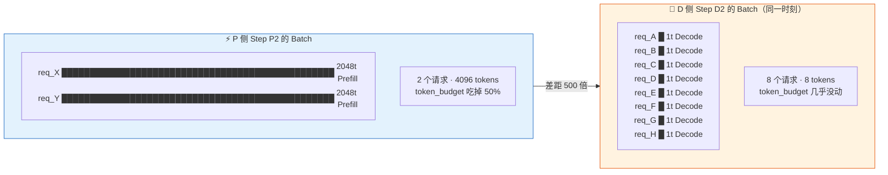
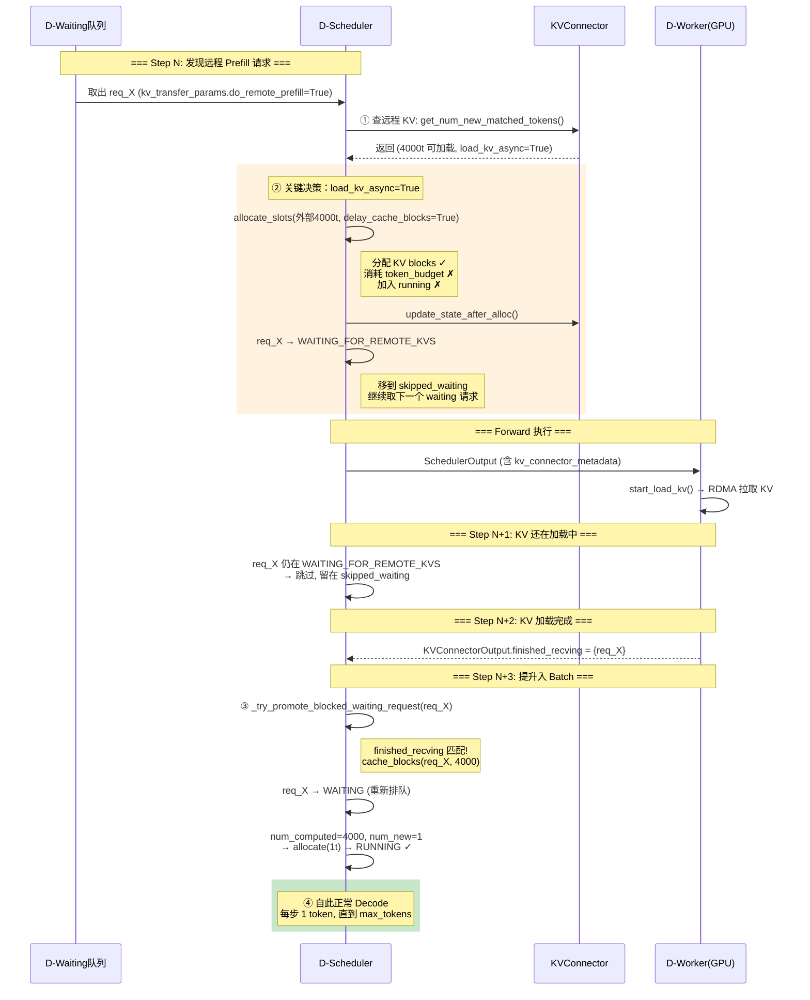
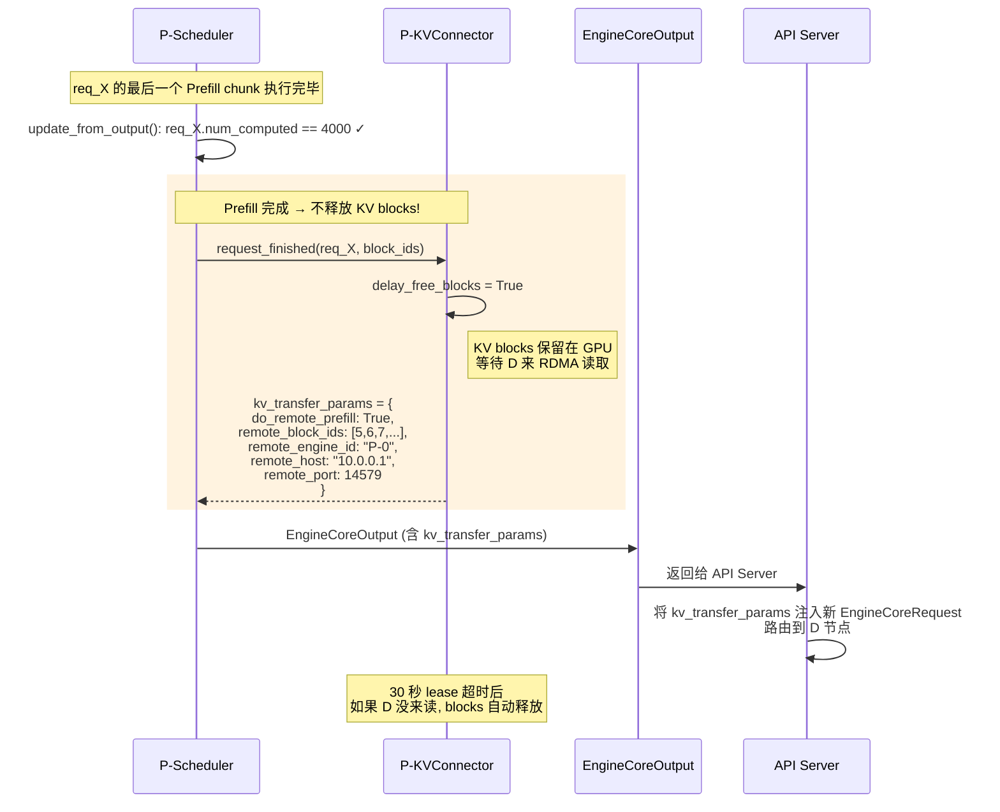
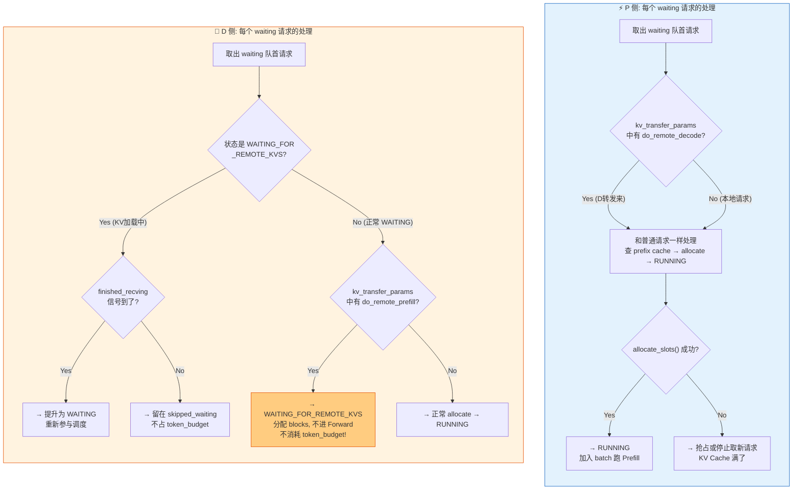
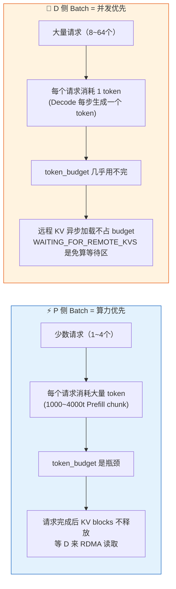

# PD 分离组 Batch 全流程

> P 和 D 各自独立调度，通过 `kv_transfer_params` + `KVConnector` 协调。两者 Batch 特征截然不同。

---

## 一、先看全景：两个 Batch 长什么样

同一个请求 X（prompt=4000t），在 P 和 D 两侧的 batch 形态完全不同：



**一句话理解：P 是把 token_budget 当饭吃（每个请求吃几千），D 是 token_budget 当空气（每个请求吃 1）。**

---

## 二、P/D 双线并行时间线

下面这张图展示 P 和 D 两个节点**同时**各自调度，同一个请求如何在两侧流转：

```mermaid
gantt
    title P/D 双线时间线（配置: P max_tokens=8192 D max_tokens=512）
    dateFormat X
    axisFormat %s

    section P-⚡req_X(4000t)
    WAITING              :px1, 0, 1
    Prefill chunk 1024t  :px2, 1, 3
    Prefill chunk 2976t  :px3, 3, 5
    完成→kv_transfer_params :milestone, px4, 5, 0

    section P-⚡req_Y(3000t)
    WAITING              :py1, 1, 3
    Prefill chunk 2048t  :py2, 3, 5
    Prefill chunk 952t   :py3, 5, 7
    完成→kv_transfer_params :milestone, py4, 7, 0

    section P-⚡req_Z(10t)
    WAITING              :pz1, 2, 3
    Prefill+完成         :pz2, 3, 4
    完成→kv_transfer_params :milestone, pz3, 4, 0

    section D-🔄req_Z(本地)
    WAITING              :dz1, 0, 1
    Prefill 10t          :dz2, 1, 2
    Decode               :dz3, 2, 9

    section D-🔄req_X(远程KV)
    WAITING_FOR_REMOTE_KVS :dx1, 3, 6
    KV加载中              :crit, dx2, 3, 6
    Decode               :dx3, 6, 12

    section D-🔄req_Y(远程KV)
    WAITING_FOR_REMOTE_KVS :dy1, 5, 8
    KV加载中              :crit, dy2, 5, 8
    Decode               :dy3, 8, 14
```



**关键观察：**
- P 侧：请求大部分时间在**跑 Prefill**（长条），完成后立刻释放线程
- D 侧：请求大部分时间在**跑 Decode**（细长条），开头有一个 `WAITING_FOR_REMOTE_KVS` 的 KV 加载间隙
- P 和 D 是**各自独立调度**的，时间轴没有锁步关系

---

## 三、焦点图：一个请求在 D 侧如何入 Batch

这是 PD 分离最核心的机制——远程 KV 加载期间**分配 blocks 但不消耗 token_budget，不跑 Forward**。



**核心洞察：步骤②中，4000 tokens 的外部 KV 不占 token_budget。这意味着 D 可以在等 req_X 加载的同时，继续调度其他请求。**

---

## 四、焦点图：P 侧请求完成后发生了什么



---

## 五、P 和 D 的调度决策树对比



---

## 六、Batch 组成可视化：P 侧 vs D 侧

```
                          P 侧 Batch                          D 侧 Batch
                       (token_budget=8192)                 (token_budget=512)
                      
    token 用量                          token 用量
    8192 ┬                              512 ┬
         │                                  │
    6144 ┤ ░░░░░░░░░░░░░░░░                 │
         │ ░░░░░░░░░░░░░░░░              384 ┤ ░░░░░░░░░░░░░░░░░░░
    4096 ┤ ░░░░░░░░░░░░░░░░                 │ ░░░░░░░░░░░░░░░░░░░
         │ ░░░  req_Y   ░░░                 │ ░░ 未使用  ░░░░░░░░
    2048 ┤ ░░░  2048t   ░░░              256 ┤ ░░░░░░░░░░░░░░░░░░░
         │ ░░░░░░░░░░░░░░░░                 │ ░░░░░░░░░░░░░░░░░░░
       0 └─███──────────███─             128 ┤ ░░░░░░░░░░░░░░░░░░░
           req_X 2048t                       │ ░░░░░░░░░░░░░░░░░░░
                                             │ ░░░░░░░░░░░░░░░░░░░
         batch: 2 个请求                     0 └─█─█─█─█─█─█─█─█──
         用掉 4096/8192 (50%)                   A B C D E F G H
                                                 各 1t Decode
                                             
                                             batch: 8 个请求
                                             用掉 8/512 (1.5%)
```

---

## 七、同一请求 X 在 P 和 D 的生命周期对照

```mermaid
flowchart TB
    subgraph LIFE["req_X(4000t) 完整生命旅程"]
        direction LR

        subgraph STAGE1["① 到达 P 侧"]
            S1A["API Server 路由到 P"]
            S1B["P: 入 waiting 队列"]
            S1C["P: schedule() → Prefill chunk"]
            S1D["P: 多次 chunk 直到 4000t 完成"]
        end

        subgraph STAGE2["② KV 交接"]
            S2A["P: request_finished()"]
            S2B["P: 生成 kv_transfer_params"]
            S2C["API Server: 路由到 D"]
            S2D["D: 收到请求, 识别 do_remote_prefill"]
        end

        subgraph STAGE3["③ D 侧异步加载"]
            S3A["D: WAITING_FOR_REMOTE_KVS"]
            S3B["D: RDMA 拉取 P 的 KV"]
            S3C["D: 加载完成 → finished_recving"]
        end

        subgraph STAGE4["④ D 侧 Decode"]
            S4A["D: 提升为 WAITING → RUNNING"]
            S4B["D: 每步 1 token Decode"]
            S4C["D: 流式返回给用户"]
        end

        STAGE1 --> STAGE2 --> STAGE3 --> STAGE4
    end

    style STAGE1 fill:#e3f2fd,stroke:#1565c0
    style STAGE2 fill:#fff9c4,stroke:#f9a825
    style STAGE3 fill:#ffcc80,stroke:#e65100
    style STAGE4 fill:#c8e6c9,stroke:#388e3c
```



---

## 八、核心结论



**这就是 PD 分离的根本价值：P 和 D 各自按自己的节奏组 batch，互不干扰。P 可以独立扩容应对 Prefill 突发，D 可以独立扩容应对高并发 Decode。**
