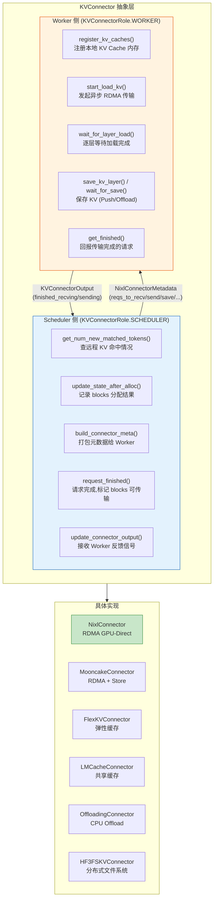
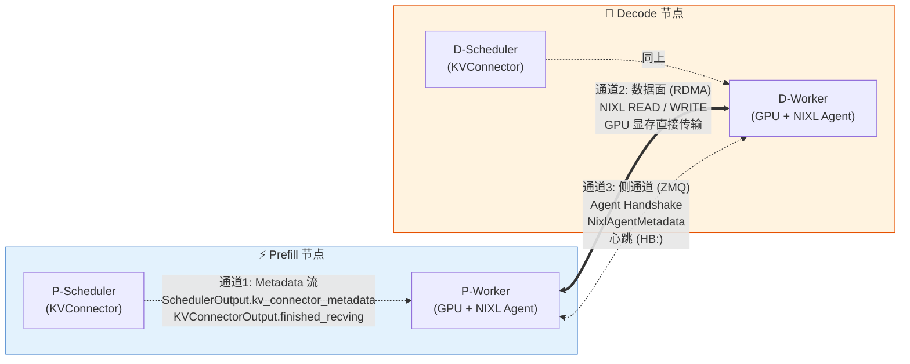
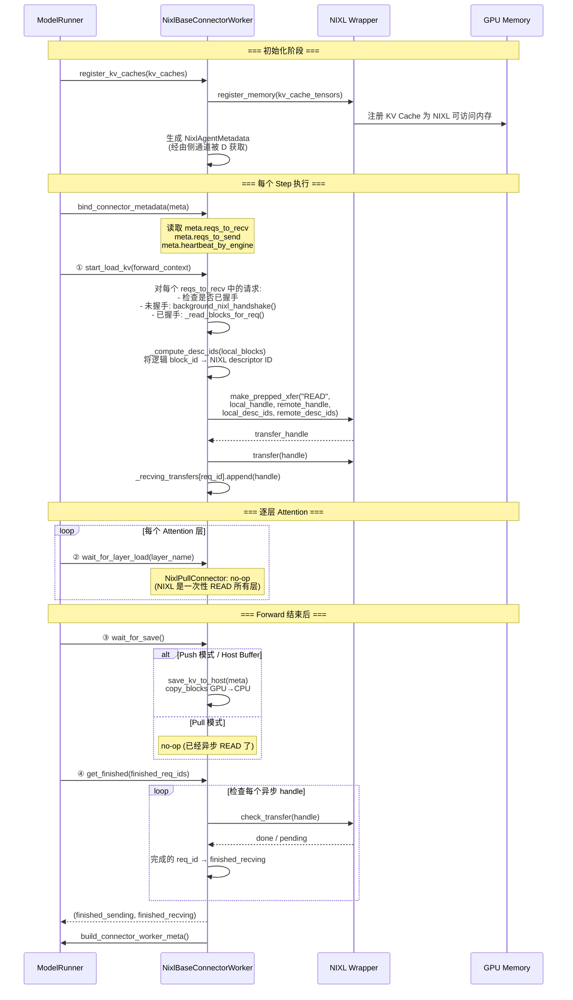
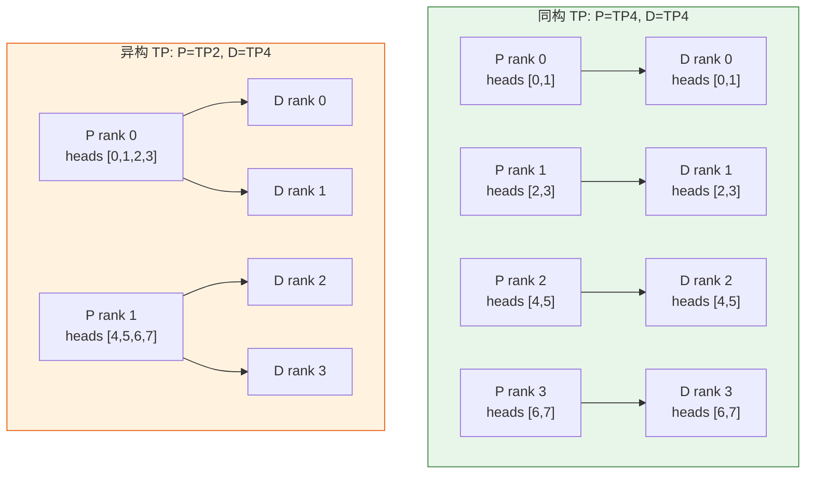

# KV 传输机制详解

> P/D 分离架构中，KV Cache 如何在 Prefill 节点和 Decode 节点之间高效传输。

---

## 一、为什么需要 KV 传输

```
┌──────────────────────────────────────────────────────────────────┐
│                                                                  │
│   P 节点 (有 GPU)              D 节点 (有 GPU)                    │
│   ┌─────────────┐             ┌─────────────┐                    │
│   │ User Prompt  │             │  Decode      │                   │
│   │      ↓       │             │  Token 1     │                   │
│   │   Prefill    │             │  Token 2     │                   │
│   │      ↓       │    KV       │  Token 3     │                   │
│   │  KV Cache    │ ═══════════ │  Token 4...  │                   │
│   │  [████████]  │  必须传输    │              │                   │
│   └─────────────┘             └─────────────┘                    │
│                                                                  │
│   问题: Prefill 在 P 上算出了全部 prompt 的 KV,                   │
│         但 Decode 在 D 上执行, 需要这些 KV 才能自回归生成          │
│                                                                  │
│   方案: 通过 RDMA (GPU-Direct) 将 KV Cache 从 P 的显存            │
│         直接传输到 D 的显存, 不经过 CPU                            │
│                                                                  │
└──────────────────────────────────────────────────────────────────┘
```

---

## 二、Connector 抽象架构



---

## 三、已注册的 Connector 一览

| Connector | 传输方式 | 适用场景 |
|-----------|---------|---------|
| **NixlConnector / NixlPullConnector** | RDMA READ (D 主动拉) | 标准 PD 分离 |
| **NixlPushConnector** | RDMA WRITE (P 主动推) | 低延迟 PD 分离 |
| **MooncakeConnector** | RDMA + Store 集群 | 大规模分布式 |
| **MoRIIOConnector** | RDMA | 高性能异构 |
| **LMCacheConnectorV1** | 共享 KV Cache 池 | 多实例缓存复用 |
| **FlexKVConnectorV1** | 弹性 KV 管理 | 动态扩缩容 |
| **OffloadingConnector** | CPU Offload | 显存不足时卸载到内存 |
| **SimpleCPUOffloadConnector** | CPU Offload 简化版 | 轻量级 CPU 卸载 |
| **HF3FSKVConnector** | 分布式文件系统 | 持久化 KV 缓存 |
| **MultiConnector** | 多子 Connector 组合 | 复杂场景链式组合 |
| **DecodeBenchConnector** | 无传输 (Benchmark) | 性能基准测试 |

---

## 四、NIXL 核心架构

### 4.1 两条通道



### 4.2 Pull vs Push

```
Pull 模式 (READ) — NixlPullConnector              Push 模式 (WRITE) — NixlPushConnector
──────────────────────────────────────             ──────────────────────────────────────

   P (持有 KV)          D (需要 KV)                  P (持有 KV)          D (需要 KV)
  ┌──────────┐        ┌──────────┐                ┌──────────┐        ┌──────────┐
  │          │  ②READ │          │                │          │ ①NIXL  │          │
  │  KV      │◄───────│  NIXL    │                │  KV      │  通知   │  注册    │
  │  Blocks  │        │  Agent   │                │  Blocks  │◄───────│  内存    │
  │          │───────►│          │                │          │───────►│          │
  └──────────┘ KV Data└──────────┘                └──────────┘②WRITE  └──────────┘

  ① D 先通过侧通道拿 P 的 Agent 信息
  ② D 发起 NIXL READ 指令                         ① D 通过 NIXL 通知 P "我要收数据"
  ③ NIXL 通过 RDMA 从 P GPU 读 → D GPU            ② P 发起 NIXL WRITE 写 KV 到 D GPU
                                                   ③ 后台线程异步完成
  优点: D 完全掌控拉取时机
  缺点: 多一层侧通道握手                             优点: 单次 WRITE 延迟更低
                                                    缺点: P 需要知道 D 的内存地址
```

---

## 五、NixlAgentMetadata — 握手协议

第一次 P↔D 通信前，双方通过 **ZMQ 侧通道**交换 Agent 信息。

```
NixlAgentMetadata (P 发给 D 的信息):
┌──────────────────────────────────────────────────────────────┐
│  engine_id: "P-0"              # 引擎唯一标识                 │
│  agent_metadata: bytes         # NIXL Agent 注册的 opaque 数据│
│  kv_caches_base_addr: [ptr,..] # KV Cache GPU 基地址 (指针)  │
│  device_id: 0                  # GPU 编号                     │
│  num_blocks: 250               # Block 总数                  │
│  block_lens: [65536, ...]      # 每个 Block 字节数           │
│  kv_cache_layout: "HND"        # KV Cache 内存布局            │
│  block_size: 16                # 逻辑 Block Size (tokens)     │
│  ssm_sizes: (0, 0)             # SSM 状态大小 (Mamba 模型)   │
│  attn_backend_name: "FLASHINFER"                             │
│  physical_blocks_per_logical_kv_block: 1                     │
└──────────────────────────────────────────────────────────────┘
          │
          ▼ 发送前先计算 compatibility_hash
┌──────────────────────────────────────────────────────────────┐
│  NixlHandshakePayload (实际线上传输的包):                      │
│    compatibility_hash: "a1b2c3..."   # ← 先校验这个!          │
│    agent_metadata_bytes: bytes       # ← hash 匹配后再解码    │
│                                                              │
│  两阶段解码:                                                  │
│    ① 解码 NixlHandshakePayload → 拿到 compatibility_hash     │
│    ② 计算本地 hash, 与远程比较                                │
│    ③ 匹配 → 解码 agent_metadata_bytes → NixlAgentMetadata    │
│    ④ 不匹配 → 报错退出 (模型/版本不兼容)                      │
└──────────────────────────────────────────────────────────────┘
```

**compatibility_hash 计算因子：** vLLM 版本、NIXL Connector 版本、模型名、dtype、num_kv_heads、head_size、num_hidden_layers、attn_backend、cache_dtype、cross_layers_blocks、HMA 开关

---

## 六、Worker 侧完整生命周期



---

## 七、Block ID 映射机制

PD 分离中一个核心复杂性：P 和 D 可能有**不同的 block_size、不同的 TP 规模、不同的 KV Cache 布局**。

### 7.1 逻辑 Block → 物理 Block 映射

```
P 侧: block_size=16, physical_blocks_per_logical=1
  logical block [5] → physical block [5]

D 侧: block_size=64, physical_blocks_per_logical=4
  logical block [2] → physical blocks [8, 9, 10, 11]

传输时:
  remote_block_ids (P侧逻辑) → remote_block_descs (P侧物理, NIXL 索引)
  local_block_ids  (D侧逻辑) → local_block_descs  (D侧物理, NIXL 索引)
```

### 7.2 TP 映射



```
同构 TP (D_TP = P_TP):
  → 一一对应: D rank_i 从 P rank_i 读取

异构 TP (D_TP > P_TP):
  → 多个 D rank 从同一个 P rank 读取不同 KV head 分片
  → TPMapping.source_ranks_per_group 记录映射关系

异构 TP (P_TP > D_TP):
  → 一个 D rank 从多个 P rank 读取
  → np.unique 去重 GQA 中相同 head 的重复 rank

MLA (Multi-head Latent Attention):
  → KV cache 被复制到所有 rank
  → 只需从 rank 0 读取

### 7.3 MLA 特殊处理 (Pull 模式)

DeepSeek V3/V4 等 MLA 模型：KV cache 在所有 TP rank 上完全复制。

```
Pull 模式 MLA:
  → 只从 rank 0 读取 (一次性)
  → 通过 send_notif 通知其他 rank "我们已拿到数据"
  → 其他 rank 收到通知后更新 request state, 释放 blocks

Push 模式 MLA (P_TP > D_TP):
  → TPMapping 只用一个 source rank
  → 但需要 WRITE 到所有 D rank (MLA latent 在所有 D rank 上都需要)
  → 为每个 D rank 创建独立的 ReadSpec, 只有 destination handle 不同
  → _region_is_mla 标记每个 region 是 REPLICATE (整块读) 还是 SPLIT (按 head 分片)
```

### 7.4 Mamba/SSM 混合模型的特殊处理

```
Mamba 层使用完全不同的 descriptor 布局:

  Attention 层: 每层 1-2 个 NIXL region (K, V)
  Mamba 层:     每层 4 个 NIXL region
                 (3 个 conv sub-projection + 1 个 SSM temporal state)

  descriptor ID 空间:
  ┌──────────────────────────┬────────────────────────────┐
  │  Attention descriptors   │  Mamba descriptors          │
  │  num_fa_regions *        │  num_ssm_regions *          │
  │  num_blocks              │  logical_blocks             │
  │  offset: 0               │  offset: num_fa_descs       │
  └──────────────────────────┴────────────────────────────┘

  Conv state 总是 TP-sharded (即使 attention KV 是 replicated)
  → 异构 TP 下需要 _build_mamba_remote() 计算 offset
```

### 7.5 Block Size 不匹配处理

```
场景: P 用 block_size=64, D 用 block_size=256

block_size_ratio = 256/64 = 4

传输时:
  remote_block_ids  (P侧, 64t/block):  [5, 6, 7, 8, 9, 10, 11, 12]
  local_block_ids   (D侧, 256t/block): [2, 3]

  get_mapped_blocks(local=[2,3], ratio=4):
    → 展开: [2,2,2,2, 3,3,3,3] → 映射: [8,9,10,11, 12,13,14,15]
    → clip 到 remote 长度: [8,9,10,11, 12,13,14,15] (长度匹配)

  → NIXL 用 P 侧 block_size 同时计算两边的 descriptor
```

### 7.6 异构 Attention Backend 后处理

```
场景: P 用 CUDA FA3, D 用 CPU_ATTN (不同的 attention backend)

问题: 两个 backend 的 KV Cache 内存格式可能不同
      (HND vs NHD, 不同的 stride order)

解决: post_process_device_kv_on_receive_heterogeneous_attn()
      → 将收到的 KV cache 重新打包 (repack)
      → 转换为 D 侧 backend 期望的格式

涉及的 transform:
  - kv_postprocess_blksize_on_receive(): block size 对齐
  - kv_postprocess_layout_on_receive(): HND ↔ NHD 布局转换
  - kv_postprocess_blksize_and_layout_on_receive(): 两者都做
```
```

---

## 八、RDMA 传输细节

```
_read_blocks() 执行流程:
─────────────────────────

① 计算 descriptor IDs
   _compute_desc_ids(block_ids, num_blocks, block_size_ratio)
   → 将逻辑 block_id 转为 NIXL 内部 descriptor index (整数数组)

② 处理 block_size 不匹配
   如果 local_block_size > remote_block_size:
     get_mapped_blocks() 展开 local block 到 remote block 粒度
   如果 local_block_size < remote_block_size:
     由 remote 侧处理

③ 前缀缓存去重
   _apply_prefix_caching(local, remote)
   → 双方都已有的 blocks 跳过传输 (只通知)

④ 构建 NIXL transfer
   nixl_wrapper.make_prepped_xfer(
     "READ",                    # READ 或 WRITE
     local_xfer_side_handle,   # D 侧 NIXL memory handle
     local_block_descs_ids,    # 写入位置
     remote_xfer_side_handle,  # P 侧 NIXL memory handle
     remote_block_descs_ids,   # 读取位置
     notif_msg=notif_id,       # 完成后通知 P
   )

⑤ 发起异步传输
   nixl_wrapper.transfer(handle)  # 不阻塞!
   _recving_transfers[req_id].append(handle)

⑥ 后续 step 中检查完成
   _pop_done_transfers():
     for handle in _recving_transfers[req_id]:
       state = nixl_wrapper.check_xfer_state(handle)
       
       "DONE" → 传输成功, 释放 handle, 记录 telemetry
       "PROC" → 仍在进行中, 保留 handle 下步再检查
       其他    → 传输失败! _handle_failed_transfer()
       
     if all handles done: → finished_recving
```

### 8.1 Push 模式的 Writer 线程

Push 模式使用独立的后台线程处理所有 NIXL WRITE 操作：

```
nixl-push-writer 线程循环:
────────────────────────────

while not stop_event:
  ① 处理 _reg_send_inbox: D 侧注册信息
     → handshake (如需要)
     → send_notif("PUSH_REG:...") 发给所有 P worker

  ② 处理 _finished_blocks_inbox: P 侧完成的 blocks
     → 匹配已收到的 D 注册
     → 匹配成功 → _do_start_push_kv() → NIXL WRITE
     → 未匹配 → 暂存到 _push_finished_blocks

  ③ 处理 _evict_finished_inbox: 清理已完成/过期请求

  ④ 轮询 NIXL 通知
     → "PUSH_REG:..." → _handle_push_reg_notif()
     → 普通完成通知 → 放入 _pending_completion_notifs

  ⑤ 等待唤醒
     → _push_finished_blocks 非空: poll 1ms (等待新注册匹配)
     → _push_finished_blocks 为空: block on _push_writer_wake event
```

```

---

## 九、Block 租约与心跳

P 侧的 KV blocks 不能无限期保留——D 可能在传输完成前就 crash，导致 P 显存泄漏。

```
租约机制:
─────────

① P 侧 Prefill 完成时:
   request_finished() → _reqs_need_send[req_id] = perf_counter() + 30s
   (默认 30 秒租约, 通过 kv_lease_duration 配置)

② P Worker 收到 send 请求后:
   _reqs_to_send[req_id] = expiration_time
   每个 step 检查过期: 过期则释放 blocks

③ D 侧维持租约 (心跳):
   每 heartbeat_interval (默认 5s = 30/6):
     heartbeat_by_engine = {
       "P-0": HeartbeatInfo(
         req_ids={"req_X", "req_Y"},  # D 还在等待加载的请求
         host, port, tp_size
       )
     }
   → 通过 NIXL send_notif("HB:req_X,req_Y") 发送到 P

④ P 侧收到心跳:
   _handle_heartbeat(msg):
     解析 "HB:req_X,req_Y"
     for req_id in parsed:
       _reqs_to_send[req_id] = perf_counter() + 30s  # 续租!

⑤ 租约到期:
   P 侧: _reqs_to_send 中的过期 block → 释放
   D 侧: _is_turn2_read_expired() → 拒绝过期读取
```

---

## 十、KV Cache 布局

```
HND 布局 (Head-Num_blocks-Dim):
  [num_kv_heads, num_blocks, block_size * head_size]
  
  优点: 按 head 连续存储, 适合 RDMA 批量传输
  缺点: 对某些 attention kernel 性能不是最优

NHD 布局 (Num_blocks-Head-Dim):
  [num_blocks, num_kv_heads, block_size * head_size]
  
  优点: 某些 attention backend (如 FlashInfer) 性能最优
  缺点: 跨 head 的 KV 传输需要多个 RDMA 操作

NixlConnector 偏好 HND:
  get_required_kvcache_layout() → "HND"
  原因: HND 布局让一个 block 的同一 head 的所有层 KV 连续,
        可以用单次 RDMA 传输更多数据
```

---

## 十一、跨层 Block 优化

```
普通模式:
  每层独立的 KV Cache tensor
  → 传输一个 block 需要 N 次 RDMA 操作 (N = num_layers)

Cross-Layer 模式 (prefer_cross_layer_blocks=True):
  所有层共享一个 KV Cache tensor, num_layers 是最外层维度
  → 传输一个 block 只需要 1 次 RDMA 操作 (所有层 KV 连续!)
  
  KV Cache shape: [num_layers, num_blocks, num_kv_heads, head_dim]

  前提条件:
    ① 所有层 KV cache 规格相同
    ② Attention backend 支持 indexes_kv_by_block_stride
    ③ 启用 enable_cross_layers_blocks=True 配置
```

---

## 十二、Host Buffer 机制

```
问题: NIXL 在某些平台上只支持 CPU 内存注册 (如 TPU、XPU 部分场景)

方案: kv_buffer_device = "cpu"
─────────────────────────────────

  ① P 侧 Forward 完成后:
     save_kv_to_host():
       copy_blocks GPU→CPU (P 的 KV 复制到 Host Buffer)
     → 然后 NIXL 从 CPU buffer 传输到 D

  ② D 侧接收 KV 后:
     wait_for_layer_load():
       从 Host Buffer copy_blocks CPU→GPU

  配置:
    kv_buffer_device = "cpu"   # 使用 CPU 作为中转
    kv_buffer_size = 1e9       # 1GB buffer
```

---

## 十三、错误处理

```
kv_load_failure_policy = "recompute" | "fail"
────────────────────────────────────────────

"recompute" (推荐):
  ① 传输失败 → _handle_failed_transfer()
  ② block_ids 标记为 invalid
  ③ get_block_ids_with_load_errors() → 回报 scheduler
  ④ Scheduler: _update_requests_with_invalid_blocks()
     → 只保留成功加载的 prefix
     → 剩余 tokens 在本地重新计算 (recompute)
  ⑤ 请求继续, 不中断

"fail":
  ① 传输失败 → 直接 FINISHED_ERROR
  ② 请求失败, 返回错误给用户
```

---

## 十四、Scheduler↔Worker 元数据协议总结

```
每个 Step 的元数据流转:

Scheduler 侧                           Worker 侧
────────────                           ────────

schedule():
  get_num_new_matched_tokens()
  update_state_after_alloc()     
  build_connector_meta() ──────────────► bind_connector_metadata()
                                         start_load_kv()
                                           ├── _read_blocks_for_req()
                                           ├── _send_heartbeats()
                                           └── (Push: send notif to P)
                                         
update_from_output() ◄────────────────── get_finished()
  finished_recving_kv_req_ids              → finished_recving
  update_connector_output()                → finished_sending
  _try_promote_blocked()                   → invalid_block_ids
                                         build_connector_worker_meta()
```

---

## 十五、NIXL 协议版本演进

```
NIXL_CONNECTOR_VERSION = 5

版本  新增内容
────  ──────────────────────────────────────────────────
 v1   初始版本, 带 compatibility checking
 v2   在 kv_transfer_params 中加入 remote_request_id
 v3   在 NixlAgentMetadata 中加入 physical_blocks_per_logical_kv_block
 v4   加入 KV block 租约通过心跳续租机制
 v5   在 kv_transfer_params 中加入 remote_blocks_expiry_time
      + 握手时钟同步时间戳 (clock-sync timestamp)
```

---

## 十六、GQA 去重与 Stale Engine 清理

### GQA 读取去重

```
GQA (Grouped Query Attention): num_kv_heads < num_attention_heads

当 P_TP > D_TP 时:
  同一 KV head 可能在多个 P rank 上复制
  
  np.unique(heads, return_index=True)
  → 每个 unique head 只读取一次
  → 避免重复 RDMA 传输相同的 KV 数据
```

### Stale Engine 清理

```
远程引擎 TTL (默认 3600 秒):
  
  _engine_last_active[engine_id]: 最后一次与该引擎交互的时间
  
  _evict_stale_engines():
    每次新 handshake 前检查
    → 超过 TTL 的 engine: 释放其 NIXL 资源
      · dlist handles
      · remote agent 注册
      · TransferTopology 中的注册信息
  
  活跃追踪: _read_blocks_for_req() 和 _ensure_handshake()
  每次交互时更新 _engine_last_active[engine_id]
```

---

## 十七、关键源码索引

| 模块 | 文件 | 职责 |
|------|------|------|
| **Connector 基类** | `distributed/kv_transfer/kv_connector/v1/base.py` | Scheduler/Worker 接口定义 |
| **Connector 工厂** | `distributed/kv_transfer/kv_connector/factory.py` | 动态注册和创建 Connector |
| **NIXL Connector** | `.../nixl/connector.py` | Pull/Push 外观类 |
| **NIXL Pull Scheduler** | `.../nixl/pull_scheduler.py` | Pull 模式 Scheduler 侧逻辑 |
| **NIXL Pull Worker** | `.../nixl/pull_worker.py` | Pull 模式 RDMA READ 执行 |
| **NIXL Push Scheduler** | `.../nixl/push_scheduler.py` | Push 模式 Scheduler 侧逻辑 |
| **NIXL Push Worker** | `.../nixl/push_worker.py` | Push 模式 RDMA WRITE 执行 |
| **NIXL Base Worker** | `.../nixl/base_worker.py` | Worker 共享逻辑 (handshake, heartbeat, desc_ids) |
| **NIXL Base Scheduler** | `.../nixl/base_scheduler.py` | Scheduler 共享逻辑 (build_meta, 侧通道监听) |
| **NIXL Metadata** | `.../nixl/metadata.py` | NixlConnectorMetadata, ReqMeta, NixlAgentMetadata |
| **TP Mapping** | `.../nixl/tp_mapping.py` | 同构/异构 TP 的 block 映射计算 |
| **NIXL Stats** | `.../nixl/stats.py` | 传输统计指标 |
| **NIXL Utils** | `.../nixl/utils.py` | ZMQ 侧通道、平台支持检测 |
| **连接器工具** | `distributed/kv_transfer/kv_connector/utils.py` | TransferTopology, block_id 映射 |
| **KV Transfer State** | `distributed/kv_transfer/kv_transfer_state.py` | 全局 Connector 实例管理 |
