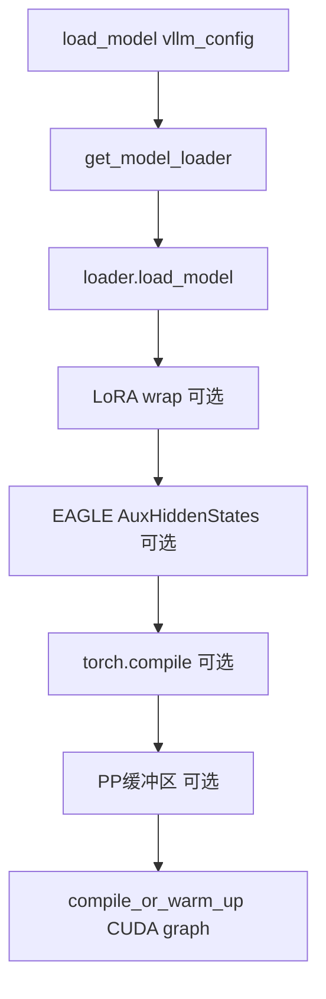

# 03 · GPUModelRunner（核心！）

**源码**：[`code/vllm/vllm/v1/worker/gpu/model_runner.py`](../../code/vllm/vllm/v1/worker/gpu/model_runner.py)

约 3000+ 行。这是 worker 侧最核心的文件。第一遍只读 `load_model()` 和 `execute_model()`。

## `load_model()` — 模型加载



LoRA / EAGLE / `torch.compile` / PP 缓冲均为**条件分支**，上图表示源码中的典型拼装顺序。

```python
def execute_model(self, scheduler_output: SchedulerOutput) -> ModelRunnerOutput:
    # 步骤 1：更新请求状态
    self._update_states(scheduler_output)
    # 从 scheduler_output 读取 new_reqs / cached_reqs
    # - 新请求：创建 RequestState（token_ids, positions, block_ids 等）
    # - 旧请求：追加 new_token_ids, 更新 num_computed_tokens
    # - 完成请求：移除状态
    # - 抢占请求：移除状态

    # 步骤 2：构建 InputBatch
    self._prepare_inputs(scheduler_output)
    # 合并所有请求的 input tokens → 一个大 flat tensor
    # input_ids: [total_tokens] — 本步所有参与计算的 token
    # positions: [total_tokens] — 每个 token 的位置
    # block_tables: [num_seqs, max_blocks] — KV 缓存的块表
    # slot_mappings: [total_tokens] — 每个 token 的 KV 写入 slot

    # 步骤 3：构建 Attention Metadata
    attn_metadata = self.model_state.prepare_attn(
        block_tables, context_lens, slot_mappings, ...
    )
    # 每个 attention backend 有自己的 AttentionMetadataBuilder
    # 将块表、上下文长度等转为 attention kernel 需要的元数据格式

    # 步骤 4：跑模型前向（CUDA graph 或 eager）
    if self.cudagraph_manager.can_use_fullgraph(batch_desc):
        # CUDA graph 重放（超低 kernel launch 开销）
        output = self.cudagraph_manager.run_fullgraph(batch_desc)
    else:
        # Eager forward
        output = self.model(
            input_ids=input_ids,
            positions=positions,
            intermediate_tensors=...,  # PP 中间 rank 用
            inputs_embeds=...          # 多模态预计算 embedding
        )

    # 步骤 5：后处理
    if self.is_last_pp_rank:
        # 尾 PP rank：采样结果已在 CUDA graph 中计算好
        return ModelRunnerOutput(
            sampled_token_ids=output.sampled_token_ids,
            logprobs=output.logprobs,
        )
    else:
        # 中间 PP rank：返回中间张量给下一个 rank
        return IntermediateTensors(output.intermediate_tensors)
```

## 关键数据结构

### InputBatch / InputBuffers

从 `SchedulerOutput` 构建模型输入的批处理结构。每次步骤前从预分配的 GPU buffer 中切片：

- `input_ids`: `[total_tokens]` — 所有 token 的 ID，按请求顺序拼接
- `positions`: `[total_tokens]` — 每个 token 在各自序列中的位置
- `block_tables`: `[num_seqs, max_blocks]` — 每个序列的 KV 缓存块表（值为物理块号 + 偏移量）
- `slot_mappings`: `[total_tokens]` — 每个 token 对应 KV 缓存中的写入 slot

### BlockTables

管理序列到 KV 物理块的映射：
- `block_table[seq_idx]` = `[block_id_1, block_id_2, ...]` — 该序列持有的 KV 块号列表
- 不同 attention type 有各自的 block table（因为块池不同）
- Worker 维护 CPU 侧的 block table，kernel 通过它寻址 GPU 上的 kV 缓存

### CUDAGraphManager

在 warmup 阶段录制多种 batch 规模的 CUDA graph。运行时根据 batch 配置匹配最适合的 graph 直接重放，跳过所有 kernel launch overhead。

录制策略取决于 `CUDAGraphSupport` 级别：
- `ALWAYS` — 为每种可能 batch size 录制 graph（包括不等长 prefill）
- `UNIFORM_SINGLE_TOKEN_DECODE` — 只为「每个请求 1 token」录制
- `UNIFORM_BATCH` — 只为所有请求 query 长度相同录制
- `NEVER` — 不录制，始终 eager forward

### RequestState tracker

`GPUModelRunner` 内部维护 `req_states: dict[str, RequestState]`：
```python
class RequestState:
    token_ids: list[int]        # 请求的完整 token 序列
    positions: list[int]        # 对应位置
    block_ids: list[int]        # KV 块号
    num_computed_tokens: int    # 当前进度
    ...
```

## 阅读重点

- `execute_model()` 的四步流程（update states → prepare inputs → attn metadata → forward）
- `block_tables` 和 `slot_mappings` 的语义 — 这是 PagedAttention 的核心寻址机制
- CUDA graph 的作用：录制一次 graph，后续直接重放，减少 kernel launch 开销
- InputBatch 是「所有请求的 token 拼成一个大 batch」——这是 GPU 高效执行的基础
