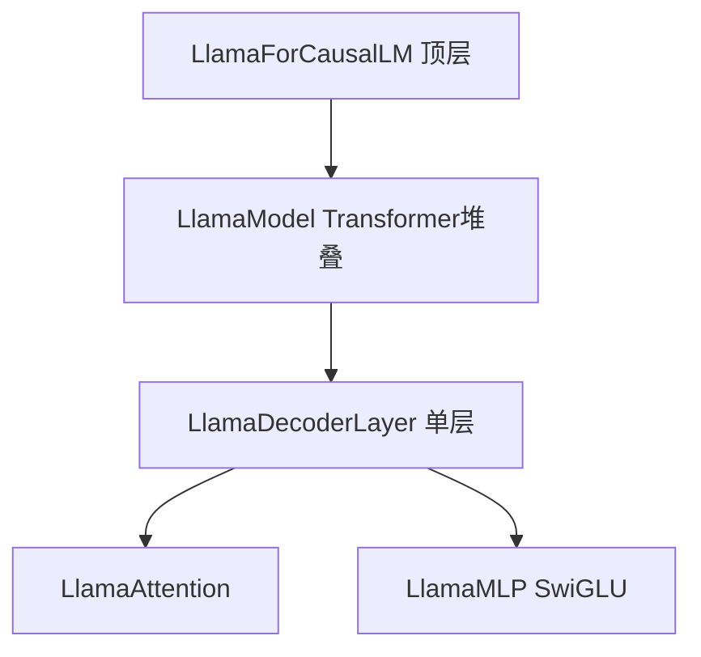
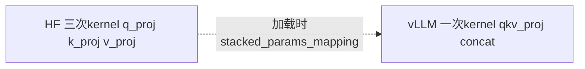

# 01 · 模型实现模式（以 Llama 为例）

**源码**：`[code/vllm/vllm/model_executor/models/llama.py](../../code/vllm/vllm/model_executor/models/llama.py)`

## vLLM 中每个模型都是五层嵌套结构




**层级含义**：`LlamaForCausalLM` 含 `packed_modules_mapping` / `stacked_params_mapping` 等；`LlamaModel` 负责 **embed_tokens**、`layers`、`norm`；`LlamaDecoderLayer` 内 **LlamaAttention**（qkv_proj、o_proj、rotary_emb、Attention 后端）与 **LlamaMLP**（gate_up_proj、down_proj、SiluAndMul）。

**为什么是 5 层？** 因为 vLLM 需要在每个层级插入并行化逻辑（TP/PP），而且需要为投机解码（EagleMixin）和 LoRA 提供 hook 点。

## 标准化的 forward 签名

所有模型（200+ 种）必须统一使用同一个 `forward` 签名：

```python
def forward(self, input_ids, positions, intermediate_tensors=None, inputs_embeds=None):
```


| 参数                     | 形状                                | 说明                                          |
| ---------------------- | --------------------------------- | ------------------------------------------- |
| `input_ids`            | `[batch, seq_len]`                | 本步要计算的 token IDs                            |
| `positions`            | `[batch, seq_len]`                | 每个 token 在序列中的绝对位置（RoPE 用）                  |
| `intermediate_tensors` | `IntermediateTensors | None`      | PP 模式下前一个 rank 传来的中间 hidden states          |
| `inputs_embeds`        | `[batch, seq_len, hidden] | None` | 多模态场景下的预计算 embedding（替代 input_ids→embed 步骤） |


**为什么所有模型必须统一签名？** 因为 `GPUModelRunner.execute_model()` 不关心你是什么模型——它只调 `self.model(input_ids=..., positions=..., ...)`。统一签名让 engine 和所有模型完全解耦。添加新模型只需继承对应 mixin 并实现这个 forward。

## 顶层模型必须实现的接口

```python
class LlamaForCausalLM(nn.Module, SupportsLoRA, SupportsPP, ...):
    # 1. 融合参数的映射
    packed_modules_mapping = {
        "qkv_proj": ["q_proj", "k_proj", "v_proj"],     # QKV 三合一
        "gate_up_proj": ["gate_proj", "up_proj"],       # gate+up 二合一
    }

    # 2. 条件层类型（哪些层受模型配置条件影响）
    conditional_layer_types = ["attn", "mlp"]

    # 3. 必须实现的方法
    def forward(self, input_ids, positions, ...): ...
    def compute_logits(self, hidden_states): ...  # hidden → logits (lm_head)
    def load_weights(self, weights): ...          # 自定义权重加载逻辑
    def make_empty_intermediate_tensors(batch_size, dtype, device): ...  # PP 缓冲区

    # 4. 嵌入层
    def embed_input_ids(self, input_ids): ...     # token ID → embedding
```

## 关键设计点

### 1. 融合投影（HF 与 vLLM）

HF 中 `**q_proj` / `k_proj` / `v_proj**` 与 SwiGLU 的 `**gate_proj` / `up_proj**` 各自独立；vLLM 在模块里合成 `**qkv_proj**`、`**gate_up_proj**`（见上文 `**packed_modules_mapping**`），目的主要是：**更少次 GEMM / kernel launch**，并与 `**ColumnParallelLinear`** / `**QKVParallelLinear**` / `**MergedColumnParallelLinear**` 的分片方式一致。checkpoint 仍多分片命名时，靠 `**stacked_params_mapping**` 在加载阶段写入融合权重对应切片。




### 2. `load_weights()` 的 `stacked_params_mapping`

```python
stacked_params_mapping = [
    ("qkv_proj", "q_proj", 0),     # q_proj.weight → qkv_proj 的前 1/3
    ("qkv_proj", "k_proj", 1),     # k_proj.weight → qkv_proj 的中 1/3
    ("qkv_proj", "v_proj", 2),     # v_proj.weight → qkv_proj 的后 1/3
    ("gate_up_proj", "gate_proj", 0),
    ("gate_up_proj", "up_proj", 1),
]
```

加载器根据这个映射知道「HF checkpoint 里的 `q_proj.weight` 应该填充到融合后的 `qkv_proj.weight` 的哪个位置」。

### 3. `compute_logits()` 返回 None 的情况

当 TP>1 且当前 rank 不是最后一个 TP rank 时，`compute_logits()` 返回 None。因为：

- `lm_head` 在 vocab 维度上做了列并行分片
- 非尾 rank 的 `hidden_states` 不是完整的输出
- 只有尾 rank 持有完整的 logits

### 4. EagleMixin

`LlamaModel` 继承 `EagleModelMixin`，在 forward 中返回 `hidden_states_from_all_layers`。Eagle 投机解码用这些 hidden states 预测 draft token。

## 阅读重点

- 记住五层结构：ForCausalLM → Model → DecoderLayer → Attention + MLP
- 理解 `forward()` 的四个参数各是什么、为什么所有模型必须统一
- 知道 `packed_modules_mapping` 和 `stacked_params_mapping` 的关系
- 注意 `compute_logits()` 在 TP 场景下可能返回 None

