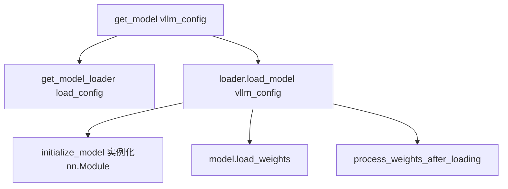

# 02 · 模型注册与加载

## ModelRegistry — 模型注册/发现

**源码**：[`code/vllm/vllm/model_executor/models/registry.py`](../../code/vllm/vllm/model_executor/models/registry.py)

`ModelRegistry` 是一个单例，维护 HF 架构名 → vLLM 实现的映射：

```python
_TEXT_GENERATION_MODELS = {
    "LlamaForCausalLM": ("llama", "LlamaForCausalLM"),
    "Qwen2ForCausalLM": ("qwen2", "Qwen2ForCausalLM"),
    "Qwen3ForCausalLM": ("qwen3", "Qwen3ForCausalLM"),
    "MistralForCausalLM": ("mistral", "MistralForCausalLM"),
    "DeepseekV2ForCausalLM": ("deepseek_v2", "DeepseekV2ForCausalLM"),
    "DeepseekV3ForCausalLM": ("deepseek_v3", "DeepseekV3ForCausalLM"),
    # ... 100+ 条目
}
```

映射值 `("llama", "LlamaForCausalLM")` 表示在 `model_executor/models/llama.py` 文件中找 `LlamaForCausalLM` 类。

### 关键方法

| 方法 | 说明 |
|------|------|
| `resolve_model_cls(architectures, model_config)` | 根据 model_config.architectures 找到 vLLM 实现类 |
| `is_pooling_model(model_config)` | 是否是 embedding/pooling 模型 |
| `is_multimodal_model(model_config)` | 是否支持多模态 |
| `is_hybrid_model(model_config)` | 是否混合注意力 + Mamba |
| `is_cross_encoder_model(model_config)` | 是否是 cross-encoder |

### 高级特性

- **外部模型支持**：通过环境变量或装饰器注册 out-of-tree 模型
- **通用 Transformers 后端**：如果模型不在注册表中但有 HF config，使用 `GenericModel` 自动生成支持
- **变体规范化**：例如 `Qwen2.5ForCausalLM` → `Qwen2ForCausalLM`（自动别名）
- **JSON 缓存**：已解析的模型注册输出缓存在 `~/.cache/vllm/model_registry/` 中，加速后续加载

## 模型加载流程

**入口**：[`code/vllm/vllm/model_executor/model_loader/__init__.py`](../../code/vllm/vllm/model_executor/model_loader/__init__.py)



`load_format` 与 Loader 对应关系：

| load_format | Loader |
|-------------|--------|
| `"auto"`（默认） | `DefaultModelLoader`（自动检测 HF safetensors / pt） |
| `"bitsandbytes"` | `BitsAndBytesModelLoader` |
| `"gguf"` | `GGUFModelLoader` |
| `"tensorizer"` | `TensorizerLoader`（CoreWeave 流式） |
| `"sharded_state"` | `ShardedStateLoader` |
| `"dummy"` | `DummyModelLoader`（测试用） |

`initialize_model`：`ModelRegistry.resolve_model_cls()` → 实例化如 `LlamaForCausalLM`。**load_weights** 迭代 checkpoint，`stacked_params_mapping` 映射 HF 融合布局。

### 权重加载的细节

`load_weights()` 的流程：
1. 打开 safetensors 文件（或 pt 文件）
2. 遍历每个 param_name, param_tensor
3. 对于普通参数，直接赋值到 `model.xxx.weight.data.copy_(tensor)`
4. 对于融合参数（如 `q_proj`），查找 `stacked_params_mapping` 确定在融合 weight 中的偏移位置，然后 `fused_weight[offset:offset+size].copy_(q_proj_weight)`
5. 如果有 `tie_word_embeddings`，复制 `lm_head.weight = embed_tokens.weight`

## 阅读重点

- 理解 ModelRegistry 的 HF 架构名 → vLLM 实现的映射机制
- 跟一遍 `get_model()` → `load_model()` 的流程
- 知道不同 load_format 对应不同 loader（第一遍只看 DefaultModelLoader）
- 理解 `stacked_params_mapping` 在权重加载中的作用
