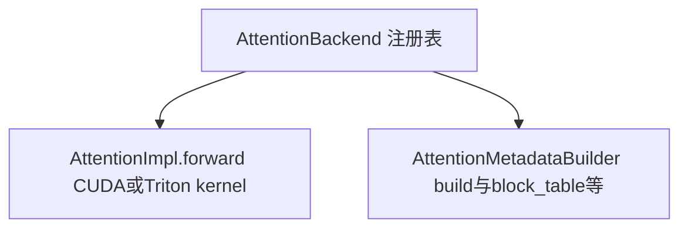

# 03 · Attention 实现层次

## 三层架构



**`AttentionImpl.forward`**：PagedAttention 核心；**AttentionMetadataBuilder** 负责 `build` / `build_for_cudagraph_capture` / `update_block_table` / `use_cascade_attention` 等。

## AttentionImpl.forward() — PagedAttention 的签名

```python
class AttentionImpl(ABC):
    @abstractmethod
    def forward(
        self,
        layer: AttentionLayerBase,       # 发起调用的 attention 层
        query: torch.Tensor,             # [num_tokens, num_heads, head_size]
        key: torch.Tensor,               # [num_tokens, num_kv_heads, head_size]
        value: torch.Tensor,             # [num_tokens, num_kv_heads, head_size]
        kv_cache: torch.Tensor,          # 物理 KV 缓存张量（PagedAttention 核心！）
        attn_metadata: "AttentionMetadata",  # block_table + context_lens + slot_mappings 等
        output: torch.Tensor,            # [num_tokens, num_heads, head_size] 输出（in-place）
    ) -> None:
```

### 参数详解

- **`kv_cache`**：预分配的 GPU 张量，形状由 `get_kv_cache_shape()` 决定。所有请求共享这个张量，通过 `block_table` 索引实现分页。
- **`attn_metadata`**：包含本步所有 batch 级别的元数据：
  - `block_tables`：`[num_seqs, max_blocks]` — 每个序列的物理块号列表
  - `context_lens`：`[num_seqs]` — 每个序列的当前长度
  - `slot_mappings`：`[num_tokens]` — 每个 query token 在 KV 缓存中对应的 slot
  - `query_start_loc` / `seq_lens` 等
- **`output`**：预分配的输出张量。kernel 把 attention 结果写入这个 tensor（in-place for efficiency）。

## MLAAttentionImpl — MLA 的两阶段接口

```python
class MLAAttentionImpl(ABC):
    @abstractmethod
    def forward_mha(
        self, q: torch.Tensor,              # query
        kv_c_normed: torch.Tensor,          # 压缩后的 KV latent (经 RMSNorm)
        k_pe: torch.Tensor,                 # K 的位置编码部分
        kv_cache: torch.Tensor,             # MLA KV 缓存（存的是压缩 latent）
        attn_metadata: "AttentionMetadata",
    ) -> torch.Tensor: ...

    @abstractmethod
    def forward_mqa(
        self, q: torch.Tensor,
        kv_c_and_k_pe_cache: torch.Tensor,  # 从 KV 缓存恢复的 latent + k_pe
        attn_metadata: "AttentionMetadata",
        layer: AttentionLayerBase,
    ) -> torch.Tensor: ...
```

MLA 分两个阶段的动机：
1. **MHA（Multi-Head Attention）**：Q 需要对 K_pe 做 RoPE，但压缩 latent 不需要。所以 K 的 RoPE 部分和压缩部分分开计算。
2. **MQA（Multi-Query Attention）**：在 decode 阶段，Q 只有一个 token，但需要关注过去全部 KV。这部分 MLA 有专门的优化。

## AttentionMetadataBuilder — 为每步构建 kernel 元数据

每个 attention 后端有自己的 `AttentionMetadataBuilder` 子类。它的职责是把调度器产出的 `block_tables`、`context_lens` 等转成对应 attention kernel 需要的具体格式。

```python
class AttentionMetadataBuilder(ABC):
    @abstractmethod
    def build(
        self,
        common_prefix_len: int,
        common_attn_metadata: CommonAttentionMetadata,  # 跨后端共享的元数据
    ) -> "AttentionMetadata": ...
    # FlashAttention 后端：返回 FlashAttentionMetadata
    # FlashInfer 后端：返回 FlashInferMetadata
    # Triton 后端：返回 TritonMetadata
    # 每个 Metadata 类包含该后端 kernel 所需的特定布局信息
```

`build()` 在每步 `execute_model()` 中被调用。

## CUDA Graph 支持级别

```python
class AttentionCGSupport(Enum):
    ALWAYS = 3                       # 任何 batch 配置都能用（FlashAttention-3 on H100）
    UNIFORM_BATCH = 2                # 所有 query 长度相同才能用
    UNIFORM_SINGLE_TOKEN_DECODE = 1  # 纯 decode（每个请求 1 token）才能用
    NEVER = 0                        # 不支持 CUDA graph
```

不同后端的 CUDA graph 支持级别决定了 `CudagraphDispatcher` 的录制策略。

## 阅读重点

- 理解 `AttentionImpl.forward()` 的 `kv_cache` 参数——它就是 PagedAttention 的「页」的物理存储
- `AttentionMetadataBuilder` 是「调度层到 kernel 层」的翻译器
- 不同后端的差异在 `forward()` 中调用的具体 CUDA/Triton kernel
- MLA 两阶段（MHA + MQA）的设计是针对压缩 KV 缓存的优化
- `AttentionCGSupport` 级别决定了 warmup 录制和运行时重放的策略
