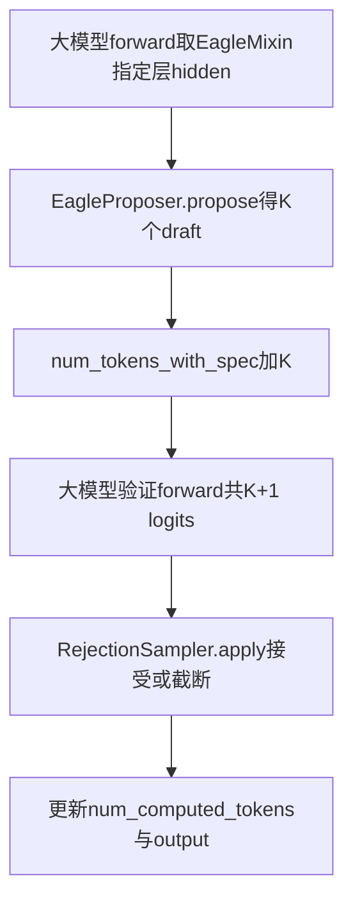
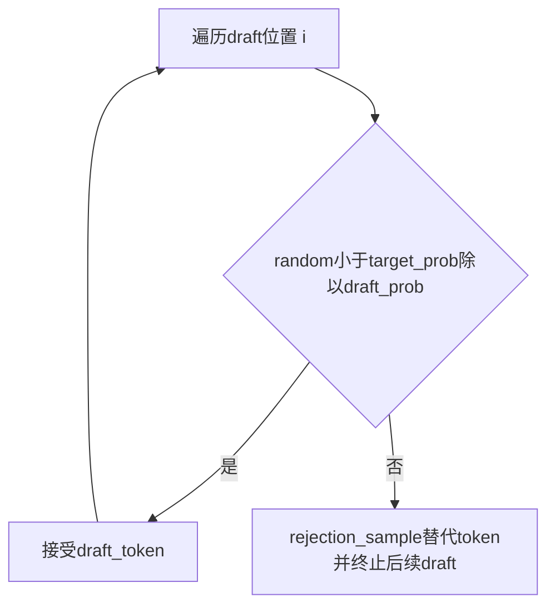

# 01 · 投机解码

## 核心原理

投机解码（Speculative Decoding）通过「小模型预测 + 大模型验证」来加速生成：

1. **Draft 阶段**：一个小的/快的「draft proposer」预测 K 个 draft token
2. **验证阶段**：大模型（target model）一次性对这 K+1 个位置做 forward（当前 token + K 个 draft），输出 K+1 组 logits
3. **接受/拒绝**：逐位置比对 draft token 与 target model 的采样分布。匹配则接受（该步生成 K 个 token），不匹配则拒绝，用 target model 的 token 替代
4. **收益**：每次接受能省 K-1 步大模型的 forward

vLLM 的投机解码深度集成在调度器和 Worker 中。关键：`num_tokens_with_spec` 包含了 draft token，调度器为它们一次性分配 KV 块。

## 三种 Draft Proposer

**目录**：[`code/vllm/vllm/v1/spec_decode/`](../../code/vllm/vllm/v1/spec_decode/)

| Proposer | 文件 | 方法 | 特点 |
|----------|------|------|------|
| **EAGLE/EAGLE3** | `eagle.py` | 用主模型特定层 hidden states 预测 draft token | 最常用，效果好（hit rate 70%+），需额外训练 aux 层 |
| **Medusa** | `medusa.py` | 在模型上加多个预测头，各预测一个 draft token | 训练简单，但 head 多增加 overhead |
| **N-gram** | `ngram_proposer.py` | 基于统计：如果最近出现 "机器"，下一个 token 很可能是 "学习" | 无需训练，但 hit rate 低（30-40%） |

### EAGLE 详细流程

## Worker 侧（GPU）

**目录**：[`code/vllm/vllm/v1/worker/gpu/spec_decode/`](../../code/vllm/vllm/v1/worker/gpu/spec_decode/)

| 文件 | 说明 |
|------|------|
| `eagle/speculator.py` | Eagle speculator：接收 hidden states → 多步生成 draft token |
| `rejection_sampler.py` | 拒绝采样器：按概率比对 draft token vs target model 分布 |

### 拒绝采样算法（逐 draft 位置）

## 在调度器中的体现

`Scheduler.schedule()` 中：
- 投机解码请求的 `num_tokens_with_spec` 可能比 `num_computed_tokens` 大 K 个
- 调度器为这 K 个 draft token 一次性分配 KV 块
- 在 `update_from_output()` 中，根据验证结果释放未使用的 KV 块

## 阅读入口

1. [`code/vllm/vllm/v1/spec_decode/eagle.py`](../../code/vllm/vllm/v1/spec_decode/eagle.py) — EagleProposer 是默认且最有效的 proposer
2. [`code/vllm/vllm/v1/spec_decode/metadata.py`](../../code/vllm/vllm/v1/spec_decode/metadata.py) — SpecDecodeMetadata 结构定义
3. [`code/vllm/vllm/v1/worker/gpu/spec_decode/rejection_sampler.py`](../../code/vllm/vllm/v1/worker/gpu/spec_decode/rejection_sampler.py) — 拒绝采样逻辑
4. [`code/vllm/vllm/model_executor/models/llama.py`](../../code/vllm/vllm/model_executor/models/llama.py) — 看 `EagleModelMixin` 如何提供 aux hidden states

## 与普通推理的关键差异

| 方面 | 普通推理 | 投机解码 |
|------|---------|---------|
| `num_tokens_with_spec` × `num_computed` | 差值为 1 | 差值可能为 5 |
| KV 块分配 | 每次 1 个 token 的 slot | 一次 K 个 |
| Draft token | 无 | 额外 `scheduled_spec_decode_tokens` 字段 |
| 验证 | 无 | 拒绝采样器逐位置概率比对 |
