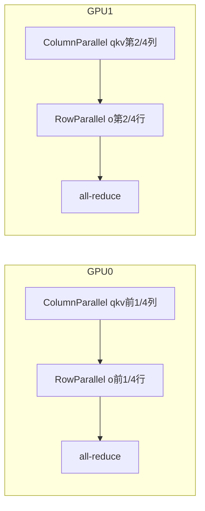

# 02 · 分布式并行

**入口目录**：[`code/vllm/vllm/distributed/`](../../code/vllm/vllm/distributed/)

## 五种并行度

| 并行类型 | 缩写 | 原理 | 关键文件 |
|---------|------|------|---------|
| **Tensor Parallelism** | TP | 权重矩阵在 GPU 间分片。`ColumnParallelLinear` / `RowParallelLinear` | `layers/linear.py` |
| **Pipeline Parallelism** | PP | 模型层在 GPU 间分片。`IntermediateTensors` 在 rank 间传递 | `v1/engine/core.py` (step_with_batch_queue) |
| **Data Parallelism** | DP | 多个引擎实例，各独立服务请求 | `v1/engine/coordinator.py` |
| **Context Parallelism** | CP | 长上下文的注意力计算跨 GPU 分片 | `distributed/kv_transfer/` |
| **Expert Parallelism** | EP | MoE 的 expert 权重分布在不同 GPU 上 | `distributed/eplb/` (Expert Load Balancing) |

实际部署中这些并行度可以组合：例如 TP=4, PP=2, DP=2 表示 4×2×2=16 GPU 的总部署。

## Tensor Parallelism (TP)

### 关键数据流

以 ColumnParallel + RowParallel 接力为例：



**关键优化**：Column → Row 之间不做 all-gather——直接传入分片数据，只在最后做一次 all-reduce。

### 通信原语

| 层 | 通信 |
|----|------|
| VocabParallelEmbedding | all-reduce（补齐缺失的 token embedding） |
| ColumnParallelLinear | 无（各 GPU 独立计算） |
| RowParallelLinear | all-reduce（汇总各 GPU 的部分和） |
| lm_head (ColumnParallel) | all-gather（拼接各 GPU 的 vocab 分片） |

## Pipeline Parallelism (PP)

PP 将模型层按 rank 切分。`IntermediateTensors` 是 rank 间传递的载体：

```python
class IntermediateTensors:
    hidden_states: torch.Tensor     # 中间 rank 传给下一个 rank 的 hidden states
    residual: torch.Tensor | None   # 残差连接的值
    
    def __getitem__(self, key): ...  # 从特定层取 hidden states
    def __setitem__(self, key, val): ...
```

PP 的关键优化在 `EngineCore.step_with_batch_queue()`：多批次在时间上**错峰流水线**，使调度与 GPU 计算重叠。单批路径如下：


典型重叠关系：**Batch B 的 schedule** 可与 **Batch A 在 GPU1 上的计算**同时进行；**Batch C** 再往后错位一轮（对照源码中的 batch queue 调度）。这样 CPU 调度与 GPU 执行重叠，设备利用率更高。

## Data Parallelism (DP)

### DPCoordinator

**源码**：[`code/vllm/vllm/v1/engine/coordinator.py`](../../code/vllm/vllm/v1/engine/coordinator.py)

在 DP>1 时，每个 GPU 运行一个独立的 `EngineCoreProc`（或 `DPEngineCoreProc`）。`DPCoordinator` 的职责：

1. **负载收集**：定期从各 engine 收集负载统计（running/received/finished 请求数）
2. **路由决策**：新请求路由到负载最低的 engine
3. **请求波（Request Waves）**：全局同步的暂停/运行状态——当需要 reconfig 或 update config 时，协调所有 engine 同步执行
4. **优雅关闭**：确保所有 engine 完成当前请求后才关闭

## KV 传输 — Prefill/Decode 分离式部署

**入口**：[`code/vllm/vllm/distributed/kv_transfer/`](../../code/vllm/vllm/distributed/kv_transfer/)

分离式（disaggregated）部署是生产环境的常见模式：prefill 节点算完 KV 缓存后通过网络传给 decode 节点。关键组件：

- `KVConnectorBase_V1`：抽象接口，定义 prefill → decode 的 KV 传输协议
- `NixlConnector` / `OffloadingConnector` 等具体实现：不同的网络传输层（RDMA / TCP / NVLink）
- 调度器层面的集成：prefill 后 KV 缓存被打包、序列化、网络传输，decode 端接收后插入本地的 KV cache

## 并行度的选择指南

| 场景 | 推荐配置 | 原因 |
|------|---------|------|
| 单 GPU >= 70GB (A100-80GB) | TP=1 | 不需要分片，单卡装得下 |
| 单 GPU < 模型大小 | TP=8 (或4) | 权重分片装多卡 |
| 需要高吞吐 | DP>1 | 让每个实例独立服务 |
| 长上下文 (< 1M tokens) | CP | 注意力计算跨卡分片 |
| MoE 模型 (DeepSeek V3) | EP=8 | Expert 权重分布 |

## 阅读入口

1. [`code/vllm/vllm/model_executor/layers/linear.py`](../../code/vllm/vllm/model_executor/layers/linear.py) — TP 在层级的实现
2. [`code/vllm/vllm/v1/engine/core.py`](../../code/vllm/vllm/v1/engine/core.py) — `step_with_batch_queue()` 的 PP pipeline
3. [`code/vllm/vllm/v1/engine/coordinator.py`](../../code/vllm/vllm/v1/engine/coordinator.py) — DP 协调
4. [`code/vllm/vllm/distributed/kv_transfer/`](../../code/vllm/vllm/distributed/kv_transfer/) — disaggregated KV 传输
