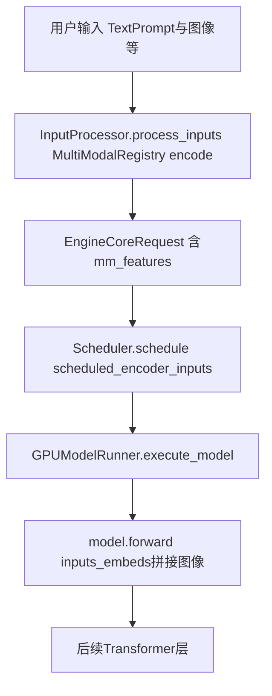

# 03 · 多模态

**入口目录**：[`code/vllm/vllm/multimodal/`](../../code/vllm/vllm/multimodal/)

## 处理流程（完整）



要点：`InputProcessor` 内完成 **find_processor → 编码图像 → mm_features → EngineCoreRequest**；调度器为多模态写入 **scheduled_encoder_inputs**；`execute_model` 若有 **mm_features** 则走 **inputs_embeds**，否则 **input_ids**；**forward** 将图像嵌入拼入序列后继续常规 Transformer。

| 模态 | 代表模型 | Encoder | MM Processor |
|------|---------|---------|-------------|
| **图像** | Llava, Qwen2-VL, InternVL, Phi-3-Vision | CLIP / SigLIP | LlavaProcessor, Qwen2VLProcessor |
| **视频** | Qwen2-VL, LLaVA-OneVision | 逐帧 CLIP，加时序位置编码 | Qwen2VLProcessor |
| **音频** | Whisper, Qwen-Audio | Whisper encoder | WhisperProcessor |
| **多模态混合** | Qwen2-VL, Chameleon | 图像 + 文本 encoder | 复合 processor |

## 关键组件

### MultiModalRegistry

**源码**：[`code/vllm/vllm/multimodal/registry.py`](../../code/vllm/vllm/multimodal/registry.py)

维护模型 → processor 的映射。`find_processor(model_config)` 根据模型配置返回对应的多模态 processor。

### MultiModalFeatureSpec

描述一个多模态特征在输入中的位置：

```python
class MultiModalFeatureSpec(msgspec.Struct):
    feature_type: str           # "image", "audio", "video"
    data: torch.Tensor          # encoder 产出的 embedding
    positions: list[int]        # 在 prompt 中的占位 token 位置
    mm_hashes: list[str]        # 用于 hash-based 缓存
```

### 在引擎中的集成

`InputProcessor` 是多模态处理的主入口：
1. 检查 `sampling_params.multi_modal_data` 是否非空
2. 调用 `MultiModalRegistry.find_processor()` 获取 processor
3. 调用 `processor.encode_mm_data()` 编码多模态数据
4. 替换 prompt 中的占位 token 为特殊 token
5. 填充 `EngineCoreRequest.mm_features`

### Hash-based 缓存

为避免对相同图像重复编码，vLLM 对输入做哈希缓存：
- 对图像/音频做 MD5 哈希
- 相同哈希的输入复用之前计算的 embedding
- 缓存 key = (model_id, mm_hash)

## 阅读入口

1. [`code/vllm/vllm/multimodal/registry.py`](../../code/vllm/vllm/multimodal/registry.py) — `MultiModalRegistry`
2. [`code/vllm/vllm/v1/engine/input_processor.py`](../../code/vllm/vllm/v1/engine/input_processor.py) — 多模态在 InputProcessor 中的处理
3. [`code/vllm/vllm/model_executor/models/vision.py`](../../code/vllm/vllm/model_executor/models/vision.py) — vision encoder 辅助
4. [`code/vllm/vllm/model_executor/models/llava.py`](../../code/vllm/vllm/model_executor/models/llava.py) — 看一个完整的多模态模型实现
5. [08-多模态权重加载.md](./08-多模态权重加载.md) — `WeightsMapper`、`AutoWeightsLoader` 与 vision / projector / language 加载分工
