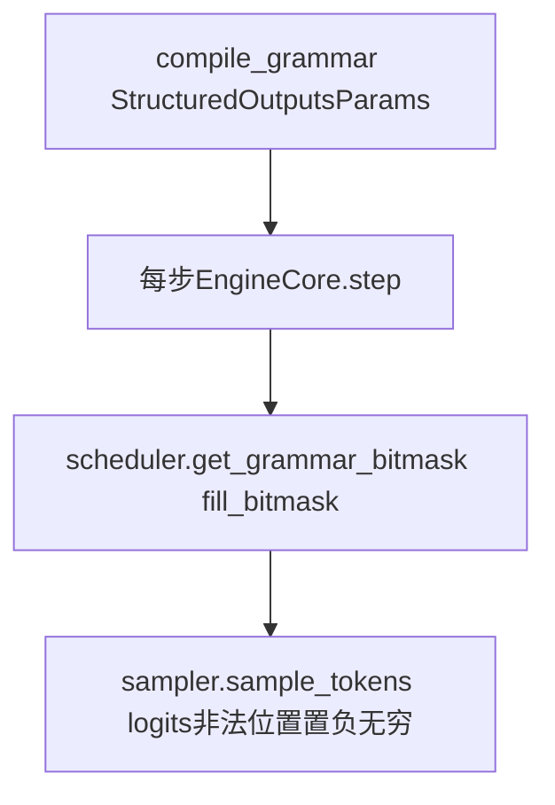

# 04 · 结构化输出

**入口目录**：[`code/vllm/vllm/v1/structured_output/`](../../code/vllm/vllm/v1/structured_output/)

## 原理

在某些步骤中，限制模型只能生成符合特定语法/格式的 token。例如要求输出 `{"name": "...", "age": ...}`，每步把不符合 JSON schema 的 token logit 置为 -inf，强制模型只能选合法路径。

## 四个后端

| 后端 | 文件 | 方法 | 特点 |
|------|------|------|------|
| **XGrammar** | `backend_xgrammar.py` | 语法约束位掩码 | 默认后端，支持 JSON schema / regex / GBNF grammar，性能最好 |
| **Outlines** | `backend_outlines.py` | FSM（有限状态机） | 索引生成速度快，适合复杂语法 |
| **LM Format Enforcer** | `backend_lm_format_enforcer.py` | 字符级别过滤 | 基于字符级 parser，支持自定义格式 |
| **Guidance** | `backend_guidance.py` | Guidance DSL | 基于 Guidance 库的 DSL 语法，灵活但性能较低 |

## 后端接口

```python
class StructuredOutputBackend(ABC):
    def compile_grammar(self, request_type, grammar_spec) -> Any: ...
    def allocate_token_bitmask(self, max_num_seqs) -> torch.Tensor: ...
    def fill_bitmask(self, grammar, bitmask, batch_indices, ...) -> None: ...
    def destroy_grammar(self, grammar) -> None: ...
    def clone_grammar(self, grammar) -> Any: ...
```

### XGrammar 的具体流程



**bitmask**：合法 token 位为 1；采样前将非法位置的 logits 置为 **-inf**。

在 `EngineCore.step()` 中：

```python
def step(self):
    # 步骤 1: 调度
    scheduler_output = self.scheduler.schedule()

    # 步骤 2: 执行前向
    model_output = self.executor.execute_model(scheduler_output)

    # 步骤 3: 获取语法约束
    grammar_output = self.scheduler.get_grammar_bitmask(scheduler_output)
    # → bitmask tensor: [num_reqs, vocab_size]

    # 步骤 4: 采样（应用 bitmask）
    if grammar_output is not None:
        model_output = self.executor.sample_tokens(grammar_output)
    # sampler 内部: logits[bitmask == 0] = -inf → 采样自动避开
    
    # 步骤 5: 更新状态
    outputs = self.scheduler.update_from_output(scheduler_output, model_output)
```

## 支持的约束格式

| 格式 | 示例 | 后端 |
|------|------|------|
| **JSON Schema** | `{"type": "object", "properties": {"name": {"type": "string"}}}` | XGrammar, Outlines |
| **Regex** | `(foo\|bar)\d+` | XGrammar, Outlines |
| **GBNF Grammar** | `root ::= "yes" \| "no"` | XGrammar |
| **Choice** | `["positive", "negative", "neutral"]` | 所有 |
| **Structural Tag** | `<function_call>` ... `</function_call>` | XGrammar |

## 阅读入口

1. [`code/vllm/vllm/v1/structured_output/backend_xgrammar.py`](../../code/vllm/vllm/v1/structured_output/backend_xgrammar.py) — 默认后端
2. [`code/vllm/vllm/v1/structured_output/__init__.py`](../../code/vllm/vllm/v1/structured_output/__init__.py) — 工厂类 `StructuredOutputManager`
3. 在 `EngineCore.step()` 中追踪 `get_grammar_bitmask()` → `sample_tokens()` 的协作
