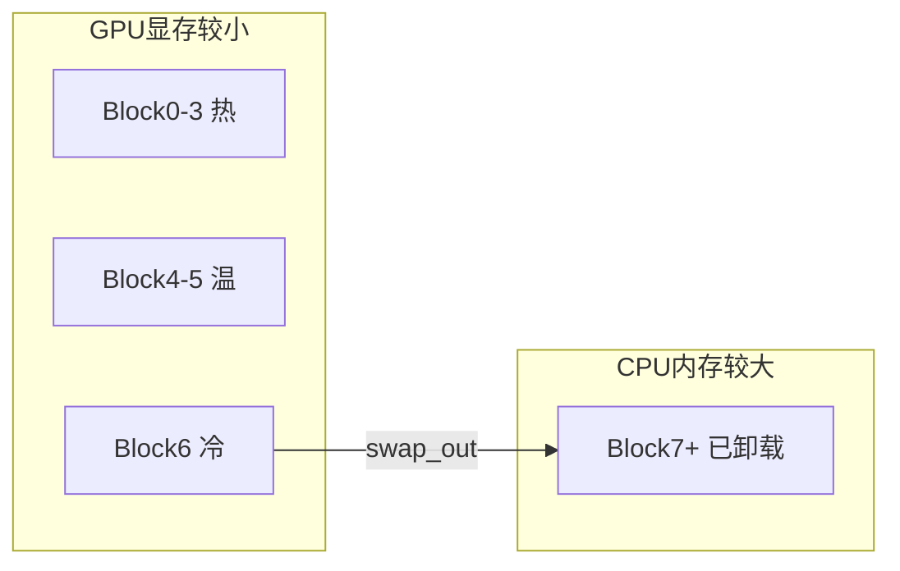

# 05 · 量化与 KV 缓存卸载

## 量化

**入口**：[`code/vllm/vllm/model_executor/layers/quantization/`](../../code/vllm/vllm/model_executor/layers/quantization/)

vLLM 支持多种模型权重量化方法，在保持推理质量的同时减少显存占用和内存带宽。

### 支持的量化方法

| 方法 | 比特数 | 特点 |
|------|--------|------|
| **GPTQ** | 4-bit | Group-wise 量化，成熟稳定，生态好 |
| **AWQ** | 4-bit | Activation-aware，保护重要通道，质量优于 GPTQ |
| **FP8** | 8-bit | H100/H800 原生支持（Transformer Engine），速度接近 fp16 |
| **Marlin** | 4-bit | 专为 GPU 优化的 int4 kernel，速度最快 |
| **BitsAndBytes** | 8/4-bit | HuggingFace 集成，使用方便但速度一般 |
| **Compressed-Tensors** | 混合 | 稀疏 + 量化混合，灵活度高 |
| **GGUF** | 多种 | llama.cpp 格式，CPU/GPU 混合推理 |
| **HQQ/MXFP4** | 4-bit | 新兴量化方案 |
| **TPU_INT8** | 8-bit | TPU 专用 |

### 集成方式

量化通过 `QuantizeMethodBase` 接口集成：

```python
class QuantizeMethodBase(ABC):
    def create_weights(self, layer, input_size_per_partition, ...) -> None: ...
    def apply(self, layer, x, bias=None) -> torch.Tensor: ...
    def process_weights_after_loading(self, layer) -> None: ...
```

每个 `ColumnParallelLinear` / `RowParallelLinear` 等层的构造过程中，量化方法被注入：

```python
# linear.py 中的 ColumnParallelLinear.__init__()
if self.quant_method is not None:
    self.quant_method.create_weights(self, ...)
# forward 时
output = self.quant_method.apply(self, input_)  # 可能走量化 kernel
```

## KV 缓存卸载

**入口**：[`code/vllm/vllm/v1/kv_offload/`](../../code/vllm/vllm/v1/kv_offload/)

当 GPU 显存不够存全部 KV 缓存时，把不常用的 KV 块换到 CPU 内存（换页到更慢但更大的存储）。

### 淘汰策略

| 策略 | 文件 | 原理 |
|------|------|------|
| **ARC** | `arc_manager.py` | Adaptive Replacement Cache — 自适应平衡 recency 和 frequency。维护 LRU + LFU 两个队列 |
| **LRU** | `lru_manager.py` | Least Recently Used — 优先淘汰最久未访问的块，简单高效 |

### 卸载流程



示意：冷块换出到 CPU；当 **Block6** 再次被访问时 **CPU → GPU swap in**（有延迟，但可避免 OOM）。

### EngineCore sleep/wake_up — 弹性调度

`EngineCore.sleep(level)` / `wake_up(tags)` 支持弹性 GPU 资源调度：

```python
class EngineCore:
    def sleep(self, level: int = 0):
        """休眠引擎，释放 GPU 资源"""
        if level == 0:
            # 暂停调度，不释放显存
        elif level == 1:
            # 卸载模型权重到 CPU
        elif level == 2:
            # 卸载全部（模型 + KV 缓存）
        self._set_sleep_state(level)

    def wake_up(self, tags: list[str] | None = None):
        """恢复引擎"""
        # 将模型权重/KV 缓存从 CPU 恢复到 GPU
        # tags 用于精细控制恢复哪些部分
```

这支持了生产环境的弹性 GPU 调度：引擎可被休眠后恢复到其他 GPU，支持 spot/preemptible instance 的优雅处理。

## 阅读入口

1. [`code/vllm/vllm/model_executor/layers/quantization/`](../../code/vllm/vllm/model_executor/layers/quantization/) — 各种量化方法的实现
2. [`code/vllm/vllm/v1/kv_offload/`](../../code/vllm/vllm/v1/kv_offload/) — KV 卸载策略
3. [`code/vllm/vllm/v1/engine/core.py`](../../code/vllm/vllm/v1/engine/core.py) — `sleep()` / `wake_up()` 方法
4. [07-Kimi-K2.6量化与权重加载.md](./07-Kimi-K2.6量化与权重加载.md) — Moonshot Kimi-K2.6、`compressed-tensors` INT4 与 `AutoWeightsLoader` 加载路径
