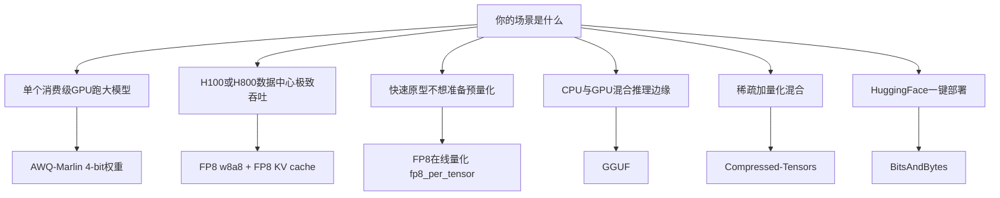

# 06 · 量化模型部署方式

了解量化方法的技术细节后，本章聚焦**如何在实际环境中部署量化模型**。所有 CLI 参数定义在 [`code/vllm/vllm/engine/arg_utils.py`](../../code/vllm/vllm/engine/arg_utils.py) 的 `EngineArgs` 中。

## 1. 部署 CLI 完整参数

### 模型量化参数

```
--quantization, -q    量化方法，如 "awq", "fp8", "gptq_marlin", "fp8_per_tensor"
--dtype               模型权重/激活精度："auto", "half", "bfloat16", "float16"
--load-format         模型加载格式："auto", "safetensors", "gguf", "bitsandbytes"
```

### KV 缓存量化参数

```
--kv-cache-dtype             KV 缓存存储格式，默认 "auto"
                             支持: "fp8", "fp8_e4m3", "fp8_e5m2", "fp8_inc",
                                   "fp8_ds_mla", "fp8_per_token_head",
                                   "int8_per_token_head", "nvfp4",
                                   "turboquant_k8v4" 等 TurboQuant 预设
--kv-cache-dtype-skip-layers  跳过量化的层（如 "0", "1", "sliding_window"）
```

### 其他相关参数

```
--override-attention-dtype    覆盖 attention 计算精度（ROCm 平台常用）
--allow-deprecated-quantization  允许已废弃的量化方法
```

## 2. 量化方法选型指南

根据 GPU 型号和部署场景选择合适的量化方法：

| GPU 级别 | 显存 | 推荐量化 | 能跑模型规模 |
|----------|------|---------|-------------|
| **消费级 (RTX 3090/4090)** | 24GB | AWQ / GPTQ-Marlin (4-bit) | 70B 模型（如 Llama-3-70B） |
| **消费级 (RTX 4060/4070)** | 12-16GB | AWQ + 8-bit KV cache | 13B-30B 模型 |
| **数据中心 (A100-80GB)** | 80GB | AWQ / GPTQ-Marlin | 405B 模型（如 Llama-3-405B） |
| **数据中心 (H100/H800)** | 80GB | FP8 (w8a8) + FP8 KV cache | 405B 模型，最高吞吐 |
| **边缘设备** | 8-16GB | GGUF (4-bit) + CPU offload | 7B-13B 模型 |

### 方法对比速查

| 方法 | 权重精度 | 激活精度 | 显存节省 | 速度 | 适用 GPU | 部署复杂度 |
|------|---------|---------|---------|------|---------|-----------|
| **AWQ-GPTQ-Marlin** | INT4 | FP16 | ~4x | 最快 | SM 75+ | 中（需预量化模型） |
| **FP8** | FP8 | FP8/BF16 | ~2x | 很快 | H100 原生最佳 | 低（支持在线量化） |
| **BitsAndBytes** | INT4/INT8 | FP16 | ~4x/~2x | 一般 | 通用 | 最低（自动处理） |
| **GGUF** | INT4/INT8 | FP16 | ~2-4x | 一般 | CPU+GPU | 低（下载即用） |
| **Compressed-Tensors** | 混合 | FP16 | 灵活 | 灵活 | 通用 | 高（需了解配置） |

### 选型决策树



## 3. 离线量化 vs 在线量化

### 离线量化：使用预量化模型

模型已在 HuggingFace 上以量化格式发布（如 `hugging-quants/Meta-Llama-3-70B-Instruct-AWQ-INT4`）。部署时直接加载，无需转换：

```bash
# AWQ 预量化模型部署
vllm serve hugging-quants/Meta-Llama-3-70B-Instruct-AWQ-INT4 \
    --quantization awq \
    --dtype half \
    --max-model-len 8192

# GPTQ-Marlin 预量化模型部署（性能优于纯 GPTQ）
vllm serve TheBloke/Llama-2-70B-GPTQ \
    --quantization gptq_marlin \
    --dtype half
```

优点：加载快、无需量化计算。缺点：依赖社区发布预量化版本。

### 在线量化：加载时自动量化

从 BF16/FP16 原始模型出发，加载时自动量化为目标精度。vLLM 支持多种在线量化方案：

```bash
# FP8 在线量化（block-wise 128x128，推荐）
vllm serve meta-llama/Meta-Llama-3-70B-Instruct \
    --quantization fp8_per_block \
    --dtype bfloat16

# FP8 在线量化（per-tensor，更简单但精度略低）
vllm serve meta-llama/Meta-Llama-3-70B-Instruct \
    --quantization fp8_per_tensor \
    --dtype bfloat16

# 通用在线量化（通过 quantization_config 精细控制）
vllm serve meta-llama/Meta-Llama-3-70B-Instruct \
    --quantization online \
    --dtype bfloat16
```

在线量化的配置定义在 [`code/vllm/vllm/engine/arg_utils.py`](../../code/vllm/vllm/engine/arg_utils.py) 的 `OnlineQuantizationConfigArgs` 中。

在线量化使用 **meta device 加载**（`uses_meta_device = True`）：先在 `device="meta"` 上创建空张量，加载权重后再物化和量化，峰值显存更低。

## 4. FP8 KV 缓存部署

FP8 KV 缓存能将 KV 缓存显存减半（相比 FP16），同时质量损失极小。这是 vLLM 生产部署的标配。

### 基本部署

```bash
# 最简单的 FP8 KV cache 部署
vllm serve meta-llama/Meta-Llama-3-8B-Instruct \
    --kv-cache-dtype fp8 \
    --dtype half

# 配合 per-token-head 量化（更精细的 scaling）
vllm serve meta-llama/Meta-Llama-3-70B-Instruct \
    --kv-cache-dtype fp8_per_token_head \
    --dtype bfloat16
```

### 自动检测

当 `--kv-cache-dtype auto`（默认）时，vLLM 自动读取模型 checkpoint 中的 `quantization_config.kv_cache` 字段。例如 DeepSeek V3.2 的 HF config 中包含 `"kv_cache": {"quant_method": "fp8"}`，引擎自动启用 FP8 KV 缓存。

### 跳过敏感层

某些层（如首尾几层）对 KV 量化更敏感，可以跳过：

```bash
vllm serve meta-llama/Meta-Llama-3-70B-Instruct \
    --kv-cache-dtype fp8 \
    --kv-cache-dtype-skip-layers "0" "1" "sliding_window"
```

TurboQuant 部署时首尾各 2 层自动加入 skip 列表——引擎在 [`arg_utils.py:1672-1695`](../../code/vllm/vllm/engine/arg_utils.py#L1672) 中处理。

### KV 缓存 dtype 全景

| `kv_cache_dtype` 值 | 精度 | 适用场景 |
|---------------------|------|---------|
| `fp8` / `fp8_e4m3` | 8-bit | 通用，H100 推荐 |
| `fp8_e5m2` | 8-bit（更大范围） | attention score 分布宽时 |
| `fp8_per_token_head` | 8-bit per-token-per-head | 最精细 scaling，质量最好 |
| `int8_per_token_head` | 8-bit int | 与 FP8 类似，int 范围 |
| `nvfp4` | 4-bit | Blackwell GPU 专用（SM 100+） |
| `turboquant_k8v4` | K:8bit, V:4bit | TurboQuant 旋转量化 |
| `turboquant_3bit_nc` | 3-bit | 极致压缩（~4.9x vs FP16） |

## 5. GPU 兼容性矩阵

每种量化方法有最低 GPU 计算能力要求。定义在各 `QuantizationConfig` 子类的 `get_min_capability()` 中。

| GPU 系列 | SM 能力 | 代表型号 | 支持的量化 |
|----------|---------|---------|-----------|
| **Blackwell** | 100 | B200, B100 | 全部方法 + NVFP4 + MXFP4 |
| **Hopper** | 90 | H100, H800 | 全部方法（FP8 原生支持，FlashAttention-3） |
| **Ada Lovelace** | 89 | RTX 4090, L40S | AWQ, GPTQ, FP8 (emulated), BitsAndBytes |
| **Ampere** | 80 | A100, A6000 | AWQ, GPTQ, FP8 (emulated) |
| **Turing** | 75 | T4, RTX 2080 | AWQ, GPTQ, BitsAndBytes |
| **Volta** | 70 | V100 | BitsAndBytes, GGUF |
| **AMD CDNA3** | — | MI300X | AWQ, FP8 (FNUZ 格式，scale 自动 ×2 适配) |
| **Apple Silicon** | — | M1/M2/M3 Ultra | GGUF（CPU+GPU 混合） |

FP8 原生 vs emulated 的关键差异：H100 的 FP8 Tensor Core 提供硬件加速（`torch.float8_e4m3fn`），其他 GPU 通过软件模拟，性能提升有限。

## 6. 典型部署方案

### 方案 1：70B 模型跑在单张 24GB GPU

```bash
# 使用 AWQ-Marlin 4-bit 量化 + FP8 KV cache
# 显存占用: ~18GB 权重 + ~4GB KV cache ≈ 22GB
vllm serve hugging-quants/Meta-Llama-3-70B-Instruct-AWQ-INT4 \
    --quantization awq_marlin \
    --dtype half \
    --kv-cache-dtype fp8 \
    --max-model-len 4096 \
    --gpu-memory-utilization 0.92 \
    --max-num-seqs 8
```

关键参数：`gpu-memory-utilization 0.92` 将 92% 显存用于 KV cache，`max-model-len 4096` 限制上下文长度以控制 KV 缓存大小。

### 方案 2：H100 生产级高吞吐 API 服务

```bash
# FP8 在线量化 + FP8 KV cache，最大化吞吐
vllm serve meta-llama/Meta-Llama-3-70B-Instruct \
    --quantization fp8_per_block \
    --dtype bfloat16 \
    --kv-cache-dtype fp8 \
    --max-model-len 32768 \
    --max-num-seqs 256 \
    --gpu-memory-utilization 0.95 \
    --tensor-parallel-size 1
```

H100 的 FP8 Tensor Core 提供 ~2x TFLOPs vs FP16。配合 FP8 KV cache，同等显存可容纳 2x 长度的上下文。

### 方案 3：消费级边缘部署（MacBook / 单卡 RTX 4060）

```bash
# GGUF 4-bit，支持 CPU offload
vllm serve bartowski/Llama-3.2-3B-Instruct-GGUF \
    --quantization gguf \
    --dtype half \
    --max-model-len 4096 \
    --gpu-memory-utilization 0.85 \
    --cpu-offload-gb 8
```

GGUF 的优势：生态成熟（llama.cpp），CPU+GPU 混合推理天然支持，下载即用。

### 方案 4：极致压缩（稀疏 + 量化 + TurboQuant）

```bash
# Compressed-Tensors 稀疏量化 + TurboQuant KV cache
vllm serve neuralmagic/Llama-3.1-70B-Instruct-FP8 \
    --quantization compressed-tensors \
    --kv-cache-dtype turboquant_k8v4 \
    --dtype bfloat16 \
    --max-model-len 131072 \
    --gpu-memory-utilization 0.95
```

TurboQuant 通过 Hadamard 旋转 + Lloyd-Max 标量量化实现 K:8bit/V:4bit 的 KV 缓存。相比 FP16 节省 ~2.6x，同时保持较高精度。配置时自动将首尾各 2 层加入 skip 列表（FlashAttention 3 不兼容）。

## 7. 性能预期

### 显存节省

| 量化方式 | vs BF16/FP16 | 70B 模型典型显存 |
|---------|-------------|-----------------|
| BF16（基准） | 1x | ~140GB |
| FP8 w8a8 | ~2x | ~70GB |
| AWQ/GPTQ 4-bit | ~4x | ~35GB |
| AWQ 4-bit + FP8 KV | ~4x + KV 再减半 | ~30GB |
| NVFP4（Blackwell）| ~4x | ~35GB |

### 吞吐影响

| 方法 | Prefill 吞吐 | Decode 吞吐 | 说明 |
|------|-------------|------------|------|
| AWQ-Marlin | 接近 BF16 | 接近 BF16 | Marlin kernel 高度优化 |
| FP8 (H100) | **超 BF16** | **超 BF16** | FP8 Tensor Core 2x TFLOPs |
| FP8 (A100) | 略低 BF16 | 接近 BF16 | 无 FP8 硬件，软件模拟 |
| GPTQ (旧 kernel) | 略低 BF16 | 接近 BF16 | 建议迁移到 GPTQ-Marlin |
| BitsAndBytes | 明显低于 BF16 | 明显 BF16 | 通用实现，未做深度优化 |
| GGUF | 取决于 CPU 速度 | 取决于 CPU 速度 | CPU-GPU 带宽是瓶颈 |

### 首 Token 延迟 vs 解码吞吐的权衡

```
在线量化（FP8）：加载时间 +5~10 分钟，运行时吞吐最高
离线量化（AWQ）：加载时间正常，运行时吞吐接近在线量化
```

在线量化首次加载时需要逐层量化 BF16→FP8，但加载后推理效率与离线预量化模型完全相同。对长期运行的生产服务来说，一次性加载成本可接受。

## 8. 注意事项

1. **AWQ/GPTQ 不支持 `torch.float32` 激活**——必须使用 `--dtype half`（FP16）或 `bfloat16`。
2. **BitsAndBytes 预量化模型不支持张量并行**（TP>1），引擎加载时主动验证并报错。
3. **TurboQuant 强制 FlashAttention 2**——如果环境配置了 FA3，引擎自动降级。
4. **投机解码中 draft model 自动继承 target model 量化**——如果 target model 用 AWQ，draft model 也会被 AWQ 量化，无需单独配置。
5. **已废弃方法**（`fbgemm_fp8`, `fp_quant`, `tpu_int8`）需 `--allow-deprecated-quantization` 才能使用——不推荐。
6. **AMD MI300X 使用 FNUZ FP8 格式**——与 NVIDIA 的 E4M3 不同，引擎自动调整 scale factor（×2）以适配。

## 阅读重点

- 根据 GPU 型号和场景选量化方法：H100→FP8，消费级→AWQ-Marlin，边缘→GGUF
- 掌握两个关键 CLI 参数：`--quantization`（模型量化）和 `--kv-cache-dtype`（KV 缓存量化）
- 生产部署标配 FP8 KV cache（`--kv-cache-dtype fp8`），显存减半
- 在线量化（`fp8_per_block`）允许从 BF16 checkpoint 直接部署，无需预量化模型
- 查看 `--help` 获取完整参数列表，或直接看 `arg_utils.py` 中 `EngineArgs` 定义

## 参见

- [07-Kimi-K2.6量化与权重加载.md](./07-Kimi-K2.6量化与权重加载.md)：`compressed-tensors` / pack-quantized 与 Kimi-K2.6 权重命名、`AutoWeightsLoader` 分层加载说明（部署 CLI 仍以本章为准）。
