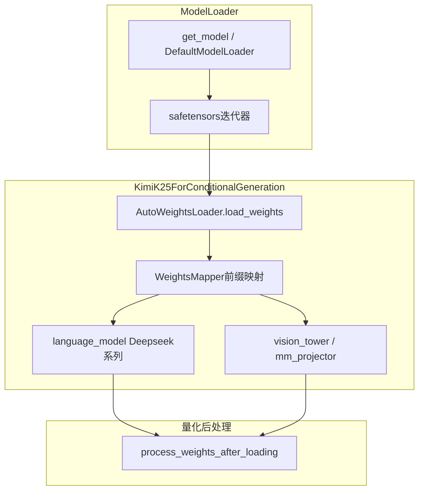

# 07 · Kimi-K2.6 量化支持与权重加载

本章说明 **Moonshot `Kimi-K2.6`（Hugging Face）** 在 vLLM 中的模型入口、`compressed-tensors` INT4 量化形态，以及权重如何从 checkpoint 写入模块参数；并对比纯文本 **`KimiLinearForCausalLM`** 另一条实现路径。

**前置阅读**：[05-模型实现/02-模型注册与加载.md](../05-模型实现/02-模型注册与加载.md)（`get_model` → `load_model` → `load_weights` → `process_weights_after_loading` 总流程）。

**源码路径**：本地若已按仓库约定放置 vLLM，可对读  
[`code/vllm/vllm/model_executor/models/kimi_k25.py`](../../code/vllm/vllm/model_executor/models/kimi_k25.py)、[`kimi_linear.py`](../../code/vllm/vllm/model_executor/models/kimi_linear.py)、[`deepseek_v2.py`](../../code/vllm/vllm/model_executor/models/deepseek_v2.py)、[`model_executor/layers/quantization/compressed_tensors/`](../../code/vllm/vllm/model_executor/layers/quantization/compressed_tensors/)（未克隆时可用 [vLLM 上游 main](https://github.com/vllm-project/vllm/tree/main/vllm/model_executor) 对照）。

---

## 1. 两类 checkpoint：不要混淆

| 场景 | Hugging Face 典型声明 | vLLM 入口 |
|------|----------------------|-----------|
| **多模态 Kimi-K2.6（HF 主仓库）** | 顶层 `architectures`: **`KimiK25ForConditionalGeneration`**；`text_config` 内常为 **`DeepseekV3ForCausalLM`**，`quantization_config.quant_method`: **`compressed-tensors`** | [`KimiK25ForConditionalGeneration`](https://github.com/vllm-project/vllm/blob/main/vllm/model_executor/models/kimi_k25.py)：ViT + `mm_projector` + **内嵌语言模型** |
| **独立文本 Kimi Linear** | **`KimiLinearForCausalLM`**（registry 映射 `("kimi_linear", "KimiLinearForCausalLM")`） | [`KimiLinearForCausalLM`](https://github.com/vllm-project/vllm/blob/main/vllm/model_executor/models/kimi_linear.py)：混合 MLA / KDA / MoE |

下文「Kimi-K2.6」默认指 **HF 多模态权重 + KimiK25 外壳**，除非你本地使用的是 Linear 变体。

---

## 2. HF `quantization_config` 大致长什么样（INT4）

官方权重常在 **`text_config`** 中带 **`quantization_config`**（以下为结构性摘要，具体字段以模型仓库 `config.json` 为准）：

- **`quant_method`**: `compressed-tensors`
- **`format`**: `pack-quantized`
- **权重量化**：例如对 **`Linear`** 做 **group-wise INT4**（如 `group_size=32`、`symmetric` 等）
- **`ignore`**：正则列表跳过 **`self_attn`**、**`shared_experts`**、dense **`mlp`** 的 **gate/up/down**、**`lm_head`**、**`vision_tower` / `mm_projector`** 等  

直观理解：**大量注意力与共享/dense 投影仍以高精度存放；packed INT4 主要落在 MoE 路由到的 expert 等符合规则的 Linear 上**（与 `ignore` 设计一致）。

运行时 vLLM 将该 JSON 解析为 **`CompressedTensorsConfig`**，各并行线性层 / MoE 通过 **`QuantizeMethod`** 完成 **`create_weights`** → **加载期 `weight_loader`** → **`process_weights_after_loading`**。

---

## 3. 视觉塔为何不套用全局 compressed-tensors

[`kimi_k25.py`](https://github.com/vllm-project/vllm/blob/main/vllm/model_executor/models/kimi_k25.py) 构造 **`vision_tower`** 与 **`mm_projector`** 时使用 **`_maybe_ignore_quant_config`**：

- 若全局 **`quant_config`** 是 **`CompressedTensorsConfig`**，则对 ViT / projector 传入 **`quant_config=None`**。
- 避免把「文本侧打包量化规则」误施加到视觉分支（与 checkpoint 中 vision 多为 BF16、且 `ignore` 含 vision 相关前缀的常见布局一致）。

语言主干仍使用完整的 **`vllm_config.quant_config`**。

---

## 4. 语言主干类名：`init_vllm_registered_model` 会覆盖 HF `architectures`

内嵌语言模型通过 **`init_vllm_registered_model`** 创建（[`models/utils.py`](https://github.com/vllm-project/vllm/blob/main/vllm/model_executor/models/utils.py)）：

- 内部调用 **`vllm_config.with_hf_config(hf_config, architectures=...)`**，用传入的 **`architectures`** 覆盖解析用的架构列表。
- **`kimi_k25.py` 当前传入 `architectures=["DeepseekV2ForCausalLM"]`**，因此 **即便 `text_config.architectures` 写的是 `DeepseekV3ForCausalLM`，解析语言模型类时也会按 V2 名称走注册表**。

Registry 中 **`DeepseekV2ForCausalLM`** 与 **`DeepseekV3ForCausalLM`** 均映射到 **`deepseek_v2`** 模块下的不同类；**是否与 Moonshot 权重完全对齐取决于上游版本与模型卡**。升级 vLLM 或换 revision 时，建议对照：

1. HF **`text_config.architectures`**  
2. **`kimi_k25.py` 中的 `architectures=[...]`**  
3. 对应 **`DeepseekV3ForCausalLM.load_weights`** 与权重命名是否匹配  

---

## 5. 权重加载：`KimiK25ForConditionalGeneration`

### 5.1 总流程

### 5.2 入口与前缀映射

- **`load_weights`**：`AutoWeightsLoader(self).load_weights(weights, mapper=self.hf_to_vllm_mapper)`。
- **`hf_to_vllm_mapper`**（[`WeightsMapper`](https://github.com/vllm-project/vllm/blob/main/vllm/model_executor/models/utils.py)）：例如  
  - `language_model.layers.` → `language_model.model.layers.`（兼容历史 NVFP4 checkpoint）  
  - `mm_projector.proj.0` / `.2` → `mm_projector.linear_1` / `linear_2`  

### 5.3 `AutoWeightsLoader` 如何落到「子模块」或「每个 Parameter」

[`AutoWeightsLoader`](https://github.com/vllm-project/vllm/blob/main/vllm/model_executor/models/utils.py) 对权重名按 **第一层前缀** 分组：

- 若子模块实现了 **`load_weights`**，则把该前缀下的 tensor **整包交给子模块**（例如语言模型的 **`DeepseekV3ForCausalLM.load_weights`**），避免外层逐参数猜测布局。
- 否则匹配 **直连 `nn.Parameter`**：对每个 param 调用 **`param.weight_loader`**（若存在），否则 **`default_weight_loader`**。

**packed INT4**：解压与写入缓冲区通常在各层的 **`weight_loader`** 中完成（由 **`compressed_tensors`** 量化方法挂载），而不是在 `kimi_k25.py` 里手写循环。

---

## 6. 权重加载：`KimiLinearForCausalLM`（文本 Linear 变体）

若 checkpoint 声明 **`KimiLinearForCausalLM`**：

- **顶层**：**`KimiLinearForCausalLM.load_weights`** → **`AutoWeightsLoader`**（若 **`tie_word_embeddings`**，可跳过 **`lm_head.`** 前缀）。
- **核心**：**`KimiLinearModel.load_weights`** 手写迭代（[`kimi_linear.py`](https://github.com/vllm-project/vllm/blob/main/vllm/model_executor/models/kimi_linear.py)）：
  - **`stacked_params_mapping`**：`gate_proj` / `up_proj` → **`MergedColumnParallelLinear`** 的 **`gate_up_proj`** 分 shard 写入。
  - **MoE**：**`fused_moe_make_expert_params_mapping`**，checkpoint 中 **`w1`/`w2`/`w3`** 与 expert id、shard 对齐 **`FusedMoE`**。
  - **其它参数**：**`weight_loader`** 或 **`default_weight_loader`**；**`maybe_remap_kv_scale_name`** 处理 FP8 KV scale 等命名。
  - 跳过 speculative layer、部分 **rotary** 缓存等非训练权重。

---

## 7. 调试与验证建议

1. 设置 **`VLLM_LOGGING_LEVEL=DEBUG`**，观察 **`AutoWeightsLoader`** 调试日志（上游文档字符串推荐）。
2. 对照 HF **`config.json`** 的 **`quantization_config`** 与 **`ignore`**，确认哪些模块应为 BF16、哪些为 packed INT4。
3. **版本对齐**：与本学习路径声明的 **`code/vllm`（如 v0.20.0）** 或你部署用的 wheel **保持一致**，再打开对应 tag 下的 **`kimi_k25.py` / `deepseek_v2.py`**，避免「文档引用 main、本地却是旧版」的偏差。

---

## 延伸阅读

- [05-量化与KV卸载.md](./05-量化与KV卸载.md)：`QuantizeMethodBase` 与并行层注入方式  
- [06-量化模型部署.md](./06-量化模型部署.md)：CLI 参数与部署选型  
- vLLM Recipes（若可用）：Moonshot 模型用法参见官方 [recipes 文档](https://docs.vllm.ai/projects/recipes/)
