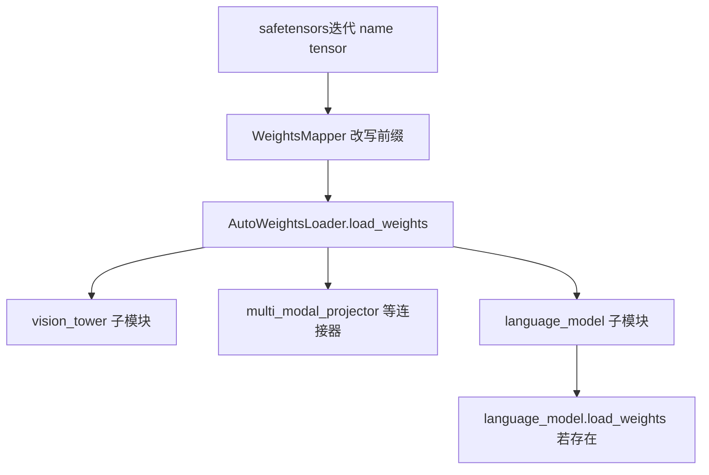

# 08 · 多模态权重加载

多模态因果模型在 vLLM 中通常是 **单个大 `nn.Module`**，内部再拆成 **视觉塔（tower）**、**连接器（projector）**、**语言主干（language model）** 等子模块。加载权重时走与普通模型相同的总路径：**`loader.load_model` → `initialize_model` → 顶层 `load_weights`**，差别主要在于 **HF checkpoint 前缀与 vLLM 子模块命名不一致时要用 `WeightsMapper`**，以及部分模型对 **视觉分支单独处理量化配置**。

**前置阅读**：[03-多模态.md](./03-多模态.md)（输入与 forward 数据流）、[05-模型实现/02-模型注册与加载.md](../05-模型实现/02-模型注册与加载.md)（`AutoWeightsLoader`）、[07-Kimi-K2.6量化与权重加载.md](./07-Kimi-K2.6量化与权重加载.md)（压缩量化下视觉塔 `quant_config=None` 的示例）。

**源码入口**（本地若有 `code/vllm`）：[`model_executor/models/llava.py`](../../code/vllm/vllm/model_executor/models/llava.py)、[`models/utils.py`](../../code/vllm/vllm/model_executor/models/utils.py) 中的 `AutoWeightsLoader` / `WeightsMapper`。

---

## 1. 总体思路：仍是「一次遍历 + 按前缀分发」



- **`WeightsMapper`**：在遍历权重前把 checkpoint 里的 **`orig_prefix`** 批量替换为 vLLM 里的 **`new_prefix`**，使 tensor 名与 `named_modules()` / `named_parameters()` 对齐。
- **`AutoWeightsLoader`**：按 **第一层前缀** 把权重组分发到子模块；若子模块实现了自己的 **`load_weights`**，则整包交给该子模块（与纯文本模型一致）。

---

## 2. LLaVA 系：`hf_to_vllm_mapper` 典型映射

以 **`LlavaForConditionalGeneration`** 实现为例（[`llava.py`](https://github.com/vllm-project/vllm/blob/main/vllm/model_executor/models/llava.py)），HF（Transformers ≥4.52 常见命名）与 vLLM 模块前缀对应关系为：

| HF checkpoint 前缀（示意） | vLLM 模块前缀 |
|---------------------------|---------------|
| `model.language_model.` | `language_model.model.` |
| `model.vision_tower.` | `vision_tower.` |
| `model.multi_modal_projector.` | `multi_modal_projector.` |
| `lm_head.` | `language_model.lm_head.` |

顶层加载代码形式为：

```python
def load_weights(self, weights):
    loader = AutoWeightsLoader(self)
    return loader.load_weights(weights, mapper=self.hf_to_vllm_mapper)
```

**含义**：无需为多模态单独写一套 safetensors 解析逻辑；**先把名字对齐**，再走与文本模型相同的 **`AutoWeightsLoader`** 分发。

**模块语义拆分**（[`get_mm_mapping()`](https://github.com/vllm-project/vllm/blob/main/vllm/model_executor/models/llava.py) 一类接口）：

- **`tower_model`**：`vision_tower` — CLIP / SigLIP / Pixtral 等视觉编码器权重。
- **`connector`**：`multi_modal_projector` — 将 vision hidden 映射到语言模型 hidden。
- **`language_model`**：decoder 主干（内部可能是 `LlamaForCausalLM` 等注册类），仍可使用 **`packed_modules_mapping` / `stacked_params_mapping`** 做 QKV、gate_up 等融合加载。

---

## 3. 语言主干如何实例化：`init_vllm_registered_model`

多模态类通常在 **`with self._mark_language_model(vllm_config):`** 上下文中调用 **`init_vllm_registered_model`**，传入 **`text_config`/`hf_text_config`** 与可选 **`architectures=[...]`** 覆盖，从而 **复用已有文本模型的实现与 `load_weights`**（与 Kimi-K25、InternVL 等模式一致）。视觉塔则多在 **`_mark_tower_model`** 下单独 `nn.Module` 构建。

因此：**同一 checkpoint 里语言部分的权重命名**，最终仍由 **具体 `ForCausalLM` 类** 的加载逻辑消费（含 TP 分片、`weight_loader`、量化等）。

---

## 4. 量化与多模态视觉分支

全局 **`quant_config`**（如 `CompressedTensorsConfig`）往往针对 **语言侧 Linear/MoE** 设计。部分实现会对 **视觉塔 / projector** 传入 **`quant_config=None`** 或单独 **`_maybe_ignore_quant_config`**，避免把文本侧的打包量化规则误施加到 CNN/ViT 结构上（参见 [07-Kimi-K2.6量化与权重加载.md](./07-Kimi-K2.6量化与权重加载.md) 中 **`kimi_k25.py`** 的写法）。

是否跳过、如何跳过 **以具体模型文件为准**；部署时需对照 HF **`config.json`** 的 **`quantization_config.ignore`** 是否包含 `vision_tower`、`mm_projector` 等字段。

---

## 5. 与「运行时多模态特征」的区别

| 环节 | 内容 |
|------|------|
| **权重加载** | 一次性把 **vision / projector / language** 参数写入 GPU（或 CPU meta 再搬移），依赖 **`WeightsMapper` + `AutoWeightsLoader`**。 |
| **推理前向** | `pixel_values` → **vision_tower** → **projector** → 与文本 embedding 在 **`inputs_embeds`** 维拼接，再走 **`language_model`**（见 [03-多模态.md](./03-多模态.md)）。 |

不要在概念上混淆：**加载解决「参数从哪来」**；**Processor/mm_features 解决「每步输入怎么 encode」**。

---

## 6. 阅读建议（按模型追）

1. 选型：**LLaVA**（[`llava.py`](../../code/vllm/vllm/model_executor/models/llava.py)）结构最典型：`hf_to_vllm_mapper` + `get_mm_mapping`。
2. 对照 **`WeightsMapper`** 定义：[`models/utils.py`](../../code/vllm/vllm/model_executor/models/utils.py)。
3. 若模型带 **MoE / MLA** 文本 backbone：在 **`language_model.load_weights`** 里继续跟 **expert 映射、stacked_params_mapping**（与纯文本相同）。
4. 量化部署：搜模型文件中 **`quant_config`** 传给 **tower / projector** 的代码路径。

---

## 延伸阅读

- [03-多模态.md](./03-多模态.md)
- [05-模型实现/02-模型注册与加载.md](../05-模型实现/02-模型注册与加载.md)
- [07-Kimi-K2.6量化与权重加载.md](./07-Kimi-K2.6量化与权重加载.md)
