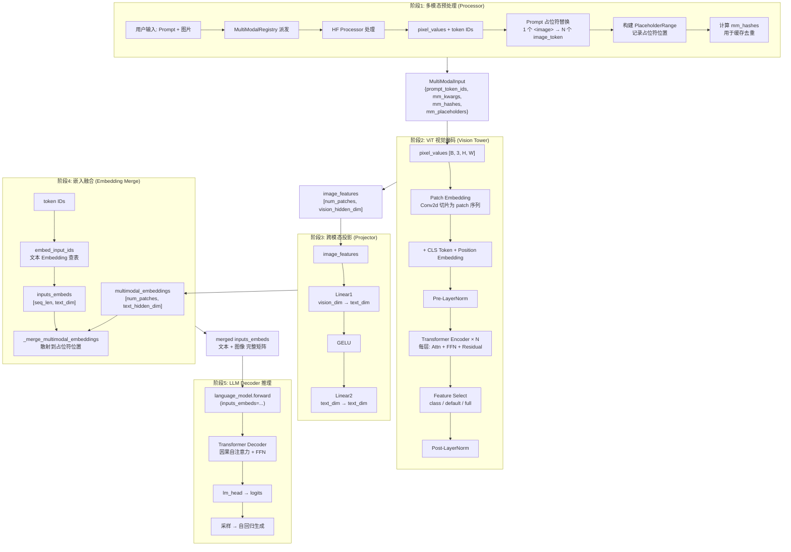
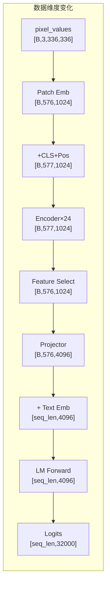
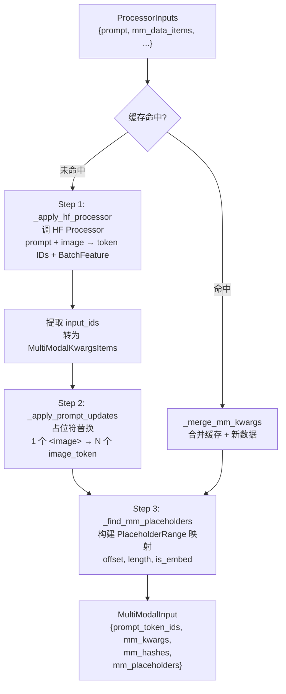
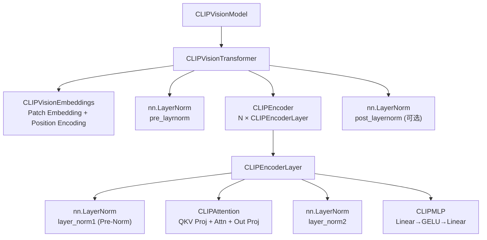
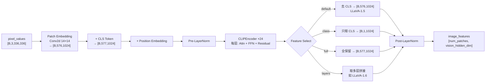
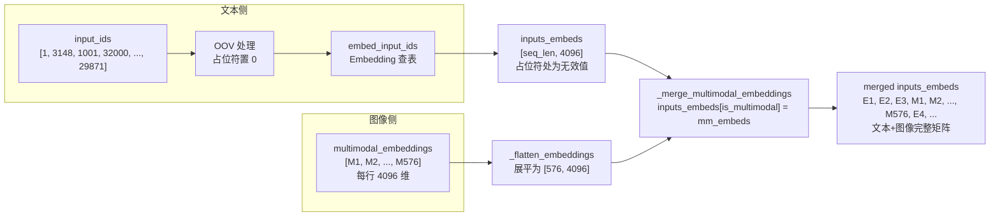
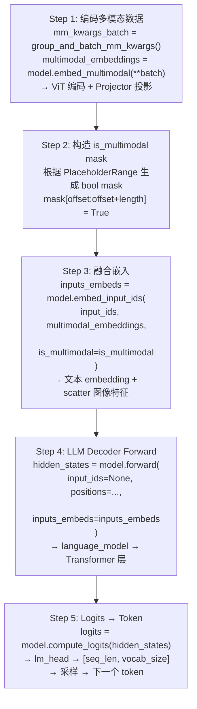

# 09 · 多模态全流程详解

**入口目录**：[`code/vllm/vllm/multimodal/`](../../code/vllm/vllm/multimodal/)

本文档以 **LLaVA-1.5**（CLIP-ViT-L/14 + LLaMA）为典型案例，详解 vLLM 多模态从用户输入到最终推理的完整数据流、参数转化、ViT 实现和推理过程。同时也涵盖 Qwen2-VL、InternVL 等模型的特殊处理。

---

## 一、整体架构概览





核心入口：
- `SupportsMultiModal` 协议：[`interfaces.py:100`](../../code/vllm/vllm/model_executor/models/interfaces.py#L100)
- `BaseMultiModalProcessor.apply()`：[`processor.py:1663`](../../code/vllm/vllm/multimodal/processing/processor.py#L1663-L1707)
- `MULTIMODAL_REGISTRY`：全局单例，见 [`multimodal/__init__.py`](../../code/vllm/vllm/multimodal/__init__.py)

---

## 二、阶段1

### 2.1 输入数据结构

用户调用 `LLM.generate()` 时输入一段文本 + 图片，最终封装为 `ProcessorInputs`：

```python
# multimodal/processing/inputs.py:12-23
@dataclass
class ProcessorInputs:
    prompt: str | list[int]              # 用户原始 prompt（如 "<image>\n描述这张图片"）
    mm_data_items: MultiModalDataItems   # 按模态组织的多模态数据 {"image": [ImageItem1, ImageItem2]}
    mm_uuid_items: MultiModalUUIDItems   # 可选，外部传入的缓存 UUID
    hf_processor_mm_kwargs: Mapping      # HF processor 额外参数（如 device）
    tokenization_kwargs: Mapping         # 分词参数
```

`MultiModalKwargsItems` 按模态组织，结构如下（[`inputs.py:894`](../../code/vllm/vllm/multimodal/inputs.py#L894-L927)）：

```python
MultiModalKwargsItems({
    "image": [
        MultiModalKwargsItem({"pixel_values": Tensor, "image_grid_thw": ...}),  # 第1张图
        MultiModalKwargsItem({"pixel_values": Tensor, "image_grid_thw": ...}),  # 第2张图
    ],
    "audio": [
        MultiModalKwargsItem({"input_audio_features": ...}),  # 第1段音频
    ],
})
```

### 2.2 主流程：`BaseMultiModalProcessor.apply()`

[`processor.py:1663-1707`](../../code/vllm/vllm/multimodal/processing/processor.py#L1663-L1707) 是预处理的核心：



**Step 1：调用 HuggingFace Processor**

```python
# processor.py:1258-1297
def _apply_hf_processor_main(self, prompt, mm_items, ...):
    # 调 HF Processor（如 LlavaProcessor）处理 "text + image"
    # 输出 token IDs 和 BatchFeature（含 pixel_values 等张量）
    processed_data = self._call_hf_processor(
        prompt=prompt_text,
        mm_data=processor_data,     # {"images": [PIL.Image]}
        mm_kwargs=hf_processor_mm_kwargs,
        tok_kwargs=tokenization_kwargs,
    )
    # 提取 input_ids，分离出 prompt_token_ids
    input_ids = processed_data.pop("input_ids")  # 含特殊 token 的完整序列
    return prompt_ids, mm_processed_data, is_update_applied
```

关键：`InputProcessingContext.call_hf_processor()`（[`context.py:244`](../../code/vllm/vllm/multimodal/processing/context.py#L244-L293)）负责实际调用，自动处理 dtype 转换、参数合并。

**Step 2：Prompt 占位符替换**

LLaVA 的 `_get_prompt_updates()` 在 [`llava.py:272`](../../code/vllm/vllm/model_executor/models/llava.py#L272-L280)：

```python
def _get_prompt_updates(self, mm_items, hf_processor_mm_kwargs, out_mm_kwargs):
    hf_config = self.info.get_hf_config()
    image_token_id = hf_config.image_token_index  # 32000
    num_image_tokens = ...
    return [
        PromptReplacement(
            modality="image",
            target=[image_token_id],         # 找到 prompt 中的 1 个 <image>
            replacement=PromptUpdateDetails(
                full=[image_token_id] * num_image_tokens,  # 替换为 N 个占位符
            ),
        )
    ]
```

**为什么需要替换？** 以 LLaVA-1.5（336×336 图片，patch_size=14）为例：

| 步骤 | Shape | 说明 |
|------|-------|------|
| 原始图片 | `[336, 336, 3]` | 输入图片 |
| Patch 划分 | `24 × 24 = 576` | `336 / 14 = 24` 个 patch |
| ViT 输出 | `[577, 1024]` | 含 1 个 CLS + 576 个 patch token |
| Feature Select="default" | `[576, 1024]` | 去掉 CLS，输出 576 个 image token |

因此 prompt 中 1 个 `<image>` 需替换为 **576 个 `image_token_index`**，以在 KV cache 中预先保留位置。LLaVA 源码注释说明了这一点（[`llava.py:686-699`](../../code/vllm/vllm/model_executor/models/llava.py#L686-L699)）：

> "To reserve space in KV cache, we have to insert placeholder tokens before they are inputted to the model, so the input processor prepends additional image tokens."

`PromptReplacement` 和 `PromptInsertion` 的区别（[`processor.py:353-476`](../../code/vllm/vllm/multimodal/processing/processor.py#L353-L476)）：

| 类型 | 行为 | 语义 |
|------|------|------|
| `PromptReplacement` | 替换 target 为 replacement tokens | "1 个 `<image>` → 576 个 `<image>`" |
| `PromptInsertion` | 在 target 之后插入 content tokens | "在 `</s>` 后追加 image tokens" |

**Step 3：构建 PlaceholderRange 映射**

```python
# processor.py:1697-1700
mm_placeholder_ranges = {
    modality: [item.to_range() for item in placeholders]
    for modality, placeholders in mm_placeholders.items()
}
```

`PlaceholderRange`（[`inputs.py:118-146`](../../code/vllm/vllm/multimodal/inputs.py#L118-L146)）记录每个多模态 item 在最终 token 序列中的位置：

```python
@dataclass(frozen=True)
class PlaceholderRange:
    offset: int              # 在 prompt 中的起始位置
    length: int              # 占位符长度
    is_embed: Tensor | None  # bool mask: 哪些位置需要散射 embedding
```

### 2.3 缓存机制

[`processor.py:1441-1510`](../../code/vllm/vllm/multimodal/processing/processor.py#L1441-L1510) 中 `_cached_apply_hf_processor()` 实现：

1. **哈希计算**：`MultiModalHasher` 对图片内容计算哈希（blake3/sha256）
2. **缓存命中**：相同哈希的图片跳过 HF Processor 处理，直接从 `cache` 获取 `MultiModalKwargsItem` 和 `PromptUpdate`
3. **缓存缺失**：仅对未命中的 item 调 HF Processor，最后合并结果

```python
# processor.py:1299-1396
mm_is_cached = {
    modality: cache.is_cached(hashes)
    for modality, hashes in mm_hashes.items()
}
# 仅处理 mm_missing_data_items
# 最后 _merge_mm_kwargs() 将缓存数据与新鲜数据合并
```

缓存类型在 [`registry.py:268`](../../code/vllm/vllm/multimodal/registry.py#L268-L310) 中根据配置选择：

| cache_type | 适用场景 |
|------------|---------|
| `processor_only` | 非 IPC 场景 |
| `lru` | IPC 场景，LRU 淘汰 |
| `shm` | IPC 场景，共享内存 |

### 2.4 最终输出：`MultiModalInput`

`apply()` 返回的数据结构（[`inputs/engine.py:135`](../../code/vllm/vllm/inputs/engine.py#L135)）：

```python
mm_input(
    prompt_token_ids=[1, 3148, ..., 32000, 32000, ..., 32000, ...],  # 含占位符
    mm_kwargs=MultiModalKwargsItems({   # 多模态张量数据
        "image": [
            MultiModalKwargsItem({
                "pixel_values": Tensor([1, 3, 336, 336]),
            }),
        ]
    }),
    mm_hashes={"image": ["abc123..."]},    # 缓存用哈希
    mm_placeholders={                      # 位置映射
        "image": [PlaceholderRange(offset=5, length=576)]
    }
)
```

---

## 三、阶段2：ViT 视觉编码器实现

CLIP ViT 完整实现在 [`clip.py`](../../code/vllm/vllm/model_executor/models/clip.py) 中。以 `CLIPVisionTransformer` 为例，由四个核心组件构成。

### 3.1 组件树



### 3.2 ViT 前向数据流



### 3.3 Patch Embedding（`CLIPVisionEmbeddings`）

[`clip.py:338`](../../code/vllm/vllm/model_executor/models/clip.py#L338-L356) 附近：

```python
class CLIPVisionEmbeddings(nn.Module):
    def __init__(self, config):
        self.patch_embedding = Conv2dLayer(
            in_channels=3,
            output_channels=embed_dim,   # 1024
            kernel_size=patch_size,      # 14
            stride=patch_size,           # 14
        )
        self.class_embedding = nn.Parameter(data)      # CLS token [1, 1024]
        self.position_embedding = nn.Embedding(         # 位置编码
            num_positions, embed_dim     # 577, 1024
        )

    def forward(self, pixel_values):     # [B, 3, 336, 336]
        # Conv2d → [B, 1024, 24, 24] → reshape → [B, 576, 1024]
        patch_embeds = self.patch_embedding(pixel_values)
        # Concat CLS token → [B, 577, 1024]
        class_embeds = self.class_embedding.expand(batch_size, 1, -1)
        embeddings = torch.cat([class_embeds, patch_embeds], dim=1)
        # 加 Position Embedding
        embeddings = embeddings + self.position_embedding(position_ids)
        return embeddings  # [B, 577, 1024]
```

### 3.4 Transformer Encoder Layer（`CLIPEncoderLayer`）

[`clip.py:458-495`](../../code/vllm/vllm/model_executor/models/clip.py#L458-L495) — 标准 Pre-Norm Transformer：

```python
class CLIPEncoderLayer(nn.Module):
    def forward(self, hidden_states):          # [B, 577, 1024]
        # ─── Self-Attention with Residual ───
        residual = hidden_states
        hidden_states = self.layer_norm1(hidden_states)  # Pre-Norm
        hidden_states, _ = self.self_attn(hidden_states) # Multi-Head Attn
        hidden_states = residual + hidden_states

        # ─── FFN with Residual ───
        residual = hidden_states
        hidden_states = self.layer_norm2(hidden_states)
        hidden_states = self.mlp(hidden_states)           # Linear→GELU→Linear
        hidden_states = residual + hidden_states

        return hidden_states
```

**Attention 实现**（[`clip.py:395-417`](../../code/vllm/vllm/model_executor/models/clip.py#L395-L417)）：

```python
class CLIPAttention(nn.Module):
    def forward(self, hidden_states):
        qkv_states, _ = self.qkv_proj(hidden_states)  # [B, 577, 1024] → [B, 577, 3072]
        query, key, value = qkv_states.chunk(3, dim=-1)
        out = self.attn(query, key, value)             # MMEncoderAttention
        attn_output, _ = self.out_proj(out)
        return attn_output, None
```

ViT 的 Attention 使用 `MMEncoderAttention`（而非 LLM 的 `Attention`），以利用专门为编码器优化的 Attention 后端（FA3、FlexAttention、Triton）。

### 3.5 完整 Forward（`CLIPVisionTransformer`）

[`clip.py:680-706`](../../code/vllm/vllm/model_executor/models/clip.py#L680-L706)：

```python
class CLIPVisionTransformer(nn.Module):
    def forward(self, pixel_values, *, select_layers=None,
                feature_select_strategy=None):
        # 1. Patch Embedding + Position Encoding
        hidden_states = self.embeddings(pixel_values)    # [B, 577, 1024]

        # 2. Pre-LayerNorm
        hidden_states = self.pre_layrnorm(hidden_states)

        # 3. Transformer Encoder (N 层)
        encoder_outputs = self.encoder(
            inputs_embeds=hidden_states,
            return_all_hidden_states=(select_layers is not None),
        )

        # 4. Feature Select + Post-LayerNorm
        encoder_outputs = resolve_visual_encoder_outputs(
            encoder_outputs,
            self.post_layernorm,
            select_layers=select_layers,
            feature_select_strategy=feature_select_strategy,
        )
        return encoder_outputs
```

### 3.6 Feature Select 策略

ViT 输出 `[B, 577, 1024]` 后，通过 `feature_select_strategy` 选择输出：

[`vision.py:157-175`](../../code/vllm/vllm/model_executor/models/vision.py#L157-L175)：

| 策略 | 选择方式 | 输出 Shape | 适用模型 |
|------|---------|-----------|---------|
| `"default"` | 去掉 CLS，取 patches | `[B, 576, 1024]` | **LLaVA-1.5** |
| `"class"` | 只取 CLS token | `[B, 1, 1024]` | LLaVA-1.6（部分配置） |
| `"full"` | 保留全部 | `[B, 577, 1024]` | 某些变体 |
| `callable` | 自定义函数 | 可变 | 高级用法 |

```python
def _get_vision_feature_selector(strategy):
    if strategy == "class":
        return lambda feats: feats[:, :1, :]   # CLS only
    if strategy == "default":
        return lambda feats: feats[:, 1:, :]   # patches only
    if strategy == "full":
        return lambda feats: feats             # all
```

### 3.7 `resolve_visual_encoder_outputs()` 详解

[`vision.py:198-278`](../../code/vllm/vllm/model_executor/models/vision.py#L198-L278) 处理多场景输出：

**场景 A：单层输出（最常见，LLaVA-1.5）**

```python
# select_layers=None, encoder_outputs=[B, 577, 1024]
# → feature_select → post_layernorm → 返回
```

**场景 B：多层输出（LLaVA-1.6 等）**

```python
# select_layers=[-2, -1], encoder_outputs=List[Tensor]
# → 取倒数第 2 层和最后一层
# → 各自做 feature_select
# → torch.cat(dim=-1) 拼接 → [B, 577, 2048]
```

```python
# vision.py:246-278
num_loaded_layers = len(encoder_outputs) - 1   # -1 因为第一项是输入 embedding
offset = max_possible_layers - num_loaded_layers
hs_pool = [
    encoder_outputs[layer_idx]
    if layer_idx >= 0
    else encoder_outputs[layer_idx + offset]   # 负索引相对完整模型
    for layer_idx in select_layers
]
# ...
return torch.cat(hs_pool, dim=-1)              # 沿 feature 维拼接
```

### 3.8 数据并行（TP Data Parallel）

多个 GPU 时，ViT 可配置 `mm_encoder_tp_mode="data"` 实现数据并行：

[`vision.py:281-311`](../../code/vllm/vllm/model_executor/models/vision.py#L281-L311)：

```python
def run_dp_sharded_vision_model(image_input, vision_model):
    # 将 batch 中的图片均匀分给各 GPU
    image_input_per_rank = image_input[
        rank * num_chunks_per_rank : (rank + 1) * num_chunks_per_rank
    ]
    # 各 GPU 独立编码
    vision_embeddings = vision_model(image_input_per_rank)
    # All-Gather 汇总
    vision_embeddings = tensor_model_parallel_all_gather(vision_embeddings, dim=0)
    return vision_embeddings[:num_chunks]
```

### 3.9 ViT 数据维度变化图

```
输入图片 (336×336)
    │  Conv2d(kernel=14, stride=14)
    ▼
Patch Embeddings  [B, 576, 1024]    24×24 patches, 每个 14×14 像素
    │  + CLS token
    ▼
+ Pos Embedding   [B, 577, 1024]    576+1 tokens, 位置编码
    │  Pre-LayerNorm
    ▼
Transformer × 24  [B, 577, 1024]    每层: Attn→Residual→FFN→Residual
    │  Feature Select ("default")
    ▼
去掉 CLS          [B, 576, 1024]    输出给 Projector
```

### 3.10 其他 ViT 后端

除 CLIP 外，vLLM 还支持多种 ViT 实现：

| 后端 | 文件 | 使用模型 |
|------|------|---------|
| **CLIP** | [`clip.py`](../../code/vllm/vllm/model_executor/models/clip.py) | LLaVA-1.5、LLaVA-1.6 |
| **SigLIP** | [`siglip.py`](../../code/vllm/vllm/model_executor/models/siglip.py) | LLaVA（SigLIP 变体）、Gemma 3 |
| **Pixtral** | [`pixtral.py`](../../code/vllm/vllm/model_executor/models/pixtral.py) | Pixtral-12B |
| **InternViT** | [`intern_vit.py`](../../code/vllm/vllm/model_executor/models/intern_vit.py) | InternVL2 系列 |
| **InternS1** | [`interns1_vit.py`](../../code/vllm/vllm/model_executor/models/interns1_vit.py) | InternVL3 |
| **MoonViT** | [`moonvit.py`](../../code/vllm/vllm/model_executor/models/moonvit.py) | Kimi-VL |
| **SigLIP2-NaViT** | [`siglip2navit.py`](../../code/vllm/vllm/model_executor/models/siglip2navit.py) | 动态分辨率模型 |

派发逻辑在 [`vision.py:66`](../../code/vllm/vllm/model_executor/models/vision.py#L66-L79) 的 `get_vision_encoder_info()`：

```python
def get_vision_encoder_info(hf_config):
    if isinstance(hf_config.vision_config, CLIPVisionConfig):
        return CLIPEncoderInfo(hf_config)
    if isinstance(hf_config.vision_config, SiglipVisionConfig):
        return SiglipEncoderInfo(hf_config)
    if isinstance(hf_config.vision_config, PixtralVisionConfig):
        return PixtralHFEncoderInfo(hf_config)
    # ...
```

---

## 四、阶段3：多模态投影（MultiModal Projector）

LLaVA 的 Projector 在 [`llava.py:126-158`](../../code/vllm/vllm/model_executor/models/llava.py#L126-L158)：

```python
class LlavaMultiModalProjector(nn.Module):
    def __init__(self, vision_hidden_size, text_hidden_size, ...):
        self.linear_1 = ColumnParallelLinear(
            vision_hidden_size,   # 1024 (CLIP)
            text_hidden_size,     # 4096 (LLaMA)
        )
        self.act = get_act_fn(projector_hidden_act)  # GELU
        self.linear_2 = RowParallelLinear(
            text_hidden_size,     # 4096
            text_hidden_size,     # 4096
        )

    def forward(self, image_features):        # [B, 576, 1024]
        hidden_states, _ = self.linear_1(image_features)  # → [B, 576, 4096]
        hidden_states = self.act(hidden_states)             # GELU
        hidden_states, _ = self.linear_2(hidden_states)    # → [B, 576, 4096]
        return hidden_states
```

**作用**：将视觉特征从 ViT 的 hidden_size 映射到 LLM 的 hidden_size，实现跨模态空间对齐。

### `embed_multimodal()` 完整调用链

[`llava.py:659-664`](../../code/vllm/vllm/model_executor/models/llava.py#L659-L664)：

```python
def embed_multimodal(self, **kwargs) -> MultiModalEmbeddings:
    # Step 1: 从 kwargs 中提取并验证图片输入
    image_input = self._parse_and_validate_image_input(**kwargs)
    #   → 区分 pixel_values 还是 image_embeds
    #   → 构造 LlavaImagePixelInputs 或 LlavaImageEmbeddingInputs

    # Step 2: 执行图片编码
    return self._process_image_input(image_input)
    #   └── _process_image_pixels(inputs)
    #         └── vision_tower(pixel_values)         → image_features
    #         └── multi_modal_projector(features)    → multimodal_embeddings
```

`_process_image_input()` 细节（[`llava.py:641-657`](../../code/vllm/vllm/model_executor/models/llava.py#L641-L657)）：

```python
def _process_image_input(self, image_input):
    if image_input["type"] == "image_embeds":
        return image_input["data"]  # 直接使用预计算的 embedding

    # 来自 pixel_values 的路径
    image_features = self._process_image_pixels(image_input)
    # image_features: [B, 576, 1024] (单张图) or tuple[Tensor] (多分辨率)

    if isinstance(image_features, torch.Tensor):
        return self.multi_modal_projector(image_features)  # → [B, 576, 4096]

    # 多分辨率场景：先 cat 再投影，再 split 回去
    feature_sizes = [f.shape[0] for f in image_features]
    image_embeds = self.multi_modal_projector(torch.cat(image_features))
    return torch.split(image_embeds, feature_sizes)
```

**完整数据维度变化**：

```
kwargs["pixel_values"]     [1, 3, 336, 336]
    │  vision_tower (CLIPVisionModel)
    ▼
image_features             [1, 576, 1024]    (vision_hidden_size=1024)
    │  multi_modal_projector (MLP: Linear→GELU→Linear)
    ▼
multimodal_embeddings      [1, 576, 4096]    (text_hidden_size=4096)
```

---

## 五、阶段4：多模态嵌入融合



### 5.1 `embed_input_ids()` — 文本 + 多模态嵌入合并

[`interfaces.py:380-415`](../../code/vllm/vllm/model_executor/models/interfaces.py#L380-L415)：

```python
def embed_input_ids(self, input_ids, multimodal_embeddings=None, *, is_multimodal=None):
    # Step 1: 获取文本 token embeddings
    inputs_embeds = self._embed_text_input_ids(
        input_ids,
        self.get_language_model().embed_input_ids,
        is_multimodal=is_multimodal,
    )
    # Step 2: 如果有多模态 token 超出 vocab_size（如 image_token_index=32000）
    # 强制将这些位置的 input_ids 设为 0，避免查表越界
    # Step 3: 无多模态数据则直接返回文本 embeddings
    if multimodal_embeddings is None or len(multimodal_embeddings) == 0:
        return inputs_embeds
    # Step 4: 散射多模态 embeddings 到占位符位置
    return _merge_multimodal_embeddings(
        inputs_embeds=inputs_embeds,
        multimodal_embeddings=multimodal_embeddings,
        is_multimodal=is_multimodal,
    )
```

### 5.2 `_merge_multimodal_embeddings()` — 核心散射操作

[`utils.py:526-562`](../../code/vllm/vllm/model_executor/models/utils.py#L526-L562)：

```python
def _merge_multimodal_embeddings(inputs_embeds, multimodal_embeddings, is_multimodal):
    # 展平：list[Tensor] → [total_multimodal_tokens, hidden_dim]
    mm_embeds_flat = _flatten_embeddings(multimodal_embeddings)

    # 核心：利用 bool mask 将多模态 embeddings 散射到 input_ids 占位符位置
    # inputs_embeds[is_multimodal] 选取所有占位符位置的行
    inputs_embeds[is_multimodal] = mm_embeds_flat.to(dtype=input_dtype)

    return inputs_embeds
```

**散射过程可视化**：

```
input_ids:       [1, 3148, 1001, 32000, 32000, ..., 32000, 29871, ...]
                                     ↑ 占位符区域 (offset=3, length=576)

is_multimodal:   [F, F,    F,    T,     T,     ..., T,     F,     ...]
                                   ↑ True at 576 positions

inputs_embeds (before merge):
                 [E₁, E₂,  E₃,   ?,     ?,     ..., ?,     E₄,    ...]
                                   ↑ 占位符处为无效值

multimodal_embeddings:
                 [M₁, M₂,  M₃,   ..., M₅₇₆]  (576 tokens × 4096 dims)

inputs_embeds (after merge):
                 [E₁, E₂,  E₃,   M₁,    M₂,   ..., M₅₇₆,  E₄,    ...]
                                   ↑ 多模态 embeddings 散射到位
```

### 5.3 `_embed_text_input_ids()` — OOV 多模态 Token 处理

[`interfaces.py:361-378`](../../code/vllm/vllm/model_executor/models/interfaces.py#L361-L378)：

```python
def _embed_text_input_ids(self, input_ids, embed_input_ids, *, is_multimodal):
    if is_multimodal is not None and self._has_oov_mm_tokens:
        # 将超出 vocab_size 的 image token 强制设为 0
        # 避免 Embedding 查表越界
        in_vocab_ids = input_ids.masked_fill(
            is_multimodal.to(device=input_ids.device), 0
        )
        return embed_input_ids(in_vocab_ids)

    return embed_input_ids(input_ids)
```

`_has_oov_mm_tokens` 在 [`interfaces.py:172`](../../code/vllm/vllm/model_executor/models/interfaces.py#L172-L180) 中设置：

```python
def configure_mm_token_handling(self, vocab_size, mm_token_ids):
    self._has_oov_mm_tokens = any(
        tok_id >= vocab_size for tok_id in mm_token_ids
    )
```

对于 LLaVA，`image_token_index=32000`，而 LLaMA vocab_size=32000，所以 `32000 >= 32000` 为 True，需要 OOV 处理。

---

## 六、阶段5：LLM Decoder 推理

### 6.1 LLaVA Forward

[`llava.py:666-718`](../../code/vllm/vllm/model_executor/models/llava.py#L666-L718)：

```python
def forward(self, input_ids, positions, intermediate_tensors=None,
            inputs_embeds=None, **kwargs):
    if intermediate_tensors is not None:
        inputs_embeds = None

    # 直接传 inputs_embeds 给 language_model
    # (input_ids 仍然传入以配合某些 attention 实现)
    hidden_states = self.language_model.model(
        input_ids, positions, intermediate_tensors,
        inputs_embeds=inputs_embeds  # ← 已融合图文信息的 embeddings
    )
    return hidden_states

def compute_logits(self, hidden_states):
    return self.language_model.compute_logits(hidden_states)
```

LLaVA 的 `forward` 十分简洁——核心工作已在前面的 `embed_multimodal()` + `embed_input_ids()` + `_merge_multimodal_embeddings()` 中完成。到 LLM 阶段时，输入已经是融合了图文信息的 `inputs_embeds`。

### 6.2 Model Runner 中的完整调度

在实际推理时（`vllm/v1/worker/gpu/mm/encoder_runner.py`）：



### 6.3 端到端数据维度变化（LLaVA-1.5）

```
┌──────────────────────────────────────────────────────────────────┐
│  步骤                         │  数据 Shape                       │
├──────────────────────────────────────────────────────────────────┤
│ 1. 原始图片                    │  (H=336, W=336, C=3)             │
│ 2. HF Processor 处理后          │  pixel_values: [1, 3, 336, 336] │
│ 3. ViT Patch Embedding         │  [1, 576, 1024] + CLS            │
│    + Position Embedding        │  → [1, 577, 1024]                │
│ 4. ViT Encoder × 24            │  [1, 577, 1024]                  │
│ 5. Feature Select ("default")  │  [1, 576, 1024] (去掉 CLS)       │
│ 6. MultiModal Projector        │  [1, 576, 4096]                  │
│ 7. Prompt Token IDs            │  [1, seq_len] (含 576 个占位符)  │
│ 8. Text Embedding              │  [1, seq_len, 4096]              │
│ 9. Merge (scatter)             │  [1, seq_len, 4096]              │
│ 10. LLM Decoder Forward        │  [1, seq_len, 4096]              │
│     → 自回归生成               │                                   │
│ 11. compute_logits             │  [1, seq_len, 32000]             │
└──────────────────────────────────────────────────────────────────┘
```

---

## 七、关键设计要点

### 7.1 `SupportsMultiModal` 协议

所有多模态模型必须实现的核心接口（[`interfaces.py:100-415`](../../code/vllm/vllm/model_executor/models/interfaces.py#L100-L415)）：

| 方法 | 职责 |
|------|------|
| `embed_multimodal(**kwargs)` | 编码多模态输入为 embeddings |
| `embed_input_ids(input_ids, multimodal_embeddings, is_multimodal)` | 融合文本和图像 embeddings |
| `get_language_model()` | 返回底层 LLM（通过 `_language_model_names` 查找） |
| `get_placeholder_str(modality, i)` | 返回占位符文本 |
| `configure_mm_token_handling(vocab_size, mm_token_ids)` | 检测 OOV token |
| `get_num_mm_encoder_tokens(num_image_tokens)` | ViT 输出 token 数 |
| `get_num_mm_connector_tokens(num_vision_tokens)` | Projector 输出 token 数 |

### 7.2 多模态注册机制

每种多模态模型通过 `MULTIMODAL_REGISTRY.register_processor()` 注册（[`llava.py:497-501`](../../code/vllm/vllm/model_executor/models/llava.py#L497-L501)）：

```python
@MULTIMODAL_REGISTRY.register_processor(
    _build_llava_or_pixtral_hf_processor,  # Processor 工厂
    info=_build_llava_or_pixtral_hf_info,   # ProcessingInfo 工厂
    dummy_inputs=LlavaDummyInputsBuilder,    # DummyInputs 工厂
)
class LlavaForConditionalGeneration(...)
```

三个工厂函数的职责：

| 工厂 | 职责 |
|------|------|
| `ProcessingInfoFactory` | 创建 `BaseProcessingInfo`：提供 token 数计算、vision config |
| `DummyInputsBuilderFactory` | 创建 `BaseDummyInputsBuilder`：生成用于内存估算的哑数据 |
| `MultiModalProcessorFactory` | 创建 `BaseMultiModalProcessor`：执行 prompt 替换和 tokenization |

### 7.3 多模态字段合并策略

`MultiModalFieldConfig`（[`inputs.py:645-863`](../../code/vllm/vllm/multimodal/inputs.py#L645-L863)）定义四种合并策略：

| 策略 | 方法 | 说明 | 使用场景 |
|------|------|------|---------|
| `batched` | `MultiModalFieldConfig.batched()` | 按 batch 维度索引 | 每项等长的 `pixel_values` |
| `flat` | `MultiModalFieldConfig.flat()` | 按指定维度切片 | 变长序列（如 `image_embeds`） |
| `flat_from_sizes` | `MultiModalFieldConfig.flat_from_sizes()` | 根据 size 张量自动计算切片 | 同上但自动计算边界 |
| `shared` | `MultiModalFieldConfig.shared()` | 所有 item 共享同一数据 | 全局配置（如 `image_grid_thw`） |

### 7.4 权重加载架构

[`08-多模态权重加载.md`](./08-多模态权重加载.md) 详细说明。LLaVA 的组件分工：

```python
@MULTIMODAL_REGISTRY.register_processor(...)
class LlavaForConditionalGeneration(nn.Module, SupportsMultiModal, ...):
    def __init__(self, *, vllm_config, prefix=""):
        with self._mark_tower_model(vllm_config, "image"):     # ViT
            self.vision_tower = init_vision_tower_for_llava(config)

            self.multi_modal_projector = LlavaMultiModalProjector(...) # Projector

        with self._mark_language_model(vllm_config):            # LLM
            self.language_model = init_vllm_registered_model(...)
```

`WeightsMapper` 做 HF → vLLM 的前缀映射（[`llava.py:515-523`](../../code/vllm/vllm/model_executor/models/llava.py#L515-L523)）：

```python
hf_to_vllm_mapper = WeightsMapper(
    orig_to_new_prefix={
        "model.language_model.":        "language_model.model.",
        "model.vision_tower.":          "vision_tower.",
        "model.multi_modal_projector.": "multi_modal_projector.",
        "lm_head.":                     "language_model.lm_head.",
    }
)
```

### 7.5 动态分辨率与多 tile 处理

Qwen2-VL、LLaVA-NeXT 等模型支持动态分辨率。处理方式：

1. **图片切分**：大图被切分为多个 tile（如 Qwen2-VL 按 `factor` 个 patch 对齐）
2. **多 tile 编码**：每个 tile 独立通过 ViT，得到多个 `image_features`
3. **维度融合**：通过 resize + concatenation 或 3D position encoding 融合 tile 信息
4. **MRoPE**（Multi-Resolution RoPE，[`mrope.py`](../../code/vllm/vllm/model_executor/layers/rotary_embedding/mrope.py)）：对图像 token 使用 2D/3D 位置编码

### 7.6 Encoder 调度与预算管理

[`03-调度与KV缓存/07-多模态Encoder调度详解.md`](../03-调度与KV缓存/07-多模态Encoder调度详解.md) 详细说明：

- **双重预算**：`token_budget`（token 数限制）+ `encoder_compute_budget`（计算量限制）
- **`_try_schedule_encoder_inputs()`**：调度器决策哪些 encoder 输入在本 step 执行
- **Encoder Cache**：FIFO 淘汰，按 `mm_hash` 去重
- **EC Connector**：Prefill/Decode 分离部署时远程传输 cache

---

## 八、各模型差异对比

| 特性 | LLaVA-1.5 | Qwen2-VL | InternVL2 | Pixtral |
|------|-----------|----------|-----------|---------|
| ViT 后端 | CLIP | 自定义 ViT + MRoPE | InternViT | Pixtral ViT |
| Feature Select | default | full | default | — |
| Projector | 2层 MLP | MLP + Resampler | MLP | 2层 MLP |
| 动态分辨率 | ✗ | ✓ (tile + MRoPE) | ✓ (dynamic) | ✓ (原生) |
| 多模态 Token 融合 | `is_multimodal` mask | `is_multimodal` mask | `is_multimodal` mask | `is_multimodal` mask |
| Vision Token 数 | 576 (固定) | 可变（按 grid_thw） | 可变 | 可变 |

各模型的详细实现见对应文件（[第七节完整清单](#71-supports multimodal-协议)）。

---

## 九、阅读入口

1. [`code/vllm/vllm/multimodal/__init__.py`](../../code/vllm/vllm/multimodal/__init__.py) — `MULTIMODAL_REGISTRY` 全局入口
2. [`code/vllm/vllm/multimodal/registry.py`](../../code/vllm/vllm/multimodal/registry.py) — `MultiModalRegistry` 注册与派发
3. [`code/vllm/vllm/multimodal/inputs.py`](../../code/vllm/vllm/multimodal/inputs.py) — 全部多模态数据类型定义
4. [`code/vllm/vllm/multimodal/processing/processor.py`](../../code/vllm/vllm/multimodal/processing/processor.py) — `BaseMultiModalProcessor` 预处理主流程
5. [`code/vllm/vllm/multimodal/processing/context.py`](../../code/vllm/vllm/multimodal/processing/context.py) — `InputProcessingContext` 与 `BaseProcessingInfo`
6. [`code/vllm/vllm/model_executor/models/vision.py`](../../code/vllm/vllm/model_executor/models/vision.py) — ViT 辅助：Feature Select、Encoder 输出解析、数据并行
7. [`code/vllm/vllm/model_executor/models/clip.py`](../../code/vllm/vllm/model_executor/models/clip.py) — CLIP ViT 完整实现
8. [`code/vllm/vllm/model_executor/models/llava.py`](../../code/vllm/vllm/model_executor/models/llava.py) — LLaVA 完整多模态模型（Processor + ViT + Projector + Forward）
9. [`code/vllm/vllm/model_executor/models/interfaces.py`](../../code/vllm/vllm/model_executor/models/interfaces.py) — `SupportsMultiModal` 协议
10. [`code/vllm/vllm/model_executor/models/utils.py`](../../code/vllm/vllm/model_executor/models/utils.py) — `_merge_multimodal_embeddings` 融合逻辑
11. [`code/vllm/vllm/v1/worker/gpu/mm/encoder_runner.py`](../../code/vllm/vllm/v1/worker/gpu/mm/encoder_runner.py) — `EncoderRunner` Worker 侧编排
12. [08-多模态权重加载.md](./08-多模态权重加载.md) — 权重映射与组件拆分
