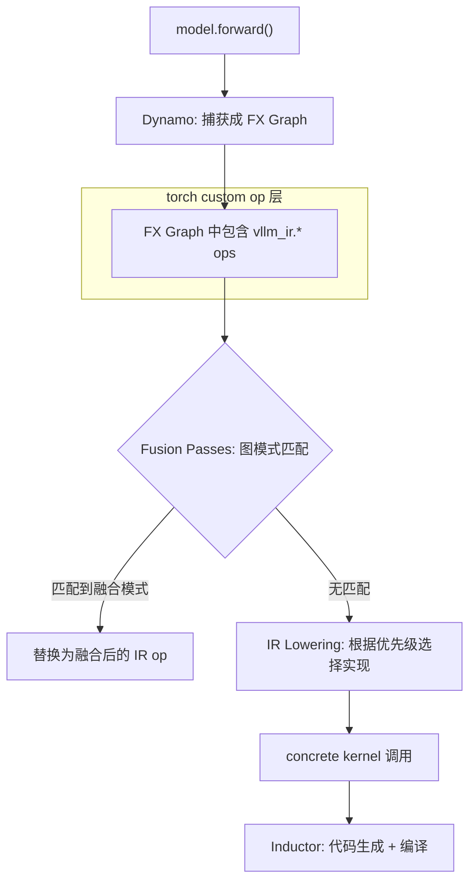

# 01 · vLLM IR — 函数式中端表示

**源码**：[`code/vllm/vllm/ir/`](../../code/vllm/vllm/ir/)
**设计文档**：[`code/vllm/docs/design/vllm_ir.md`](../../code/vllm/docs/design/vllm_ir.md)

## 为什么需要 vLLM IR

vLLM 同时运行在多个平台上（CUDA/ROCm/TPU/XPU），每个平台有不同的 kernel 实现。传统做法是为每个 op 编写 `CustomOp` + `forward_cuda`/`forward_rocm` 分派——但随着 op 数量和平台增长，这种方式难以维护。

vLLM IR 的核心理念：**分离 op 语义、实现、分派**。通过函数式 IR 描述"做什么"，再根据平台选择"怎么做"。

```
@register_op 定义语义（什么操作）
@register_impl 注册实现（怎么做的）
Torch FX Graph → IR Ops → Dispatching → Concrete Impl
```

## 核心模式：`@register_op` / `@register_impl`

### 注册一个 IR Op

```python
# vllm/ir/ops/layernorm.py
@vllm.ir.register_op
def rms_norm(x: torch.Tensor, weight: torch.Tensor, eps: float) -> torch.Tensor:
    """RMS Normalization. 这个 native 实现同时作为参考实现和测试基准。"""
    return x * torch.rsqrt(x.pow(2).mean(-1, keepdim=True) + eps) * weight
```

`@register_op` 做了几件事：
1. 在 `torch.ops.vllm_ir` 中注册一个 **torch custom op**（`CompositeExplicitAutograd` dispatch key）
2. 注册一个 **fake op** 用于 Dynamo tracing
3. 创建一个 `IrOp` 对象，存入 `IrOp.registry`
4. native 函数同时作为**默认实现**和**语义定义**

### 注册一个平台实现

```python
# 在某个 platform plugin 中
@rms_norm.register_impl("cuda_fp8", supported=torch.cuda.is_available())
def rms_norm_fp8(x: torch.Tensor, weight: torch.Tensor, eps: float) -> torch.Tensor:
    return fused_rms_norm_fp8_kernel(x, weight, eps)
```

`@register_impl` 的参数：
- `provider`：唯一标识符（不能是 `"native"` 或 `"unfused"`——这两个是保留关键字）
- `supported`：静态支持检查（如 `torch.cuda.is_available()`）
- `supports_args`：动态参数检查（如「这个 dtype/shape 是否支持」）

### 分派优先级

```python
# 设置优先级：先试 cuda_fp8，不行就 fallback 到 native
rms_norm.set_default(["cuda_fp8", "native"])
```

分派发生在 **hot path**（`IrOp.dispatch()`），必须极快：遍历优先级列表，跳过不支持的 impl，找到第一个 `supports_args()` 返回 True 的即可。

## `maybe_inplace` — 零拷贝优化

对于 `allow_inplace=True` 的 op，自动生成一个 `.maybe_inplace` 重载：

```python
@vllm.ir.register_op(allow_inplace=True)
def add(x: torch.Tensor, y: torch.Tensor) -> torch.Tensor:
    return x + y

# 自动生成 add.maybe_inplace —— 允许实现者复用 x 的内存
```

编译期可以安全地选择 inplace 实现来减少显存分配。Eager 模式下，`IrOpImpl.func_impl_fn()` 会自动 clone 激活值以保证 functional 语义。

## 编译管线中的 IR



关键点：
- IR op 是 **torch custom op**（`CompositeExplicitAutograd`），在 Dynamo 捕获时是"原子"操作
- `CompositeExplicitAutograd` 不会被 AOTAutograd 分解——它保持为整体
- Fusion Pass 对 IR op 做模式匹配和替换
- IR Lowering 从 FX graph 中移除 IR op，替换为具体 kernel 调用

## 与 Legacy CustomOp 的关系

| | Legacy CustomOp | vLLM IR |
|---|---|---|
| 注册方式 | `CustomOp.register("name")` | `@register_op` 装饰器 |
| 语义定义 | 内嵌在 `forward_cuda()` 中 | native Python 函数（也用作测试参考） |
| 分派方式 | `forward_cuda` / `forward_rocm` 开关 | `supports_args()` predicate + priority |
| Torch 集成 | 自定义 dispatch key | `CompositeExplicitAutograd` |
| 编译兼容 | 需手动处理 Dynamo | 天然兼容 Dynamo/Inductor |

vLLM IR 是 CustomOp 的**迁移目标**。新 op 应直接用 IR，旧 CustomOp 逐步迁移。

## 已注册的 IR Op 示例

| Op | 文件 | 用途 |
|----|------|------|
| `rms_norm` | `ir/ops/layernorm.py` | RMS 归一化 |
| `fused_add_rms_norm` | `ir/ops/layernorm.py` | Add + RMSNorm 融合 |

> 注意：IR 仍在建设中，已注册的 op 数量有限。大部分模型仍在通过非 IR 路径执行。

## 阅读重点

- `IrOp.__init__()` 中 torch custom op 的注册逻辑
- `IrOp.dispatch()` 的优先级分派算法——这是 hot path
- `IrOpInplace` 如何生成 `.maybe_inplace` 重载
- `IrOpImpl.uuid()` 如何通过源码 hash 控制编译缓存
