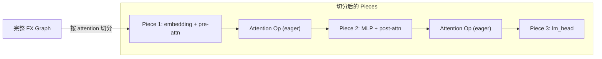
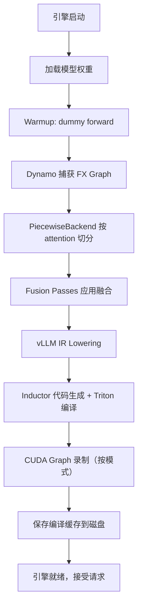

# 02 · torch.compile 深度集成

**源码**：[`code/vllm/vllm/compilation/`](../../code/vllm/vllm/compilation/)
**设计文档**：[`code/vllm/docs/design/torch_compile.md`](../../code/vllm/docs/design/torch_compile.md)

## 为什么 torch.compile 默认开启

V1 引擎中 `torch.compile` 是默认开启的。设计目标：

1. **零配置**：用户无需手动指定编译选项
2. **启动时完成编译**：所有编译在第一个请求到达前完成——运行时无 JIT stall
3. **编译缓存**：相同模型 + 相同配置 → 直接加载缓存
4. **渐进式优化**：O0（无融合）/ O1（关键融合）/ O2（全部融合 + full CUDA graph）

## 编译配置

**源码**：[`code/vllm/vllm/config/compilation.py`](../../code/vllm/vllm/config/compilation.py) (~1555 行)

| 配置项 | 说明 |
|--------|------|
| `mode` | 编译模式：`NONE` / `VLLM_COMPILE` (默认) |
| `optimization_level` | O0 / O1 / O2（默认 O1） |
| `cudagraph_mode` | CUDA Graph 模式（见 08-04） |
| `cudagraph_capture_sizes` | 预录制 CUDA Graph 的 batch size 列表 |
| `dynamic_shapes_config` | BACKED / UNBACKED / BACKED_SIZE_OBLIVIOUS |
| `pass_config` | 各 fusion pass 开关 |
| `max_cudagraph_capture_size` | CUDA Graph 最大录制 batch |

## PiecewiseBackend — 核心机制

`PiecewiseBackend` 是 vLLM 自定义的 torch.compile backend。它的关键行为：

1. **不编译整个图**，而是按 attention op 将图**切分成多个 piece**
2. **每个 piece 独立编译**，通过 Inductor 生成优化 kernel
3. **Piece 之间的 attention op 保持 eager 执行**（或走 CUDA Graph）



**为什么是 piecewise 而非 fullgraph？**

- Fullgraph 要求整个模型被 `torch.compile` 覆盖，包括 attention kernel——但 attention kernel 有其专属的高性能实现（FlashAttention/FlashInfer），不应被 Inductor 替换
- Piecewise 让 attention kernel 走其原生的高效路径，只编译「非 attention」的部分

## 编译缓存

### Cache Key 构成

```
cache_key = hash(
    model_code_hash           # 模型实现的 Python 源码 hash
    + config_hashes            # VllmConfig 中各子 config 的 hash
    + pytorch_config_hashes    # PyTorch/Triton 版本相关配置 hash
)
```

任何代码或配置变更都会导致 cache miss，触发重新编译。

### Cache 存储

- 默认路径：`~/.cache/vllm/torch_compile_cache/`
- 格式：`binary`（默认，更快加载）或 `unpacked`（可调试）
- 环境变量控制：
  - `VLLM_DISABLE_COMPILE_CACHE=1` 禁用缓存
  - `VLLM_COMPILE_CACHE_SAVE_FORMAT=binary|unpacked`

### 缓存失效机制

通过 hash 链保证一致性：

```python
# compilation/caching.py
def get_cache_key(vllm_config: VllmConfig) -> str:
    model_hash = hash_source_files(model_source_files)
    config_hash = hash(vllm_config.to_json())
    return combine_hashes([model_hash, config_hash])
```

## Dynamic Shapes 处理

vLLM 的输入 batch size 和序列长度是**运行时动态**的。torch.compile 需要处理动态形状：

| 模式 | 说明 |
|------|------|
| `BACKED` | 标记动态维度，编译时生成 guard，运行时匹配 |
| `UNBACKED` | 完全不约束维度大小（开销最大，一般不用） |
| `BACKED_SIZE_OBLIVIOUS` | 忽略大小差异，允许更多 reuse（默认） |

## 编译流程全景



## 调试技巧

- `VLLM_LOGGING_LEVEL=DEBUG` 可以看到编译进度和 cache hit/miss
- `VLLM_DISABLE_COMPILE_CACHE=1` 强制重新编译
- `torch._dynamo.config.verbose = True` 查看 Dynamo 捕获的图结构
- `VLLM_COMPILE_CACHE_SAVE_FORMAT=unpacked` 查看编译产物

## 阅读重点

- `piecewise_backend.py` 的切分逻辑——理解为什么按 attention 切分
- `caching.py` 的 cache key 生成——调试「改了代码但没重新编译」
- `config/compilation.py` 的 `CompilationConfig`——所有编译选项的源头
- O0/O1/O2 的差异——影响性能但增加编译时间
