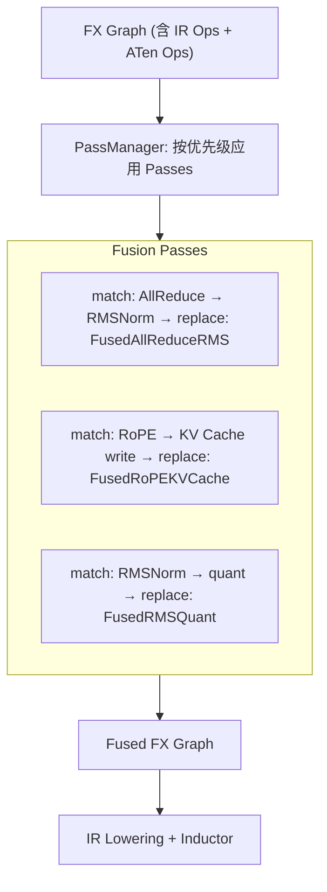

# 03 · Fusion Passes — 编译期图融合

**源码**：[`code/vllm/vllm/compilation/passes/fusion/`](../../code/vllm/vllm/compilation/passes/fusion/)
**设计文档**：[`code/vllm/docs/design/fusions.md`](../../code/vllm/docs/design/fusions.md)

## 为什么需要 Fusion Passes

torch.compile 的 Inductor backend 能自动做算子融合，但有一些融合需要**语义级别的知识**——比如「这个 AllReduce 后面一定是 RMSNorm」这种领域知识 Inductor 无法自动推断。vLLM 的 Fusion Passes 在 Inductor 编译之前对 FX Graph 做**模式匹配与替换**，将这些领域融合注入图中。

```
FX Graph (含 IR Ops)
  → Fusion Passes (模式匹配，替换为融合 Op)
  → IR Lowering (分派到具体 kernel)
  → Inductor (代码生成)
```

## Pass 注册机制

Fusion pass 通过 `vllm_inductor_pass.py` 注册，由 `PassManager` 统一调度：

```python
# 每个 pass 是一个注册函数，接收 fx.GraphModule，返回修改后的 fx.GraphModule
class VllmInductorPass:
    def __call__(self, graph: fx.GraphModule) -> fx.GraphModule: ...
```

`PassConfig`（在 `CompilationConfig` 中）控制每个 pass 的开关。

## 融合 Pass 一览

| Pass | 文件 | 融合内容 | 优化级别 | 典型加速 |
|------|------|---------|---------|---------|
| **AllReduce + RMSNorm** | `allreduce_rms_fusion.py` | AllReduce → RMSNorm 融合为单 kernel | O2 | 5-20% |
| **RoPE + KV Cache** | `rope_kvcache_fusion.py` | RoPE 旋转后直接写入 KV Cache | O2 (ROCm) | 2-4% |
| **QK Norm + RoPE** | `qk_norm_rope_fusion.py` | Query/Key Normalization 后直接 RoPE | O2 | 2-3% |
| **QK Norm + RoPE + KV Cache** | `qk_norm_rope_kvcache_fusion.py` | 三步融合：Norm → RoPE → KV Cache | O2 | 3-5% |
| **RMSNorm + Quant** | `rms_quant_fusion.py` | RMSNorm 后直接量化（避免写回显存） | O1 | 1-4% |
| **Activation Quant** | `act_quant_fusion.py` | 激活量化融合 | O1 | 2-5% |
| **Attention Quant** | `attn_quant_fusion.py` | Attention 输出量化融合 | O1 | 2-5% |
| **MLA Attn Quant** | `mla_attn_quant_fusion.py` | MLA attention 输出量化融合 | O1 | 3-6% |
| **MLA RoPE + KV Cat** | `mla_rope_kvcache_cat_fusion.py` | MLA: RoPE + KV Cache concat 融合 | O2 | 1-3% |
| **Collective Fusion** | `collective_fusion.py` | AllReduce/AllGather 集合通信融合 | O2 | 2-8% |
| **ROCm AITER** | `rocm_aiter_fusion.py` | ROCm 平台特定融合（AITER 库） | O1 (ROCm) | 3-10% |
| **Sequence Parallelism** | `sequence_parallelism.py` | 序列并行相关的通信融合 | O2 | 2-5% |

## 典型融合详解

### AllReduce + RMSNorm

TP 场景下的关键优化。传统流程：

```
GPU0: Compute → AllReduce → wait → RMSNorm
GPU1: Compute → AllReduce → wait → RMSNorm
```

融合后：

```
GPU0: Compute → FusedAllReduceRMSNorm (单 kernel)
GPU1: Compute → FusedAllReduceRMSNorm (单 kernel)
```

将 AllReduce 通信和 RMSNorm 计算重叠为单 kernel，减少一次显存读写。

### RoPE + KV Cache

传统流程中 RoPE 计算完成后将结果写回显存，再由 KV Cache 从显存读出——两次显存访问。融合为一个 kernel 直接写入 KV Cache。

### RMSNorm + Quant

量化推理的常见模式：`x = rms_norm(h)` → `x_q = quantize(x)`。独立执行意味着两次显存往返。融合后只写量化结果，节省带宽。

## 融合流程



PassManager 保证 pass 的有序执行：某些融合（如 QK Norm + RoPE + KV Cache）必须在 RoPE + KV Cache 之前执行，否则后者会"抢走"匹配。

## 平台差异

不同平台的 fusion 支持矩阵不同：

| Fusion | CUDA | ROCm | XPU | TPU |
|---------|------|------|-----|-----|
| AllReduce + RMSNorm | ✅ | ✅ | ❌ | ❌ |
| RoPE + KV Cache | ❌ | ✅ | ❌ | ❌ |
| RMS + Quant | ✅ | ✅ | ✅ | ❌ |
| Collective Fusion | ✅ | ✅ | ❌ | ❌ |

选择通过 `supported` 参数控制——`PassConfig` 只注册当前平台支持的 fusion pass。

## 阅读重点

- `pass_manager.py`：理解 pass 的执行顺序和优先级
- `matcher_utils.py`：FX Graph 模式匹配工具
- 选 2-3 个 pass 的实现阅读：`allreduce_rms_fusion.py`（最直观）和 `rope_kvcache_fusion.py`（通信+计算融合的经典模式）
