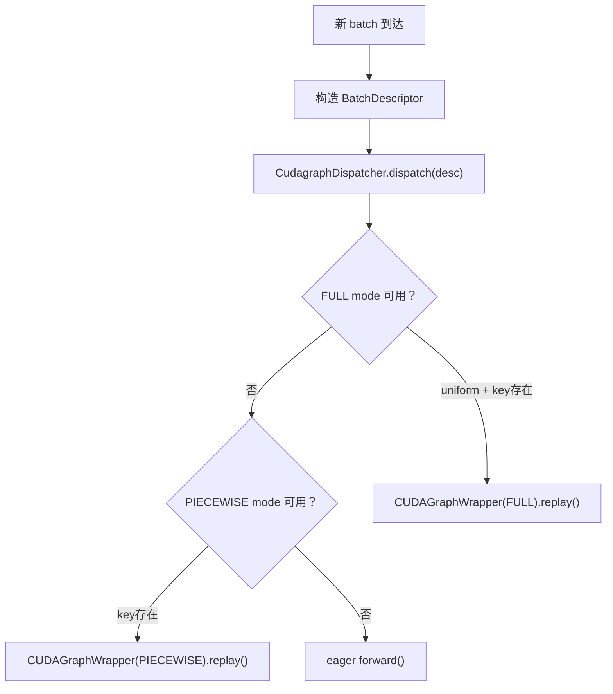

# 04 · CUDA Graph 多模式

**源码**：[`code/vllm/vllm/compilation/cuda_graph.py`](../../code/vllm/vllm/compilation/cuda_graph.py)、[`code/vllm/vllm/v1/cudagraph_dispatcher.py`](../../code/vllm/vllm/v1/cudagraph_dispatcher.py)
**设计文档**：[`code/vllm/docs/design/cuda_graphs.md`](../../code/vllm/docs/design/cuda_graphs.md)

## 为什么需要多模式 CUDA Graph

CUDA Graph 的核心优势：将一整个 GPU 操作序列录制为静态图，后续通过单次 API 调用重放——**消除 kernel launch overhead**。对于 LLM 推理这种「重复执行相同计算图」的场景效果显著。

但挑战在于：不同场景对 CUDA Graph 的需求不同：
- **Prefill**：batch 大小不固定（不同请求的 prompt 长度不同）→ 难以做 uniform CUDA Graph
- **Decode**：每个请求只生成 1 个 token，batch 大小相对固定 → CUDA Graph 效果最好
- **Mixed**：prefill 和 decode 混合在一个 batch 中 → 需要灵活切换

vLLM 的 5 种 CUDA Graph 模式就是为应对这些场景。

## 五种模式

| 模式 | 枚举值 | 录制内容 | 适用场景 |
|------|--------|---------|---------|
| **NONE** | `CUDAGraphMode.NONE` | 无 | 调试、兼容性测试 |
| **PIECEWISE** | `CUDAGraphMode.PIECEWISE` | 每个编译 piece 单独录制 | 通用场景，prefill 和 decode 混合 |
| **FULL** | `CUDAGraphMode.FULL` | 整个 model forward 录制 | 追求极致性能 |
| **FULL_DECODE_ONLY** | `CUDAGraphMode.FULL_DECODE_ONLY` | 仅 uniform decode batch 录制 | P/D 分离的 decode 节点（节省显存） |
| **FULL_AND_PIECEWISE** | `CUDAGraphMode.FULL_AND_PIECEWISE` | FULL（uniform） + PIECEWISE（非 uniform） | **默认**——双模式自适应 |

## 核心组件

### CUDAGraphWrapper

**源码**：[`code/vllm/vllm/compilation/cuda_graph.py`](../../code/vllm/vllm/compilation/cuda_graph.py)

封装单个 CUDA Graph 的生命周期：

```python
class CUDAGraphWrapper:
    def capture(self, runnable, *inputs): ...   # 录制 graph
    def replay(self, *inputs): ...               # 重放 graph
    def mode(self) -> CUDAGraphMode: ...         # 当前模式
```

关键设计：**嵌套 wrapper**。对于 `FULL_AND_PIECEWISE` 模式，外层 wrapper 管理 FULL graph，内层 wrapper 管理 PIECEWISE graph。两者通过 `CudagraphDispatcher` 协调。

### CudagraphDispatcher

**源码**：[`code/vllm/vllm/v1/cudagraph_dispatcher.py`](../../code/vllm/vllm/v1/cudagraph_dispatcher.py)

运行时调度器，负责为每个 batch 选择正确的 CUDA Graph 模式：

```python
class CudagraphDispatcher:
    # 维护两套 dispatch key:
    #   cudagraph_keys[FULL]: set[BatchDescriptor]  — 哪些 batch 可用 FULL
    #   cudagraph_keys[PIECEWISE]: set[BatchDescriptor] — 哪些 batch 可用 PIECEWISE
    
    def dispatch(self, batch_desc: BatchDescriptor) -> tuple[CUDAGraphMode, BatchDescriptor]:
        # 1. 先检查 FULL：如果 batch_desc uniform 且有 FULL key → FULL
        # 2. 再检查 PIECEWISE：如果 batch_desc 有 PIECEWISE key → PIECEWISE
        # 3. 都不匹配 → NONE (eager forward)
```

### BatchDescriptor

**源码**：[`code/vllm/vllm/forward_context.py`](../../code/vllm/vllm/forward_context.py)

CUDA Graph 的分派 key：

```python
@dataclass(frozen=True)
class BatchDescriptor:
    num_tokens: int       # batch 总 token 数
    num_reqs: int         # 请求数
    uniform: bool         # 是否所有请求的 query 长度相同
    has_lora: bool        # 是否包含 LoRA adapter
    num_active_loras: int = 0  # 活跃 LoRA adapter 数
```

## 模式切换流程



## Attention Backend 兼容性

不是所有 attention backend 都支持所有 CUDA Graph 模式：

| Backend | PIECEWISE | FULL (uniform decode) | FULL (non-uniform) | CUDAGraphSupport |
|---------|-----------|----------------------|-------------------|-------------------|
| FlashAttention 3 | ✅ | ✅ | ✅ | `ALWAYS` |
| FlashInfer | ✅ | ✅ | ❌ | `UNIFORM_SINGLE_TOKEN_DECODE` |
| Triton Attention | ✅ | ✅ | ❌ | `UNIFORM_BATCH` |
| FlexAttention | ✅ | ❌ | ❌ | `NEVER` |
| MLA (CUTLASS) | ✅ | ✅ | ❌ | `UNIFORM_BATCH` |
| Mamba | ✅ | ✅ | ✅ | `ALWAYS` |

兼容性通过 `AttentionCGSupport` 枚举声明：
- `ALWAYS`：全场景支持
- `UNIFORM_SINGLE_TOKEN_DECODE`：仅 uniform decode（每请求 1 token）
- `UNIFORM_BATCH`：仅所有请求 query 长度相同
- `NEVER`：不支持 CUDA Graph

## 录制策略

### FULL 模式录制

```
Warmup阶段：
  for each capture_size in cudagraph_capture_sizes:
    runnable = model.forward (with torch.compile)
    cuda_graph_wrapper.capture(runnable, example_inputs_for_size(capture_size))
```

录制时用 `torch.cuda.CUDAGraph` API 记录所有 GPU 操作。`capture_sizes` 是用户指定的 batch size 列表（如 `[1, 2, 4, 8, 16, 32]`）。

### PIECEWISE 模式录制

每个编译 piece 单独录制（由 `PiecewiseBackend` 管理）。Piece 之间的连接保持 eager。比 FULL 灵活（可以处理不同 batch），但 kernel launch overhead 略高。

## 默认模式：FULL_AND_PIECEWISE

vLLM 的默认模式，实现最优性能：

1. 如果 batch 是 uniform decode → **FULL**（最低 overhead）
2. 否则如果有编译 piece → **PIECEWISE**（兼顾灵活性）
3. 否则 → **NONE**（eager fallback）

## 阅读重点

- `CUDAGraphMode` 枚举的定义和文档——理解每种模式的含义
- `CudagraphDispatcher.dispatch()`——运行时选择 CUDA Graph 的入口
- `CUDAGraphWrapper` 的嵌套设计——`FULL_AND_PIECEWISE` 的实现基础
- `BatchDescriptor` 的五个字段——理解分派 key 的含义
- Attention backend 的 `CUDAGraphSupport` 声明——如何影响模式降级
