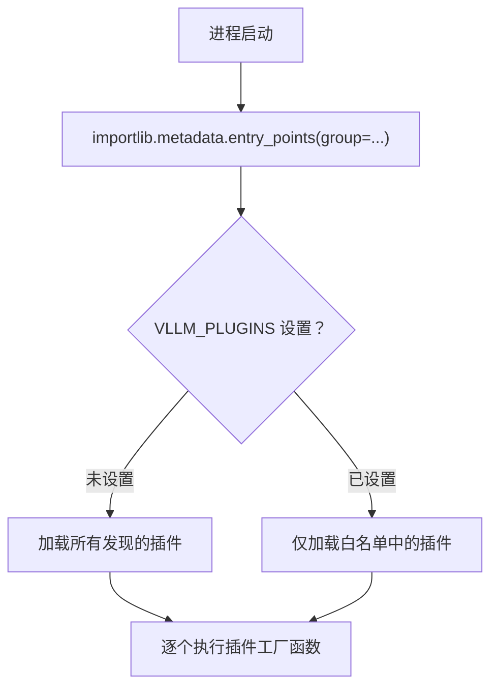

# 01 · Plugin 系统

**源码**：[`code/vllm/vllm/plugins/__init__.py`](../../code/vllm/vllm/plugins/__init__.py)
**设计文档**：[`code/vllm/docs/design/plugin_system.md`](../../code/vllm/docs/design/plugin_system.md)

## 为什么需要 Plugin 系统

vLLM 面临两个扩展性需求：

1. **自定义硬件**：厂商需要注册新的 Platform（如自定义 AI 芯片）、Attention Backend、Device Communicator
2. **自定义行为**：用户需要在请求处理链路中注入自定义逻辑（预处理、后处理、日志、HTTP 路由）

Plugin 系统通过 Python `entry_points` 机制统一解决这些问题，避免 fork 修改源码。

## Plugin 类型总览

| Plugin 类型 | entry_point group | 加载进程 | 用途 |
|------------|-------------------|---------|------|
| **General** | `vllm.general_plugins` | 所有进程 | 注册自定义模型、初始化全局状态 |
| **Platform** | `vllm.platform_plugins` | 所有进程 | 注册自定义硬件平台 |
| **IO Processor** | `vllm.io_processor_plugins` | 仅进程0 | 自定义输入预处理/输出后处理 |
| **Stat Logger** | `vllm.stat_logger_plugins` | 仅进程0（异步模式） | 自定义指标/统计日志 |
| **Endpoint** | `vllm.endpoint_plugins` | 仅 API Server | 添加自定义 HTTP 路由 |

## 发现与加载机制

```python
# 通过 Python importlib.metadata 发现所有注册的 entry_points
from importlib.metadata import entry_points
discovered = entry_points(group="vllm.general_plugins")

# VLLM_PLUGINS 环境变量做白名单过滤
allowed = os.environ.get("VLLM_PLUGINS")  # 逗号分隔的插件名
```

加载流程：



## 各 Plugin 详解

### General Plugin

最通用的插件类型。在所有进程（API Server、Engine Core、Worker）中加载：

```python
# setup.py 或 pyproject.toml
[project.entry-points."vllm.general_plugins"]
my_plugin = "my_package.plugins:register"
```

```python
# my_package/plugins.py
def register():
    from vllm.model_executor.models.registry import ModelRegistry
    ModelRegistry.register_model("MyCustomModel", MyCustomModel)
```

### Platform Plugin

注册自定义硬件平台。在 `current_platform` 首次访问时解析：

- Plugin 工厂函数返回 platform 类的 fully-qualified name（字符串）
- 只能激活**一个** platform plugin
- 内置平台（CUDA/ROCm/TPU/XPU/CPU）优先于第三方 plugin

### Endpoint Plugin

最特殊的 plugin 类型——仅在 API Server 进程中加载，且**必须显式白名单**：

```python
class EndpointPlugin:
    name: str                          # 插件名
    required_tasks: tuple | None       # 需要的任务类型（如 ("generate",)）
    
    def attach_router(self, app): ...  # Phase A: 注册路由（engine 尚未就绪）
    def init_state(self, engine): ...  # Phase B: 初始化状态（engine 已就绪）
```

两阶段加载：
1. **Phase A**（路由注册）：`attach_router(app)` → 向 FastAPI app 注册路由
2. **Phase B**（状态初始化）：`init_state(engine)` → engine 可用后，初始化插件内部状态

### IO Processor Plugin

在进程0中自定义输入预处理/输出后处理。适用于 Pooling/Embedding 模型的特殊处理逻辑。

## VLLM_PLUGINS 控制

```bash
# 只加载特定插件
VLLM_PLUGINS=my_plugin,my_other_plugin vllm serve model

# 禁用所有插件
VLLM_PLUGINS="" vllm serve model

# 不设置 = 加载所有发现的插件
vllm serve model
```

## 可重入性要求

插件可能被多次加载（多进程场景），必须设计为**幂等**：

```python
_registered = False

def register():
    global _registered
    if _registered:
        return  # 已注册，幂等返回
    # ... 执行注册逻辑
    _registered = True
```

## 阅读重点

- `load_plugins_by_group()` —— 所有 plugin 加载的入口
- `load_endpoint_plugins()` —— 理解两阶段加载的不同安全策略
- `resolve_current_platform_cls_qualname()` —— 平台检测与 plugin 选择
