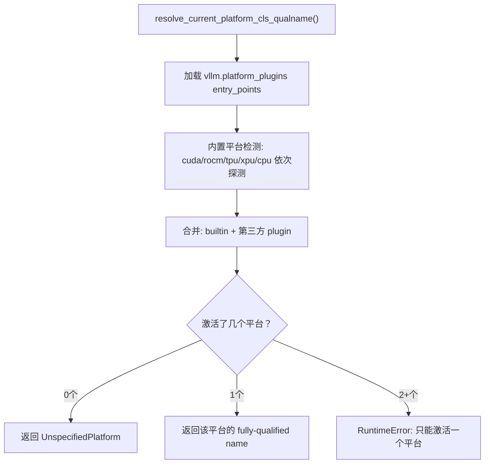

# 02 · 平台抽象 — 多硬件适配

**源码**：[`code/vllm/vllm/platforms/`](../../code/vllm/vllm/platforms/)

## 为什么需要平台抽象

vLLM 支持 CUDA、ROCm、TPU、XPU（Intel）、CPU 五种硬件平台。每种平台的差异体现在：

- **Device 操作**：内存分配、同步、流管理
- **Attention Backend**：kernel 选择和参数配置
- **Device Communicator**：跨设备通信（AllReduce/NCCL/Custom）
- **Custom Op**：硬件特有的 kernel 实现

平台抽象通过 `Platform` 基类 + 各平台子类将这些差异封装起来，上层代码与硬件解耦。

## Platform 基类接口

**源码**：[`code/vllm/vllm/platforms/interface.py`](../../code/vllm/vllm/platforms/interface.py)

```python
class Platform:
    # 平台标识
    device_type: str                  # torch device type
    device_name: str                  # 显示名称
    _enum: PlatformEnum               # 枚举值
    
    # 硬件能力
    def is_cuda_alike() -> bool       # CUDA-like 行为（大部分 NVIDIA/AMD GPU）
    def inference_mode() -> InferenceMode  # 推理模式（classmethod）
    
    # 组件选择
    def get_attn_backend_cls(...) -> type[AttentionBackend]: ...
    def get_device_communicator_cls(...) -> type: ...
    
    # Device 操作
    def check_if_supports_dtype(dtype) -> bool: ...
```

## 平台实现一览

| 平台 | 类 | 关键特征 |
|------|-----|---------|
| **CUDA** | `CudaPlatform` | NVIDIA GPU、CUDA Toolkit、NVML 设备发现 |
| **ROCm** | `RocmPlatform` | AMD GPU、ROCm/amdsmi、AITER 优化库 |
| **TPU** | `TpuPlatform` | Google TPU、libtpu、Pathways proxy 支持 |
| **XPU** | `XPUPlatform` | Intel GPU、XCCL 分布式后端、SYCL |
| **CPU** | `CpuPlatform` | x86/ARM CPU、无 GPU 依赖 |
| **Zen CPU** | `ZenCpuPlatform` | AMD Zen CPU + AVX-512 + zentorch 优化 |

## 平台解析流程



内置平台按优先级探测：TPU → CUDA → ROCm → XPU → CPU。每个探测函数检查硬件是否存在（NVML/amdsmi/libtorch/torch.xpu/构建标记）。

## current_platform 单例

```python
# vllm/platforms/__init__.py
current_platform: Platform  # 延迟初始化，首次 __getattr__ 访问时解析

# 使用方式：
from vllm.platforms import current_platform
if current_platform.is_cuda_alike():
    # CUDA/ROCm 通用路径
    ...
```

`current_platform` 通过 `__getattr__` 延迟解析——这确保了：
1. 第三方 platform plugin 有机会在解析前被加载
2. `import vllm` 不会立即初始化硬件相关状态

## 平台对下游的影响

Platform 决定了一系列关键组件的选择：

| 组件 | 选择方式 |
|------|---------|
| **Attention Backend** | `current_platform.get_attn_backend_cls()` 返回平台默认 backend |
| **Device Communicator** | `current_platform.get_device_communicator_cls()` 选择 NCCL/Custom/等 |
| **Custom Op** | `CustomOp`（`model_executor/custom_op.py`）经 `compilation_config.custom_ops` 按名字启用 |
| **Worker** | `parallel_config.worker_cls`（默认 `"auto"`）根据平台选择 GPUWorker/CPUWorker/TPUWorker/XPUWorker |

## 自定义 Platform Plugin

```python
# pyproject.toml
[project.entry-points."vllm.platform_plugins"]
my_hw = "my_platform.plugin:my_platform_plugin"

# my_platform/plugin.py
def my_platform_plugin() -> str | None:
    if my_hw_available():
        return "my_platform.MyHardwarePlatform"
    return None
```

Platform plugin 工厂函数返回 `None`（硬件不可用）或 platform 类的 fully-qualified name。vLLM 自动选择第一个可用的 platform。

## 阅读重点

- `resolve_current_platform_cls_qualname()` —— 理解平台解析和选择逻辑
- `Platform` 基类的抽象方法 —— 了解各平台需实现的接口
- `current_platform` 的 `__getattr__` 延迟初始化 —— 理解为什么 `import vllm` 不立即初始化硬件
