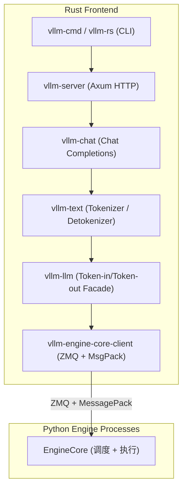

# 03 · Rust 工作空间 — 高性能前端

**源码**：[`code/vllm/rust/`](../../code/vllm/rust/)
**README**：[`code/vllm/rust/README.md`](../../code/vllm/rust/README.md)

## 为什么用 Rust 重写前端

vLLM 的 Python 前端（FastAPI + uvicorn）在生产环境中面临几个瓶颈：

1. **Tokenizer 性能**：Python tokenizer 在高吞吐场景下成为瓶颈
2. **JSON 解析**：流式 reasoning/tool call 的增量 JSON 解析在 Python 中开销大
3. **HTTP 层**：python-asyncio 的事件循环与 threading 混合使用存在 GIL 竞争
4. **尾部延迟**：Python GC pause 和内存分配的不确定性导致 P99 升高

Rust 前端目标是**重建 northbound serving layer**，通过 ZMQ + MessagePack 协议与核心 Python Engine 进程通信。

## 架构分层



### 各层职责

| Crate | 功能 | 关键实现 |
|-------|------|---------|
| `vllm-engine-core-client` | ZMQ transport + MessagePack 协议，与 headless engine 通信 | ZMQ DEALER socket, MsgPack 编解码 |
| `vllm-llm` | 薄封装：token-in → engine → token-out | 统一的 `generate(ids)` 接口 |
| `vllm-text` | 高性能 tokenizer 和 incremental detokenizer | HF Tokenizer, TikToken, Tekken 支持 |
| `vllm-chat` | Chat completions：模板渲染、结构化事件、reasoning & tool parsing | Streaming chat response |
| `vllm-server` | OpenAI 兼容 HTTP API | Axum framework, `/v1/chat/completions` 等 |
| `vllm-cmd` / `vllm-rs` | CLI 入口点 | Python 子进程启动、managed-engine serve |

### 独立 Crate

| Crate | 功能 |
|-------|------|
| `vllm-tokenizer` | 多后端 tokenizer（HF, TikToken, Tekken） |
| `vllm-parser` | 高速流式 JSON/reasoning parser（DeepSeek v3.2, Gemma4 等） |
| `vllm-bench` | 基准测试工具：TikToken bench, multi-turn, sweep, rate control |
| `vllm-metrics` | Metrics 工具库 |
| `vllm-mock-engine` | Mock engine 用于测试 |

## 启动方式

### 内嵌模式（默认）

```bash
VLLM_USE_RUST_FRONTEND=1 vllm serve Qwen/Qwen3-0.6B
```

Python 启动 Rust HTTP Server 作为**受监督的子进程**，传递继承的 socket 和 transport 地址。Python 进程负责进程生命周期管理。

### 外部 Engine 模式

```bash
# Python engine (headless)
vllm serve model --headless --data-parallel-address 127.0.0.1 --data-parallel-rpc-port 62100

# Rust 前端（独立进程）
vllm-rs serve model --data-parallel-address 127.0.0.1 --data-parallel-rpc-port 62100 --data-parallel-size-local 0
```

Rust 前端通过 ZMQ 连接到已有 Python engine。适合 P/D 分离部署或 frontend-only 节点。

## Python 绑定

Rust parser 通过 PyO3 导出到 Python：

```python
# Python 侧调用 Rust parser
from vllm.rust.parser import DeepSeekV3_2Parser  # pyo3 binding

# Rust parser (src/parser/python/) 提供 Python 可调用的解析器类
# 比纯 Python 实现快 10-100x
```

## 实验状态

Rust 前端目前仍是**实验性**的：

- ✅ OpenAI `/v1/chat/completions`（streaming 和 non-streaming）
- ✅ Tokenizer（HF, TikToken, Tekken）
- ✅ Reasoning & tool call parsing
- ⚠️ 部分高级功能（multi-modal、LoRA、beam search 等）仍在开发中
- ℹ️ 默认情况下使用 Python 前端（`VLLM_USE_RUST_FRONTEND` 不设置时）

## 阅读重点

- `rust/src/engine-core-client/` —— 理解 ZMQ + MessagePack 协议如何取代 Python IPC
- `rust/src/chat/` —— 理解 chat completions 的 Rust 实现
- `rust/src/server/` —— Axum HTTP server 架构
- `build_rust.sh` —— Rust workspace 的构建流程
- Python 侧启动 Rust 子进程的代码（`vllm` 中的 `--use-rust-frontend` 逻辑）
