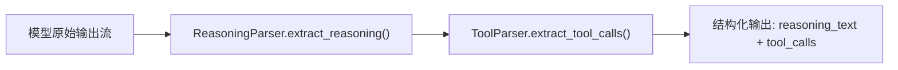

# 01 · 推理与工具解析（Reasoning & Tool Parsers）

**源码**：[`code/vllm/vllm/reasoning/`](../../code/vllm/vllm/reasoning/)、[`code/vllm/vllm/tool_parsers/`](../../code/vllm/vllm/tool_parsers/)

## 背景

现代 LLM 的推理输出结构中包含两类需要解析的内容：

1. **推理过程（Reasoning）**：模型在给出最终答案前的"思考"步骤（如 `<think>...</think>` 标签内的内容）
2. **工具调用（Tool Call）**：模型生成的 function call（如 JSON 格式的 `tool_calls`）

不同模型使用**不同的格式**来包裹这些内容——有的用 XML 标签，有的用 JSON，有的用自定义分隔符。Parser 系统为每种模型提供定制化的流式解析器。

## Reasoning Parser

### 抽象基类

**源码**：[`code/vllm/vllm/reasoning/abs_reasoning_parsers.py`](../../code/vllm/vllm/reasoning/abs_reasoning_parsers.py)

```python
class ReasoningParser:
    engine_based_streaming: bool = False  # 是否支持引擎级流式解析
    
    def __init__(self, tokenizer: TokenizerLike, *, model_config=None): ...
    
    @abstractmethod
    def extract_reasoning(self, text: str) -> ReasoningContent:
        """从一段文本中提取推理内容"""
```

### 支持的模型 (27+)

| Parser | 模型 | 格式 |
|--------|------|------|
| `DeepSeekR1ReasoningParser` | DeepSeek R1 | `<｜end▁of▁thinking｜>...` |
| `DeepSeekV3ReasoningParser` | DeepSeek V3/V3.1 | `__DSTHINK__...__DSTHINKEND__` |
| `DeepSeekV4EngineReasoningParser` | DeepSeek V4 | Engine-native reasoning stream |
| `Qwen3EngineReasoningParser` | Qwen3 | Engine-native reasoning events |
| `Gemma4EngineReasoningParser` | Gemma 4 | `...` |
| `InklingReasoningParser` | Inkling | `response` |
| `GPTOSSEngineReasoningParser` | GPT-OSS | Engine-native streaming |
| `MistralReasoningParser` | Mistral | Custom delimiter |
| `KimiK2ReasoningParser` | Kimi K2 | `...` |
| `MiniMaxM2ReasoningParser` | MiniMax M2 | `...` |
| `MiniMaxM3ReasoningParser` | MiniMax M3 | `...` |
| `Ernie45ReasoningParser` | ERNIE 4.5 | Custom format |
| `Step3ReasoningParser` | Step 3 | `...` |
| `GraniteReasoningParser` | Granite | Custom format |
| `IdentityReasoningParser` | 通用/passthrough | 不做解析，直接返回 |

### 选择机制

Parser 由模型配置 (`model_config.hf_config`) 决定：

```python
# vllm/reasoning/__init__.py
_REASONING_PARSER_MAP: dict[str, type[ReasoningParser]] = {
    "deepseek_r1": DeepSeekR1ReasoningParser,
    "deepseek_v3": DeepSeekV3ReasoningParser,
    "deepseek_v4": DeepSeekV4EngineReasoningParser,
    ...
}

def get_reasoning_parser(model_config: ModelConfig) -> ReasoningParser:
    parser_name = resolve_parser_name(model_config)  # 从 config 推断
    parser_cls = _REASONING_PARSER_MAP[parser_name]
    return parser_cls(tokenizer)
```

## Tool Parser

### 抽象基类

**源码**：[`code/vllm/vllm/tool_parsers/abstract_tool_parser.py`](../../code/vllm/vllm/tool_parsers/abstract_tool_parser.py)

```python
class ToolParser:
    def __init__(self, tokenizer: TokenizerLike): ...
    
    @abstractmethod
    def extract_tool_calls(self, text: str) -> list[ToolCall]:
        """从一段文本中提取 tool call 列表"""
```

### StreamToolParser

**源码**：[`code/vllm/vllm/tool_parsers/streaming.py`](../../code/vllm/vllm/tool_parsers/streaming.py)

支持流式增量解析——在 token 逐个到达时实时提取 tool call：

```python
class StreamingToolParser(ToolParser):
    def process_token(self, token_id: int) -> list[ToolCall] | None:
        """逐个 token 处理，有新 tool call 完成时返回"""
```

### 支持的模型 (35+)

包括但不限于：Hermes、Mistral、Llama 3、DeepSeek V3/V3.1/V4、Qwen3、Gemma4、GPT-OSS、Inkling、MiniMax M2/M3、Command R、Nemotron V3 等。

## 解析管线



如果模型使用 engine-based streaming（`engine_based_streaming = True`），引擎在生成过程中直接产式结构化事件，无需后解析。

## 与 Rust Parser 的关系

Rust workspace 中的 `vllm-parser` ([`rust/src/parser/`](../../code/vllm/rust/src/parser/)) 提供了高性能的 Rust 实现：

- `DeepSeekV3_2Parser`：DeepSeek V3.2 的 reasoning + tool call 解析
- `Gemma4Parser`：Gemma 4 的结构化输出解析
- 通过 PyO3 导出到 Python（`vllm.rust.parser`）

Rust 实现比 Python 快 10-100x，在流式高吞吐场景下显著降低 CPU 开销。

## 阅读重点

- `abs_reasoning_parsers.py`：`ReasoningParser` 基类的接口定义
- `deepseek_v3_reasoning_parser.py`：DeepSeek V3 的解析实现——最典型的 pattern
- `abstract_tool_parser.py`：`ToolParser` 基类
- `streaming.py`：流式增量解析的机制
- 选择一个你感兴趣的模型的 parser 深入阅读
