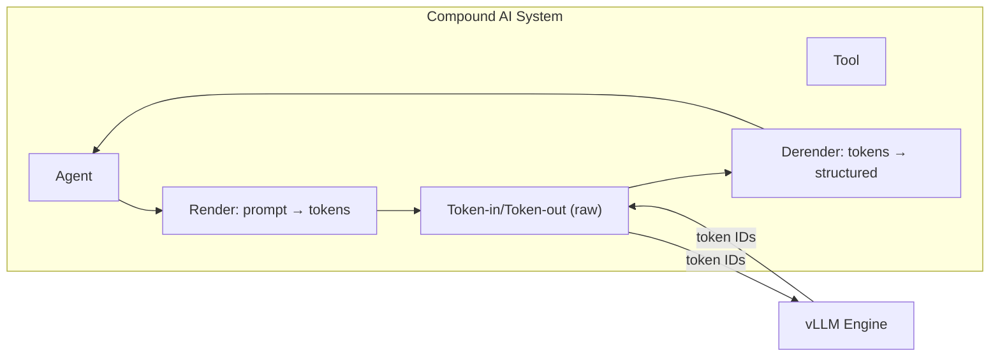

# 02 · 入口点扩展 — 多协议 API

**源码**：[`code/vllm/vllm/entrypoints/`](../../code/vllm/vllm/entrypoints/)

## 概述

vLLM 不再只有 OpenAI-compatible API。`entrypoints/` 目录现包含 9 个独立的 API 子模块，支持多种协议和使用场景：

| 入口 | 目录 | 协议 |
|------|------|------|
| **OpenAI** | `entrypoints/openai/` | OpenAI Chat/Completions/Embeddings/Batch |
| **Anthropic** | `entrypoints/anthropic/` | Anthropic Messages API |
| **MCP** | `entrypoints/mcp/` | Model Context Protocol Tools |
| **Speech-to-Text** | `entrypoints/speech_to_text/` | OpenAI Audio Transcription/Translation/Realtime |
| **Scale-Out** | `entrypoints/scale_out/` | Token-in/Token-out、Render/Derender |
| **Pooling** | `entrypoints/pooling/` | Embed/Classify/Score |
| **Generate** | `entrypoints/generate/` | 底层生成 API |
| **Serve** | `entrypoints/serve/` | 内部管理 API (LoRA, Tokenize, Sleep, Profile) |
| **CLI** | `entrypoints/cli/` | 命令行：serve, benchmark, collect_env |

## Anthropic API

**源码**：[`code/vllm/vllm/entrypoints/anthropic/`](../../code/vllm/vllm/entrypoints/anthropic/)

提供 Anthropic Messages API 兼容接口：

- `api_router.py` —— FastAPI router
- `protocol.py` —— Anthropic 数据类型（MessagesRequest, MessagesResponse, ContentBlock 等）
- `serving.py` —— 服务逻辑：请求转换 → engine 调用 → 响应格式化

```bash
# 使用 Anthropic client 连接 vLLM
from anthropic import Anthropic

client = Anthropic(base_url="http://localhost:8000/v1", api_key="not-needed")
message = client.messages.create(
    model="Qwen/Qwen3-0.6B",
    messages=[{"role": "user", "content": "Hello!"}],
    max_tokens=100,
)
```

## MCP (Model Context Protocol)

**源码**：[`code/vllm/vllm/entrypoints/mcp/`](../../code/vllm/vllm/entrypoints/mcp/)

将 vLLM 模型暴露为 MCP Tool Server：

- `tool.py` —— Tool 注册和配置
- `tool_server.py` —— MCP server 启动和管理

```python
# vLLM 作为 MCP tool server
# 其他 MCP client 可以调用 vLLM 上的模型
```

## Speech-to-Text

**源码**：[`code/vllm/vllm/entrypoints/speech_to_text/`](../../code/vllm/vllm/entrypoints/speech_to_text/)

OpenAI 兼容的语音识别 API：

- `transcription/` —— `/v1/audio/transcriptions`
- `translation/` —— `/v1/audio/translations`
- `realtime/` —— 实时语音识别流

## Scale-Out API

**源码**：[`code/vllm/vllm/entrypoints/scale_out/`](../../code/vllm/vllm/entrypoints/scale_out/)

为 **Compound AI 系统**设计的底层 API：

- **Token-in/Token-out** (`token_in_token_out/`)：直接输入 token IDs，输出 token IDs——最快的推理接口，跳过 detokenization
- **Render** (`render/`)：将结构化内容渲染为 token 序列
- **Derender** (`derender/`)：将 token 序列解析为结构化内容



## 入口点架构模式

所有 entrypoint 遵循相同的架构模式：

```python
# 每个子目录的标准结构
entrypoints/xxx/
    __init__.py        # 模块导出
    api_router.py      # FastAPI APIRouter
    protocol.py        # Pydantic 数据类型
    serving.py         # 服务逻辑：请求 → 引擎调用 → 响应
    factories.py       # 工厂函数（可选的多个实现）
```

这种模式使得添加新协议相对简单——实现 `protocol.py` 和 `serving.py` 即可。

## 阅读重点

- 选一个你感兴趣的 entrypoint（如 `anthropic/`），阅读 `serving.py` → `protocol.py` 的顺序理解从外部请求到 engine 调用的完整链路
- 对比不同的 `api_router.py`，理解各协议路由的组织方式
- `scale_out/` 的 token-in/token-out 模式——理解 Compound AI 系统如何最低延迟调用 vLLM
