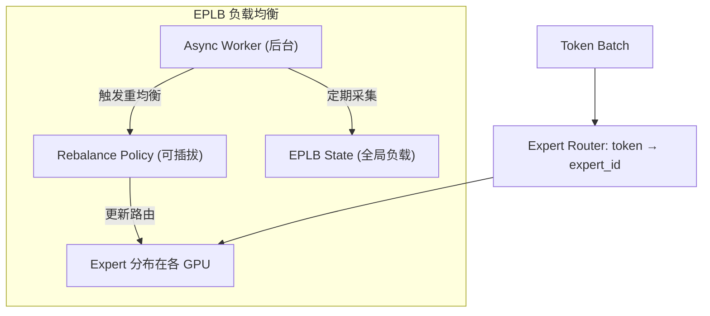
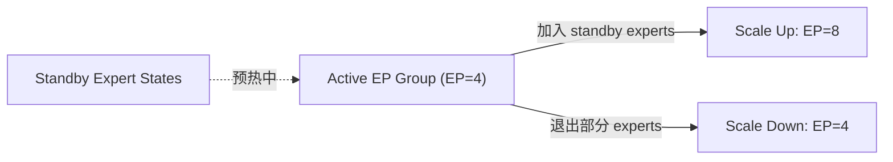
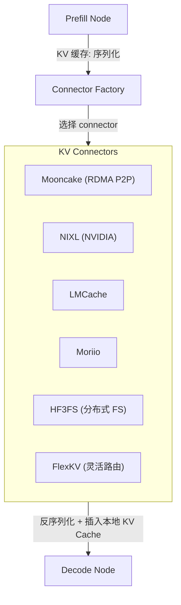

# 03 · 分布式深化：EP + Disaggregated KV Transfer

> 本文为 [07-高级特性/02-分布式并行.md](../07-高级特性/02-分布式并行.md) 的深入扩展。

**源码**：[`code/vllm/vllm/distributed/`](../../code/vllm/vllm/distributed/)

## Expert Parallelism Load Balancing (EPLB)

**源码**：[`code/vllm/vllm/distributed/eplb/`](../../code/vllm/vllm/distributed/eplb/)

### 问题

MoE 模型的 Expert 权重分布在多 GPU 上。不同请求的 token 路由到不同 expert，导致各 GPU 负载不均——有的忙于计算，有的空闲等待。

### 架构



### 核心组件

| 组件 | 文件 | 职责 |
|------|------|------|
| **Async Worker** | `async_worker.py` | 后台异步采集 GPU 负载，触发重均衡 |
| **Rebalance Policy** | `policy/abstract.py` | 可插拔的均衡策略接口 |
| **Default Policy** | `policy/default.py` | 默认策略：基于实际负载信号做 expert 重分配 |
| **EPLB State** | `eplb_state.py` | 全局 expert 负载状态跟踪 |
| **EPLB Communicator** | `eplb_communicator.py` | 跨 GPU 负载信息同步 |

### 工作流程

1. **采集**：Async Worker 定期从各 GPU 采集 expert 负载（处理的 token 数、执行时间）
2. **决策**：Policy 判断是否需要重均衡（负载方差是否超过阈值）
3. **执行**：如果需要重均衡，重新分配 expert → GPU 映射，Zero-copy 迁移 expert 状态

### 启用方式

```bash
vllm serve deepseek-ai/DeepSeek-V2-Lite \
  --enable-expert-parallel \
  --data-parallel-size 2
```

Expert Parallel 和 Data Parallel 可组合使用（`EP + DP`），实现 Expert 分布 + 多副本负载均衡。

## Elastic Expert Parallelism

**源码**：[`code/vllm/vllm/distributed/elastic_ep/`](../../code/vllm/vllm/distributed/elastic_ep/)

动态扩缩 Expert 并行度：



| 组件 | 文件 | 职责 |
|------|------|------|
| **Elastic State** | `elastic_state.py` | 当前 EP 状态管理 |
| **Elastic Execute** | `elastic_execute.py` | 弹性执行逻辑 |
| **Standby State** | `standby_state.py` | 备用 Expert 状态预热 |

支持 zero-downtime 扩缩容——运行时动态调整 EP 大小，不中断正在处理的请求。

## Disaggregated KV Transfer

**源码**：[`code/vllm/vllm/distributed/kv_transfer/`](../../code/vllm/vllm/distributed/kv_transfer/)

### 为什么需要分离式部署

Prefill（首次推理）和 Decode（生成 token）的计算特征不同：
- **Prefill**：计算密集，需要大 batch 提高效率
- **Decode**：内存带宽密集，batch 大小无关紧要

分离式部署将 P 和 D 部署在不同节点，独立扩缩。P 节点算完 KV Cache 后通过网络传给 D 节点。

### Connector 架构



### 6 种 Connector

| Connector | 目录 | 传输方式 | 适用场景 |
|-----------|------|---------|---------|
| **Mooncake** | `mooncake/` | RDMA-based P2P | 低延迟、高带宽 HPC 环境 |
| **NIXL** | `nixl/` | NVIDIA 集合通信 | NVIDIA 生态、GPU Direct |
| **LMCache** | `lmcache_connector.py` | 分布式缓存 | 共享 cache 池、多 P 多 D |
| **Moriio** | `moriio/` | Moriio 传输层 | 特定网络环境 |
| **HF3FS** | `hf3fs/` | 分布式文件系统 | 超大规模持久化 KV 缓存 |
| **FlexKV** | `flexkv_connector.py` | 灵活路由 | 动态选择传输路径 |

### Multi-Connector

**源码**：`multi_connector.py`

支持组合多个 connector，例如：同机架用 NIXL（低延迟），跨机架用 Mooncake（高吞吐）。

### Connector 基类

```python
class KVConnectorBase_V1(ABC):
    def start_load_kv(self, request: Request) -> None:
        """Prefill 完成后，将 KV 缓存发送给 Decode 节点"""
    
    def maybe_get_next_kv_block(self, request: Request) -> KVBlock | None:
        """Decode 节点获取下一个 KV Block"""
    
    def request_finished(self, request: Request) -> None:
        """请求完成，释放 remote KV 资源"""
```

## Encoder Cache Transfer (EC Transfer)

**源码**：[`code/vllm/vllm/distributed/ec_transfer/`](../../code/vllm/vllm/distributed/ec_transfer/)

多模态场景下，Prefill 节点计算的 Encoder 缓存（图像/音频/视频编码结果）也需要传给 Decode 节点：

- `ec_connector/base.py` —— EC Connector 基类
- `ec_connector/cpu_connector.py` —— CPU 侧传输实现

## 阅读重点

- `eplb/policy/abstract.py`——理解负载均衡策略的接口设计
- `kv_transfer/kv_connector/v1/base.py`——理解 KV Transfer 的核心协议
- 选一个你感兴趣的 connector（如 NIXL 或 Mooncake）深入阅读
- `ec_transfer/`——理解多模态分离式部署的特殊传输需求
