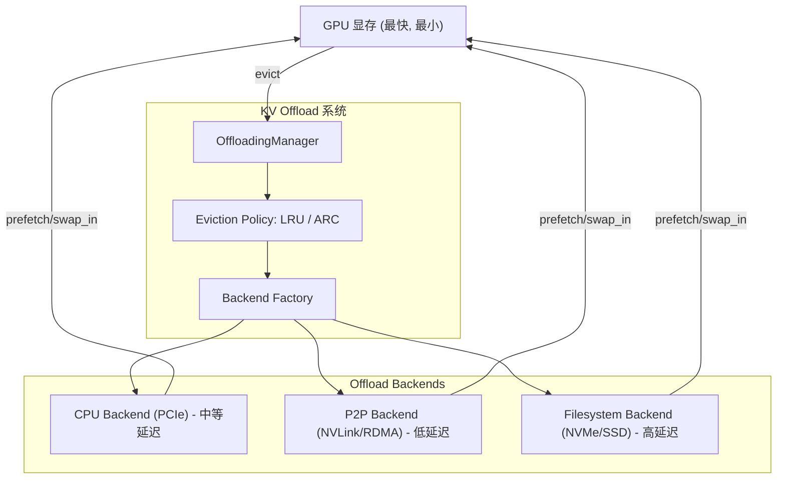
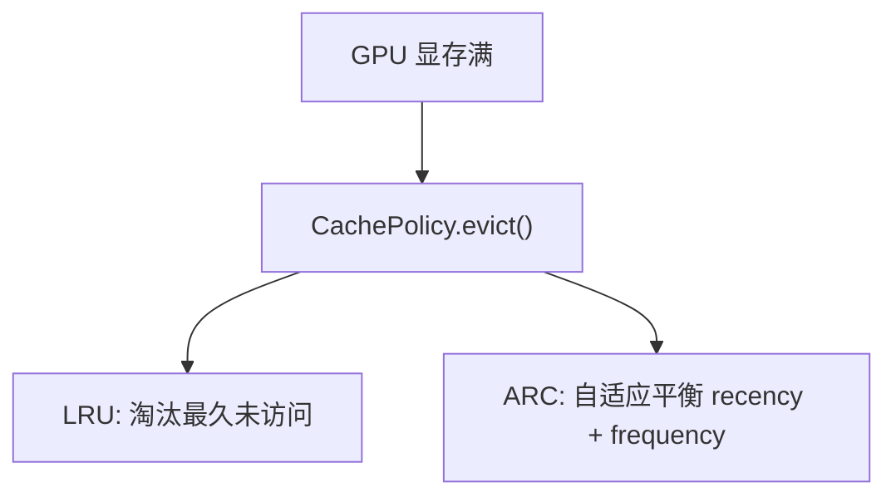

# 05 · KV 卸载扩展 — 分层存储架构

> 本文为 [07-高级特性/05-量化与KV卸载.md](../07-高级特性/05-量化与KV卸载.md) 中 KV 卸载部分的深入扩展。

**源码**：[`code/vllm/vllm/v1/kv_offload/`](../../code/vllm/vllm/v1/kv_offload/)

## KV Offload 分层架构

vLLM 的 KV 卸载已从简单的「GPU → CPU 换页」演进为**三层分层存储**系统：



## 三层 Backend 详解

### CPU Backend

**源码**：[`code/vllm/vllm/v1/kv_offload/cpu/`](../../code/vllm/vllm/v1/kv_offload/cpu/)

通过 PCIe 将 KV 块卸载到 CPU 内存：

| 组件 | 文件 | 职责 |
|------|------|------|
| **Manager** | `cpu/manager.py` | CPU 内存中的 KV 块管理，swap_in/swap_out 决策 |
| **GPU Worker** | `cpu/gpu_worker.py` | GPU 侧的卸载执行 |
| **Shared Region** | `cpu/shared_offload_region.py` | 多 GPU 共享的 CPU 内存池 |
| **Triton Swap** | `cpu/swap_blocks_triton.py` | Triton kernel 实现的高效 swap 操作 |

### P2P Backend

**源码**：[`code/vllm/vllm/v1/kv_offload/tiering/p2p/`](../../code/vllm/vllm/v1/kv_offload/tiering/p2p/)

通过 NVLink/RDMA 将 KV 块卸载到远程 GPU：

- Control path 和 Data path 分离——控制面协商，数据面直接传输
- Session 管理——建立、维护、释放 P2P 连接
- 适用于 P/D 分离部署中的 KV 缓存共享

### Filesystem Backend

**源码**：[`code/vllm/vllm/v1/kv_offload/tiering/fs/`](../../code/vllm/vllm/v1/kv_offload/tiering/fs/)

将 KV 块持久化到 NVMe SSD：

| 组件 | 职责 |
|------|------|
| `io.py` | 文件 I/O 层 |
| `thread_pool.py` | 异步 I/O 线程池，避免阻塞 CUDA stream |

### File Mapper

**源码**：[`code/vllm/vllm/v1/kv_offload/file_mapper.py`](../../code/vllm/vllm/v1/kv_offload/file_mapper.py)

将 KV 块映射到持久化文件：
- 支持 crash recovery——服务重启后可以从文件恢复 KV 缓存
- 配合 prefix caching 使用——热点 prefix 的 KV 缓存持久化到磁盘

## 淘汰策略工厂



| 策略 | 原理 | 适用场景 |
|------|------|---------|
| **LRU** | 优先淘汰最久未访问的 block，维护 access timestamp | 简单场景，访问模式有明确的时间局部性 |
| **ARC** | 维护 LRU + LFU 两个队列，自适应平衡 recency 和 frequency。当 LRU 页被再次访问时提升到 LFU；当 LFU 页长时间不访问时降级 | 复杂访问模式、Prefix Caching 混合场景 |

## 工厂模式

```python
# vllm/v1/kv_offload/factory.py —— OffloadingSpec 工厂
OffloadingSpecFactory.register_spec(name, module_path, class_name)
spec = OffloadingSpecFactory.create_spec(config)          # CPU / tiering 规格

# vllm/v1/kv_offload/tiering/factory.py —— 二级存储工厂
SecondaryTierFactory.register_tier(tier_type, module_path, class_name)
tier = SecondaryTierFactory.create_secondary_tier(...)    # "p2p" | "fs" | ...

# vllm/v1/kv_offload/cpu/manager.py —— 淘汰策略注册表
_CACHE_POLICIES: dict[str, type[CachePolicy]] = {"lru": LRUCachePolicy, "arc": ARCCachePolicy}
```

## Async Lookup

**源码**：[`code/vllm/vllm/v1/kv_offload/tiering/async_lookup.py`](../../code/vllm/vllm/v1/kv_offload/tiering/async_lookup.py)

在后台线程中异步检查 KV 块是否存在于卸载存储中，避免阻塞 CUDA stream：

```python
class AsyncLookupManager(ABC):
    def lookup(self, key: OffloadKey, req_context: ReqContext) -> bool | None:
        """提交异步查询；True/False=块是否存在，None=结果未就绪（下步重试）"""

    def drain_results(self) -> None:
        """收集后台线程完成的查询结果（非阻塞）"""
```

## 使用场景对比

| Backend | 延迟 | 容量 | 典型场景 |
|---------|------|------|---------|
| **无卸载** | 0 | GPU 显存 (80GB) | 小模型、短上下文 |
| **CPU** | ~10μs/block | CPU 内存 (~1TB) | 常规大模型、中等上下文 |
| **P2P** | ~5μs/block | 远程 GPU 显存 | P/D 分离、跨 GPU KV 共享 |
| **Filesystem** | ~100μs/block | NVMe (~10TB) | 超长上下文、KV 持久化、crash recovery |

## 阅读重点

- `tiering/base.py`——Backend 抽象接口
- `tiering/factory.py`——Backend 选择逻辑
- `cpu/manager.py`——CPU backend 的 swap 决策
- `tiering/p2p/manager.py`——P2P 的 control/data 分离设计
- `tiering/fs/manager.py`——文件系统的持久化语义
- `cpu/policies/`——LRU 和 ARC 的实现细节
