# vLLM 源码学习路径

> 基于对 `code/vllm/vllm/` (v0.16.0rc1) 的通读生成，按学习阶段分目录组织。
> 源码位置：`code/vllm/`（与本学习路径同级）

## 整体架构（读代码前先看这张图）

```mermaid
flowchart TD
  %% ====== Layer 1: Entrypoints ======
  subgraph entrypoints["🔵 Layer 1: 入口层 (Entrypoints)"]
    llmPy["LLM.generate() 离线推理"]
    openaiApi["OpenAI API Server"]
    anthropicApi["Anthropic API"]
    mcpTool["MCP Tools"]
    speechStt["Speech-to-Text"]
    scaleOut["Scale-Out API"]
    rustFrontend["Rust Frontend (Axum)"]
  end

  %% ====== Layer 2: Frontend Engine ======
  subgraph frontend["🟢 Layer 2: 前端引擎 (Frontend Engine)"]
    llmEngine["LLMEngine (前端)"]
    inputProc["InputProcessor"]
    outputProc["OutputProcessor"]
    detokenizer["Detokenizer"]
  end

  %% ====== Layer 3: IPC ======
  subgraph ipc["🟡 Layer 3: IPC / 协调"]
    ecClient["EngineCoreClient: Inproc / SyncMP / AsyncMP / DPAsyncMP / DPLBAsyncMP"]
    dpCoord["DP Coordinator (DP>1)"]
  end

  %% ====== Layer 4: Backend Engine ======
  subgraph backend["🟠 Layer 4: 后端引擎 (EngineCore.step())"]
    scheduler["Scheduler (V1统一调度)"]
    kvCache["KV Cache Manager"]
    kvOffload["KV Offload Manager (CPU/P2P/FS)"]
    encCache["Encoder Cache Manager"]
    asyncSched["Async Scheduler"]
  end

  %% ====== Layer 5: Compilation ======
  subgraph compile["🟣 Layer 5: 编译与CUDA图"]
    dynamo["Dynamo FX Graph Capture"]
    piecewise["PiecewiseBackend (按Attention切分)"]
    fusions["Fusion Passes (RMS+Quant, RoPE+KV等)"]
    irLower["vLLM IR Lowering"]
    inductor["Inductor Codegen"]
    cudaGraph["CUDAGraphWrapper (5种模式)"]
  end

  %% ====== Layer 6: Model ======
  subgraph model["🔴 Layer 6: 模型层"]
    irOps["vLLM IR Ops (@register_op/@register_impl)"]
    modelImpl["291 Model Implementations"]
    keyLayers["Key Layers: ColumnParallel / RowParallel / QKVParallel / RMSNorm"]
    attnBackends["Attention Backends (FlashAttn/FlashInfer/Triton/FlexAttention/MLA/Mamba)"]
    quantization["Quantization (GPTQ/AWQ/FP8/Marlin/CompressedTensors...)"]
  end

  %% ====== Layer 7: Distributed ======
  subgraph dist["⚫ Layer 7: 分布式"]
    tp["TP 张量并行"]
    pp["PP 流水线并行"]
    dp["DP 数据并行"]
    cp["CP 上下文并行"]
    ep["EP Expert并行 + Elastic EP"]
    kvTransfer["Disaggregated KV Transfer (Mooncake/NIXL/LMCache/HF3FS...)"]
    ecTransfer["EC Transfer (Encoder Cache)"]
  end

  %% ====== Layer 8: Platform ======
  subgraph platform["🟤 Layer 8: 平台抽象"]
    platIface["Platform Interface"]
    cudaPlat["CUDA"]
    rocmPlat["ROCm"]
    tpuPlat["TPU"]
    xpuPlat["XPU"]
    cpuPlat["CPU"]
  end

  %% ====== Layer 9: Plugins ======
  subgraph plugins["⚪ Layer 9: 扩展性"]
    pluginSys["Plugin System (entry_points): General / Platform / IO / Stats / Endpoint"]
  end

  %% ====== Data Flow ======
  entrypoints -->|"prompts"| frontend
  frontend -->|"EngineCoreRequest (Msgpack/ZMQ)"| ipc
  ipc -->|"调度请求"| backend
  backend -->|"SchedulerOutput"| compile
  compile -->|"compiled callable"| model
  model -->|"logits / hidden_states"| backend
  backend -->|"EngineCoreOutputs"| ipc
  ipc -->|"结果"| frontend
  frontend -->|"RequestOutput"| entrypoints

  %% ====== Cross-cutting ======
  model -.->|"并行分片"| dist
  model -.->|"硬件适配"| platform
  frontend -.->|"注入"| plugins
  compile -.->|"融合模式选择"| model
  dist -.->|"KV offload弹性"| backend
```

**核心设计要点**：

1. **前后端分离**：前端 `LLMEngine` 管「请求从哪来、结果回哪去」；后端 `EngineCore` 管「调度-执行-采样的紧循环」。两者通过 `EngineCoreClient`（IPC 抽象层：InprocClient/MPClient/AsyncMPClient）通信。
2. **V1 统一调度**：不再区分 prefill/decode。每个 Request 有 `num_computed_tokens` 和 `num_tokens_with_spec`，调度器让前者追后者——自然地处理 chunked prefill、prefix caching、speculative decoding。
3. **编译管线默认开启**：Dynamo tracing → PiecewiseBackend 切分 → Fusion Passes 融合 → IR Lowering → Inductor 代码生成 → CUDA Graph 录制。全流程对用户透明。
4. **可插拔架构**：Attention Backend、量化方法、KV Transfer Connector、Plugin 均可按需替换，平台抽象层统一适配多硬件。
5. **Rust 加速**：Tokenizer、Parser、HTTP Server 等性能关键路径用 Rust 实现，Python 通过 pyo3/子进程调用。
6. **分离式部署**：Prefill 和 Decode 可部署在不同节点，通过 KV Transfer Connector（Mooncake/NIXL/LMCache等）传输 KV 缓存。

## 学习阶段

| 阶段 | 目录 | 学时 |
|------|------|------|
| 0 | [00-入口](00-入口/) — 找到正确的入口，避开废弃代码 | 15 分钟 |
| 1 | [01-用户API到引擎](01-用户API到引擎/) — 从 LLM.generate() 追到引擎入口 | 2~3 小时 |
| 2 | [02-V1引擎主循环](02-V1引擎主循环/) — EngineCore.step() 紧循环 | 3~5 小时 |
| 3 | [03-调度与KV缓存](03-调度与KV缓存/) — 调度器算法与 KV 块管理 | 4~6 小时 |
| 4 | [04-模型执行与采样](04-模型执行与采样/) — Executor/Worker/GPUModelRunner | 3~5 小时 |
| 5 | [05-模型实现](05-模型实现/) — 模型实现模式、层、加载 | 3~5 小时 |
| 6 | [06-Attention后端](06-Attention后端/) — 可插拔 attention 后端设计 | 2~3 小时 |
| 7 | [07-高级特性](07-高级特性/) — 投机解码、分布式、多模态等（按需） | 每项 1~3 天 |
| 8 | [08-编译与CUDA图](08-编译与CUDA图/) — vLLM IR、torch.compile、Fusion Passes、CUDA Graphs 多模式 | 6~8 小时 |
| 9 | [09-扩展性与平台抽象](09-扩展性与平台抽象/) — Plugin 系统、多硬件平台、Rust 工作空间 | 4~5 小时 |
| 10 | [10-推理增强特性](10-推理增强特性/) — Reasoning/Tool Parser、入口点扩展、EP/KV Transfer 深化、DBO/MRV2、KV Offload 扩展 | 8~10 小时 |

**建议节奏**：阶段 0~1 第一天；阶段 2 第二天；阶段 3 第三~四天；阶段 4 第五~六天；阶段 5 第七~八天；阶段 6 第九天；阶段 8 第十~十一天；阶段 9 第十二天；阶段 10 第十三~十五天；阶段 7 按需深入。

## 阅读技巧

1. **用 IDE Ctrl+Click 追 import 链**。vLLM 大量使用 re-export（如 `vllm/engine/` → `vllm/v1/engine/`），IDE 跳转比 grep 快。
2. **忽略 C++/CUDA 代码直到必要**。`csrc/` 目录是 kernel 实现，第一遍全部跳过。
3. **复杂文件分多次读**：`core.py`(~2400行) 只读 `step()`；`gpu_model_runner.py`(~7800行) 只读 `execute_model()`/`load_model()`；`arg_utils.py`(~2750行) 只扫字段分组。
4. **每读完一个阶段画图**。画出模块间的调用关系和数据流。
5. **配合 examples/tests 打断点**。`code/vllm/examples/` 和 `code/vllm/tests/` 有对应测试。
6. **先读设计文档**。`code/vllm/docs/design/` 下有 29 篇官方设计文档，是理解子系统的最佳入口。

## 常见误区

| 误区 | 纠正 |
|------|------|
| 在 `vllm/engine/` 找代码 | 那是历史遗物，只有 re-export。一切在 `vllm/v1/` |
| 认为 prefill 和 decode 是不同阶段 | V1 已统一，只有 `num_computed_tokens` 追 `num_tokens_with_spec` |
| 从 CUDA kernel 开始读 | 先理解 Python 层的调度和模型执行流程 |
| 认为 `LLM` 和 `LLMEngine` 是同一个东西 | `LLM` 是用户入口，`LLMEngine` 是前端，`EngineCore` 才是后端引擎 |
| 忽略 `v1/engine/__init__.py` 的类型定义 | `EngineCoreRequest`/`EngineCoreOutput` 是理解数据流的基础 |
| 认为 torch.compile 是可选的 | V1 中 `torch.compile` 默认开启，编译管线是执行路径的核心环节 |
