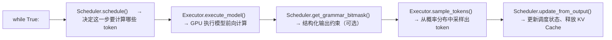
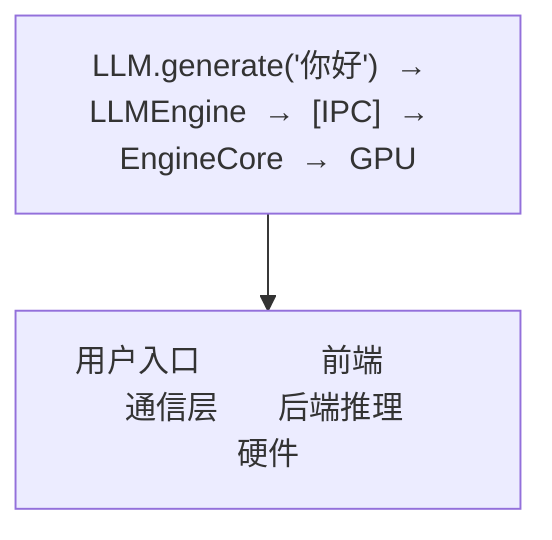

# 01 · vLLM 基础：V1 引擎核心概念

**源码**：vLLM 的 V1 引擎位于 `code/vllm/vllm/v1/` 目录

## 为什么需要先了解 vLLM

vLLM-Omni 是在 vLLM 之上构建的。它的 AR（自回归）引擎直接复用 vLLM 的 V1 引擎来做文本生成。如果你不了解 vLLM 的基本工作方式，看 vLLM-Omni 的代码会经常遇到 `EngineCore`、`Scheduler`、`KV Cache`、`Executor` 这些概念，不知道它们在做什么。

## vLLM V1 引擎核心流程

vLLM V1 引擎的推理过程可以浓缩为 **五步紧循环**：

### 前后端分离

vLLM V1 采用前后端分离架构：

- **前端（LLMEngine）**：负责"请求的进出"。接收用户请求、预处理输入、把结果返回给用户。它是面向用户的接口。
- **后端（EngineCore）**：负责"推理紧循环"。它只关心一件事：高效地在 GPU 上执行模型推理。它运行在自己的进程里，通过 IPC（进程间通信）与前端通信。

## 关键概念速查

| 概念 | 是什么 | 类比 |
|------|--------|------|
| **KV Cache** | 缓存 Transformer 每一层已计算的 Key/Value，避免重复计算 | 做数学题的"草稿纸"，先写的不重复写 |
| **Prefill** | 处理用户输入的 prompt（所有 token 一次算完） | "读题"阶段 |
| **Decode** | 逐个生成新 token（每次用之前的 KV Cache） | "解题"阶段 |
| **Scheduler** | 决定哪些请求的哪些 token 在何时计算 | 餐厅排位系统，决定谁先翻台 |
| **PagedAttention** | 将 KV Cache 按"页"管理，不连续存放 | 操作系统虚拟内存的分页机制 |
| **Continuous Batching** | 请求可以随时加入/离开批处理，不等整批完成 | 流水席，吃完就走，不用等人齐 |

## vLLM-Omni 如何复用 vLLM

vLLM-Omni 继承了 vLLM 的两个关键能力：

1. **高效的 KV Cache 管理**：PagedAttention + 块管理，让多个请求能高效共享 GPU 内存
2. **V1 引擎架构**：前后端分离 + IPC 通信，vLLM-Omni 在此基础上加入了多 Stage 的概念

但 vLLM-Omni 也做了很多"加法"：

- **不只输出文本**：除了 token，还输出 embedding、latent、音频波形等
- **不只自回归**：加入了 Diffusion 引擎来处理扩散模型
- **不只一个 Stage**：模型被拆成多个 Stage，Orchestrator 负责在 Stage 间传递数据

## 阅读时间

约 20 分钟。如果已经熟悉 vLLM，可以快速扫过。如果不熟悉，建议先看看 `vllm-learning-path/` 的 01 和 02 阶段。
