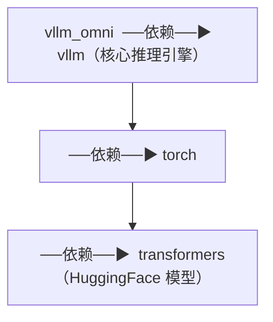

# 01 · 符号地图：`vllm_omni/__init__.py`

**源码**：[`code/vllm-omni/vllm_omni/__init__.py`](../../code/vllm-omni/vllm_omni/__init__.py)

## 为什么先读这个文件

这是 vLLM-Omni 的「符号地图」。`vllm_omni` 包的 `__init__.py` 定义了哪些类和函数是给外部使用的（公开 API）。花 10 分钟扫完，之后看到不认识的类名，回来查这个文件就知道它在哪。

## 关键导出符号

| 导出符号 | 实际位置 | 用途 |
|----------|---------|------|
| `Omni` | `vllm_omni.entrypoints.omni` | 离线推理入口（同步） |
| `AsyncOmni` | `vllm_omni.entrypoints.async_omni` | 在线服务入口（异步） |
| `OmniModelConfig` | `vllm_omni.config.model` | 多 Stage 模型配置 |

`Omni` 和 `AsyncOmni` 使用了**延迟加载**（`__getattr__`），只有当你的代码第一次访问 `vllm_omni.Omni` 时才会真正加载对应的模块。这是因为它们依赖 vLLM 的重模块（会初始化 CUDA），延迟加载可以避免在不需要时拖慢启动。

## 初始化做了什么

```python
from .version import __version__, __version_tuple__   # ①版本检查
from . import patch                                   # ②打补丁（修改 vLLM 行为）
from vllm_omni.transformers_utils import configs       # ③注册 HF Transformers 的 AutoConfig
from .config import OmniModelConfig                    # ④导出配置类
```

1. **版本检查**：确保 vLLM-Omni 和 vLLM 的大版本号一致，不一致会警告
2. **打补丁（patch）**：vLLM-Omni 需要修改 vLLM 的一些行为。比如把 vLLM 的 `ModelRegistry` 替换成包含 Omni 模型的版本
3. **注册 Transformers 配置**：让 HuggingFace 的 `AutoConfig` 能识别 Omni 特有的模型（如 FishSpeech、MammothModa2 等）
4. **导出公开 API**：`Omni`、`AsyncOmni`、`OmniModelConfig`

## 依赖关系

vLLM-Omni 依赖 vLLM 但不捆绑。它的 `setup.py` 会根据你的硬件平台（CUDA/ROCm/NPU/XPU）自动安装不同版本的 vLLM 和 PyTorch。



## 阅读时间

约 10 分钟。扫一遍即可，不用记。后续遇到不认识的类名，回来查就行。
